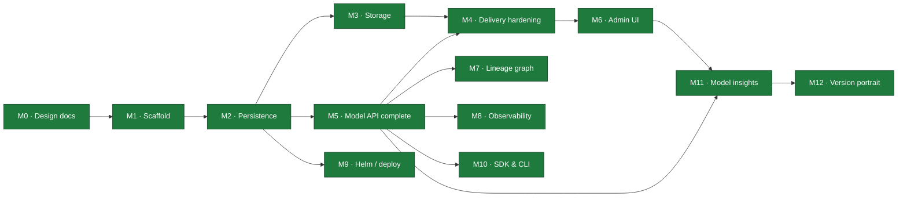

# Lineage — Milestones

Living progress tracker. Update status markers as work lands and link the commit that
completed a task. Architecture specs are in [`docs/`](docs/) (`00`–`12`); this file
tracks *execution* against them.

**Legend:** ✅ done · 🚧 in progress · ⬜ not started · 🔮 future

## Roadmap

## Status Summary

| # | Milestone | Docs | Status |
|---|---|---|---|
| M0 | Architecture & design docs | `00`–`12` | ✅ |
| M1 | Go scaffold (single binary, ports & adapters) | `01` | ✅ |
| M2 | Persistence: per-dialect MetadataStore + migrations | `02` | ✅ |
| M3 | Storage: S3 backend, signed URLs, upload flow | `05` | ✅ |
| M4 | Delivery hardening: cache↔events, fetch, `lineage://` | `04` | ✅ |
| M5 | Model API completeness + OpenAPI | `03` | ✅ |
| M6 | Admin UI: BFF + web console | `06` | ✅ |
| M7 | Lineage & provenance graph | `07` | ✅ |
| M8 | Observability: metrics, traces, SLOs | `09` | ✅ |
| M9 | Deployment: Helm chart + profiles | `08` | ✅ |
| M10 | SDK & CLI (OpenAPI-generated) | `10` | ✅ |
| M11 | Model insights: fingerprint, footprint, evaluations | `11` | ✅ |
| M12 | Version portrait: generated fingerprint + portrait marks | `12` | ✅ |

**Open work:** none. The only remaining `[ ]` is M3's OCI/ORAS driver, a locked v1-out
decision (§00.11.4) rather than a gap.

---

## M0 — Architecture & Design Docs ✅

Full spec set `00`–`10`, mermaid-only diagrams, decisions recorded in `00 §11`.
**Done:** commits through `9eed5f0`. `11-model-insights.md` was specced later, with **M11**
(it replaced the managed-service doc, moved out of this OSS repo); `12-version-portrait.md`
later still, with **M12**.

## M1 — Go Scaffold ✅

Compiling, runnable, tested skeleton; ports & adapters; end-to-end happy path verified.
**Done:** `0f8bb34`.

- [x] Module, package tree, Makefile, README, `.gitignore`
- [x] Domain: entities, enums, stage machine, ULID, coded errors, port interfaces
- [x] Core: create/publish/transition/resolve, audit-in-flow
- [x] Adapters: in-memory store, fs storage, memory cache, event bus
- [x] Two surfaces (:8081 Model API, :8080 Admin UI) + ops (:9090)
- [x] Unit tests (stage machine, name validation); `go vet`/`gofmt` clean

## M2 — Persistence ✅

**Goal:** replace the in-memory store with real per-dialect adapters (§02.7).
**Acceptance:** the full happy path passes against **both** SQLite and Postgres; schema
via migrations; singleton invariant enforced (Postgres `FOR UPDATE`, SQLite serialized).
**Done:** shared `sqlstore` (`database/sql`) + `Dialect`; conformance suite green on
memory + SQLite; persistence verified across a restart.

- [x] Shared `sqlstore` + `Dialect` (placeholders, unique-violation, model lock)
- [x] SQLite `MetadataStore` (cgo-free modernc driver, WAL, single-writer) + migrations
- [x] Postgres `MetadataStore` (pgx) + migrations; `FOR UPDATE` singleton lock
- [x] Shared conformance suite (`storetest`) run vs memory + SQLite; Postgres via `LINEAGE_TEST_PG`
- [x] Versioned forward-only migrator (`schema_version`)
- [x] Config wiring (`LINEAGE_DB_ENGINE`) picks the adapter at startup; default SQLite
- [x] FK `ON DELETE CASCADE` in schema (§02.5)
- [x] Cursor pagination (real `nextPageToken`) — delivered in **M5** (`domain.Page`)
- [x] Postgres JSONB `label`/`custom_properties` push-down — delivered post-M9 (per-dialect
      `JSONContainsClause`); the Postgres adapter is now validated on real embedded Postgres

## M3 — Storage ✅

**Goal:** production artifact delivery (§05).
**Acceptance:** register-by-reference fills digest/size via `Stat`; signed upload
(initiate→PUT→finalize) verifies digest; signed download works on S3.
**Done:** hand-rolled SigV4 (validated vs AWS's published vector **and** against a live
MinIO server) so any S3-compatible endpoint works; full upload flow (all three modes) driven
end-to-end over HTTP — including the real binary uploading to MinIO via a presigned PUT and a
consumer downloading via the resolve `signedUrl`; integrity + immutability enforced.

- [x] S3 driver: `SignGet`/`SignPut`/`Stat`/`Get`/`Put`/`Delete`, path- & virtual-host style
      (AWS · MinIO · R2 · Ceph via endpoint override); SigV4 hand-rolled, stdlib-only
- [x] **Credential chain**: static → env → **IRSA / EKS Pod Identity** (STS
      `AssumeRoleWithWebIdentity`) → ECS task role → EC2 IMDSv2; temporary creds cached +
      auto-refreshed before expiry (§05.4.1)
- [x] Upload initiate/finalize flow (§05.6): signed direct PUT (s3), **multipart** for large
      files (presigned part URLs → complete), **and** stream-through (`fs`/non-signing);
      `Put`/`URIFor`/multipart/`ListObjects` added to the `StorageBackend` port
- [x] Integrity: sha256 verification on finalize (stream-through hashes inline; signed path
      Stats `x-amz-meta-sha256`, or verifies-by-stream under a size cap; large/multipart trust
      declared digest + `Stat` size); immutability via write-once `UNIQUE(version_id,name)`
- [x] **GC** (§05.8): default `retain` (`DELETE` drops the row, not bytes); optional `sweep`
      reference-counts objects by uri (`ArtifactRefsURI`) and deletes unreferenced ones past a
      grace period, path-scoped; background sweeper wired via `LINEAGE_STORAGE_GC=sweep`
- [x] Tests: SigV4 vector, `fs` round-trip, IRSA web-identity + cache/refresh, core upload
      (stream-through/multipart/mismatch/immutability), GC sweep; **live MinIO** integration
      (round-trip + multipart, gated by `LINEAGE_TEST_S3_*`)
- [ ] (later) OCI/ORAS driver — a locked v1-out decision (§00.11.4), not a punt

## M4 — Delivery Hardening ✅

**Goal:** the resolve/fetch path is fast, correct, and integration-ready (§04).
**Acceptance:** cache invalidates on events; `ETag`/`304` on resolve; stream-through
fetch for fs; `lineage://` initializer resolves in a KServe pod.
**Done:** verified end-to-end against the running binary — conditional resolve returns 304,
`/content` streams fs bytes, and `lineage-init` pulls `lineage://fraud-detector/production`
into a model dir with matching bytes.

- [x] Resolve cache subscribed to `version.created`/`stage_changed`/`artifact.created` via the
      bus in `core.New`; direct invalidation calls removed (purely event-driven, §04.4)
- [x] `ETag` (= digest) + `If-None-Match` → `304` + `Cache-Control: private,no-cache` on resolve
- [x] `/content` fetch: `302` to a fresh signed URL, or stream-through with `Range` +
      conditional (`http.ServeContent`) where the backend can't sign (`FetchArtifact`)
- [x] `lineage://` grammar parser (`domain.ParseLineageURI`) + `cmd/lineage-init` KServe
      storage-initializer; `ClusterStorageContainer` manifest in §04.5
- [x] Tests: parser cases, resolve ETag/304, content stream/Range/304, event-driven
      invalidation (promotion reflected immediately); live initializer round-trip

## M5 — Model API Completeness ✅

**Goal:** the full `/v1` contract (§03).
**Acceptance:** OpenAPI served at `/v1/openapi.json` matches handlers; all resources CRUD.
**Done:** every resource in the §03 map is wired and verified end-to-end (HTTP tests + a live
SQLite binary smoke run): CRUD, guards, immutability, idempotency, pagination, audit, OpenAPI.

- [x] Model PATCH / `:archive` (reversible) / guarded `DELETE`; Version PATCH / guarded `DELETE`
- [x] Artifact GET / list / PATCH (immutable uri·digest·sizeBytes → `409`) / DELETE
- [x] Lineage endpoints (add/list/delete, relation + target validation)
- [x] Deployment endpoints (create/list/get/patch/delete)
- [x] Audit feed: `GET /v1/models/{m}/audit` + `GET /v1/audit?subjectType=&subjectId=`
- [x] **Idempotency-Key** replay for POST creates (in-process store, replays cached 2xx)
- [x] **Cursor pagination** (real `nextPageToken`, `(createdAt,id)` cursor) — carried from M2,
      shared `domain.Page`, applied to models/versions/audit
- [x] Delete guards: production version / model with production → `409` unless `?force=true`
- [x] Hand-authored **OpenAPI 3.1** spec embedded + served at `/v1/openapi.json`; test asserts
      it covers the resources and every `$ref` resolves
- [x] Postgres `custom_properties` filtering (`cp.<k>`, JSONB `@>`) — done post-M9; a richer
      `filter` expression grammar is still deferred (§03.3)

## M6 — Admin UI ✅

**Goal:** the human console (§06). BFF endpoints + SPA served on :8080.
**Done:** a Vite/React/TypeScript + Tailwind v4 SPA with shadcn-style components, embedded via
`go:embed` and served by the `:8080` BFF; verified end-to-end (Go tests + a live run).
**Design system:** monochrome (grayscale only, no accent color), 1px hairline borders, sharp
(zero-radius) corners, mono type for ids/digests; auto light/dark.

- [x] BFF (`adminui/bff.go`): `/api/overview`, `/api/models` (rollup: version count +
      production pointer), `/api/models/{m}`, `/api/models/{m}/versions/{v}`, `/api/activity`;
      calls the same core in-process, empty collections coalesced to `[]`
- [x] Web console SPA (`adminui/web/`): Overview (counts, stage bars, recent activity), Models
      (searchable table), Model detail (version timeline), Version detail, Activity feed
- [x] Lineage edges + audit **timeline** views on the version detail page
- [x] Search box (header → `/models?q=`); client-side routing with SPA index fallback
- [x] `go:embed all:web/dist` + `make web` (pnpm build); dist committed so `go build` needs no Node
- [x] Tests: SPA served at `/` + fallback for client routes; BFF aggregates/rollup/detail

## M7 — Lineage & Provenance ✅

**Goal:** the differentiator (§07). Typed edges + graph traversal.
**Done:** bounded, cycle-safe traversal (ancestry upstream, impact downstream) exposed on the
Model API and rendered in the console; verified end-to-end + unit-tested.

- [x] Edge create/list/delete; relation + target validation — delivered in **M5**
- [x] Ancestry (upstream) + impact-analysis (downstream) traversal: bounded `depth`, cycle-safe
      (each version expanded once), relation filter, reaches external dataset refs;
      `core.TraverseLineage` walks the store's indexed edge lookup (dialect-agnostic; a
      per-dialect `WITH RECURSIVE` can replace the neighbor-walk behind the port for scale)
- [x] `GET /v1/models/{m}/versions/{v}/lineage?direction=&depth=&relations=` → `{nodes, edges}`
      (flat edge list without `direction`); `GetVersionByID` added for node labeling; OpenAPI updated
- [x] Console: version detail renders **Provenance (upstream)** + **Impact (downstream)** graphs
      (BFF `/api/…/graph`), version nodes linked
- [x] Tests: ancestry, depth bound, impact, relation filter, cycle safety (core); graph over HTTP
- [x] SDK auto-capture (`produced_by`, `derived_from`) — delivered in **M10**
      (`sdk/python/lineage/client.py`: run + `git://<sha>` provenance, `derived_from` parents)

## M8 — Observability ✅

**Goal:** production ops (§09).
**Done:** a hand-rolled, dependency-free Prometheus registry + `/metrics`, real readiness, and
structured JSON access logs with correlation IDs — all verified live. Tracing and the SLO rules
landed after M9: spans export over OTLP from the running binary (API → core → store, verified
against a stub collector), and the six alert rules render and pass `promtool check rules`.

- [x] **Prometheus registry** (`observability/metrics`, hand-rolled counters/gauges/histograms
      with labels + text exposition — no `client_golang` dep): RED (`surface`/**templated**
      `route`/`method`/`status` + duration histogram), resolve cache hit/miss, versions
      published, transitions by `to`-stage, singleton demotions, signed URLs, finalize latency,
      digest-mismatch; domain gauges (totals + stage distribution) and DB pool stats refreshed
      at scrape via `OnScrape`
- [x] Core stays metrics-free: a `domain.Meter` port (no-op default) is injected with
      `core.WithMeter` (non-breaking functional option); hooks in resolve/publish/transition/finalize
- [x] **Structured JSON request logs** (`slog`): surface, route, method, status, latencyMs,
      `requestId`, `actor`, `traceId`; `X-Request-Id` echoed; **W3C `traceparent`** trace-id
      propagated for correlation — never logs secrets/signed URLs/bytes
- [x] Real **`/readyz`**: composed store + default-storage `Stat` checks gate traffic; `/healthz` liveness
- [x] Tests: registry (counter/gauge/histogram cumulative buckets, scrape hooks, label escaping),
      ops handler (health/ready/metrics + failure gating), meter hooks fire from the core
- [x] **OTLP span export** (OTel SDK): a `domain.Tracer` port with a no-op default, injected via
      `core.WithTracer` — the core never imports the SDK, mirroring `Meter` (§01). The
      `observability/tracing` adapter owns the provider, OTLP/HTTP exporter, and W3C propagation;
      store spans come from a decorator over the `MetadataStore` **port**, so SQLite/Postgres/
      memory are covered once and the store adapters stay telemetry-free
- [x] Server spans carry the **templated** route (renamed after the mux matches), so span names
      stay bounded like the metric labels; 5xx marks the span errored, 4xx does not; `requestId`
      falls back to the live span's trace id so logs and traces join
- [x] Tracing is **off unless `otlpEndpoint` is set** — disabled means the decorator is not in
      the call path at all; the chart renders the env, sampling is parent-based
- [x] SLO alert rules (§09.5) as a `PrometheusRule` chart asset over the existing RED metrics:
      resolve availability + p99, publish success, digest mismatch, singleton violation, down
- [x] Tests: real OTLP export to a stub collector, upstream `traceparent` adoption, disabled-path
      identity, store-decorator spans + error marking, middleware route templating and 4xx/5xx;
      live binary → collector round-trip; `helm lint`/`template` both profiles + `promtool`

## M9 — Deployment (Helm) ✅

**Goal:** the Helm axiom realized (§08).
**Acceptance:** `helm install` on a fresh cluster → working registry (dev profile).
**Done:** chart in `deploy/helm/lineage`; `helm lint` + `helm template` clean on both profiles;
guards fail-closed; multi-stage `Dockerfile` (cgo-free static → distroless non-root).

- [x] Chart: Deployment (two surfaces + ops port), three Services, two Ingresses; env rendered
      from values (secret-bearing DSN/keys via `secretKeyRef`, never plaintext, §08.6)
- [x] **Migrate Job** = Helm `pre-install`/`pre-upgrade` hook running `lineage migrate` (new
      subcommand) for Postgres; SQLite migrates at startup; `values-dev.yaml` / `values-prod.yaml`
- [x] **SQLite ⇒ single replica** enforced (template `fail` on `replicaCount>1` or autoscaling);
      PVC for sqlite/fs; `Recreate` strategy for the single-writer; postgres/redis are external
      (subcharts reserved as a documented opt-in — external managed DB is the prod path)
- [x] Hardened: non-root, `readOnlyRootFilesystem`, dropped caps, seccomp; **NetworkPolicy**
      (restricts Admin UI, opens Model API + ops), **PDB** + **HPA** (prod), **ServiceMonitor**
- [x] `Dockerfile` (node build console → cgo-free static Go binary → distroless nonroot) + `make docker`
- [x] Validated: `helm lint`/`template` both profiles, guard failures, `lineage migrate` smoke

## M10 — SDK & CLI ✅

**Goal:** client ergonomics (§10). Generated from OpenAPI (needs M5).

- [x] Python SDK: `publish`, `transition`, `resolve`, `download`, lineage helpers; all three
      upload modes (signed direct, multipart, stream-through) with streamed bodies; SHA-256
      verification on upload and download; optional git/run lineage capture
- [x] Go CLI `lineage`: model list, version publish/promote, resolve, pull, lineage traversal;
      multipart upload and multi-artifact pull
- [x] Generation + versioning pipeline: `sdk/generate.py` derives an operation → path manifest
      from the served OpenAPI source and the SDK routes every request through it;
      `make sdk-check` regenerates and compiles it
- [x] Validated end-to-end on both storage tiers: `fs` (stream-through) and S3/MinIO
      (signed direct + 70 MiB multipart), plus `go test ./cmd/lineage-cli`

## M11 — Model Insights ✅

**Goal:** the fact API for model composition (§11) — param counts, layer breakdown,
framework, precision/quantization, disk vs memory footprint, evaluations, and an
architecture fingerprint that classifies version-to-version change. The registry stores and
queries these facts; producers outside it derive them (§11.1).
**Acceptance:** two versions whose facts were submitted over the API yield
`GET /v1/models/{m}/diff?from=A&to=B` with the correct §11.4.1 verdict (`reweighted` vs
`recast` vs `rearchitected`) plus metric deltas, while the binary opens no artifact on any
insight path — no framework code, no header parsing, no artifact reads.
**Depends on:** M5 (Model API contract) · M2 (per-dialect store) · M6 (console panels).
M10 is not a dependency; the SDK is one producer among several, added later.
**Done:** four tables behind the `MetadataStore` port, green on memory + SQLite + real
Postgres; the four-hash verdict table with per-tensor partial diffs; PATCH-merge writes with
per-field attribution; the published producer contract; console panels. Verified live on the
SQLite binary — two producers merging without clobber, a bf16→int8 pair diffing to `recast`
(−9.6 GB on disk, −10.0 GB resident, −1.7 points of MMLU), the `409` immutability guard, and
persistence across a restart.

### 11a — Schema & core

- [x] Tables `version_insight`, `layer_block`, `footprint`, `evaluation` (§11.3) — per-dialect
      migrations + `MetadataStore` port methods; `ON DELETE CASCADE` from `model_version`
- [x] `lineage_edge.properties json?` (§11.3.6) so `derived_from` can carry `{method:"quantize"}`
- [x] Domain entities + enums (`source`, `param_count_method`, `dtype_dominant`); `coverage`
      records extractability rather than substituting a value — unknown is `null` (§11.2)
- [x] Per-field provenance: `field_sources` + `reporter_*`, so independent producers coexist
      without clobbering each other (§11.2, §11.6.1)
- [x] Store conformance suite extended (`storetest`) → green on memory + SQLite + Postgres

### 11b — Fingerprint & diff

All of this computes over stored facts only — the same posture as lineage traversal (§07).

- [x] Canonical arch-doc normalization spec (sorted tensor names, normalized op names,
      collapsed repeats), published so independent producers hash identically; the registry
      validates the shape, producers compute the hashes
- [x] Verdict classifier over the stored four-hash ladder, from the §11.4.1 lookup table
      (not a heuristic) + per-tensor merkle partial diff → changed-name patterns (detects a
      LoRA merge, §11.4.2)
- [x] Partial facts: missing `weights_hash` ⇒ a narrowed verdict naming the missing inputs;
      no facts ⇒ `verdict:"unknown"` rather than an inference (§11.4.3, §11.6.2)
- [x] Metric delta join over (`suite`,`metric`,`split`,`harness_version`) with
      `higher_is_better` applied; empty intersection ⇒ `comparable:false`, never a bogus delta
- [x] Tests: each verdict row, partial/unknown verdicts, ordering stability of the
      canonical form, non-comparable metric pairs

### 11c — API

- [x] `PATCH …/insight` merges per field (absent = unchanged, explicit `null` = clear),
      recording `field_sources` per merged field — the default write (§11.6.1)
- [x] `PUT …/insight` full replace (single-owner case); `POST`/`GET …/evaluations` (append-only);
      `PUT`/`GET …/footprints[/{scenario}]` (upsert by scenario); `GET …/insight?include=layers,sources`
- [x] `GET /v1/models/{m}/diff?from=&to=` + cross-model `GET /v1/diff?from=a@1&to=b@2`
- [x] Versioned JSON Schema: payload declares `schemaVersion`; unknown version ⇒ `400`;
      unknown fields rejected rather than dropped; no partial writes
- [x] Governance (§11.7): audit-in-transaction; **`weights_hash` conflict ⇒ `409`** unless
      `?force=true`; evaluations append-only
- [x] `resolve ?include=insight` compact block (`paramCount`,`dtype`,`diskBytes`,
      `minDeviceMemoryBytes`) — gated so the hot cached path stays small (§04, axiom 8)
- [x] OpenAPI updated; scalar filters on both engines, `arch_doc` JSONB predicates
      Postgres-only (§02.7)
- [x] Tests: multi-producer merge (three writers, disjoint fields, no clobber), schema-version
      rejection, `409` on fingerprint contradiction, idempotent replay

### 11d — Producer contract (published, not implemented here)

The registry ships no extractor (§11.5, §11.9); it owes producers a contract stable enough
to build against.

- [x] JSON Schema published + served alongside the OpenAPI document, versioned independently
- [x] Golden fixture set (one per format family) + a conformance test any producer can run
- [x] Canonical arch-doc normalization documented precisely enough that two producers agree
      on the same hash for the same model
- [x] Worked producer examples in the docs (curl + SDK), incl. the `declared`-only path for a
      format that reveals nothing

### 11e — Console (§11.8)

- [x] Version detail Insights panel: params, framework, precision, disk vs memory, layer
      breakdown (repeats collapsed); every value labelled with its `source` and reporter
- [x] Compare view: verdict, hash ladder, changed-tensor summary, metric deltas
- [x] Estimated footprints rendered with their basis, not as a bare byte count
- [x] Absent facts render as "not reported", distinct from a zero or an empty value

**Non-goals** (§11.9): the registry derives no fact from an artifact (weights, headers, or
config); no scanner ships in this repo; no eval orchestration; no verification of accuracy
claims; no determination of why weights changed.

## M12 — Version Portrait ✅

**Goal:** two procedurally generated marks per version in the console (§12) — a square
**Fingerprint** (identity, from `insight.hashes`) and a wide **Portrait** (structure, from
`insight.layers`). Independent sections, deterministic, browser-side at paint time.
**Done:** `b22a6e9`…`5916f69`. Specced after M11 and built in the same pass, so it was never
given a milestone row until now.

- [x] `VersionPortrait` / `VersionFingerprint` / `VersionMark` components, drawn only from
      facts a producer already reported — no new field, table, or API (§12.1)
- [x] The honesty rule (§12.2): absent input renders an empty section; neither mark ever
      substitutes for the other; nothing reported ⇒ no mark
- [x] Interactive portrait with per-level ring colour and dimension details; comparison
      fingerprints on the Compare view
