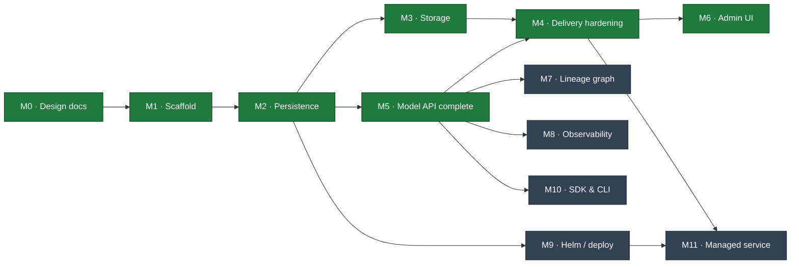

# Lineage — Milestones

Living progress tracker. Update status markers as work lands and link the commit that
completed a task. Architecture specs are in [`docs/`](docs/) (`00`–`11`); this file
tracks *execution* against them.

**Legend:** ✅ done · 🚧 in progress · ⬜ not started · 🔮 future

## Roadmap

## Status Summary

| # | Milestone | Docs | Status |
|---|---|---|---|
| M0 | Architecture & design docs | `00`–`11` | ✅ |
| M1 | Go scaffold (single binary, ports & adapters) | `01` | ✅ |
| M2 | Persistence: per-dialect MetadataStore + migrations | `02` | ✅ |
| M3 | Storage: S3 backend, signed URLs, upload flow | `05` | ✅ |
| M4 | Delivery hardening: cache↔events, fetch, `lineage://` | `04` | ✅ |
| M5 | Model API completeness + OpenAPI | `03` | ✅ |
| M6 | Admin UI: BFF + web console | `06` | ✅ |
| M7 | Lineage & provenance graph | `07` | ⬜ |
| M8 | Observability: metrics, traces, SLOs | `09` | ⬜ |
| M9 | Deployment: Helm chart + profiles | `08` | ⬜ |
| M10 | SDK & CLI (OpenAPI-generated) | `10` | ⬜ |
| M11 | Managed service (separate repo) | `11` | 🔮 |

---

## M0 — Architecture & Design Docs ✅

Full spec set `00`–`11`, mermaid-only diagrams, decisions recorded in `00 §11`.
**Done:** commits through `9eed5f0`.

## M1 — Go Scaffold ✅

Compiling, runnable, tested skeleton; ports & adapters; end-to-end happy path verified.
**Done:** `0f8bb34`.

- [x] Module, package tree, Makefile, README, `.gitignore`
- [x] Domain: entities, enums, stage machine, ULID, coded errors, port interfaces
- [x] Core: create/publish/transition/resolve, audit-in-flow
- [x] Adapters: in-memory store, fs storage, memory cache, event bus
- [x] Two surfaces (:8081 Model API, :8080 Admin UI) + ops (:9090)
- [x] Unit tests (stage machine, name validation); `go vet`/`gofmt` clean

## M2 — Persistence ✅

**Goal:** replace the in-memory store with real per-dialect adapters (§02.7).
**Acceptance:** the full happy path passes against **both** SQLite and Postgres; schema
via migrations; singleton invariant enforced (Postgres `FOR UPDATE`, SQLite serialized).
**Done:** shared `sqlstore` (`database/sql`) + `Dialect`; conformance suite green on
memory + SQLite; persistence verified across a restart.

- [x] Shared `sqlstore` + `Dialect` (placeholders, unique-violation, model lock)
- [x] SQLite `MetadataStore` (cgo-free modernc driver, WAL, single-writer) + migrations
- [x] Postgres `MetadataStore` (pgx) + migrations; `FOR UPDATE` singleton lock
- [x] Shared conformance suite (`storetest`) run vs memory + SQLite; Postgres via `LINEAGE_TEST_PG`
- [x] Versioned forward-only migrator (`schema_version`)
- [x] Config wiring (`LINEAGE_DB_ENGINE`) picks the adapter at startup; default SQLite
- [x] FK `ON DELETE CASCADE` in schema (§02.5)
- [x] Cursor pagination (real `nextPageToken`) — delivered in **M5** (`domain.Page`)
- [ ] JSONB/label-table filtering, Postgres-native features — carried to **M5/M7**

## M3 — Storage ✅

**Goal:** production artifact delivery (§05).
**Acceptance:** register-by-reference fills digest/size via `Stat`; signed upload
(initiate→PUT→finalize) verifies digest; signed download works on S3.
**Done:** hand-rolled SigV4 (validated vs AWS's published vector **and** against a live
MinIO server) so any S3-compatible endpoint works; full upload flow (all three modes) driven
end-to-end over HTTP — including the real binary uploading to MinIO via a presigned PUT and a
consumer downloading via the resolve `signedUrl`; integrity + immutability enforced.

- [x] S3 driver: `SignGet`/`SignPut`/`Stat`/`Get`/`Put`/`Delete`, path- & virtual-host style
      (AWS · MinIO · R2 · Ceph via endpoint override); SigV4 hand-rolled, stdlib-only
- [x] **Credential chain**: static → env → **IRSA / EKS Pod Identity** (STS
      `AssumeRoleWithWebIdentity`) → ECS task role → EC2 IMDSv2; temporary creds cached +
      auto-refreshed before expiry (§05.4.1)
- [x] Upload initiate/finalize flow (§05.6): signed direct PUT (s3), **multipart** for large
      files (presigned part URLs → complete), **and** stream-through (`fs`/non-signing);
      `Put`/`URIFor`/multipart/`ListObjects` added to the `StorageBackend` port
- [x] Integrity: sha256 verification on finalize (stream-through hashes inline; signed path
      Stats `x-amz-meta-sha256`, or verifies-by-stream under a size cap; large/multipart trust
      declared digest + `Stat` size); immutability via write-once `UNIQUE(version_id,name)`
- [x] **GC** (§05.8): default `retain` (`DELETE` drops the row, not bytes); optional `sweep`
      reference-counts objects by uri (`ArtifactRefsURI`) and deletes unreferenced ones past a
      grace period, path-scoped; background sweeper wired via `LINEAGE_STORAGE_GC=sweep`
- [x] Tests: SigV4 vector, `fs` round-trip, IRSA web-identity + cache/refresh, core upload
      (stream-through/multipart/mismatch/immutability), GC sweep; **live MinIO** integration
      (round-trip + multipart, gated by `LINEAGE_TEST_S3_*`)
- [ ] (later) OCI/ORAS driver — a locked v1-out decision (§00.11.4), not a punt

## M4 — Delivery Hardening ✅

**Goal:** the resolve/fetch path is fast, correct, and integration-ready (§04).
**Acceptance:** cache invalidates on events; `ETag`/`304` on resolve; stream-through
fetch for fs; `lineage://` initializer resolves in a KServe pod.
**Done:** verified end-to-end against the running binary — conditional resolve returns 304,
`/content` streams fs bytes, and `lineage-init` pulls `lineage://fraud-detector/production`
into a model dir with matching bytes.

- [x] Resolve cache subscribed to `version.created`/`stage_changed`/`artifact.created` via the
      bus in `core.New`; direct invalidation calls removed (purely event-driven, §04.4)
- [x] `ETag` (= digest) + `If-None-Match` → `304` + `Cache-Control: private,no-cache` on resolve
- [x] `/content` fetch: `302` to a fresh signed URL, or stream-through with `Range` +
      conditional (`http.ServeContent`) where the backend can't sign (`FetchArtifact`)
- [x] `lineage://` grammar parser (`domain.ParseLineageURI`) + `cmd/lineage-init` KServe
      storage-initializer; `ClusterStorageContainer` manifest in §04.5
- [x] Tests: parser cases, resolve ETag/304, content stream/Range/304, event-driven
      invalidation (promotion reflected immediately); live initializer round-trip

## M5 — Model API Completeness ✅

**Goal:** the full `/v1` contract (§03).
**Acceptance:** OpenAPI served at `/v1/openapi.json` matches handlers; all resources CRUD.
**Done:** every resource in the §03 map is wired and verified end-to-end (HTTP tests + a live
SQLite binary smoke run): CRUD, guards, immutability, idempotency, pagination, audit, OpenAPI.

- [x] Model PATCH / `:archive` (reversible) / guarded `DELETE`; Version PATCH / guarded `DELETE`
- [x] Artifact GET / list / PATCH (immutable uri·digest·sizeBytes → `409`) / DELETE
- [x] Lineage endpoints (add/list/delete, relation + target validation)
- [x] Deployment endpoints (create/list/get/patch/delete)
- [x] Audit feed: `GET /v1/models/{m}/audit` + `GET /v1/audit?subjectType=&subjectId=`
- [x] **Idempotency-Key** replay for POST creates (in-process store, replays cached 2xx)
- [x] **Cursor pagination** (real `nextPageToken`, `(createdAt,id)` cursor) — carried from M2,
      shared `domain.Page`, applied to models/versions/audit
- [x] Delete guards: production version / model with production → `409` unless `?force=true`
- [x] Hand-authored **OpenAPI 3.1** spec embedded + served at `/v1/openapi.json`; test asserts
      it covers the resources and every `$ref` resolves
- [ ] Richer `filter` grammar + Postgres `custom_properties` filtering — deferred (§03.3, §02.7)

## M6 — Admin UI ✅

**Goal:** the human console (§06). BFF endpoints + SPA served on :8080.
**Done:** a Vite/React/TypeScript + Tailwind v4 SPA with shadcn-style components, embedded via
`go:embed` and served by the `:8080` BFF; verified end-to-end (Go tests + a live run).
**Design system:** monochrome (grayscale only, no accent color), 1px hairline borders, sharp
(zero-radius) corners, mono type for ids/digests; auto light/dark.

- [x] BFF (`adminui/bff.go`): `/api/overview`, `/api/models` (rollup: version count +
      production pointer), `/api/models/{m}`, `/api/models/{m}/versions/{v}`, `/api/activity`;
      calls the same core in-process, empty collections coalesced to `[]`
- [x] Web console SPA (`adminui/web/`): Overview (counts, stage bars, recent activity), Models
      (searchable table), Model detail (version timeline), Version detail, Activity feed
- [x] Lineage edges + audit **timeline** views on the version detail page
- [x] Search box (header → `/models?q=`); client-side routing with SPA index fallback
- [x] `go:embed all:web/dist` + `make web` (pnpm build); dist committed so `go build` needs no Node
- [x] Tests: SPA served at `/` + fallback for client routes; BFF aggregates/rollup/detail

## M7 — Lineage & Provenance ⬜

**Goal:** the differentiator (§07). Typed edges + graph traversal.

- [ ] Edge create/list/delete; relation validation + CHECK
- [ ] Ancestry + impact-analysis queries (recursive CTE, per-dialect, cycle-safe)
- [ ] SDK auto-capture (`produced_by`, `derived_from`)

## M8 — Observability ⬜

**Goal:** production ops (§09).

- [ ] Prometheus registry (RED, resolve cache, storage, DB, domain gauges)
- [ ] OTel traces (API→core→store/storage), structured request logs
- [ ] Real `/readyz` (DB + cache + storage) ; SLO dashboards/alerts

## M9 — Deployment (Helm) ⬜

**Goal:** the Helm axiom realized (§08).
**Acceptance:** `helm install` on a fresh cluster → working registry (dev profile).

- [ ] Chart: Deployment (two ports), two Services + Ingresses, ConfigMap/Secrets
- [ ] Migration pre-upgrade hook Job; `dev`/`prod` values profiles
- [ ] SQLite-single-replica guard; PVC; optional postgres/redis subcharts
- [ ] Non-root, NetworkPolicy, PDB/HPA

## M10 — SDK & CLI ⬜

**Goal:** client ergonomics (§10). Generated from OpenAPI (needs M5).

- [ ] Python SDK: `publish`, `transition`, `resolve`, `download`, lineage helpers
- [ ] Go CLI `lineage`: model/version/resolve/pull/lineage
- [ ] Generation + versioning pipeline

## M11 — Managed Service 🔮

**Goal:** monetization (§11). **Separate proprietary repo**; the OSS chart is the contract.

- [ ] Control plane: provisioning over the Helm chart, fleet observability, billing
- [ ] Edge gateway: SSO/RBAC → `X-Lineage-Actor`
- [ ] BYOC operator; export/import (no lock-in)
