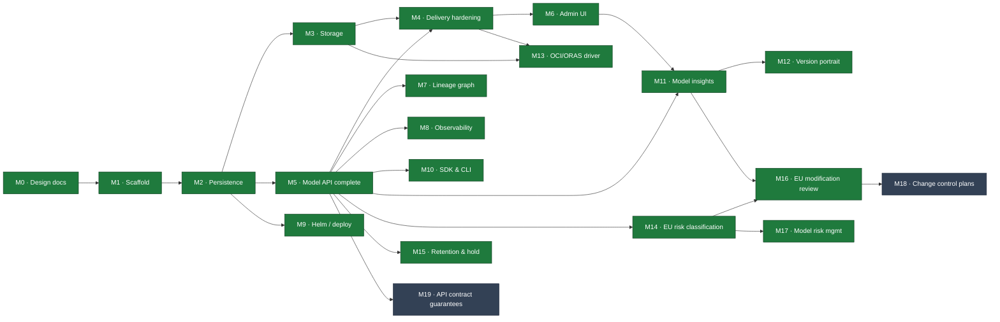

# Lineage — Milestones

This file tracks execution against the architecture specs in [`docs/`](docs/). When a task
lands, update its status marker and link the commit that completed it.

**References:** `§NN.x` means section `x` of `docs/NN-*.md`. For example, §16.7.1 is section
7.1 of `16-eu-risk-classification.md`.

**Legend:** ✅ done · 🚧 in progress · ⬜ not started · 🔮 future

**Renumbered on 2026-09-26.** Milestones now run in the order they shipped, then open work in
dependency order. Commits and code comments before that date use the old numbers:

| Old | New | Milestone |
|---|---|---|
| M17 | M13 | OCI/ORAS storage driver |
| M13 | M14 | EU risk classification & drift |
| M19 | M17 | Model risk management |
| M20 | M18 | Change control plans |
| M21 | M19 | API contract guarantees |

M0–M12, M15 and M16 keep their numbers. The old M14 and M18 are no longer tracked here.

## Roadmap

**Next up:** M19 whenever there is capacity. M18 is built when a user needs it.

## Status Summary

| # | Milestone | Docs | Status |
|---|---|---|---|
| M0 | Architecture & design docs | `00`–`10` | ✅ |
| M1 | Go scaffold (single binary, ports & adapters) | `01` | ✅ |
| M2 | Persistence: per-dialect MetadataStore + migrations | `02` | ✅ |
| M3 | Storage: S3 backend, signed URLs, upload flow | `05` | ✅ |
| M4 | Delivery hardening: cache invalidation, fetch, `lineage://` | `04` | ✅ |
| M5 | Model API completeness + OpenAPI | `03` | ✅ |
| M6 | Admin UI: BFF + web console | `06` | ✅ |
| M7 | Lineage & provenance graph | `07` | ✅ |
| M8 | Observability: metrics, traces, SLOs | `09` | ✅ |
| M9 | Deployment: Helm chart + profiles | `08` | ✅ |
| M10 | SDK & CLI (OpenAPI-generated) | `10` | ✅ |
| M11 | Model insights: fingerprint, footprint, evaluations | `11` | ✅ |
| M12 | Version portrait: generated fingerprint + portrait marks | `12` | ✅ |
| M13 | OCI/ORAS storage driver | §05.3.1 | ✅ |
| M14 | EU risk classification & drift | `16` | ✅ |
| M15 | Retention, legal hold, Merkle audit sealing | `19` | ✅ |
| M16 | EU modification review (Art. 25) | `17` | ✅ |
| M17 | Model risk management: tier, validation, monitoring | `20` | ✅ |
| M18 | Change control plans (FDA PCCP shape) | `22` | ⬜ |
| M19 | API contract guarantees | `03` | ⬜ |

**Open work:** M18 covers the last non-EU regime specced, doc `22`; M17 (doc `20`) has
shipped. It is built on demand, not by dependency (§15.6.1). M19 turns two
existing API contracts into CI checks. There are no blocked decisions: §00.11.11–16 are all
resolved.

---

## M0 — Architecture & Design Docs ✅

The full spec set (`00`–`10`), with Mermaid-only diagrams and decisions recorded in §00.11.
**Done:** commits up to `9eed5f0`. `11-model-insights.md` was written later, alongside **M11**,
and `12-version-portrait.md` later still, with **M12**.

## M1 — Go Scaffold ✅

A compiling, runnable, tested skeleton using ports and adapters, with the end-to-end happy path
verified.
**Done:** `0f8bb34`.

- [x] Module, package tree, Makefile, README, `.gitignore`
- [x] Domain: entities, enums, stage machine, ULIDs, coded errors, port interfaces
- [x] Core: create, publish, transition, resolve; audit recorded inside each flow
- [x] Adapters: in-memory store, filesystem storage, memory cache, event bus
- [x] Two surfaces (Model API on :8081, Admin UI on :8080) plus ops (:9090)
- [x] Unit tests (stage machine, name validation); `go vet` and `gofmt` clean

## M2 — Persistence ✅

**Goal:** replace the in-memory store with real per-dialect adapters (§02.7).
**Acceptance:** the full happy path passes on **both** SQLite and Postgres; the schema is
managed by migrations; the singleton invariant is enforced (Postgres with `FOR UPDATE`, SQLite
by serializing writes).
**Done:** a shared `sqlstore` package (`database/sql`) with a `Dialect` interface. The
conformance suite passes on memory and SQLite, and data persists across a restart.

- [x] Shared `sqlstore` + `Dialect` (placeholders, unique-violation detection, model lock)
- [x] SQLite `MetadataStore` (cgo-free modernc driver, WAL, single writer) + migrations
- [x] Postgres `MetadataStore` (pgx) + migrations; `FOR UPDATE` singleton lock
- [x] Shared conformance suite (`storetest`) run against memory and SQLite; against Postgres
      when `LINEAGE_TEST_PG` is set
- [x] Versioned, forward-only migrator (`schema_version`)
- [x] `LINEAGE_DB_ENGINE` selects the adapter at startup; SQLite is the default
- [x] `ON DELETE CASCADE` foreign keys in the schema (§02.5)
- [x] Cursor pagination with a real `nextPageToken`, delivered in **M5** (`domain.Page`)
- [x] Postgres JSONB push-down for `label` and `custom_properties`, delivered after M9 via a
      per-dialect `JSONContainsClause`. The Postgres adapter is now validated against a real
      embedded Postgres

## M3 — Storage ✅

**Goal:** production-grade artifact delivery (§05).
**Acceptance:** registering an artifact by reference fills in its digest and size via `Stat`;
the signed upload flow (initiate → PUT → finalize) verifies the digest; signed downloads work
on S3.
**Done:** SigV4 is implemented by hand and validated against AWS's published test vector
**and** a live MinIO server, so any S3-compatible endpoint works. All three upload modes were
exercised end-to-end over HTTP, including the real binary uploading to MinIO through a
presigned PUT and a consumer downloading through the `signedUrl` returned by resolve.
Integrity and immutability are enforced.

- [x] S3 driver: `SignGet`, `SignPut`, `Stat`, `Get`, `Put`, `Delete`, with path-style and
      virtual-host-style addressing (AWS, MinIO, R2, Ceph via an endpoint override). SigV4 is
      implemented with the standard library only
- [x] **Credential chain:** static → environment → **IRSA / EKS Pod Identity** (STS
      `AssumeRoleWithWebIdentity`) → ECS task role → EC2 IMDSv2. Temporary credentials are
      cached and refreshed before they expire (§05.4.1)
- [x] Upload flow (§05.6): signed direct PUT (S3), **multipart** for large files (presigned
      part URLs, then complete), **and** stream-through for `fs` and other non-signing
      backends. `Put`, `URIFor`, multipart, and `ListObjects` were added to the
      `StorageBackend` port
- [x] Integrity: SHA-256 is verified on finalize. Stream-through hashes bytes as they arrive.
      The signed path reads `x-amz-meta-sha256` via `Stat`, or re-reads the object to verify it
      when under a size cap. Large and multipart uploads trust the declared digest and check the
      size via `Stat`. Immutability comes from a write-once `UNIQUE(version_id, name)`
- [x] **Garbage collection** (§05.8): the default is `retain` (`DELETE` removes the row, not
      the bytes). The optional `sweep` mode reference-counts objects by URI
      (`ArtifactRefsURI`) and deletes unreferenced ones after a grace period, limited to the
      configured path. Enabled with `LINEAGE_STORAGE_GC=sweep`
- [x] Tests: SigV4 vector, `fs` round-trip, IRSA web identity with cache and refresh, core
      upload (stream-through, multipart, digest mismatch, immutability), GC sweep; **live
      MinIO** integration (round-trip and multipart, enabled by `LINEAGE_TEST_S3_*`)
- [x] OCI/ORAS driver: originally excluded from v1 (§00.11.4); delivered in **M13**

## M4 — Delivery Hardening ✅

**Goal:** a fast, correct resolve/fetch path that integrates easily with serving systems (§04).
**Acceptance:** the cache invalidates on events; resolve supports `ETag`/`304`; fetch streams
bytes from `fs`; the `lineage://` initializer resolves inside a KServe pod.
**Done:** verified end-to-end against the running binary. A conditional resolve returns `304`,
`/content` streams bytes from `fs`, and `lineage-init` pulls
`lineage://fraud-detector/production` into a model directory with matching bytes.

- [x] The resolve cache subscribes to `version.created`, `stage_changed`, and
      `artifact.created` on the event bus (in `core.New`). Direct invalidation calls were
      removed, so invalidation is purely event-driven (§04.4)
- [x] Resolve sets `ETag` (the digest) and `Cache-Control: private, no-cache`, and returns
      `304` on a matching `If-None-Match`
- [x] `/content` fetch: redirects (`302`) to a fresh signed URL, or streams the bytes with
      `Range` and conditional support (`http.ServeContent`) when the backend cannot sign
      (`FetchArtifact`)
- [x] `lineage://` URI parser (`domain.ParseLineageURI`) and the `cmd/lineage-init` KServe
      storage initializer; the `ClusterStorageContainer` manifest is in §04.5
- [x] Tests: parser cases, resolve `ETag`/`304`, content streaming with `Range` and `304`,
      event-driven invalidation (a promotion shows up immediately); live initializer round-trip

## M5 — Model API Completeness ✅

**Goal:** the full `/v1` contract (§03).
**Acceptance:** the OpenAPI document served at `/v1/openapi.json` matches the handlers, and
every resource supports CRUD.
**Done:** every resource in the §03 map is implemented and verified end-to-end, through HTTP
tests and a live smoke run on SQLite: CRUD, guards, immutability, idempotency, pagination,
audit, and OpenAPI.

- [x] Model `PATCH`, reversible `:archive`, and guarded `DELETE`; version `PATCH` and guarded
      `DELETE`
- [x] Artifact `GET`, list, `PATCH` (changing `uri`, `digest`, or `sizeBytes` returns `409`),
      and `DELETE`
- [x] Lineage endpoints (add, list, delete) with relation and target validation
- [x] Deployment endpoints (create, list, get, patch, delete)
- [x] Audit feed: `GET /v1/models/{m}/audit` and `GET /v1/audit?subjectType=&subjectId=`
- [x] **`Idempotency-Key`** support for `POST` creates (in-process store that replays the
      cached 2xx response)
- [x] **Cursor pagination** with a real `nextPageToken` and a `(createdAt, id)` cursor, carried
      over from M2. Shared via `domain.Page` and applied to models, versions, and audit
- [x] Delete guards: deleting a production version, or a model that has one, returns `409`
      unless `?force=true`
- [x] Hand-written **OpenAPI 3.1** spec, embedded in the binary and served at
      `/v1/openapi.json`. A test checks that it covers every resource and that every `$ref`
      resolves
- [x] Postgres filtering on `custom_properties` (`cp.<k>`, JSONB `@>`), done after M9. A richer
      `filter` expression language is still deferred (§03.3)

## M6 — Admin UI ✅

**Goal:** the human-facing console (§06): BFF endpoints plus an SPA, served on :8080.
**Done:** a Vite + React + TypeScript SPA styled with Tailwind v4 and shadcn-style components.
It is embedded with `go:embed` and served by the :8080 BFF. Verified by Go tests and a live
run.
**Design system:** monochrome (grayscale, no accent color), 1px hairline borders, square
corners, monospace type for IDs and digests, automatic light and dark modes.

- [x] BFF (`adminui/bff.go`): `/api/overview`, `/api/models` (with version count and production
      pointer), `/api/models/{m}`, `/api/models/{m}/versions/{v}`, `/api/activity`. It calls
      the same core in-process and returns `[]` rather than `null` for empty collections
- [x] SPA (`adminui/web/`): Overview (counts, stage bars, recent activity), Models (searchable
      table), Model detail (version timeline), Version detail, and Activity feed
- [x] Lineage edges and an audit **timeline** on the version detail page
- [x] Header search box (navigates to `/models?q=`); client-side routing with an SPA fallback
      to `index.html`
- [x] `go:embed all:web/dist` and `make web` (pnpm build). The built `dist` is committed, so
      `go build` does not need Node
- [x] Tests: SPA served at `/` with fallback for client routes; BFF aggregation, rollup, and
      detail endpoints

## M7 — Lineage & Provenance ✅

**Goal:** Lineage's main differentiator (§07): typed edges and graph traversal.
**Done:** bounded, cycle-safe traversal, upstream (ancestry) and downstream (impact), exposed
on the Model API and rendered in the console. Verified end-to-end and by unit tests.

- [x] Edge create, list, delete, with relation and target validation (delivered in **M5**)
- [x] Ancestry (upstream) and impact (downstream) traversal with a bounded `depth`, cycle
      safety (each version is expanded once), relation filtering, and support for external
      dataset references. `core.TraverseLineage` uses the store's indexed edge lookup, so it
      works on every dialect. A per-dialect `WITH RECURSIVE` query can replace it behind the
      port if scale requires it
- [x] `GET /v1/models/{m}/versions/{v}/lineage?direction=&depth=&relations=` returns
      `{nodes, edges}`, or a flat edge list when `direction` is omitted. `GetVersionByID` was
      added to label nodes; OpenAPI updated
- [x] Console: the version detail page renders **Provenance (upstream)** and **Impact
      (downstream)** graphs (BFF `/api/…/graph`), with version nodes linked
- [x] Tests: ancestry, depth limit, impact, relation filter, cycle safety (core); graph over HTTP
- [x] SDK automatic capture of `produced_by` and `derived_from`, delivered in **M10**
      (`sdk/python/lineage/client.py`: run and `git://<sha>` provenance, `derived_from` parents)

## M8 — Observability ✅

**Goal:** production operations support (§09).
**Done:** a dependency-free Prometheus registry with `/metrics`, a real readiness check, and
structured JSON access logs with correlation IDs, all verified live. Tracing and SLO rules
landed after M9. Spans are exported over OTLP from the running binary (API → core → store,
verified against a stub collector), and the six alert rules render and pass
`promtool check rules`.

- [x] **Prometheus registry** (`observability/metrics`): hand-written counters, gauges, and
      histograms with labels and text exposition, with no `client_golang` dependency. It
      records RED metrics (labelled by `surface`, **templated** `route`, `method`, and
      `status`, plus a duration histogram), resolve cache hits and misses, versions published,
      transitions by target stage, singleton demotions, signed URLs issued, finalize latency,
      and digest mismatches. Domain gauges (totals and stage distribution) and DB pool stats
      are refreshed at scrape time via `OnScrape`
- [x] The core has no metrics dependency. A `domain.Meter` port (no-op by default) is injected
      with `core.WithMeter`, a non-breaking functional option, and called from resolve,
      publish, transition, and finalize
- [x] **Structured JSON request logs** (`slog`): surface, route, method, status, `latencyMs`,
      `requestId`, `actor`, and `traceId`. `X-Request-Id` is echoed back, and the **W3C
      `traceparent`** trace ID is propagated for correlation. Secrets, signed URLs, and
      artifact bytes are never logged
- [x] Real **`/readyz`**, which gates traffic on a store check and a `Stat` against the default
      storage backend; `/healthz` reports liveness
- [x] Tests: registry (counters, gauges, cumulative histogram buckets, scrape hooks, label
      escaping), ops handler (health, readiness, metrics, and failure gating), meter hooks
      called from the core
- [x] **OTLP span export** (OpenTelemetry SDK): a `domain.Tracer` port with a no-op default,
      injected via `core.WithTracer`, so the core never imports the SDK (the same pattern as
      `Meter`, §01). The `observability/tracing` adapter owns the provider, the OTLP/HTTP
      exporter, and W3C propagation. Store spans come from a decorator around the
      `MetadataStore` **port**, so SQLite, Postgres, and memory are all covered by one
      implementation and the adapters stay free of telemetry code
- [x] Server spans are named after the **templated** route (renamed once the router matches),
      keeping span names bounded like the metric labels. A 5xx marks the span as errored; a 4xx
      does not. When no `requestId` is supplied, the live span's trace ID is used, so logs and
      traces can be joined
- [x] Tracing is **off unless `otlpEndpoint` is set**. When disabled, the decorator is not in
      the call path at all. The chart renders the environment variables; sampling is
      parent-based
- [x] SLO alert rules (§09.5) shipped as a `PrometheusRule` chart asset built on the existing
      RED metrics: resolve availability and p99 latency, publish success, digest mismatch,
      singleton violation, and instance down
- [x] Tests: real OTLP export to a stub collector, adoption of an upstream `traceparent`,
      disabled path adds nothing, store-decorator spans and error marking, route templating
      and 4xx/5xx handling in middleware; live binary → collector round-trip; `helm lint` and
      `helm template` on both profiles, plus `promtool`

## M9 — Deployment (Helm) ✅

**Goal:** deliver on the Helm axiom (§08).
**Acceptance:** `helm install` on a fresh cluster yields a working registry (dev profile).
**Done:** the chart is in `deploy/helm/lineage`. `helm lint` and `helm template` pass on both
profiles, and misconfiguration guards fail closed. A multi-stage `Dockerfile` builds a
cgo-free static binary into a distroless, non-root image.

- [x] Chart: one Deployment (both surfaces plus the ops port), three Services, two Ingresses.
      Environment is rendered from values; secrets such as the DSN and keys come from
      `secretKeyRef`, never plaintext (§08.6)
- [x] **Migration Job**: a Helm `pre-install`/`pre-upgrade` hook runs `lineage migrate` (a new
      subcommand) for Postgres. SQLite migrates at startup. Ships `values-dev.yaml` and
      `values-prod.yaml`
- [x] **SQLite requires a single replica**: the template fails if `replicaCount > 1` or
      autoscaling is enabled. A PVC backs SQLite and `fs` storage, and the `Recreate`
      strategy protects the single writer. Postgres and Redis are external; bundled subcharts
      are a documented opt-in, and an external managed database is the recommended production
      setup
- [x] Hardening: non-root, `readOnlyRootFilesystem`, all capabilities dropped, seccomp.
      **NetworkPolicy** restricts the Admin UI and opens the Model API and ops ports. **PDB**
      and **HPA** (prod profile) and a **ServiceMonitor**
- [x] `Dockerfile` (Node builds the console → cgo-free static Go binary → distroless nonroot)
      and `make docker`
- [x] Validated: `helm lint` and `helm template` on both profiles, guard failures, and a
      `lineage migrate` smoke test

## M10 — SDK & CLI ✅

**Goal:** client ergonomics (§10), generated from OpenAPI (requires M5).

- [x] Python SDK: `publish`, `transition`, `resolve`, `download`, and lineage helpers. Supports
      all three upload modes (signed direct, multipart, stream-through) with streamed bodies,
      SHA-256 verification on upload and download, and optional git/run lineage capture
- [x] Go CLI `lineage`: list models, publish and promote versions, resolve, pull, and traverse
      lineage; supports multipart upload and multi-artifact pull
- [x] Generation and versioning: `sdk/generate.py` builds an operation → path manifest from
      the served OpenAPI source, and the SDK routes every request through it.
      `make sdk-check` regenerates and compiles it
- [x] Validated end-to-end on both storage tiers: `fs` (stream-through) and S3/MinIO (signed
      direct and a 70 MiB multipart upload), plus `go test ./cmd/lineage-cli`

## M11 — Model Insights ✅

**Goal:** an API for facts about a model's composition (§11): parameter counts, layer
breakdown, framework, precision and quantization, disk and memory footprint, evaluations, and
an architecture fingerprint that classifies how one version differs from another. The registry
stores and queries these facts; external producers derive them (§11.1).
**Acceptance:** given two versions whose facts were submitted over the API,
`GET /v1/models/{m}/diff?from=A&to=B` returns the correct §11.4.1 verdict (`reweighted`,
`recast`, or `rearchitected`) plus metric deltas, and the binary never opens an artifact on
any insight path: no framework code, no header parsing, no artifact reads.
**Depends on:** M5 (Model API contract), M2 (per-dialect store), M6 (console panels). M10 is
not a dependency; the SDK is just one producer among several and was added later.
**Done:** four tables behind the `MetadataStore` port, passing on memory, SQLite, and real
Postgres; the four-hash verdict table with per-tensor partial diffs; `PATCH`-merge writes with
per-field attribution; the published producer contract; console panels. Verified live on the
SQLite binary: two producers merged their facts without overwriting each other, a bf16 → int8
pair diffed as `recast` (−9.6 GB on disk, −10.0 GB in memory, −1.7 points on MMLU), the `409`
immutability guard fired, and the data survived a restart.

### 11a — Schema & core

- [x] Tables `version_insight`, `layer_block`, `footprint`, and `evaluation` (§11.3), with
      per-dialect migrations, `MetadataStore` port methods, and `ON DELETE CASCADE` from
      `model_version`
- [x] `lineage_edge.properties` (optional JSON, §11.3.6), so a `derived_from` edge can carry
      `{method: "quantize"}`
- [x] Domain entities and enums (`source`, `param_count_method`, `dtype_dominant`). `coverage`
      records what could be extracted instead of guessing a value; unknown is `null` (§11.2)
- [x] Per-field provenance (`field_sources` and `reporter_*`), so independent producers can
      contribute without overwriting each other (§11.2, §11.6.1)
- [x] Store conformance suite (`storetest`) extended; passes on memory, SQLite, and Postgres

### 11b — Fingerprint & diff

Everything here computes over stored facts only, the same approach as lineage traversal (§07).

- [x] A published specification for normalizing the architecture document (sorted tensor
      names, normalized op names, collapsed repeats), so independent producers compute
      identical hashes. The registry validates the shape; producers compute the hashes
- [x] Verdict classifier over the stored four-hash ladder, using the §11.4.1 lookup table
      rather than a heuristic, plus a per-tensor Merkle partial diff that reports patterns in
      changed tensor names (for example, detecting a LoRA merge, §11.4.2)
- [x] Partial facts: a missing `weights_hash` produces a narrower verdict that names the
      missing inputs; no facts at all produce `verdict: "unknown"` rather than a guess
      (§11.4.3, §11.6.2)
- [x] Metric deltas are joined on (`suite`, `metric`, `split`, `harness_version`) and respect
      `higher_is_better`. If nothing matches, the result is `comparable: false` rather than a
      misleading delta
- [x] Tests: every verdict row, partial and unknown verdicts, ordering stability of the
      canonical form, non-comparable metric pairs

### 11c — API

- [x] `PATCH …/insight` merges field by field (absent means unchanged; explicit `null` means
      clear) and records `field_sources` for each merged field. This is the default write path
      (§11.6.1)
- [x] `PUT …/insight` for full replacement when there is a single owner; `POST` and
      `GET …/evaluations` (append-only); `PUT` and `GET …/footprints[/{scenario}]` (upsert by
      scenario); `GET …/insight?include=layers,sources`
- [x] `GET /v1/models/{m}/diff?from=&to=` and the cross-model `GET /v1/diff?from=a@1&to=b@2`
- [x] Versioned JSON Schema: payloads declare `schemaVersion`, and an unknown version returns
      `400`. Unknown fields are rejected rather than silently dropped, and writes are never
      partial
- [x] Governance (§11.7): audit is written in the same transaction; a conflicting
      `weights_hash` returns **`409`** unless `?force=true`; evaluations are append-only
- [x] `resolve ?include=insight` adds a compact block (`paramCount`, `dtype`, `diskBytes`,
      `minDeviceMemoryBytes`). It is opt-in so the cached hot path stays small (§04, axiom 8)
- [x] OpenAPI updated. Scalar filters work on both engines; `arch_doc` JSONB predicates are
      Postgres-only (§02.7)
- [x] Tests: multi-producer merge (three writers on disjoint fields, no overwrites),
      schema-version rejection, `409` on a fingerprint contradiction, idempotent replay

### 11d — Producer contract (published, not implemented here)

The registry ships no extractor (§11.5, §11.9). Instead, it owes producers a contract stable
enough to build against.

- [x] JSON Schema published and served next to the OpenAPI document, versioned independently
- [x] A golden fixture set (one per format family) and a conformance test any producer can run
- [x] Architecture-document normalization documented precisely enough that two producers
      compute the same hash for the same model
- [x] Worked producer examples in the docs (curl and SDK), including the `declared`-only path
      for formats that expose nothing

### 11e — Console (§11.8)

- [x] Insights panel on version detail: parameters, framework, precision, disk and memory
      footprint, and layer breakdown (with repeats collapsed). Every value shows its `source`
      and reporter
- [x] Compare view: verdict, hash ladder, summary of changed tensors, metric deltas
- [x] Estimated footprints are shown with the basis of the estimate, not as a bare byte count
- [x] Missing facts are shown as "not reported", distinct from zero or empty

**Non-goals** (§11.9): the registry derives no facts from artifacts (weights, headers, or
config); no scanner ships in this repo; no evaluation orchestration; no verification of
accuracy claims; no explanation of why weights changed.

## M12 — Version Portrait ✅

**Goal:** two procedurally generated marks per version in the console (§12): a square
**Fingerprint** that shows identity (from `insight.hashes`) and a wide **Portrait** that shows
structure (from `insight.layers`). They are independent, deterministic, and drawn in the
browser.
**Done:** `b22a6e9`…`5916f69`. It was specced after M11 and built in the same pass, which is
why it did not have a milestone row until later.

- [x] `VersionPortrait`, `VersionFingerprint`, and `VersionMark` components, drawn only from
      facts a producer has already reported. No new field, table, or API (§12.1)
- [x] Honesty rule (§12.2): a section with no input renders empty; neither mark ever stands in
      for the other; if nothing is reported, no mark is drawn
- [x] Interactive portrait with per-level ring colours and dimension details; fingerprints
      shown side by side in the Compare view

## M13 — OCI/ORAS Storage Driver ✅

**Goal:** resolve the one deferred v1 decision (§00.11.4) by making an OCI registry a
first-class `StorageBackend` (§05.3.1).
**Acceptance:** publishing a version to a registry puts every artifact in **one** manifest;
`Stat` returns the artifact's own content digest; resolve returns an `ociImage` that a KServe
`InferenceService` can use as-is; a standard OCI client can read the manifest Lineage wrote.
**Done:** verified against a live `registry:2`: a driver round-trip, a spec-compliant manifest
fetched using only the standard `Accept` header, and the real binary publishing, resolving,
and serving `/content` end-to-end with `LINEAGE_STORAGE_DRIVER=oci`.

- [x] URI grammar `oci://<registry>/<repo>[:tag][@sha256:…][#<layer>]`
      (`domain.ParseOCIURI`) with distribution-spec name and tag validation. The `#fragment`
      mirrors `lineage://…#artifact`
- [x] Distribution v1.1 client, **standard library only** (like SigV4): manifest get, put, and
      delete; blob head, get, and push (streamed and hashed on the fly); the Docker registry v2
      **bearer-token flow**, with tokens cached per scope (a `pull,push` token also serves later
      pulls)
- [x] **One manifest per version, one layer per artifact**, each titled with
      `org.opencontainers.image.title`. Layers store bytes **unchanged**, so a layer's digest
      *is* the artifact's content digest and the integrity model of §05.5 carries over as-is
- [x] `Put` adds a new layer to the version's manifest (creating the manifest on the first
      write and replacing a same-named layer in place), serialized per `(repo, tag)`
- [x] `SignGet` returns the registry's blob redirect, which is a presigned URL on registries
      backed by object storage. Where blobs are served directly, it returns
      `ErrStorageUnsupported` and delivery falls back to stream-through
- [x] **Port change:** `SignPut` was split out of `Signing`. A registry can offload reads but
      has no presignable write target, so uploads stream through while resolve still offloads
      downloads
- [x] `ociImage` on the resolution (§04.2), omitted when a version's artifacts span more than
      one image
- [x] GC opt-out: `ListObjects` returns `ErrStorageUnsupported`, which the sweeper treats as a
      no-op rather than an error. Registry lifecycle policies own blob retention (§05.8)
- [x] Rejected uploads discard their bytes. On a blob backend this is tidiness; here it is
      **essential**, because a rejected layer would otherwise remain inside a pullable image
      with no GC to remove it
- [x] Configuration via `LINEAGE_OCI_*` and Helm `storage.oci` with a credentials Secret
- [x] Tests: URI grammar; an in-process fake registry covering round-trips, manifest
      accumulation, in-place replacement, **layer safety under concurrent puts**, redirect vs
      direct signing, layer and manifest deletion, and token reuse; core-level `ociImage`,
      stream-through selection, and GC skip; live-registry integration enabled by
      `LINEAGE_TEST_OCI_REGISTRY`

**Known limitations, accepted rather than engineered around** (§05.3.1):

- Lineage pushes an OCI **artifact**, not a runnable image. KServe **modelcars** mount a real
  image with tar layers. Build that image in CI and **register it by reference**; Lineage
  `Stat`s it, and resolve returns the same reference. Repacking artifacts into tar layers would
  break the digest identity that makes `Stat` cheap and integrity verifiable.
- The manifest read-modify-write lock is **per process**. If two replicas finalize different
  artifacts of the same version at the same time, one layer can be lost. The normal case (one
  CI job publishing one version) is unaffected. A proper fix would need a conditional manifest
  PUT, which the distribution spec does not portably provide.

---

# Compliance (M14–M16)

Specced in docs `15`–`19` (`ddf4654`). Doc `15` surveys the regulatory landscape and frames
the approach; it ships no code. **M14, M15, and M16 have all shipped.**

**The stance that constrains every task here:** Lineage is an *evidence substrate*, not a
compliance product. It records facts and **states explicitly what it does not know**. It never
decides a risk class, never asserts that a modification is legally substantial, and never
implies that its audit log satisfies the Act's runtime logging articles (§15.3). A task that
blurs any of these lines is out of scope, not merely postponed. Everything Lineage ships is a
fact, a predicate over facts, or a way to read them.

**Sequencing** follows §15.6. Each task is annotated with its phase number, because the phases
cut across docs while the milestones follow the docs.

## M14 — EU Risk Classification & Drift ✅

**Goal:** record how risky a model is, as a **declared** claim by the operator (never
inferred), and detect when that claim has gone out of date (§16).
**Acceptance:** classify a model as `high_annex_iii`, publish a new version, and
`GET /v1/models?classificationState=stale` returns it with
`staleReasons: ["version_published_since"]`, **without any background job having run**. This
proves drift is computed at read time rather than stored.
**Depends on:** M2 (per-dialect store), M5 (API contract), M6 (console).
**Phase:** 1, plus its share of phase 3.
**Done:** `a3ebc0a`…`8fa3030`. Acceptance was verified live on the real SQLite binary, not just
in tests. Store conformance passes on memory, SQLite, and real Postgres.

**The work forced two corrections, both recorded in the relevant docs.** First, migrations are
**shared, not per-dialect**: this codebase keeps a single portable migration list in
`sqlstore`, and only `Rebind`, `IsUniqueViolation`, `LockModelByVersionSQL`, and
`JSONContainsClause` sit behind the `Dialect`, so one migration serves both engines. Second,
§16.6 said a client-supplied `classifiedAt`/`classifiedBy` would be *ignored*. In fact, the
shared decoder used by every `/v1` write rejects unknown fields, so the response is **`400`**,
and the doc now says so.

- [x] `classification` table (§16.7.1), with **primary key `(model_id, regime)`: one row per
      model per regime**. `MetadataStore` port methods and `ON DELETE CASCADE` from `model`.
      One shared migration, since the schema needs nothing dialect-specific
- [x] **A `CHECK` constraint ties each group of enum columns to the `regime` discriminator.**
      There is only one branch today, so it also rejects any regime this build does not define;
      M17 adds the `mrm` branch. `nullEnum` keeps unused columns `NULL` rather than `''`,
      because an empty string would satisfy `IS NOT NULL` and quietly defeat the constraint
- [x] The fields `eu_system_risk_class` and `eu_gpai_tier` carry an **`eu_` prefix**
      (§16.3.1), while `intended_purpose`, `basis`, `classified_at`, and `review_due_at` do
      not. Whether a field is jurisdiction-specific or shared is part of the contract, not a
      naming preference
- [x] `source` is always `declared`. **There is no `derived` path in the schema or in the
      struct** (§16.7.2): the entity has no settable field, and `MarshalJSON` always emits the
      constant, so a client sending `"source": "derived"` gets `declared` back
- [x] `PUT`/`GET /v1/models/{m}/classifications/{regime}` and `GET …/classifications`. Writes
      are full replacements, not `PATCH` (§16.8). **The regime is part of the path**, so
      writing one regime's assessment can neither see nor modify another's. The audit action
      `classification.set` records the regime as structured data, not only in the message
- [x] Validation (§16.6): enum values must be valid; a class requires `intendedPurpose`; a
      high-risk class requires `basis`; `reviewDueAt` must be in the future. `classifiedAt` and
      `classifiedBy` are set by the server, and **sending them returns `400`**.
      `ClassificationInput` has no field for them, which is a stronger guarantee than a step
      that strips them, since such a step is easy to forget when a new field is added
- [x] **Drift predicate** (§16.5), computed at read time. It has four clauses, each with its
      own reason, and `staleReasons[]` lists *every* clause that fired. It is a **pure function
      over the facts it is given**, so §20.7 can reuse it (§16.5.1) and the inventory filter
      calls the same predicate instead of duplicating it in SQL. Comparisons are strict: a
      publish in the same millisecond as the classification does not count as happening
      *after* it; otherwise, classifying a model would immediately mark it stale
- [x] `classificationState` has three values (`unclassified`, `stale`, `current`), not a
      boolean. `unclassified` is decided first, before any clause runs (§16.4)
- [x] Inventory filter: `GET /v1/models?euSystemRiskClass=&euGpaiTier=&classificationState=`.
      Enum filters run in SQL; the computed state is filtered in Go; pagination is applied
      last, so pages are never short. **The join only happens when needed** (when filtering or
      with `include=classification`), because `GET /v1/models` is a hot path and most callers
      do not use the field
- [x] Console (§16.9): the model table **is** the inventory view. Stale rows show the reason in
      the same component as the badge, so one never renders without the other. The version
      detail page has a Compliance panel. An unclassified model arrives as an explicit `null`
      and is shown as `unclassified`, never as `minimal`. There is no "mark as current" action
      anywhere
- [x] OpenAPI updated (`compliance` tag, 6 schemas, 2 paths, 5 query parameters); scalar
      filters work on both engines
- [x] Tests: each drift clause fires on its own; `unclassified` is not `stale`; every
      validation rule; the intentional false positive in clause 3 (`updated_at` on the
      production version) is asserted as expected behaviour rather than fixed; the `CHECK`
      rejects an `eu_ai_act` row with a null `eu_system_risk_class` on both dialects

**Regime isolation is tested in M17, not here.** The bug that the per-regime key prevents can
only occur when a second regime exists, and the second regime, `mrm`, arrives in M17
(§20.8.1). Writing an undefined regime would only test that the `CHECK` rejects it, which is a
different claim. M14 tests its own part: the key itself, and that one model's rows never leak
into another's.

## M15 — Retention, Legal Hold & Audit Sealing ✅

**Goal:** evidence cannot be destroyed prematurely, and the audit log can prove it has not been
rewritten (§19).
**Acceptance (met):** `DELETE` on a held model returns `409` with `reason: "legal_hold"`.
Editing a row inside a sealed epoch makes `:verify` report `root_mismatch` for that epoch;
deleting a row makes it report `leaf_count_mismatch`. A `:proof` for a sealed row verifies
against its epoch's root.
**Depends on:** M2, M5. **Phase:** 4 (hold and floor), 7 (sealing).

### 15a — Legal hold & retention floor ✅

- [x] `held_since` and `held_by` on `model` and `model_version`; `hold.set` and `hold.release`
      are separate audited actions
- [x] **⚠ The one non-additive change:** `DELETE` refuses a held subject, or one younger than
      the configured retention floor, with `409 failed_precondition` and `details.reason`
      (§00.11.13)
- [x] Holds are inherited **in both directions**, and the refusal names the holding subject in
      `heldSubject`
- [x] A hold blocks **deletion only**. `PATCH`, transitions, publishing, and archiving still
      work
- [x] Retention configuration is reported at `/healthz` **and `GET /v1/retention`**; a value of
      `0` disables it
- [x] `POST …:hold` and `…:release`; the `reason` is stored on the audit event, not on the row

### 15b — Merkle epoch sealing ✅

- [x] `audit_event.epoch` is derived from the row's own timestamp, **without reading any other
      row**
- [x] `audit_epoch` table: one root per closed time window, chained through `prev_root`,
      append-only
- [x] Background sealer, delayed by `sealGraceSeconds`
- [x] Domain-separated leaf and node hashing; leaves ordered by ULID `id`; an odd node is
      promoted to the next level
- [x] Sealing is **on** by default
- [x] `GET /v1/audit:verify` and `GET /v1/audit/{id}:proof`
- [x] The current, unsealed epoch is reported honestly rather than hidden:
      `409 reason: "epoch_unsealed"` with `sealsAt`
- [x] Tests: tampering is detected for an edited row, a deleted row, a removed epoch, and a
      removal at the head of the chain; proof verification; no backfill of existing rows

### Console & chart ✅

- [x] Hold marker on model and version detail pages, naming the holder when the hold is
      inherited. The console has no destructive actions, so nothing needed disabling
- [x] Evidence-integrity panel on the compliance page: retention floor, sealing state, and an
      explicit "verify audit log" action that reports what it did not cover
- [x] Chart values `compliance.retention.*` and `compliance.auditAttestation.*`; the dev
      profile ships with a floor of `0`

**The one behaviour change in M14–M16.** `DELETE` now refuses a held or retention-floored
subject (`409 failed_precondition`). Upgrading changes nothing on its own: the floor defaults
to `0`, and nothing is held until someone places a hold. Every other task in M14–M16 is purely
additive. See §00.11.13.

## M16 — EU Modification Review ✅

**Goal:** warn when modifying someone else's model may have transferred provider liability
under Art. 25 (§17).
**Acceptance (met):** a fine-tune with a `derived_from` edge to a high-risk model appears in
`GET /v1/reviews?status=open` with its verdict and declared method. Recording a review closes
the item. A client-supplied `verdictAtReview` is rejected with `400`, and nothing is stored.
**Depends on:** M14 (the risk class that gates the queue), M11 (the §11.4 verdicts).
**Phase:** 5.
**Done:** conformance passes on memory, SQLite, and real Postgres. The seeded registry
populates the queue with all four notable verdicts.

- [x] `modification_review` table (§17.5.1), append-only like `evaluation`. A re-review adds a
      new row, and the queue uses the latest row per (`version_id`, `edge_id`). **There is no
      foreign key on `edge_id`:** deleting the edge removes the item from the queue, but must
      not erase the record that a human reviewed it
- [x] `verdict_at_review` is **set by the server and frozen**, so a `weights_hash` submitted
      later cannot change what the reviewer actually saw. A closed item returns both this and
      the current verdict, so any difference is visible
- [x] Queue query (§17.4) with all four conditions, including that **`unknown` verdicts are
      eligible**. Conditions 2 and 3 form a pure predicate (`ReviewEligible`) shared by the
      endpoint, the console, and drift clause 4. Condition 3 is an **inner join**, which
      bounds the scan
- [x] `POST …/reviews` rejects a client-supplied verdict with `400`: `ReviewInput` has no field
      for it, and the shared decoder rejects unknown keys. `GET /v1/reviews?status=` has no
      default status, so the full total can always be retrieved
- [x] The response includes `basis` as **two lists, not one**, because the question it answers
      is which *side* of the comparison was missing which facts. `hashes` is included
      alongside, as in the §11.6.2 diff
- [x] `undetermined` is a valid outcome and closes the item like any other
- [x] Console (§17.7): the queue in the compliance workspace, with both fingerprints side by
      side and the changed rings highlighted. Nothing on the page blocks any action
- [x] Drift clause 4 connected back to M14. It is computed in core rather than SQL, because
      whether an item is open depends on the §11.4 verdict; it is batched for inventory reads
- [x] Tests: each queue condition; `unknown` is queued; latest row per pair; the frozen verdict
      survives a later hash write; an open item blocks no transition, publish, or delete

**Non-goals across M14–M16** (§15.5): deciding a risk class; asserting substantial
modification; conformity assessment, CE marking, or EU database submission; Art. 12/19 runtime
inference logging; risk management, human oversight, or cybersecurity (not
built); advice on retention periods.

## M17 — Model Risk Management ✅

**Goal:** a single set of fields that serves SR 26-2, PRA SS1/23, and OSFI E-23 (§20).
**Acceptance:** `GET /v1/models?mrmTier=tier_1&mrmState=stale` returns a tier-1 model whose
production version has had no evaluation since it was promoted, with the reason
`unmonitored_in_production`.
**Depends on:** M14 (the `classification` row). **Phase:** 9.
**Why it might come first:** of the regimes in doc `15`, it is the only one with budget
already allocated today, rather than a deadline still to come.
**Done:** `0a0161d`…`efbaa53`. Acceptance is asserted over HTTP in `modelapi` and in core, not
yet verified on a live binary. Store conformance, including regime isolation and the
cross-regime `CHECK`, passes on memory, SQLite, and real Postgres; an upgrade test runs the
migration over M16-era SQLite rows. The seeded registry shows one model on each MRM rung.

**The work forced five corrections, all recorded in `20`.** The `CHECK` is changed by
**rebuilding** `classification` (SQLite cannot alter one), still in the one shared migration
list. The model-level state needs a **subject version** — production, else newest — since
§20.7 is per version and the inventory per model. **`undetermined` reads `unvalidated`**, not
`current`. The inventory's `mrm` object is the row's classification view (`mrmTier`, not
`tier`). `evidence_artifact_id` carries **no foreign key**, for the §17.5.1 reason. Two
additions: `POST …/validations/{id}:clearConditions` (the doc named the column but no
endpoint, 409 `not_conditional` / `already_cleared`), and `GET …/validations` returning that
version's own state.

- [x] **One new column and one new `regime` value** (§20.8.1): add `mrm_tier` to
      `classification`, add `mrm` to `regime`, and add a branch to the §16.7.1 `CHECK`. An MRM
      assessment is the row `(model_id, 'mrm')`. There is **no `mrm_basis`**: the shared
      `basis` column is filled in again on that row, which is exactly what per-regime rows make
      possible (§20.4)
- [x] `out_of_scope` tier with a **required basis**. The SR 26-2 carve-out for generative AI is
      *declared*, never inferred (§20.3); the registry does not decide what a regulation covers
- [x] `validation` table (§20.8.2), append-only. A validation is a **judgement**, not a
      measurement, so it is kept separate from `evaluation` (§20.5). A `conditional` result
      requires a non-empty `conditions`
- [x] `stage_changed_at` on `model_version`, backfilled from `audit_event`. This is the only
      new column that clause 3 needs
- [x] `mrmState` predicate (§20.7) reusing the §16.5 drift machinery, with all four clauses.
      **`unmonitored_in_production` matters most**: it catches the ongoing-monitoring failure
      that all three regimes exist to prevent
- [x] Independence is **recorded, not enforced** (§20.6): flag a validation whose
      `validated_by` matches the version's author, but never reject the write
- [x] `PUT`/`GET /v1/models/{m}/classifications/mrm`; inventory filter
      `GET /v1/models?mrmTier=&mrmState=`
- [x] `validatedBy` and `validatedAt` are set by the server; client-supplied values return `400`
- [x] Tests: each staleness clause; `conditional` without `conditions` is rejected; latest row
      per version; the independence flag on a self-validated version
- [x] **Regime isolation, deferred from M14:** writing the `mrm` row leaves the `eu_ai_act`
      row's `classified_at` and staleness unchanged. This is the bug the `(model_id, regime)`
      key exists to prevent (§16.3.2), and M17 is the first milestone with two regimes that
      could trigger it. Also test that the `CHECK` rejects an enum from the wrong regime on both
      dialects
- [x] OpenAPI (`MRMTier`, `MRMState`, `Validation*`, two paths, `stageChangedAt`) and the SDK
      operation manifest regenerated
- [x] Console (§20.10): a model-risk tier column on the model table, model-risk panels on the
      model and version pages with the validation timeline, and a model-risk worklist on the
      compliance page. `untiered` renders as `untiered`; nothing is gated
- [x] Seed: `fraud-detector` tier 1 and stale (`conditions_outstanding`), `churn-predictor`
      tier 3 and current, `demand-forecast` tier 2 and unvalidated, plus one self-validation

## M18 — Change Control Plans ⬜

**Goal:** record a declared envelope of permitted changes, and check what actually shipped
against it (§22).
**Acceptance:** declare a plan allowing `["identical", "reweighted"]`, then publish a version
whose §11.4 verdict is `rescaled`. The version appears in
`GET /v1/change-plans/conformance?status=outside_plan` with its basis, **and the publish is
not blocked**.
**Depends on:** the §11.4 fingerprints. **Phase:** 10.

- [ ] `change_plan` table (§22.6.1), append-only. Superseding a plan adds a new row and sets
      `effective_to` on the old one, because the key question is *which plan was in force when
      a given version shipped*
- [ ] The envelope uses the §11.4.1 **verdict vocabulary**, not free text (§22.3). A phrase
      like *"minor retraining only"* cannot be checked and would never flag anything
- [ ] Conformance is **computed on read, never stored** (§22.4). A stored verdict would be a
      second source of truth that goes stale as soon as either side changes
- [ ] `undetermined` (no `weights_hash`) is **queued, not passed** (§22.4.1). Treating a
      missing hash as conformant would hide any producer that never computes one
- [ ] `uncovered` is distinct from `outside_plan` (§22.4.2): a version published before the plan
      existed is not a violation
- [ ] Overlapping active plans are rejected with `409 plan_overlap`, so there is always exactly
      one applicable plan
- [ ] Every queue row includes a `basis`, so readers see *why* it was flagged, not just the label
- [ ] **Publishing is never blocked** (§22.5). A registry that refused publishes based on a
      derived legal judgement would often be wrong, and users would quickly work around it
- [ ] Tests: each conformance branch; supersession preserves history; overlaps are rejected;
      publishing succeeds while `outside_plan`

---

## M19 — API Contract Guarantees ⬜

**Goal:** turn two integration contracts that Lineage already meets into CI checks, so no
refactor can quietly break them: a `/v1` API complete enough that an external client can read
every recorded fact, and a configurable actor header.
**Acceptance:** an external process with no privileged access reads every fact a compliance
report needs from `/v1` alone; a custom `LINEAGE_ACTOR_HEADER` is honoured end-to-end into the
audit trail.
**Depends on:** M5 (the `/v1` contract).

- [ ] **Read-from-outside test.** A test binary talking to a live server over HTTP only
      collects a reference report kept in the test suite. It covers a version-scoped read, an
      install-scoped `asOf` read, evaluations, lineage, audit history, and the classification
      fields. If it ever needs an in-process call, that is a `/v1` gap to close, not a test to
      loosen
- [ ] **Actor-header test.** A non-default `LINEAGE_ACTOR_HEADER` is honoured; its value is
      recorded **verbatim** in `audit_event`; Lineage makes no authorization decision from it
      (§00.2.4), so a front door that rewrites the header is enough
- [ ] Document the header in §03 as an **integration contract**: its name is configurable, its
      value is trusted, and changing either is a breaking change
- [ ] **Core smoke test:** the default build starts on Postgres, resolves, fetches, signs URLs
      and seals an audit epoch
- [ ] These tests run in CI on every PR, not only at release time
