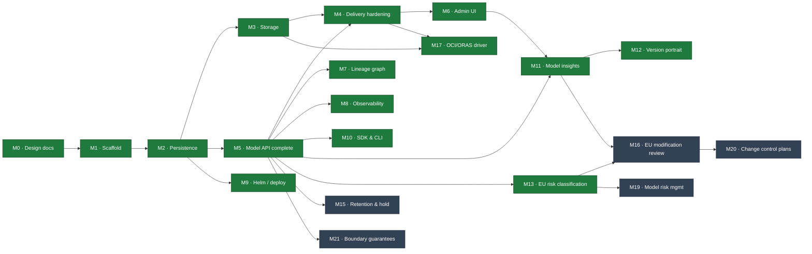

# Lineage — Milestones

Living progress tracker. Update status markers as work lands and link the commit that
completed a task. Architecture specs are in [`docs/`](docs/) (`00`–`24`); this file
tracks *execution* against them.

**This file tracks the free registry only.** Lineage is open core (`24`): everything below is
Apache-2.0 and ships here. The commercial tier is a separate program in a separate repository
and has its own tracker; nothing in it is a prerequisite for anything here. See
[§ Boundary](#boundary) for what moved out and why.

**Legend:** ✅ done · 🚧 in progress · ⬜ not started · 🔮 future · ⧉ split — this milestone
ships its facts here and its bundle profile in the commercial repo

## Roadmap

**Next up:** M15 — retention, legal hold and Merkle sealing. With evidence export moved out
(§ Boundary), the remaining core work is the record itself, and sealing is what makes that
record worth citing. M16 follows, then M19/M20 by demand.

## Status Summary

Shipped first, then open work in dependency order. **The number is an identifier, not a
position** — M17 was specced late and shipped early, and renumbering it would break every
reference already written against it.

| # | Milestone | Docs | Status |
|---|---|---|---|
| M0 | Architecture & design docs | `00`–`19` | ✅ |
| M1 | Go scaffold (single binary, ports & adapters) | `01` | ✅ |
| M2 | Persistence: per-dialect MetadataStore + migrations | `02` | ✅ |
| M3 | Storage: S3 backend, signed URLs, upload flow | `05` | ✅ |
| M4 | Delivery hardening: cache↔events, fetch, `lineage://` | `04` | ✅ |
| M5 | Model API completeness + OpenAPI | `03` | ✅ |
| M6 | Admin UI: BFF + web console | `06` | ✅ |
| M7 | Lineage & provenance graph | `07` | ✅ |
| M8 | Observability: metrics, traces, SLOs | `09` | ✅ |
| M9 | Deployment: Helm chart + profiles | `08` | ✅ |
| M10 | SDK & CLI (OpenAPI-generated) | `10` | ✅ |
| M11 | Model insights: fingerprint, footprint, evaluations | `11` | ✅ |
| M12 | Version portrait: generated fingerprint + portrait marks | `12` | ✅ |
| M17 | OCI/ORAS storage driver | `05.3.1` | ✅ |
| M13 | EU risk classification & drift | `16` | ✅ |
| M15 | Retention, legal hold, Merkle audit sealing | `19` | ⬜ |
| M16 | EU modification review (Art. 25) | `17` | ⬜ |
| M19 | Model risk management: tier, validation, monitoring | `20` | ⬜ ⧉ |
| M20 | Change control plans (FDA PCCP shape) | `22` | ⬜ ⧉ |
| M21 | Boundary guarantees: the two contracts `24` rests on | `24` | ⬜ |

**M14 and M18 are not in this table.** Evidence export (`18`, `21`) moved wholly commercial —
see [§ Boundary](#boundary). They are tracked in the commercial repo.

**Open work:** M15 and M16, the rest of the EU set specced in `15`–`19` (`ddf4654`; M13 has
shipped), then M19–M20, the non-EU regimes specced in `20`–`22`, plus **M21, now load-bearing**
rather than a guard (§ Boundary). No blocked decisions —
`00.11.11`–`16` are all resolved. M3's OCI/ORAS checkbox, the one pre-existing `[ ]`, closed
with **M17**.

**M19–M20 are demand-ordered, not dependency-ordered** (`15.6.1`): none blocks another, and
which comes first is a question about the next buyer rather than the next commit.

## Boundary

`24` is the public promise; this is what it means for execution. The test is one line:

> **Core holds the record. If it turns stored facts into paperwork, it is commercial.**

**Evidence export left core entirely.** `18` and `21` are now wholly commercial — the bundle
mechanism, `evidence_bundle`, install scope, and all six profiles including `annex_xii`. The
two milestones that were going to build them, **M14 and M18, are no longer tracked here**;
they are the commercial repo's work. M19 and M20 keep everything except their one profile.

| Milestone | Stays here | Goes there |
|---|---|---|
| M13 ✅ | classification, drift predicate, inventory query | — |
| M15 | retention floor, legal hold, Merkle sealing | — |
| M16 | the modification-review queue | — |
| M19 | `mrm_tier`, `validation`, `stage_changed_at`, the `mrmState` predicate | the `mrm` profile |
| M20 | `change_plan`, the conformance predicate, the queue | the `pccp` profile |
| ~~M14~~ | — | the whole bundle mechanism and every profile |
| ~~M18~~ | — | install-scope bundles, `iso_42001`, `nist_ai_rmf` |

**The old rule is dead, and it is worth saying why.** It used to read *"if it needs a column,
it is core"* — which held only while the commercial tier was profiles alone. `evidence_bundle`
is a table (`18.8.1`), and it now lives with the thing that writes it, so the commercial
program carries its own schema. The upside is that the dependency arrow reverses: core no
longer gains anything on behalf of the commercial tier, ever. The old M18 columns were the one
counter-example, and they left with `18`.

**What core owes in exchange: `/v1` completeness.** Every profile is built from outside, so a
gap in the public API is now a broken promise rather than an inconvenience. That obligation
lands on **M21**, whose rebuild-from-outside test changes shape — it can no longer compare
against a bundle core produces, because core produces none. Instead it asserts that an
out-of-tree process, over HTTP only, can assemble a complete bundle from a reference profile
kept in the test suite. Same guarantee, and now the only thing standing behind `24 §4.3`.

**M21 is therefore no longer optional or late.** It was specced as a guard against a future
refactor; it is now the sole mechanism keeping the free registry honest about what a paying
client can do that you cannot.

**One behaviour change to plan for.** M15 makes `DELETE` **refuse** on held or
retention-floored subjects (`409 failed_precondition`). Every other task in M13–M16 is
purely additive — new tables, new endpoints, no existing behaviour altered. See §00.11.13.

---

## M0 — Architecture & Design Docs ✅

Full spec set `00`–`10`, mermaid-only diagrams, decisions recorded in `00 §11`.
**Done:** commits through `9eed5f0`. `11-model-insights.md` was specced later, with **M11**
(it replaced the managed-service doc, moved out of this OSS repo); `12-version-portrait.md`
later still, with **M12**.

## M1 — Go Scaffold ✅

Compiling, runnable, tested skeleton; ports & adapters; end-to-end happy path verified.
**Done:** `0f8bb34`.

- [x] Module, package tree, Makefile, README, `.gitignore`
- [x] Domain: entities, enums, stage machine, ULID, coded errors, port interfaces
- [x] Core: create/publish/transition/resolve, audit-in-flow
- [x] Adapters: in-memory store, fs storage, memory cache, event bus
- [x] Two surfaces (:8081 Model API, :8080 Admin UI) + ops (:9090)
- [x] Unit tests (stage machine, name validation); `go vet`/`gofmt` clean

## M2 — Persistence ✅

**Goal:** replace the in-memory store with real per-dialect adapters (§02.7).
**Acceptance:** the full happy path passes against **both** SQLite and Postgres; schema
via migrations; singleton invariant enforced (Postgres `FOR UPDATE`, SQLite serialized).
**Done:** shared `sqlstore` (`database/sql`) + `Dialect`; conformance suite green on
memory + SQLite; persistence verified across a restart.

- [x] Shared `sqlstore` + `Dialect` (placeholders, unique-violation, model lock)
- [x] SQLite `MetadataStore` (cgo-free modernc driver, WAL, single-writer) + migrations
- [x] Postgres `MetadataStore` (pgx) + migrations; `FOR UPDATE` singleton lock
- [x] Shared conformance suite (`storetest`) run vs memory + SQLite; Postgres via `LINEAGE_TEST_PG`
- [x] Versioned forward-only migrator (`schema_version`)
- [x] Config wiring (`LINEAGE_DB_ENGINE`) picks the adapter at startup; default SQLite
- [x] FK `ON DELETE CASCADE` in schema (§02.5)
- [x] Cursor pagination (real `nextPageToken`) — delivered in **M5** (`domain.Page`)
- [x] Postgres JSONB `label`/`custom_properties` push-down — delivered post-M9 (per-dialect
      `JSONContainsClause`); the Postgres adapter is now validated on real embedded Postgres

## M3 — Storage ✅

**Goal:** production artifact delivery (§05).
**Acceptance:** register-by-reference fills digest/size via `Stat`; signed upload
(initiate→PUT→finalize) verifies digest; signed download works on S3.
**Done:** hand-rolled SigV4 (validated vs AWS's published vector **and** against a live
MinIO server) so any S3-compatible endpoint works; full upload flow (all three modes) driven
end-to-end over HTTP — including the real binary uploading to MinIO via a presigned PUT and a
consumer downloading via the resolve `signedUrl`; integrity + immutability enforced.

- [x] S3 driver: `SignGet`/`SignPut`/`Stat`/`Get`/`Put`/`Delete`, path- & virtual-host style
      (AWS · MinIO · R2 · Ceph via endpoint override); SigV4 hand-rolled, stdlib-only
- [x] **Credential chain**: static → env → **IRSA / EKS Pod Identity** (STS
      `AssumeRoleWithWebIdentity`) → ECS task role → EC2 IMDSv2; temporary creds cached +
      auto-refreshed before expiry (§05.4.1)
- [x] Upload initiate/finalize flow (§05.6): signed direct PUT (s3), **multipart** for large
      files (presigned part URLs → complete), **and** stream-through (`fs`/non-signing);
      `Put`/`URIFor`/multipart/`ListObjects` added to the `StorageBackend` port
- [x] Integrity: sha256 verification on finalize (stream-through hashes inline; signed path
      Stats `x-amz-meta-sha256`, or verifies-by-stream under a size cap; large/multipart trust
      declared digest + `Stat` size); immutability via write-once `UNIQUE(version_id,name)`
- [x] **GC** (§05.8): default `retain` (`DELETE` drops the row, not bytes); optional `sweep`
      reference-counts objects by uri (`ArtifactRefsURI`) and deletes unreferenced ones past a
      grace period, path-scoped; background sweeper wired via `LINEAGE_STORAGE_GC=sweep`
- [x] Tests: SigV4 vector, `fs` round-trip, IRSA web-identity + cache/refresh, core upload
      (stream-through/multipart/mismatch/immutability), GC sweep; **live MinIO** integration
      (round-trip + multipart, gated by `LINEAGE_TEST_S3_*`)
- [x] OCI/ORAS driver — was a locked v1-out decision (§00.11.4); delivered in **M17**

## M4 — Delivery Hardening ✅

**Goal:** the resolve/fetch path is fast, correct, and integration-ready (§04).
**Acceptance:** cache invalidates on events; `ETag`/`304` on resolve; stream-through
fetch for fs; `lineage://` initializer resolves in a KServe pod.
**Done:** verified end-to-end against the running binary — conditional resolve returns 304,
`/content` streams fs bytes, and `lineage-init` pulls `lineage://fraud-detector/production`
into a model dir with matching bytes.

- [x] Resolve cache subscribed to `version.created`/`stage_changed`/`artifact.created` via the
      bus in `core.New`; direct invalidation calls removed (purely event-driven, §04.4)
- [x] `ETag` (= digest) + `If-None-Match` → `304` + `Cache-Control: private,no-cache` on resolve
- [x] `/content` fetch: `302` to a fresh signed URL, or stream-through with `Range` +
      conditional (`http.ServeContent`) where the backend can't sign (`FetchArtifact`)
- [x] `lineage://` grammar parser (`domain.ParseLineageURI`) + `cmd/lineage-init` KServe
      storage-initializer; `ClusterStorageContainer` manifest in §04.5
- [x] Tests: parser cases, resolve ETag/304, content stream/Range/304, event-driven
      invalidation (promotion reflected immediately); live initializer round-trip

## M5 — Model API Completeness ✅

**Goal:** the full `/v1` contract (§03).
**Acceptance:** OpenAPI served at `/v1/openapi.json` matches handlers; all resources CRUD.
**Done:** every resource in the §03 map is wired and verified end-to-end (HTTP tests + a live
SQLite binary smoke run): CRUD, guards, immutability, idempotency, pagination, audit, OpenAPI.

- [x] Model PATCH / `:archive` (reversible) / guarded `DELETE`; Version PATCH / guarded `DELETE`
- [x] Artifact GET / list / PATCH (immutable uri·digest·sizeBytes → `409`) / DELETE
- [x] Lineage endpoints (add/list/delete, relation + target validation)
- [x] Deployment endpoints (create/list/get/patch/delete)
- [x] Audit feed: `GET /v1/models/{m}/audit` + `GET /v1/audit?subjectType=&subjectId=`
- [x] **Idempotency-Key** replay for POST creates (in-process store, replays cached 2xx)
- [x] **Cursor pagination** (real `nextPageToken`, `(createdAt,id)` cursor) — carried from M2,
      shared `domain.Page`, applied to models/versions/audit
- [x] Delete guards: production version / model with production → `409` unless `?force=true`
- [x] Hand-authored **OpenAPI 3.1** spec embedded + served at `/v1/openapi.json`; test asserts
      it covers the resources and every `$ref` resolves
- [x] Postgres `custom_properties` filtering (`cp.<k>`, JSONB `@>`) — done post-M9; a richer
      `filter` expression grammar is still deferred (§03.3)

## M6 — Admin UI ✅

**Goal:** the human console (§06). BFF endpoints + SPA served on :8080.
**Done:** a Vite/React/TypeScript + Tailwind v4 SPA with shadcn-style components, embedded via
`go:embed` and served by the `:8080` BFF; verified end-to-end (Go tests + a live run).
**Design system:** monochrome (grayscale only, no accent color), 1px hairline borders, sharp
(zero-radius) corners, mono type for ids/digests; auto light/dark.

- [x] BFF (`adminui/bff.go`): `/api/overview`, `/api/models` (rollup: version count +
      production pointer), `/api/models/{m}`, `/api/models/{m}/versions/{v}`, `/api/activity`;
      calls the same core in-process, empty collections coalesced to `[]`
- [x] Web console SPA (`adminui/web/`): Overview (counts, stage bars, recent activity), Models
      (searchable table), Model detail (version timeline), Version detail, Activity feed
- [x] Lineage edges + audit **timeline** views on the version detail page
- [x] Search box (header → `/models?q=`); client-side routing with SPA index fallback
- [x] `go:embed all:web/dist` + `make web` (pnpm build); dist committed so `go build` needs no Node
- [x] Tests: SPA served at `/` + fallback for client routes; BFF aggregates/rollup/detail

## M7 — Lineage & Provenance ✅

**Goal:** the differentiator (§07). Typed edges + graph traversal.
**Done:** bounded, cycle-safe traversal (ancestry upstream, impact downstream) exposed on the
Model API and rendered in the console; verified end-to-end + unit-tested.

- [x] Edge create/list/delete; relation + target validation — delivered in **M5**
- [x] Ancestry (upstream) + impact-analysis (downstream) traversal: bounded `depth`, cycle-safe
      (each version expanded once), relation filter, reaches external dataset refs;
      `core.TraverseLineage` walks the store's indexed edge lookup (dialect-agnostic; a
      per-dialect `WITH RECURSIVE` can replace the neighbor-walk behind the port for scale)
- [x] `GET /v1/models/{m}/versions/{v}/lineage?direction=&depth=&relations=` → `{nodes, edges}`
      (flat edge list without `direction`); `GetVersionByID` added for node labeling; OpenAPI updated
- [x] Console: version detail renders **Provenance (upstream)** + **Impact (downstream)** graphs
      (BFF `/api/…/graph`), version nodes linked
- [x] Tests: ancestry, depth bound, impact, relation filter, cycle safety (core); graph over HTTP
- [x] SDK auto-capture (`produced_by`, `derived_from`) — delivered in **M10**
      (`sdk/python/lineage/client.py`: run + `git://<sha>` provenance, `derived_from` parents)

## M8 — Observability ✅

**Goal:** production ops (§09).
**Done:** a hand-rolled, dependency-free Prometheus registry + `/metrics`, real readiness, and
structured JSON access logs with correlation IDs — all verified live. Tracing and the SLO rules
landed after M9: spans export over OTLP from the running binary (API → core → store, verified
against a stub collector), and the six alert rules render and pass `promtool check rules`.

- [x] **Prometheus registry** (`observability/metrics`, hand-rolled counters/gauges/histograms
      with labels + text exposition — no `client_golang` dep): RED (`surface`/**templated**
      `route`/`method`/`status` + duration histogram), resolve cache hit/miss, versions
      published, transitions by `to`-stage, singleton demotions, signed URLs, finalize latency,
      digest-mismatch; domain gauges (totals + stage distribution) and DB pool stats refreshed
      at scrape via `OnScrape`
- [x] Core stays metrics-free: a `domain.Meter` port (no-op default) is injected with
      `core.WithMeter` (non-breaking functional option); hooks in resolve/publish/transition/finalize
- [x] **Structured JSON request logs** (`slog`): surface, route, method, status, latencyMs,
      `requestId`, `actor`, `traceId`; `X-Request-Id` echoed; **W3C `traceparent`** trace-id
      propagated for correlation — never logs secrets/signed URLs/bytes
- [x] Real **`/readyz`**: composed store + default-storage `Stat` checks gate traffic; `/healthz` liveness
- [x] Tests: registry (counter/gauge/histogram cumulative buckets, scrape hooks, label escaping),
      ops handler (health/ready/metrics + failure gating), meter hooks fire from the core
- [x] **OTLP span export** (OTel SDK): a `domain.Tracer` port with a no-op default, injected via
      `core.WithTracer` — the core never imports the SDK, mirroring `Meter` (§01). The
      `observability/tracing` adapter owns the provider, OTLP/HTTP exporter, and W3C propagation;
      store spans come from a decorator over the `MetadataStore` **port**, so SQLite/Postgres/
      memory are covered once and the store adapters stay telemetry-free
- [x] Server spans carry the **templated** route (renamed after the mux matches), so span names
      stay bounded like the metric labels; 5xx marks the span errored, 4xx does not; `requestId`
      falls back to the live span's trace id so logs and traces join
- [x] Tracing is **off unless `otlpEndpoint` is set** — disabled means the decorator is not in
      the call path at all; the chart renders the env, sampling is parent-based
- [x] SLO alert rules (§09.5) as a `PrometheusRule` chart asset over the existing RED metrics:
      resolve availability + p99, publish success, digest mismatch, singleton violation, down
- [x] Tests: real OTLP export to a stub collector, upstream `traceparent` adoption, disabled-path
      identity, store-decorator spans + error marking, middleware route templating and 4xx/5xx;
      live binary → collector round-trip; `helm lint`/`template` both profiles + `promtool`

## M9 — Deployment (Helm) ✅

**Goal:** the Helm axiom realized (§08).
**Acceptance:** `helm install` on a fresh cluster → working registry (dev profile).
**Done:** chart in `deploy/helm/lineage`; `helm lint` + `helm template` clean on both profiles;
guards fail-closed; multi-stage `Dockerfile` (cgo-free static → distroless non-root).

- [x] Chart: Deployment (two surfaces + ops port), three Services, two Ingresses; env rendered
      from values (secret-bearing DSN/keys via `secretKeyRef`, never plaintext, §08.6)
- [x] **Migrate Job** = Helm `pre-install`/`pre-upgrade` hook running `lineage migrate` (new
      subcommand) for Postgres; SQLite migrates at startup; `values-dev.yaml` / `values-prod.yaml`
- [x] **SQLite ⇒ single replica** enforced (template `fail` on `replicaCount>1` or autoscaling);
      PVC for sqlite/fs; `Recreate` strategy for the single-writer; postgres/redis are external
      (subcharts reserved as a documented opt-in — external managed DB is the prod path)
- [x] Hardened: non-root, `readOnlyRootFilesystem`, dropped caps, seccomp; **NetworkPolicy**
      (restricts Admin UI, opens Model API + ops), **PDB** + **HPA** (prod), **ServiceMonitor**
- [x] `Dockerfile` (node build console → cgo-free static Go binary → distroless nonroot) + `make docker`
- [x] Validated: `helm lint`/`template` both profiles, guard failures, `lineage migrate` smoke

## M10 — SDK & CLI ✅

**Goal:** client ergonomics (§10). Generated from OpenAPI (needs M5).

- [x] Python SDK: `publish`, `transition`, `resolve`, `download`, lineage helpers; all three
      upload modes (signed direct, multipart, stream-through) with streamed bodies; SHA-256
      verification on upload and download; optional git/run lineage capture
- [x] Go CLI `lineage`: model list, version publish/promote, resolve, pull, lineage traversal;
      multipart upload and multi-artifact pull
- [x] Generation + versioning pipeline: `sdk/generate.py` derives an operation → path manifest
      from the served OpenAPI source and the SDK routes every request through it;
      `make sdk-check` regenerates and compiles it
- [x] Validated end-to-end on both storage tiers: `fs` (stream-through) and S3/MinIO
      (signed direct + 70 MiB multipart), plus `go test ./cmd/lineage-cli`

## M11 — Model Insights ✅

**Goal:** the fact API for model composition (§11) — param counts, layer breakdown,
framework, precision/quantization, disk vs memory footprint, evaluations, and an
architecture fingerprint that classifies version-to-version change. The registry stores and
queries these facts; producers outside it derive them (§11.1).
**Acceptance:** two versions whose facts were submitted over the API yield
`GET /v1/models/{m}/diff?from=A&to=B` with the correct §11.4.1 verdict (`reweighted` vs
`recast` vs `rearchitected`) plus metric deltas, while the binary opens no artifact on any
insight path — no framework code, no header parsing, no artifact reads.
**Depends on:** M5 (Model API contract) · M2 (per-dialect store) · M6 (console panels).
M10 is not a dependency; the SDK is one producer among several, added later.
**Done:** four tables behind the `MetadataStore` port, green on memory + SQLite + real
Postgres; the four-hash verdict table with per-tensor partial diffs; PATCH-merge writes with
per-field attribution; the published producer contract; console panels. Verified live on the
SQLite binary — two producers merging without clobber, a bf16→int8 pair diffing to `recast`
(−9.6 GB on disk, −10.0 GB resident, −1.7 points of MMLU), the `409` immutability guard, and
persistence across a restart.

### 11a — Schema & core

- [x] Tables `version_insight`, `layer_block`, `footprint`, `evaluation` (§11.3) — per-dialect
      migrations + `MetadataStore` port methods; `ON DELETE CASCADE` from `model_version`
- [x] `lineage_edge.properties json?` (§11.3.6) so `derived_from` can carry `{method:"quantize"}`
- [x] Domain entities + enums (`source`, `param_count_method`, `dtype_dominant`); `coverage`
      records extractability rather than substituting a value — unknown is `null` (§11.2)
- [x] Per-field provenance: `field_sources` + `reporter_*`, so independent producers coexist
      without clobbering each other (§11.2, §11.6.1)
- [x] Store conformance suite extended (`storetest`) → green on memory + SQLite + Postgres

### 11b — Fingerprint & diff

All of this computes over stored facts only — the same posture as lineage traversal (§07).

- [x] Canonical arch-doc normalization spec (sorted tensor names, normalized op names,
      collapsed repeats), published so independent producers hash identically; the registry
      validates the shape, producers compute the hashes
- [x] Verdict classifier over the stored four-hash ladder, from the §11.4.1 lookup table
      (not a heuristic) + per-tensor merkle partial diff → changed-name patterns (detects a
      LoRA merge, §11.4.2)
- [x] Partial facts: missing `weights_hash` ⇒ a narrowed verdict naming the missing inputs;
      no facts ⇒ `verdict:"unknown"` rather than an inference (§11.4.3, §11.6.2)
- [x] Metric delta join over (`suite`,`metric`,`split`,`harness_version`) with
      `higher_is_better` applied; empty intersection ⇒ `comparable:false`, never a bogus delta
- [x] Tests: each verdict row, partial/unknown verdicts, ordering stability of the
      canonical form, non-comparable metric pairs

### 11c — API

- [x] `PATCH …/insight` merges per field (absent = unchanged, explicit `null` = clear),
      recording `field_sources` per merged field — the default write (§11.6.1)
- [x] `PUT …/insight` full replace (single-owner case); `POST`/`GET …/evaluations` (append-only);
      `PUT`/`GET …/footprints[/{scenario}]` (upsert by scenario); `GET …/insight?include=layers,sources`
- [x] `GET /v1/models/{m}/diff?from=&to=` + cross-model `GET /v1/diff?from=a@1&to=b@2`
- [x] Versioned JSON Schema: payload declares `schemaVersion`; unknown version ⇒ `400`;
      unknown fields rejected rather than dropped; no partial writes
- [x] Governance (§11.7): audit-in-transaction; **`weights_hash` conflict ⇒ `409`** unless
      `?force=true`; evaluations append-only
- [x] `resolve ?include=insight` compact block (`paramCount`,`dtype`,`diskBytes`,
      `minDeviceMemoryBytes`) — gated so the hot cached path stays small (§04, axiom 8)
- [x] OpenAPI updated; scalar filters on both engines, `arch_doc` JSONB predicates
      Postgres-only (§02.7)
- [x] Tests: multi-producer merge (three writers, disjoint fields, no clobber), schema-version
      rejection, `409` on fingerprint contradiction, idempotent replay

### 11d — Producer contract (published, not implemented here)

The registry ships no extractor (§11.5, §11.9); it owes producers a contract stable enough
to build against.

- [x] JSON Schema published + served alongside the OpenAPI document, versioned independently
- [x] Golden fixture set (one per format family) + a conformance test any producer can run
- [x] Canonical arch-doc normalization documented precisely enough that two producers agree
      on the same hash for the same model
- [x] Worked producer examples in the docs (curl + SDK), incl. the `declared`-only path for a
      format that reveals nothing

### 11e — Console (§11.8)

- [x] Version detail Insights panel: params, framework, precision, disk vs memory, layer
      breakdown (repeats collapsed); every value labelled with its `source` and reporter
- [x] Compare view: verdict, hash ladder, changed-tensor summary, metric deltas
- [x] Estimated footprints rendered with their basis, not as a bare byte count
- [x] Absent facts render as "not reported", distinct from a zero or an empty value

**Non-goals** (§11.9): the registry derives no fact from an artifact (weights, headers, or
config); no scanner ships in this repo; no eval orchestration; no verification of accuracy
claims; no determination of why weights changed.

## M12 — Version Portrait ✅

**Goal:** two procedurally generated marks per version in the console (§12) — a square
**Fingerprint** (identity, from `insight.hashes`) and a wide **Portrait** (structure, from
`insight.layers`). Independent sections, deterministic, browser-side at paint time.
**Done:** `b22a6e9`…`5916f69`. Specced after M11 and built in the same pass, so it was never
given a milestone row until now.

- [x] `VersionPortrait` / `VersionFingerprint` / `VersionMark` components, drawn only from
      facts a producer already reported — no new field, table, or API (§12.1)
- [x] The honesty rule (§12.2): absent input renders an empty section; neither mark ever
      substitutes for the other; nothing reported ⇒ no mark
- [x] Interactive portrait with per-level ring colour and dimension details; comparison
      fingerprints on the Compare view

## M17 — OCI/ORAS Storage Driver ✅

**Goal:** close the one deferred v1 decision (§00.11.4) — an OCI registry as a first-class
`StorageBackend` (`05.3.1`).
**Acceptance:** publish a version to a registry and every artifact lands in **one** manifest;
`Stat` returns the artifact's own content digest; resolve carries an `ociImage` a KServe
`InferenceService` can use verbatim; a plain OCI client reads the manifest we wrote.
**Done:** verified against a live `registry:2` — driver round-trip, a spec-shaped manifest
fetched with nothing but the standard `Accept` header, and the real binary publishing,
resolving and serving `/content` end-to-end with `LINEAGE_STORAGE_DRIVER=oci`.

- [x] `oci://<registry>/<repo>[:tag][@sha256:…][#<layer>]` grammar (`domain.ParseOCIURI`),
      distribution-spec name/tag validation; the `#fragment` mirrors `lineage://…#artifact`
- [x] Distribution v1.1 client, **stdlib-only** like SigV4: manifest get/put/delete, blob
      head/get/push (streamed, hashed in flight), Docker registry v2 **bearer-token flow**
      with per-scope caching (a `pull,push` token satisfies later pulls)
- [x] **One manifest per version, one layer per artifact**, titled with
      `org.opencontainers.image.title`; layers hold bytes **verbatim**, so a layer's digest
      *is* the artifact's content digest and `05.5` integrity carries over unchanged
- [x] `Put` folds a new layer into the version's manifest (creating it on first write,
      replacing a same-named layer in place); serialized per `(repo, tag)`
- [x] `SignGet` returns the registry's blob redirect — a presigned URL on object-store-backed
      registries; `ErrStorageUnsupported` where blobs are served inline, so delivery falls
      back to stream-through
- [x] **Port change:** `SignPut` split out of `Signing` — a registry offloads reads but has no
      presignable write target, so uploads stream through while resolve still offloads
- [x] `ociImage` on the resolution (`04.2`), omitted when artifacts span >1 image
- [x] GC opt-out: `ListObjects` → `ErrStorageUnsupported`, swept as a no-op rather than an
      error; registry lifecycle policies own blob retention (`05.8`)
- [x] Rejected uploads discard their bytes — tidy on a blob backend, **load-bearing** here,
      since a rejected layer would otherwise sit inside a pullable image with no GC to reap it
- [x] Config (`LINEAGE_OCI_*`) + Helm `storage.oci` with a credentials Secret
- [x] Tests: URI grammar; an in-process fake registry driving round-trip, manifest
      accumulation, in-place replacement, **concurrent-put layer safety**, redirect vs inline
      signing, layer/manifest deletion, and token reuse; core-level `ociImage`,
      stream-through selection and GC skip; live-registry integration gated by
      `LINEAGE_TEST_OCI_REGISTRY`

**Known limits, accepted rather than engineered around** (`05.3.1`):

- Lineage pushes an OCI **artifact**, not a runnable image. KServe **modelcars** mounts a real
  image with tar layers — build that in CI and **register it by reference**; Lineage `Stat`s
  it and resolution hands back the same ref. Repacking artifacts into tar layers would break
  the digest identity that makes `Stat` free and integrity verifiable.
- The manifest read-modify-write lock is **process-local**. Two replicas finalizing different
  artifacts of the same version concurrently can lose a layer. One CI job publishing one
  version — the normal case — is unaffected; the distribution spec has no portable
  conditional manifest PUT that would fix it properly.

---

# Compliance & Evidence (M13, M15, M16)

Specced in `15`–`19` (`ddf4654`). `15` is the regime landscape and framing; it ships no code.
**M13 has shipped; M15 and M16 are next.** M14 left for the commercial repo with the rest of
`18` — the section below is kept as a pointer, not as work.

**The stance, which constrains every task here:** Lineage is an *evidence substrate*, not a
compliance product. It records stored facts and **names what it does not hold**. It never
decides a risk class, never asserts a modification is substantial in law, and never implies
its audit log satisfies the Act's runtime logging articles (§15.3). A task that would blur one
of those lines is out of scope, not behind.

Since evidence export moved out, that stance sharpens rather than softens: core is now
*only* the substrate. Everything it ships is a fact, a predicate over facts, or a way to read
them — nothing it ships is a document.

**Sequencing** follows `15.6`. Phase numbers are annotated per task, since the phases
interleave across docs while the milestones stay doc-aligned.

## M13 — EU Risk Classification & Drift ✅

**Goal:** record how risky a model is — a **declared** operator claim, never an inference —
and detect when that claim has gone out of date (`16`).
**Acceptance:** classify a model `high_annex_iii`, publish a new version, then
`GET /v1/models?classificationState=stale` returns it with
`staleReasons:["version_published_since"]` — **with no background job having run**, proving
drift is computed at read time rather than stored.
**Depends on:** M2 (per-dialect store) · M5 (API contract) · M6 (console).
**Phase:** 1, plus its half of phase 3.
**Done:** `a3ebc0a`…`8fa3030`. Acceptance verified live on the real SQLite binary, not only
in tests. Store conformance green on memory, SQLite and real Postgres.

**Two corrections the work forced, both recorded where they belong.** The migrations are
**shared, not per-dialect** — this tree keeps one portable list in `sqlstore` and puts only
`Rebind`/`IsUniqueViolation`/`LockModelByVersionSQL`/`JSONContainsClause` behind the
`Dialect`, so one migration served both engines. And `§16.6` said a client-supplied
`classifiedAt`/`classifiedBy` was *ignored*; the shared decoder used by every other `/v1`
write rejects unknown fields, so it is **`400`**, and the doc now says so.

- [x] `classification` table (`16.7.1`) — **PK `(model_id, regime)`, one row per model per
      regime**, `MetadataStore` port methods, `ON DELETE CASCADE` from `model`. One shared
      migration, not per-dialect: the schema needs nothing behind the `Dialect`
- [x] **`CHECK` tying each enum group to the discriminator**. One branch today, so it also
      refuses a regime this build does not define — M19 adds the `mrm` branch beside it.
      `nullEnum` keeps unused columns NULL rather than `''`, which would satisfy
      `IS NOT NULL` and defeat the constraint from the inside
- [x] Fields `eu_system_risk_class` / `eu_gpai_tier` carry the **`eu_` prefix** (`16.3.1`);
      `intended_purpose`, `basis`, `classified_at`, `review_due_at` stay unprefixed —
      jurisdictional vs shared is part of the contract, not a naming preference
- [x] `source` is always `declared`; **no `derived` path exists in the schema, and none in the
      struct** (`16.7.2`) — the entity has no settable field, and `MarshalJSON` emits the
      constant, so a client sending `"source":"derived"` gets `declared` back
- [x] `PUT`/`GET /v1/models/{m}/classifications/{regime}` + `GET …/classifications` — full
      replace, not `PATCH` (`16.8`); **the regime is in the path**, so writing one regime's
      assessment cannot see or touch another's; audit action `classification.set` records the
      regime in structured data, not only in prose
- [x] Validation (`16.6`): enum membership; class ⇒ `intendedPurpose`; high-risk ⇒ `basis`;
      `reviewDueAt > now`. `classifiedAt`/`classifiedBy` are server-set and **rejected with
      `400`** if sent — `ClassificationInput` has nowhere to put them, which is a stronger
      guarantee than a strip step that the next new field can forget
- [x] **Drift predicate** (`16.5`) as a read-time computation — four disjuncts, each
      returning its own reason; `staleReasons[]` returns *every* one that fired. Written as a
      **pure function over supplied facts**, so `20.7` can reuse the shape (`16.5.1`) and so
      the inventory filter reuses the predicate rather than restating it in SQL.
      Comparisons are strict: a publish in the same millisecond as the classification did not
      happen *since* it, or classifying would report a model stale instantly
- [x] `classificationState` is three-valued (`unclassified`/`stale`/`current`), not a boolean
      — `unclassified` short-circuits before any clause runs (`16.4`)
- [x] Inventory filter on `GET /v1/models?euSystemRiskClass=&euGpaiTier=&classificationState=`.
      The enums push into SQL; the computed state filters in Go; paging happens last, so a
      page is never short. **The join is opt-in** (a filter, or `include=classification`) —
      `GET /v1/models` is a hot path and most callers ignore the field
- [x] Console (`16.9`): the model table **is** the inventory view; stale rows carry their
      reason in the same component as the badge, so neither can render without the other;
      version detail Compliance panel; unclassified arrives as an explicit `null` and renders
      as `unclassified`, never `minimal`. No "mark as current" anywhere
- [x] OpenAPI updated (`compliance` tag, 6 schemas, 2 paths, 5 query params); scalar filters
      work on both engines
- [x] Tests: each drift clause fires independently; `unclassified ≠ stale`; every validation
      rule; the deliberate false positive in clause 3 (`updated_at` on the production version)
      is asserted as intended behaviour, not fixed; the CHECK rejects an `eu_ai_act` row whose
      `eu_system_risk_class` is null, on both dialects

**Regime isolation is asserted in M19, not here.** The defect the per-regime key exists to
prevent needs a second regime to be provoked at all, and `mrm` is M19's (`20.8.1`). Writing a
regime this build does not define would exercise the CHECK rejecting it, which is a different
claim. The M13 half — the key, and that one model's rows never reach another's — is tested
here.

## M14 — Evidence Export · moved to the commercial repo

`18` is wholly commercial (`24 §4.1`): the bundle mechanism, canonical serialization, gap
reporting, the determinism gate, `evidence_bundle`, and every profile including `annex_xii`.
None of it is built here, and core gains no table or endpoint on its behalf.

What core still owes it is **`/v1` completeness** — every profile is assembled from outside, so
a gap in the public API breaks the promise in `24 §4.3`. That obligation is **M21**.

## M15 — Retention, Legal Hold & Audit Sealing ⬜

**Goal:** evidence survives, and the audit log can prove it was not rewritten (`19`).
**Acceptance:** `DELETE` on a held model returns `409` with `reason:"legal_hold"`; editing a
row inside a sealed epoch makes `:verify` report `root_mismatch` at that epoch; deleting one
makes it report `leaf_count_mismatch`; `:proof` for a sealed row verifies against its root.
**Depends on:** M2 · M5. Independent of M13 and M16 — schedule by value, not by blockers.
**Phase:** 4 (hold + floor), 7 (sealing).

### 15a — Legal hold & retention floor (phase 4)

- [ ] `legal_hold` on `model` / `model_version`; `hold.set` / `hold.release` as **separate
      audited actions** — clearing a hold is the event an auditor cares about
- [ ] **⚠ The non-additive change:** `DELETE` refuses on a held subject, or one younger than
      the configured floor, with `409 failed_precondition` + `details.reason`. Existing
      teardown automation may need a retry branch (§00.11.13)
- [ ] Transitive: a hold on a model covers its versions, refused with the model in `heldBy`
- [ ] Hold blocks **destruction only** — `PATCH`, transitions, and archival still work
- [ ] Retention config (`19.4`) echoed at `/healthz` **and in every bundle**, so a filing can
      cite the floor the registry actually ran under; `0` disables and is a real choice
- [ ] `POST …:hold` / `…:release`; `reason` recorded on the audit event, not the row

### 15b — Merkle epoch sealing (phase 7)

- [ ] `audit_event.epoch = floor(at / sealIntervalMs)` — derived from the row's own clock,
      **reading no other row**. This is what keeps the write path free of coordination
- [ ] `audit_epoch` table (`19.6.1`) — one Merkle root per closed window, epochs chained by
      `prev_root`; append-only and never updated
- [ ] Background sealer with `sealGraceSeconds`, so a transaction begun inside a window
      commits before its epoch closes
- [ ] RFC 6962 construction (`19.5.1`): domain-separated leaf/node hashing, leaves ordered by
      ULID `id`, odd node promoted
- [ ] Defaults **on** (`19.5.2`) — the write cost that justified opt-in belonged to the
      per-row chain design, not to the goal; axiom 7 says auditable by default
- [ ] `GET /v1/audit:verify` reporting `root_mismatch` / `leaf_count_mismatch` /
      `prev_root_mismatch`, plus `openEpochSince`
- [ ] `GET /v1/audit/{id}:proof` — `O(log n)` inclusion path, so a third party verifies one
      event without reading the log
- [ ] The open epoch is **reported, not glossed** (`19.5.3`): `:proof` inside it returns
      `409 reason:"epoch_unsealed"` with `sealsAt`
- [ ] Tests: tamper detection for edit / delete / whole-epoch removal; proof verification;
      enabling mid-life starts at the current epoch and does **not** backfill

## M16 — EU Modification Review ⬜

**Goal:** warn when editing someone else's model may have transferred provider liability
under Art. 25 (`17`).
**Acceptance:** publish a fine-tune with a `derived_from` edge on a high-risk model → it
appears in `GET /v1/reviews?status=open` with verdict `reweighted` and the declared method;
recording a review closes it; a client-supplied `verdictAtReview` is rejected.
**Depends on:** M13 (the class that gates the queue) · M11 (`11.4` verdicts).
**Phase:** 5.

- [ ] `modification_review` table (`17.5.1`) — append-only like `evaluation`; a re-review is a
      new row and the queue keys on the latest per (`version_id`,`edge_id`)
- [ ] `verdict_at_review` is **server-set and frozen**, so a producer submitting a
      `weights_hash` later cannot rewrite what a reviewer actually saw
- [ ] Queue query (`17.4`), all four conditions — including that **`unknown` is eligible**:
      "we cannot tell what changed" is precisely the case wanting human eyes, and excluding it
      would make a missing hash look like a clean bill of health
- [ ] `POST …/reviews` rejects a client-supplied verdict with `400`; `GET /v1/reviews?status=`
- [ ] Response carries `basis` (which hashes were present per side), so a partial verdict is
      identifiable as partial rather than read as confident
- [ ] `undetermined` is a real outcome — "looked at it, needs counsel" must be distinguishable
      from "nobody opened it"
- [ ] Console (`17.7`): queue with verdict, declared method, and **both fingerprints side by
      side** (`12.6.2` already renders at 64px). The queue never blocks an action
- [ ] Wire drift clause 4 back to M13 — an open review item makes a classification stale
- [ ] Tests: each queue condition; `unknown` queued; latest-row-per-pair; frozen verdict
      survives a later hash write

**Non-goals across M13–M16** (`15.5`): determining a risk class; asserting substantial
modification; conformity assessment, CE marking, or EU database submission; Art. 12/19 runtime
inference logging; risk management, human oversight, or cybersecurity (named as bundle gaps,
not built); advising on retention periods.

## M18 — Install-Scope Bundles · moved to the commercial repo

`21` declares zero schema of its own, and the install-scope columns it needed
(`evidence_bundle.scope` / `as_of`, `21.7.2`) went with the table they hang off. `iso_42001`
and `nist_ai_rmf` are profiles like any other.

This was the one place the commercial tier reached into core for a column. It no longer does.

## M19 — Model Risk Management ⬜ ⧉

**Goal:** one field set serving SR 26-2, PRA SS1/23 and OSFI E-23 (`20`).
**Acceptance:** `GET /v1/models?mrmTier=tier_1&mrmState=stale` returns a tier-1 model whose
production version has had no evaluation since promotion, with reason
`unmonitored_in_production`.
**Depends on:** M13 (the `classification` row). **Phase:** 9.
**Why it may go first:** the only regime in `15` governing budget that already exists rather
than a deadline that is coming.
**⧉ Split (§ Boundary):** the `mrm` bundle profile is commercial. Every fact it reads — tier,
validations, the monitoring gap — is core, which is the whole argument: **knowing** a tier-1
model has gone unmonitored is free forever; filing the supervisory pack about it is the
product.

- [ ] **One new column and one new `regime` value** (`20.8.1`): `mrm_tier` on `classification`,
      `regime` gains `mrm`, the `16.7.1` CHECK gains a branch. An MRM assessment is the row
      `(model_id, 'mrm')`. There is **no `mrm_basis`** — the shared `basis` column is answered
      again on that row, which is what per-regime rows bought (`20.4`)
- [ ] `out_of_scope` tier with **required basis** — the SR 26-2 genAI carve-out is *declared*,
      never inferred (`20.3`); the registry does not decide what a regulation covers
- [ ] `validation` table (`20.8.2`) — append-only, a **judgement** not a measurement, kept
      distinct from `evaluation` (`20.5`); `conditional` requires non-empty `conditions`
- [ ] `stage_changed_at` on `model_version`, backfilled from `audit_event` — the one column
      clause 3 needs
- [ ] `mrmState` predicate (`20.7`) reusing `16.5` drift machinery, all four clauses.
      **`unmonitored_in_production` is the one worth the trouble** — the ongoing-monitoring
      failure all three regimes exist to catch
- [ ] Independence **evidenced, not enforced** (`20.6`): flag when `validated_by` equals the
      version author; never refuse the write
- [ ] `PUT`/`GET /v1/models/{m}/classifications/mrm`; inventory filter
      `GET /v1/models?mrmTier=&mrmState=`
- [ ] Server-set `validatedBy` / `validatedAt`; client-supplied values → `400`
- [ ] Tests: each stale clause; conditional-without-conditions rejected; latest-row-per-version;
      independence flag on a self-validated version
- [ ] **Regime isolation, deferred from M13** — writing the `mrm` row leaves the `eu_ai_act`
      row's `classified_at` and staleness untouched. This is the defect the `(model_id, regime)`
      key exists to prevent (`16.3.2`), and M19 is the first milestone with two regimes to
      provoke it. Also: the CHECK rejects a cross-regime enum on both dialects

## M20 — Change Control Plans ⬜ ⧉

**Goal:** a declared change envelope, and conformance against what actually shipped (`22`).
**Acceptance:** declare a plan allowing `["identical","reweighted"]`, publish a version whose
`11.4` verdict is `rescaled`, and it appears in `GET /v1/change-plans/conformance?status=outside_plan`
with its basis — **and the publish is not blocked**.
**Depends on:** `11.4` fingerprints. **Phase:** 10.
**⧉ Split (§ Boundary):** the `pccp` profile is commercial; the `change_plan` table and the
conformance predicate are core, because they are a column and a query over it.

- [ ] `change_plan` table (`22.6.1`) — append-only; superseding writes a new row and stamps
      `effective_to`, because *which plan was in force when that version shipped* is the question
- [ ] Envelope in the `11.4.1` **verdict vocabulary**, not free text (`22.3`) — *"minor
      retraining only"* is unfalsifiable and would never flag anything
- [ ] Conformance **derived on read, never stored** (`22.4`) — a stored verdict is a second
      truth that disagrees the moment either side moves
- [ ] `undetermined` (missing `weights_hash`) is **queued, not passed** (`22.4.1`); treating an
      absent hash as conformant makes a producer who never computes it invisible
- [ ] `uncovered` ≠ `outside_plan` (`22.4.2`) — a version predating the plan is not a violation
- [ ] Overlapping live plans rejected with `409 plan_overlap`, so "which plan" stays
      single-valued
- [ ] `basis` on every queue row so a reader sees *why*, not just the label
- [ ] **Publish is never blocked** (`22.5`) — a registry refusing a publish on a derived legal
      judgement would be wrong often and routed around fast
- [ ] Tests: each conformance branch; supersession keeps history; overlap rejected; publish
      succeeds while `outside_plan`

---

## M21 — Boundary Guarantees ⬜

**Goal:** make `24` checkable in CI rather than aspirational. Two contracts carry the entire
open-core split — a configurable actor header and a `/v1` complete enough to build any bundle
from outside — and both are properties core **already has and must not lose**.
**Acceptance:** an out-of-tree process, holding no privileged access, assembles a complete
evidence bundle from `/v1` alone, with every heading either filled or named as not held; a
custom `LINEAGE_ACTOR_HEADER` is honoured end-to-end into the audit trail; the tree builds with
no feature-gating build tags.
**Depends on:** M5 (the `/v1` contract).
**Why this exists — and why it is now load-bearing.** It was specced as a guard against a
future refactor quietly removing one of the two contracts. Since evidence export moved wholly
commercial (§ Boundary), it is also the *only* thing keeping the free registry honest: every
profile is now built from outside, so a `/v1` gap is a broken promise (`24 §4.3`) rather than
an inconvenience. Schedule it accordingly.

- [ ] **Build-from-outside test.** A test binary that talks to a live server over HTTP only
      assembles a full evidence bundle — sections held, partial and not-held — from a
      **reference profile kept in the test suite**, not a shipped one. Core produces no
      bundle to compare against, so the assertion is coverage and determinism, not a digest
      match: the same inputs twice across a clock change give byte-identical output. If it
      ever needs an in-process call, that is a `/v1` gap to close, not a test to relax
- [ ] The reference profile exercises the shapes real profiles need — a version-scoped read,
      an install-scoped `asOf` read, evaluations, lineage, audit history, and the
      classification fields `annex_iv` depends on. It is the executable form of "a profile
      needs nothing core does not publish"
- [ ] **Actor-header conformance test.** A non-default `LINEAGE_ACTOR_HEADER` is honoured;
      the value is recorded **verbatim** in `audit_event`; core makes no authorisation
      decision from it (`00.2.4`) — which is exactly why a front door that replaces the header
      is sufficient, and why core needs no authz hook to support one
- [ ] Document the header in `03` as an **integration contract**, not a convenience: its name
      is configurable, its value is trusted, and changing either is a breaking change
- [ ] **No dormant commercial code**: a CI check that the build has no feature-gating build
      tags and no licence check anywhere in the tree — the claim `24.1` makes and invites
      readers to verify
- [ ] **Never-gated smoke**: the default OSS build starts on Postgres, resolves, fetches,
      signs URLs and seals an audit epoch — `24.3`'s list, asserted rather than promised
- [ ] Tests run in CI on every PR, not as a release gate; a boundary checked quarterly is a
      boundary already broken
