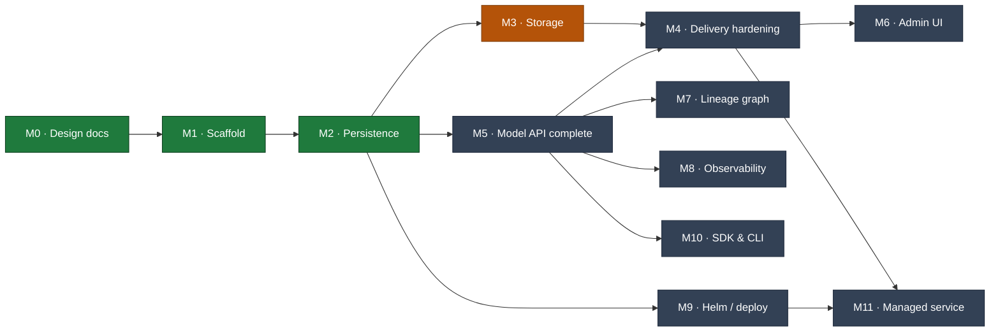

# Lineage — Milestones

Living progress tracker. Update status markers as work lands and link the commit that
completed a task. Architecture specs are in [`docs/`](docs/) (`00`–`11`); this file
tracks *execution* against them.

**Legend:** ✅ done · 🚧 in progress · ⬜ not started · 🔮 future

## Roadmap

## Status Summary

| # | Milestone | Docs | Status |
|---|---|---|---|
| M0 | Architecture & design docs | `00`–`11` | ✅ |
| M1 | Go scaffold (single binary, ports & adapters) | `01` | ✅ |
| M2 | Persistence: per-dialect MetadataStore + migrations | `02` | ✅ |
| M3 | Storage: S3 backend, signed URLs, upload flow | `05` | 🚧 |
| M4 | Delivery hardening: cache↔events, fetch, `lineage://` | `04` | ⬜ |
| M5 | Model API completeness + OpenAPI | `03` | ⬜ |
| M6 | Admin UI: BFF + web console | `06` | ⬜ |
| M7 | Lineage & provenance graph | `07` | ⬜ |
| M8 | Observability: metrics, traces, SLOs | `09` | ⬜ |
| M9 | Deployment: Helm chart + profiles | `08` | ⬜ |
| M10 | SDK & CLI (OpenAPI-generated) | `10` | ⬜ |
| M11 | Managed service (separate repo) | `11` | 🔮 |

---

## M0 — Architecture & Design Docs ✅

Full spec set `00`–`11`, mermaid-only diagrams, decisions recorded in `00 §11`.
**Done:** commits through `9eed5f0`.

## M1 — Go Scaffold ✅

Compiling, runnable, tested skeleton; ports & adapters; end-to-end happy path verified.
**Done:** `0f8bb34`.

- [x] Module, package tree, Makefile, README, `.gitignore`
- [x] Domain: entities, enums, stage machine, ULID, coded errors, port interfaces
- [x] Core: create/publish/transition/resolve, audit-in-flow
- [x] Adapters: in-memory store, fs storage, memory cache, event bus
- [x] Two surfaces (:8081 Model API, :8080 Admin UI) + ops (:9090)
- [x] Unit tests (stage machine, name validation); `go vet`/`gofmt` clean

## M2 — Persistence ✅

**Goal:** replace the in-memory store with real per-dialect adapters (§02.7).
**Acceptance:** the full happy path passes against **both** SQLite and Postgres; schema
via migrations; singleton invariant enforced (Postgres `FOR UPDATE`, SQLite serialized).
**Done:** shared `sqlstore` (`database/sql`) + `Dialect`; conformance suite green on
memory + SQLite; persistence verified across a restart.

- [x] Shared `sqlstore` + `Dialect` (placeholders, unique-violation, model lock)
- [x] SQLite `MetadataStore` (cgo-free modernc driver, WAL, single-writer) + migrations
- [x] Postgres `MetadataStore` (pgx) + migrations; `FOR UPDATE` singleton lock
- [x] Shared conformance suite (`storetest`) run vs memory + SQLite; Postgres via `LINEAGE_TEST_PG`
- [x] Versioned forward-only migrator (`schema_version`)
- [x] Config wiring (`LINEAGE_DB_ENGINE`) picks the adapter at startup; default SQLite
- [x] FK `ON DELETE CASCADE` in schema (§02.5)
- [ ] Cursor pagination (real `nextPageToken`) — carried to **M5** (belongs with the API)
- [ ] JSONB/label-table filtering, Postgres-native features — carried to **M5/M7**

## M3 — Storage 🚧

**Goal:** production artifact delivery (§05).
**Acceptance:** register-by-reference fills digest/size via `Stat`; signed upload
(initiate→PUT→finalize) verifies digest; signed download works on S3.

- [ ] S3 driver (SignGet/SignPut/Stat/Get/Delete, S3-compatible endpoints)
- [ ] Upload initiate/finalize API + multipart for large files (§05.6)
- [ ] Integrity: digest verification on finalize; immutability enforcement
- [ ] GC policy (retain | sweep)
- [ ] (later) OCI/ORAS driver

## M4 — Delivery Hardening ⬜

**Goal:** the resolve/fetch path is fast, correct, and integration-ready (§04).
**Acceptance:** cache invalidates on events; `ETag`/`304` on resolve; stream-through
fetch for fs; `lineage://` initializer resolves in a KServe pod.

- [ ] Resolve cache subscribed to `version.created`/`stage_changed` via the bus
- [ ] `ETag`/`If-None-Match` on resolve; `/content` fetch (redirect + stream-through)
- [ ] `lineage://` grammar parser + KServe `ClusterStorageContainer` image
- [ ] Consumer smoke tests (KServe manifest, signed-URL download)

## M5 — Model API Completeness ⬜

**Goal:** the full `/v1` contract (§03).
**Acceptance:** OpenAPI served at `/v1/openapi.json` matches handlers; all resources CRUD.

- [ ] Artifacts CRUD (metadata PATCH with immutability guard), Model/Version PATCH,
      `:archive`, `DELETE` with guards
- [ ] Lineage + Deployment endpoints
- [ ] Idempotency-Key handling; richer filters
- [ ] Hand-authored or generated **OpenAPI spec** served + validated in CI

## M6 — Admin UI ⬜

**Goal:** the human console (§06). BFF endpoints + SPA served on :8080.

- [ ] BFF: overview, models rollup, version detail, search, activity
- [ ] Web console SPA (frontend-design pass)
- [ ] Lineage graph + audit timeline views

## M7 — Lineage & Provenance ⬜

**Goal:** the differentiator (§07). Typed edges + graph traversal.

- [ ] Edge create/list/delete; relation validation + CHECK
- [ ] Ancestry + impact-analysis queries (recursive CTE, per-dialect, cycle-safe)
- [ ] SDK auto-capture (`produced_by`, `derived_from`)

## M8 — Observability ⬜

**Goal:** production ops (§09).

- [ ] Prometheus registry (RED, resolve cache, storage, DB, domain gauges)
- [ ] OTel traces (API→core→store/storage), structured request logs
- [ ] Real `/readyz` (DB + cache + storage) ; SLO dashboards/alerts

## M9 — Deployment (Helm) ⬜

**Goal:** the Helm axiom realized (§08).
**Acceptance:** `helm install` on a fresh cluster → working registry (dev profile).

- [ ] Chart: Deployment (two ports), two Services + Ingresses, ConfigMap/Secrets
- [ ] Migration pre-upgrade hook Job; `dev`/`prod` values profiles
- [ ] SQLite-single-replica guard; PVC; optional postgres/redis subcharts
- [ ] Non-root, NetworkPolicy, PDB/HPA

## M10 — SDK & CLI ⬜

**Goal:** client ergonomics (§10). Generated from OpenAPI (needs M5).

- [ ] Python SDK: `publish`, `transition`, `resolve`, `download`, lineage helpers
- [ ] Go CLI `lineage`: model/version/resolve/pull/lineage
- [ ] Generation + versioning pipeline

## M11 — Managed Service 🔮

**Goal:** monetization (§11). **Separate proprietary repo**; the OSS chart is the contract.

- [ ] Control plane: provisioning over the Helm chart, fleet observability, billing
- [ ] Edge gateway: SSO/RBAC → `X-Lineage-Actor`
- [ ] BYOC operator; export/import (no lock-in)
