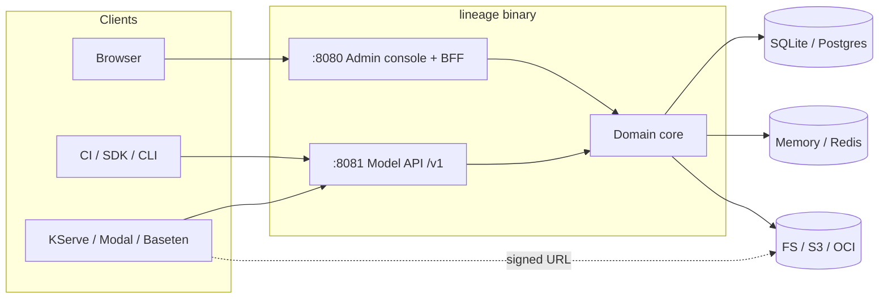

<div align="center">

<picture>
  <source media="(prefers-color-scheme: dark)" srcset="docs/assets/mark-dark.svg" />
  
</picture>

# Lineage

**The self-hostable system of record and model registry for ML/AI models.**

[](LICENSE)
[](go.mod)
[](deploy/helm/lineage)
[](https://github.com/proseria-research/lineage/actions/workflows/images.yml)

[Website & guides](https://lineage.proseria.ca) · [Quickstart](#quickstart) · [API](docs/03-model-api.md) · [Design docs](docs/) · [Contributing](#contributing)

</div>

---

Lineage is the system of record for ML/AI models. It sits between experimentation and
production and tracks which models and versions exist, where their artifacts live, which
lifecycle stage each is in, who owns them, and how serving systems fetch them. It ships as
one Go binary and one Helm chart, over your own database and object storage.

## Highlights

**Registry & lifecycle**
- Models, versions, artifacts, deployments, and a typed **lineage graph** (`derived_from`,
  `trained_on`, `produced_by`, `deployed_as`) with ancestry and impact traversal.
- Stages `draft → staging → production → archived` with a singleton `production` invariant:
  promoting a version transactionally archives the incumbent.
- REST `/v1` API with a hand-authored **OpenAPI 3.1** spec, `Idempotency-Key` replay, cursor
  pagination, and write-once artifact content.

**Delivery for inference systems**
- One `resolve` call returns a native `storageUri`, a fresh signed URL, digest, size, and
  model format, so KServe, Modal, and Baseten pull with near-zero glue.
- `ETag` / `304` caching with event-driven invalidation, and a `/content` broker that
  redirects to a signed URL or streams through (Range-capable).
- A KServe storage-initializer resolves `lineage://model/stage` at pull time, so a promotion
  takes effect without a redeploy.

**Governance & evidence**
- Append-only audit trail on every change, sealed by **Merkle epoch sealing** for tamper evidence.
- **Retention floors and legal hold**: deletion is refused inside the floor, with no override.
- **EU AI Act** risk classification with drift detection, and Art. 25 modification review.
- **Model risk management**: risk tiers, independent validation, and monitoring
  (SR 26-2, PRA SS1/23, OSFI E-23).
- **Change control plans** for pre-authorized modifications (FDA PCCP shape).
- **Model insights**: composition facts, an architecture fingerprint, and version-to-version
  diffs.

**Storage & metadata**
- Artifacts on the **filesystem**, any **S3-compatible** store (AWS, MinIO, R2, Ceph), or an
  **OCI registry**, with signed GET/PUT, multipart upload, digest verification, and
  reference-counted garbage collection. SigV4 and the OCI client are hand-rolled; there is
  no cloud SDK dependency.
- Metadata in **SQLite** (zero-dependency dev/edge) or **Postgres** (HA/production) behind one
  `MetadataStore` port; resolution cache in memory or **Redis**.

**Operations**
- Embedded **admin console** (React, compiled into the binary): what needs attention, model
  and version detail, the lineage graph, governance queues, the audit timeline, and
  promotion.
- `/healthz`, `/readyz`, Prometheus `/metrics`, OTLP tracing, and structured JSON access logs
  with W3C `traceparent` correlation.
- Distroless, non-root, static image; a Helm chart where one `helm install` gives a working,
  secure registry.
- **Python SDK** (standard library only) and a **CLI** for publish, promote, resolve, and pull.

## How Lineage compares

Lineage is for teams that want to **own** their model registry. Its closest analog is
**Kubeflow Model Registry**. We aim for capability parity with it, not wire compatibility.

| Capability | Lineage | Kubeflow Model Registry | Hugging Face Hub |
| --- | --- | --- | --- |
| **Footprint** | One Go binary + Helm chart | Kubernetes / Kubeflow, MLMD-based | SaaS (managed; enterprise / VPC) |
| **Metadata store** | SQLite or Postgres, in your database | MLMD on MySQL | Managed, Git-backed repos |
| **Artifact storage** | Filesystem / S3-compatible / OCI, signed-URL delivery | External URI references | HF-hosted (Git-LFS / Xet) |
| **Lineage / provenance** | Typed graph: ancestry + impact | MLMD lineage | Informal `base_model` tag |
| **Serving delivery** | `resolve` + `lineage://` KServe initializer | KServe | HF Inference Endpoints |
| **Governance** | Stages, sealed audit, retention/hold, risk & change control | Lifecycle state | Tags & model cards |
| **API contract** | REST + OpenAPI 3.1, Python SDK, CLI | REST + Python client | REST + `huggingface_hub` |
| **Authentication** | Delegated to infrastructure | Cluster identity | Built-in accounts & tokens |

Hugging Face Hub is the right tool for public model sharing. Lineage is deliberately **not** a
public hub.

## Design principles

1. **Self-hosting is the primary distribution model.**
2. **One binary, two surfaces, two ports.** Admin console on `:8080`, Model API on `:8081`.
   Publishing is a Model API operation; the console is for humans.
3. **Storage-agnostic, metadata-authoritative.** Lineage owns metadata and pointers; bytes
   live in your storage and flow directly to consumers.
4. **Auditable by default.** Every state transition is a durable, sealed event.
5. **Authentication is the infrastructure's job.** Your ingress, gateway, or mesh
   authenticates; Lineage records the identity header it is given.

## Quickstart

### Run locally

Requires Go 1.25+. Node 20+ and pnpm are also needed, because `make run` builds the embedded
console.

```bash
make run
```

`go run ./cmd/lineage` also works without Node; it serves the API with a placeholder console.

| Port    | Surface                                                     |
| ------- | ----------------------------------------------------------- |
| `:8081` | **Model API** (`/v1`): publish, resolve, fetch (machines)   |
| `:8080` | **Admin console**: web UI + backend-for-frontend (humans)   |
| `:9090` | **Ops**: `/healthz`, `/readyz`, `/metrics`                  |

`make run` uses the same retention and attestation settings as the Helm chart, including a
10-year retention floor. Use `make reset` (with the registry stopped) to start over.

Publish a model, promote it, and resolve it:

```bash
curl -XPOST localhost:8081/v1/models -H X-Lineage-Actor:me \
  -d '{"name":"fraud-detector"}'

curl -XPOST localhost:8081/v1/models/fraud-detector/versions -H X-Lineage-Actor:me \
  -d '{"name":"1.4.0","artifacts":[{"name":"model.onnx","uri":"s3://m/1.4.0","modelFormat":{"name":"onnx"}}]}'

curl -XPOST localhost:8081/v1/models/fraud-detector/versions/1.4.0:transition -d '{"to":"staging"}'
curl -XPOST localhost:8081/v1/models/fraud-detector/versions/1.4.0:transition -d '{"to":"production"}'

curl "localhost:8081/v1/models/fraud-detector/resolve?stage=production"
```

The console is at <http://localhost:8080> and the OpenAPI document at
<http://localhost:8081/v1/openapi.json>.

### Load sample data

With the registry running, load a demo dataset: five models across every stage, with lineage
edges, deployments, risk classifications, validations, change control plans, and a real
audit trail.

```bash
make seed
```

Seeding is additive and talks to the Model API like any client. Set `LINEAGE_ENDPOINT` to
target a remote install.

### Python SDK

```bash
pip install ./sdk/python
```

```python
from lineage import Client

lin = Client("http://localhost:8081", actor="training-ci")
lin.publish(
    model="fraud-detector",
    version="1.4.0",
    artifacts=[lin.model_file("model.onnx", format=("onnx", "1.16"))],
    lineage=[("trained_on", "s3://datasets/fraud-q2")],
)
lin.transition("fraud-detector", "1.4.0", to="staging")
paths = lin.download("fraud-detector", stage="staging", dest="./model")
```

See [`sdk/python`](sdk/python/README.md). The Go CLI (`make cli` → `bin/lineage-cli`) covers the
same publish, promote, resolve, and pull flow from a shell.

### Deploy with Helm

```bash
# dev: SQLite on a PVC, filesystem storage, no external dependencies
helm install lineage deploy/helm/lineage -f deploy/helm/lineage/values-dev.yaml

# prod: external Postgres + S3, autoscaling, PDB, NetworkPolicy, ServiceMonitor
helm install lineage deploy/helm/lineage -f deploy/helm/lineage/values-prod.yaml \
  --set database.postgres.dsnSecret.name=lineage-db \
  --set ingress.modelApi.host=api.example.com
```

Images are published to `ghcr.io/proseria-research/lineage` and
`ghcr.io/proseria-research/lineage-init`. SQLite is single-writer, so the chart rejects a
multi-replica SQLite install.

## Architecture

One binary serves two surfaces over a shared domain core (ports and adapters). The core
depends only on port interfaces. Adapters are wired at startup and never imported by the
core.



| Path | Contents |
| --- | --- |
| `cmd/lineage` | The registry binary |
| `cmd/lineage-init` | KServe storage-initializer for `lineage://` URIs |
| `cmd/lineage-cli`, `cmd/lineage-seed` | CLI and demo-data loader |
| `internal/domain` | Entities, the stage machine, errors, and port interfaces |
| `internal/core` | Business logic over the ports |
| `internal/api/modelapi` | `/v1` API and the OpenAPI spec |
| `internal/api/adminui` | Console BFF; the React app lives in `web/` |
| `internal/adapters` | `store/{memory,sqlite,postgres}`, `storage/{fs,s3,oci}`, `cache/{memory,redis}`, `events` |
| `internal/observability` | Health probes, Prometheus registry, tracing |
| `deploy/helm/lineage` | Helm chart with dev and prod profiles |
| `sdk/python` | Python SDK |
| `site/` | Website and guides ([lineage.proseria.ca](https://lineage.proseria.ca)) |
| `docs/` | Numbered design documents |

**Runtime dependencies** are few: `modernc.org/sqlite` (cgo-free), `jackc/pgx/v5`, and
`redis/go-redis`. The S3 signer, OCI client, Prometheus registry, and OpenAPI document are
standard library or hand-written.

## Configuration

All configuration comes from environment variables.

| Variable | Default | Description |
| --- | --- | --- |
| **Listeners** | | |
| `LINEAGE_MODEL_API_ADDR` | `:8081` | Model API listen address |
| `LINEAGE_ADMIN_ADDR` | `:8080` | Admin console listen address |
| `LINEAGE_METRICS_ADDR` | `:9090` | Ops (health / metrics) listen address |
| `LINEAGE_PUBLIC_MODEL_API_URL` | — | Model API URL the console shows to users; guessed if unset |
| `LINEAGE_DOCS_URL` | `https://lineage.proseria.ca` | Docs link target in the console |
| `LINEAGE_ACTOR_HEADER` | `X-Lineage-Actor` | Trusted identity header recorded on audit events |
| **Metadata & cache** | | |
| `LINEAGE_DB_ENGINE` | `sqlite` | `sqlite` \| `postgres` \| `memory` |
| `LINEAGE_DB_PATH` | `lineage.db` | SQLite file path, or Postgres DSN |
| `LINEAGE_CACHE_ENGINE` | `memory` | `memory` \| `redis` |
| `LINEAGE_REDIS_ADDR` | `localhost:6379` | Redis address |
| `LINEAGE_REDIS_PASSWORD` | — | Redis password |
| `LINEAGE_REDIS_DB` | `0` | Redis database index |
| **Storage** | | |
| `LINEAGE_STORAGE_DRIVER` | `fs` | `fs` \| `s3` \| `oci` |
| `LINEAGE_STORAGE_ROOT` | `./data/artifacts` | Filesystem backend root |
| `LINEAGE_S3_BUCKET` | — | S3 bucket |
| `LINEAGE_S3_REGION` | — | S3 region |
| `LINEAGE_S3_ENDPOINT` | — | Endpoint override (MinIO / R2 / Ceph) |
| `LINEAGE_S3_ACCESS_KEY` / `_SECRET_KEY` / `_SESSION_TOKEN` | — | Static credentials; omit to use the IRSA / ECS / IMDS chain |
| `LINEAGE_S3_PATH_STYLE` | `false` | `true` for MinIO / Ceph |
| `LINEAGE_OCI_REGISTRY` | — | Registry host\[:port\], e.g. `ghcr.io` |
| `LINEAGE_OCI_REPOSITORY` | — | Repository prefix; a model's repo is `<prefix>/<model>` |
| `LINEAGE_OCI_USERNAME` / `_PASSWORD` | — | Registry credentials; omit for anonymous pull |
| `LINEAGE_OCI_PLAIN_HTTP` | `false` | `true` for in-cluster / dev registries |
| `LINEAGE_STORAGE_GC` | `retain` | `sweep` enables reference-counted garbage collection |
| `LINEAGE_GC_GRACE` | `24h` | Minimum object age before GC |
| `LINEAGE_GC_INTERVAL` | `1h` | GC sweep period |
| `LINEAGE_GC_PREFIX` | — | Storage prefix the sweeper is scoped to |
| **Retention & audit** | | |
| `LINEAGE_RETENTION_MIN_AUDIT_AGE_DAYS` | `0` | Audit events younger than this cannot be deleted |
| `LINEAGE_RETENTION_MIN_ARCHIVED_VERSION_DAYS` | `0` | Archived versions younger than this cannot be deleted |
| `LINEAGE_AUDIT_ATTESTATION` | `on` | `off` disables Merkle sealing of the audit log |
| `LINEAGE_SEAL_INTERVAL_SECONDS` | `60` | Seal period |
| `LINEAGE_SEAL_GRACE_SECONDS` | `5` | Delay before sealing, for late-committing writes |
| **Tracing** | | |
| `LINEAGE_OTLP_ENDPOINT` | `$OTEL_EXPORTER_OTLP_ENDPOINT` | OTLP/HTTP collector; empty disables tracing |
| `LINEAGE_SERVICE_NAME` | `lineage` | Service name on spans |
| `LINEAGE_TRACE_SAMPLE_RATIO` | `1.0` | Trace sampling ratio |

The Helm chart sets production defaults for these, including a 10-year retention floor.

## Contributing

Issues, discussions, and pull requests are welcome. [`CONTRIBUTING.md`](CONTRIBUTING.md)
covers setup, tests, conventions, and the PR process. Everyone taking part agrees to the
[Code of Conduct](CODE_OF_CONDUCT.md).

```bash
make build   # console + binary → bin/lineage
make test    # full suite; no external services needed
```

## Documentation

- **Guides**: [lineage.proseria.ca](https://lineage.proseria.ca)
- **Design documents** in [`docs/`](docs/):

| Doc | Topic | Doc | Topic |
| --- | --- | --- | --- |
| [`00`](docs/00-preplanning.md) | Framing, axioms, decisions | [`12`](docs/12-version-portrait.md) | Version portrait |
| [`01`](docs/01-architecture-overview.md) | Architecture overview | [`13`](docs/13-performance-and-scale.md) | Performance & scale |
| [`02`](docs/02-data-model.md) | Data model | [`14`](docs/14-competitive-landscape.md) | Competitive landscape |
| [`03`](docs/03-model-api.md) | Model API | [`15`](docs/15-regulatory-landscape.md) | Regulatory landscape |
| [`04`](docs/04-delivery-api.md) | Consumption & delivery | [`16`](docs/16-eu-risk-classification.md) | EU risk classification & drift |
| [`05`](docs/05-storage-and-artifacts.md) | Storage & artifacts | [`17`](docs/17-eu-modification-review.md) | EU modification review |
| [`06`](docs/06-admin-ui-api.md) | Admin console | [`19`](docs/19-retention-and-hold.md) | Retention & legal hold |
| [`07`](docs/07-lineage-and-provenance.md) | Lineage & provenance | [`20`](docs/20-model-risk-management.md) | Model risk management |
| [`08`](docs/08-deployment-helm.md) | Deployment & Helm | [`22`](docs/22-change-control-plans.md) | Change control plans |
| [`09`](docs/09-observability-and-ops.md) | Observability & ops | | |
| [`10`](docs/10-sdk-and-cli.md) | SDK & CLI | | |
| [`11`](docs/11-model-insights.md) | Model insights | | |

## Project status

All tracked milestones (M0–M19) have shipped, including the core registry, delivery,
console, lineage graph, observability, Helm chart, SDK and CLI, OCI storage, and the
governance features above. See [`MILESTONES.md`](MILESTONES.md).

## License

[Apache License 2.0](LICENSE).
