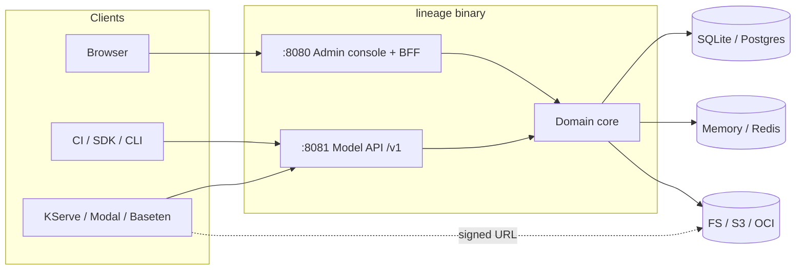

<div align="center">

<picture>
  <source media="(prefers-color-scheme: dark)" srcset="docs/assets/mark-dark.svg" />
  
</picture>

# Lineage

**The self-hostable system of record and model registry for ML/AI models.**

[](LICENSE)
[](go.mod)
[](deploy/helm/lineage)
[](https://github.com/proseria-research/lineage/actions/workflows/images.yml)

[Website and guides](https://lineage.proseria.ca) · [Quickstart](#quickstart) · [API](docs/03-model-api.md) · [Design docs](docs/) · [Contributions](#contributions)

</div>

---

Lineage is a registry for ML and AI models. It keeps a record of each model and each version.
It records where the artifact files are, the lifecycle stage of each version, and who owns it.
Serving systems use Lineage to find the correct files for a model.

Lineage is one Go binary and one Helm chart. It uses your database and your object storage.

## Features

**Registry and lifecycle**
- Lineage records models, versions, artifacts and deployments.
- A **lineage graph** records how each version was made. The graph has four types of link:
  `derived_from`, `trained_on`, `produced_by` and `deployed_as`. You can follow the links in
  the two directions.
- Each version has one of four stages: `draft`, `staging`, `production` or `archived`.
- Only one version of a model can be in `production`. When you promote a version to
  `production`, Lineage archives the old version in the same transaction.
- The REST `/v1` API has an **OpenAPI 3.1** specification. The API can replay a request with an
  `Idempotency-Key`. Lists use cursor pagination.
- You cannot change the content of an artifact after you write it.

**Delivery to inference systems**
- One `resolve` call gives the `storageUri`, a signed URL, the digest, the size and the model
  format. KServe, Modal and Baseten can use this data directly.
- Responses have an `ETag`, and Lineage can reply `304`. A change to the registry makes the
  cached data not valid.
- The `/content` endpoint sends a redirect to a signed URL. For filesystem storage, it sends the
  file bytes directly. It can send a part of a file (HTTP Range).
- A KServe storage-initializer resolves a `lineage://model/stage` URI when the model is pulled.
  Thus a promotion has an effect without a new deployment.

**Governance and evidence**
- Lineage writes an audit event for each change. You cannot change or remove an audit event.
- Lineage seals the audit log with **Merkle epoch sealing**. Thus you can find changes to the log.
- **Retention floors and legal hold** prevent the deletion of data. There is no override.
- Lineage records the **EU AI Act** risk class of a model. It shows when the class is possibly
  out of date. It also sends derived models to an Art. 25 review.
- **Model risk management** records risk tiers, independent validation and monitoring. This
  agrees with SR 26-2, PRA SS1/23 and OSFI E-23.
- **Change control plans** record the modifications that are approved before they occur. This
  agrees with the FDA PCCP structure.
- **Model insights** record the composition of a model and an architecture fingerprint. You can
  compare two versions.

**Storage and metadata**
- Lineage keeps artifacts on the **filesystem**, in an **S3-compatible** store (AWS, MinIO, R2,
  Ceph) or in an **OCI registry**.
- Storage operations include signed GET and PUT, multipart upload and digest verification. A
  garbage collector removes files that no version uses.
- Lineage has its own SigV4 signer and OCI client. It does not use a cloud SDK.
- Lineage keeps metadata in **SQLite** or **Postgres**. Use SQLite for development and small
  installations. Use Postgres for high availability and production.
- The resolve cache is in memory or in **Redis**.

**Operations**
- The **admin console** is a web interface in the binary. It shows the items that need
  attention, models, versions, the lineage graph, governance queues and the audit log. You can
  promote versions from the console.
- Lineage has `/healthz`, `/readyz` and Prometheus `/metrics` endpoints. It sends OTLP traces
  and writes access logs in JSON. The logs contain the W3C `traceparent`.
- The container image is distroless and static. It does not run as root.
- One `helm install` command gives a registry that operates correctly and is secure.
- The **Python SDK** uses only the Python standard library. The **CLI** can publish, promote,
  resolve and pull.

## Comparison with other registries

Lineage is for teams that operate their own model registry. **Kubeflow Model Registry** is the
most similar product. Lineage has the same capabilities, but it does not use the same API.

| Capability | Lineage | Kubeflow Model Registry | Hugging Face Hub |
| --- | --- | --- | --- |
| **Footprint** | One Go binary + Helm chart | Kubernetes / Kubeflow, MLMD-based | SaaS (managed; enterprise / VPC) |
| **Metadata store** | SQLite or Postgres, in your database | MLMD on MySQL | Managed, Git-backed repos |
| **Artifact storage** | Filesystem / S3-compatible / OCI, signed-URL delivery | External URI references | HF-hosted (Git-LFS / Xet) |
| **Lineage / provenance** | Typed graph: ancestry + impact | MLMD lineage | Informal `base_model` tag |
| **Serving delivery** | `resolve` + `lineage://` KServe initializer | KServe | HF Inference Endpoints |
| **Governance** | Stages, sealed audit, retention/hold, risk & change control | Lifecycle state | Tags & model cards |
| **API contract** | REST + OpenAPI 3.1, Python SDK, CLI | REST + Python client | REST + `huggingface_hub` |
| **Authentication** | Delegated to infrastructure | Cluster identity | Built-in accounts & tokens |

Use Hugging Face Hub to share models with the public. Lineage is not a public hub.

## Design principles

1. **You operate Lineage on your own infrastructure.** There is no hosted service.
2. **One binary has two interfaces on two ports.** The admin console is on `:8080`. The Model
   API is on `:8081`. Machines publish models through the Model API. People use the console.
3. **Lineage keeps the metadata, not the files.** The artifact files stay in your storage.
   Consumers get the files directly from the storage.
4. **Lineage records each change.** Each state transition is an audit event, and Lineage
   seals it.
5. **Your infrastructure does the authentication.** Your ingress, gateway or mesh
   authenticates each request. Lineage records the identity header that it receives.

## Quickstart

### Run Lineage on your computer

You must have Go 1.25 or later. `make run` builds the admin console, thus you must also have
Node 20 or later and pnpm.

1. Start the registry:

   ```bash
   make run
   ```

   If you do not have Node, use `go run ./cmd/lineage`. The API operates, but the console is a
   placeholder.

The registry opens three ports:

| Port    | Interface                                                   |
| ------- | ----------------------------------------------------------- |
| `:8081` | **Model API** (`/v1`): publish, resolve, fetch (machines)   |
| `:8080` | **Admin console**: web UI + backend-for-frontend (people)   |
| `:9090` | **Ops**: `/healthz`, `/readyz`, `/metrics`                  |

`make run` uses the same retention and attestation settings as the Helm chart. The retention
floor is 10 years. To start again with no data, stop the registry, then do `make reset`.

2. Publish a model, promote it, and resolve it:

   ```bash
   curl -XPOST localhost:8081/v1/models -H X-Lineage-Actor:me \
     -d '{"name":"fraud-detector"}'

   curl -XPOST localhost:8081/v1/models/fraud-detector/versions -H X-Lineage-Actor:me \
     -d '{"name":"1.4.0","artifacts":[{"name":"model.onnx","uri":"s3://m/1.4.0","modelFormat":{"name":"onnx"}}]}'

   curl -XPOST localhost:8081/v1/models/fraud-detector/versions/1.4.0:transition -d '{"to":"staging"}'
   curl -XPOST localhost:8081/v1/models/fraud-detector/versions/1.4.0:transition -d '{"to":"production"}'

   curl "localhost:8081/v1/models/fraud-detector/resolve?stage=production"
   ```

3. Open the console at <http://localhost:8080>.

The OpenAPI document is at <http://localhost:8081/v1/openapi.json>.

### Load sample data

The sample data has five models in all stages. It also has lineage links, deployments, risk
classes, validations, change control plans and an audit log.

1. Make sure that the registry operates.
2. Load the data:

   ```bash
   make seed
   ```

The loader adds data. It does not remove data. It uses the Model API, as other clients do.
To load the data into a remote registry, set `LINEAGE_ENDPOINT`.

### Python SDK

1. Install the SDK:

   ```bash
   pip install ./sdk/python
   ```

2. Use the client:

   ```python
   from lineage import Client

   lin = Client("http://localhost:8081", actor="training-ci")
   lin.publish(
       model="fraud-detector",
       version="1.4.0",
       artifacts=[lin.model_file("model.onnx", format=("onnx", "1.16"))],
       lineage=[("trained_on", "s3://datasets/fraud-q2")],
   )
   lin.transition("fraud-detector", "1.4.0", to="staging")
   paths = lin.download("fraud-detector", stage="staging", dest="./model")
   ```

For more data, see [`sdk/python`](sdk/python/README.md). The Go CLI does the same operations
from a shell. To build it, do `make cli`. The result is `bin/lineage-cli`.

### Install with Helm

```bash
# dev: SQLite on a PVC, filesystem storage, no external dependencies
helm install lineage deploy/helm/lineage -f deploy/helm/lineage/values-dev.yaml

# prod: external Postgres + S3, autoscaling, PDB, NetworkPolicy, ServiceMonitor
helm install lineage deploy/helm/lineage -f deploy/helm/lineage/values-prod.yaml \
  --set database.postgres.dsnSecret.name=lineage-db \
  --set ingress.modelApi.host=api.example.com
```

The images are at `ghcr.io/proseria-research/lineage` and
`ghcr.io/proseria-research/lineage-init`.

SQLite lets only one process write at a time. Thus the chart does not let you install more than
one replica with SQLite.

## Architecture

One binary has two interfaces. The two interfaces use one domain core. The design uses ports
and adapters: the core uses only port interfaces. Lineage connects the adapters at startup. The
core does not import an adapter.



| Path | Contents |
| --- | --- |
| `cmd/lineage` | The registry binary |
| `cmd/lineage-init` | KServe storage-initializer for `lineage://` URIs |
| `cmd/lineage-cli`, `cmd/lineage-seed` | CLI and demo-data loader |
| `internal/domain` | Entities, the stage machine, errors, and port interfaces |
| `internal/core` | Business logic over the ports |
| `internal/api/modelapi` | `/v1` API and the OpenAPI spec |
| `internal/api/adminui` | Console BFF; the React app lives in `web/` |
| `internal/adapters` | `store/{memory,sqlite,postgres}`, `storage/{fs,s3,oci}`, `cache/{memory,redis}`, `events` |
| `internal/observability` | Health probes, Prometheus registry, tracing |
| `deploy/helm/lineage` | Helm chart with dev and prod profiles |
| `sdk/python` | Python SDK |
| `site/` | Website and guides ([lineage.proseria.ca](https://lineage.proseria.ca)) |
| `docs/` | Numbered design documents |

Lineage has three **runtime dependencies**: `modernc.org/sqlite` (no cgo), `jackc/pgx/v5` and
`redis/go-redis`. The S3 signer, the OCI client, the Prometheus registry and the OpenAPI
document use only the Go standard library.

## Configuration

You configure Lineage with environment variables.

| Variable | Default | Description |
| --- | --- | --- |
| **Ports** | | |
| `LINEAGE_MODEL_API_ADDR` | `:8081` | Model API listen address |
| `LINEAGE_ADMIN_ADDR` | `:8080` | Admin console listen address |
| `LINEAGE_METRICS_ADDR` | `:9090` | Ops (health / metrics) listen address |
| `LINEAGE_PUBLIC_MODEL_API_URL` | — | Model API URL that the console shows. If it is not set, Lineage calculates a value |
| `LINEAGE_DOCS_URL` | `https://lineage.proseria.ca` | Documentation URL for links in the console |
| `LINEAGE_ACTOR_HEADER` | `X-Lineage-Actor` | Identity header that Lineage records on audit events |
| **Metadata & cache** | | |
| `LINEAGE_DB_ENGINE` | `sqlite` | `sqlite` \| `postgres` \| `memory` |
| `LINEAGE_DB_PATH` | `lineage.db` | SQLite file path, or Postgres DSN |
| `LINEAGE_CACHE_ENGINE` | `memory` | `memory` \| `redis` |
| `LINEAGE_REDIS_ADDR` | `localhost:6379` | Redis address |
| `LINEAGE_REDIS_PASSWORD` | — | Redis password |
| `LINEAGE_REDIS_DB` | `0` | Redis database index |
| **Storage** | | |
| `LINEAGE_STORAGE_DRIVER` | `fs` | `fs` \| `s3` \| `oci` |
| `LINEAGE_STORAGE_ROOT` | `./data/artifacts` | Filesystem backend root |
| `LINEAGE_S3_BUCKET` | — | S3 bucket |
| `LINEAGE_S3_REGION` | — | S3 region |
| `LINEAGE_S3_ENDPOINT` | — | Endpoint override (MinIO / R2 / Ceph) |
| `LINEAGE_S3_ACCESS_KEY` / `_SECRET_KEY` / `_SESSION_TOKEN` | — | Static credentials. If they are not set, Lineage uses the IRSA / ECS / IMDS chain |
| `LINEAGE_S3_PATH_STYLE` | `false` | `true` for MinIO / Ceph |
| `LINEAGE_OCI_REGISTRY` | — | Registry host\[:port\], for example `ghcr.io` |
| `LINEAGE_OCI_REPOSITORY` | — | Repository prefix; a model's repo is `<prefix>/<model>` |
| `LINEAGE_OCI_USERNAME` / `_PASSWORD` | — | Registry credentials. If they are not set, Lineage pulls without credentials |
| `LINEAGE_OCI_PLAIN_HTTP` | `false` | `true` for in-cluster / dev registries |
| `LINEAGE_STORAGE_GC` | `retain` | `sweep` starts the garbage collector |
| `LINEAGE_GC_GRACE` | `24h` | Minimum age of an object before the garbage collector can remove it |
| `LINEAGE_GC_INTERVAL` | `1h` | Time between two garbage collector runs |
| `LINEAGE_GC_PREFIX` | — | Storage prefix that the garbage collector examines |
| **Retention & audit** | | |
| `LINEAGE_RETENTION_MIN_AUDIT_AGE_DAYS` | `0` | You cannot delete an audit event that is newer than this |
| `LINEAGE_RETENTION_MIN_ARCHIVED_VERSION_DAYS` | `0` | You cannot delete an archived version that is newer than this |
| `LINEAGE_AUDIT_ATTESTATION` | `on` | `off` stops the Merkle sealing of the audit log |
| `LINEAGE_SEAL_INTERVAL_SECONDS` | `60` | Time between two seals |
| `LINEAGE_SEAL_GRACE_SECONDS` | `5` | Time to wait before a seal, for writes that commit late |
| **Tracing** | | |
| `LINEAGE_OTLP_ENDPOINT` | `$OTEL_EXPORTER_OTLP_ENDPOINT` | OTLP/HTTP collector. If it is empty, Lineage sends no traces |
| `LINEAGE_SERVICE_NAME` | `lineage` | Service name on the spans |
| `LINEAGE_TRACE_SAMPLE_RATIO` | `1.0` | Ratio of traces that Lineage sends |

The Helm chart sets production values for these variables. The chart sets a retention floor of 10 years.

## Contributions

You can send issues, discussions and pull requests. [`CONTRIBUTING.md`](CONTRIBUTING.md) gives
the setup, the tests, the conventions and the pull request procedure. All contributors must
obey the [Code of Conduct](CODE_OF_CONDUCT.md).

```bash
make build   # console + binary → bin/lineage
make test    # all tests; no external services necessary
```

## Documentation

- **Guides**: [lineage.proseria.ca](https://lineage.proseria.ca)
- **Design documents** in [`docs/`](docs/):

| Doc | Topic | Doc | Topic |
| --- | --- | --- | --- |
| [`00`](docs/00-preplanning.md) | Framing, axioms, decisions | [`12`](docs/12-version-portrait.md) | Version portrait |
| [`01`](docs/01-architecture-overview.md) | Architecture overview | [`13`](docs/13-performance-and-scale.md) | Performance & scale |
| [`02`](docs/02-data-model.md) | Data model | [`14`](docs/14-competitive-landscape.md) | Competitive landscape |
| [`03`](docs/03-model-api.md) | Model API | [`15`](docs/15-regulatory-landscape.md) | Regulatory landscape |
| [`04`](docs/04-delivery-api.md) | Consumption & delivery | [`16`](docs/16-eu-risk-classification.md) | EU risk classification & drift |
| [`05`](docs/05-storage-and-artifacts.md) | Storage & artifacts | [`17`](docs/17-eu-modification-review.md) | EU modification review |
| [`06`](docs/06-admin-ui-api.md) | Admin console | [`19`](docs/19-retention-and-hold.md) | Retention & legal hold |
| [`07`](docs/07-lineage-and-provenance.md) | Lineage & provenance | [`20`](docs/20-model-risk-management.md) | Model risk management |
| [`08`](docs/08-deployment-helm.md) | Deployment & Helm | [`22`](docs/22-change-control-plans.md) | Change control plans |
| [`09`](docs/09-observability-and-ops.md) | Observability & ops | | |
| [`10`](docs/10-sdk-and-cli.md) | SDK & CLI | | |
| [`11`](docs/11-model-insights.md) | Model insights | | |

## Project status

All milestones (M0 to M19) are complete. They include the registry, delivery, the console, the
lineage graph, observability, the Helm chart, the SDK and CLI, OCI storage and governance. For
more data, see [`MILESTONES.md`](MILESTONES.md).

## License

[Apache License 2.0](LICENSE).
