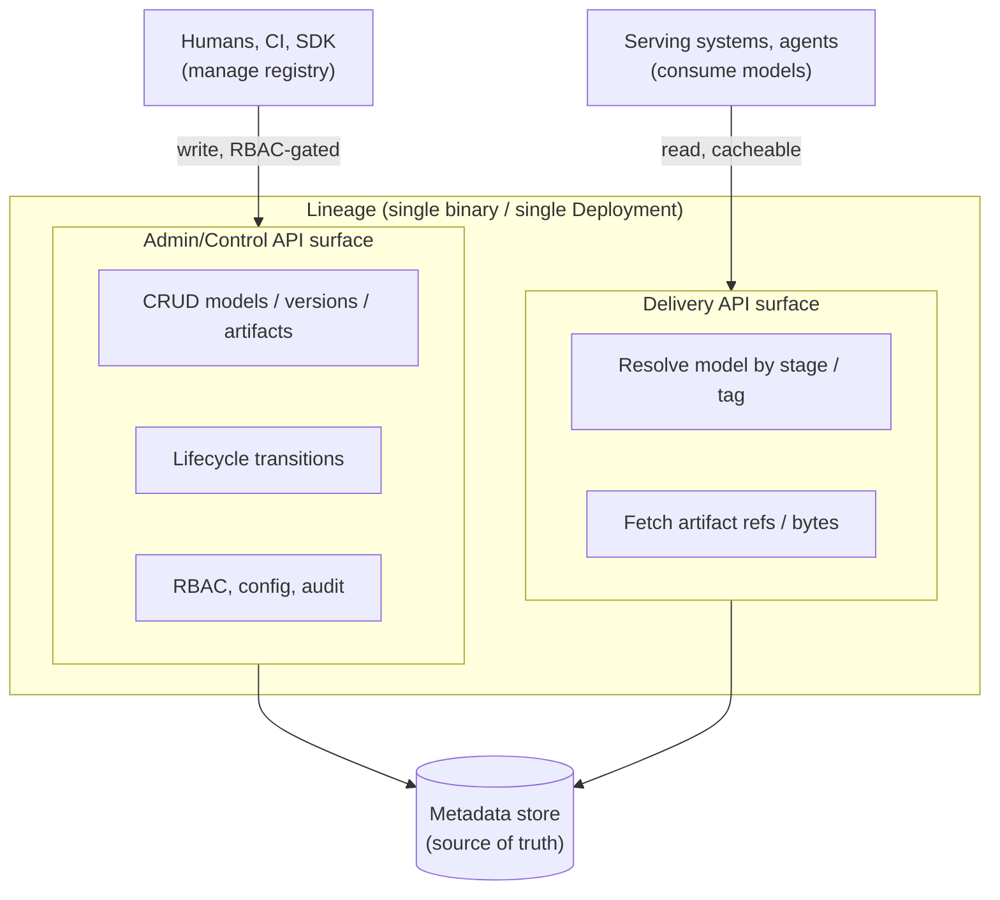
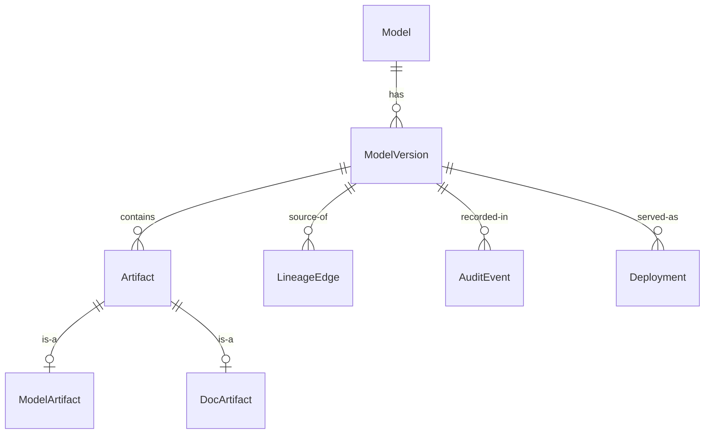

# 00 — Preplanning

> Status: **Draft**. Frames the problem, sets axioms, records decisions. Nothing is
> final until promoted into a numbered doc (`01`, `02`, …).

## 1. Vision

**Lineage** is a self-hostable, feature-complete **AI model registry**: the system of
record for models from post-experimentation to production to archival. It owns
**metadata and pointers** — what models/versions exist, where artifacts live, each
version's lifecycle stage, ownership, and how consumers fetch them. It is not a model
server and not an object store.

Benchmark: **Kubeflow Model Registry**. Target: **capability parity, not API
compatibility** — match what it does, with our own cleaner data model and API.

## 2. Axioms

1. **Self-hosting is primary.** SaaS never compromises it.
2. **Helm is a first-class product surface** — versioned and tested with the code.
   One `helm install` yields a working, secure registry. No Istio dependency.
3. **Single binary.** One Go binary, one Deployment. It exposes **two logical API
   surfaces** — Admin/Control (manage) and Delivery (consume) — with different routes
   and auth, but in one process. No separate deployables in v1.
4. **Capability parity, our own interface** — no MLMD, no wire compat.
5. **Storage-agnostic, metadata-authoritative** — bytes in pluggable backends.
6. **Auditable by default** — every state transition recorded.
7. **Frictionless for inference systems** — KServe, Modal, Baseten, and similar must
   consume from the Delivery API with near-zero glue (§5.1).

## 3. Goals & Non-Goals

**Goals (v1):** register models/versions/artifacts with queryable metadata; governed
lifecycle **stages**; Control API + admin-UI backend; separate Delivery API for
machine consumers; pluggable artifact storage with signed-URL delivery;
**lineage/provenance** graph (the namesake feature); first-class Helm; OIDC + RBAC;
audit log + event stream.

**Non-goals (v1):** model *serving* (we hold serving metadata, don't run models);
experiment tracking (we reference runs, don't host metrics); wire compat with
Kubeflow/MLMD/KServe; multi-region active-active; multi-tenancy (single-tenant per
install — §11.6).

## 4. Personas & Signature Journey

| Persona | Plane | Needs |
|---|---|---|
| ML Engineer / Researcher | Control | Publish version + artifacts from a pipeline; tag metadata. |
| MLOps / Platform Engineer | Control | Promote stages, manage RBAC, configure storage, operate. |
| Governance / Compliance | Control | Audit changes; enforce approval gates; export lineage. |
| Runtime Consumer (serving, CI, edge) | Delivery | Resolve "production version of model X" → artifact ref + metadata, fast. |
| App Developer | Delivery | Discover models; pull the right version by stage/label. |

**Signature journey:** pipeline pushes `ModelVersion` + `ModelArtifact` → human/gate
promotes `staging → production` → serving asks Delivery for `model=X, stage=production`
and gets a resolvable artifact ref + load metadata → every step is audited and in the
lineage graph.

## 5. Architecture: One Binary, Two API Surfaces

Lineage is a **single Go binary / single Deployment**. Within it, two logical API
surfaces serve different audiences over different route groups and auth middleware.

**Why two surfaces (not one flat API):** different blast radius (Delivery is a tiny
read-only surface, exposable more broadly; Admin stays locked down) and different auth
(Delivery uses minimal machine auth; Admin uses OIDC + RBAC). They share the process,
DB, and cache. Surfaces can be bound to separate ports/ingress; splitting into
separate deployables is a **future option, not v1**.

**Open (§11.3):** Delivery reads from source-of-truth DB + cache; read replicas later.

### 5.1 Consumer Integration (KServe, Modal, Baseten, …)

Serving systems must consume with near-zero glue. Two dominant patterns:

| Pattern | Systems | How Lineage serves it |
|---|---|---|
| **In-cluster pull by URI** | KServe, KServe ModelMesh | Resolution returns a **native `storageUri`** the system already understands (`s3://`, `gs://`, `oci://`, `hf://`) + a `serviceAccountName` hint. Drop straight into `InferenceService.spec.predictor.model.storageUri`. |
| **SDK / URL download at build or startup** | Modal, Baseten (Truss), custom | Resolution returns a **time-limited signed HTTPS URL** + digest + size. SDK call `resolve(model, stage=…)` → download into a Volume / image layer. |

**Resolution contract** (detail in `04-delivery-api.md`) — one call
`GET /models/{name}/resolve?stage=production` returns, for the matched version:
`versionId`, `digest` (sha256), `modelFormat` (name+version), and one or more artifact
refs, each carrying **all** of: `storageUri` (native scheme), `signedUrl`, `sizeBytes`,
`mediaType`. Consumers pick whichever fits; no registry-internal knowledge needed.

**Killer feature — `lineage://` URIs.** Ship an optional **KServe cluster
storage-initializer** (a `ClusterStorageContainer`) that resolves
`storageUri: lineage://<model>/<stage>` at pull time. Users reference models by
stage, not by physical location — promotions take effect with no manifest change.

**Enablers:** signed URLs (serving pulls bytes without registry credentials);
content digests (cache + reproducibility); the OCI/ORAS driver (KServe *modelcars*,
Modal/Baseten OCI pulls) — see §11.4.

## 6. Domain Model (draft)

Finalized in `02-data-model.md`. We reject Kubeflow's MLMD indirection and model these
as first-class relational entities.

- **Model** (≈ `RegisteredModel`) — logical model. `name` (unique per install),
  `owner`, `description`, `labels`, `customProperties`, `state` (LIVE/ARCHIVED),
  timestamps.
- **ModelVersion** — concrete iteration. `version`, `author`, `description`, `stage`,
  `labels`, `customProperties`, `state`, timestamps. 1 Model → N Versions.
- **ModelArtifact** — weights/graph. `uri`, `storageBackendRef`, `storagePath`,
  `modelFormat` (name+version), `sizeBytes`, `digest`, `serviceAccount`,
  `customProperties`.
- **DocArtifact** — README, model card, license, eval report. `uri`, `mediaType`.
  (Extensible: dataset/metrics artifact refs for lineage.) 1 Version → N Artifacts.
- **Stage** — governed status on a Version: `draft → staging → production → archived`
  (configurable). Singleton stages (e.g. one `production` per Model) TBD. Transitions
  emit events.
- **LineageEdge** — typed relationship: `derived-from`, `trained-on`, `produced-by`,
  `deployed-as`.
- **Deployment** — descriptive serving metadata (parity with Kubeflow
  ServingEnvironment/InferenceService/ServeModel); we don't orchestrate serving in v1.
- **AuditEvent** — immutable record of every mutation.
- ~~Project/Namespace~~ — deferred (single-tenant v1, §11.6); scope keys reserved for
  additive multi-tenancy later.

## 7. Cross-Cutting Concerns

Detailed in dedicated docs.

| Concern | v1 approach |
|---|---|
| AuthN | OIDC (humans/UI) + service tokens/API keys (machines); optional mTLS on Delivery |
| AuthZ | RBAC roles (viewer/publisher/approver/admin); approver-gated stage transitions |
| Storage | `StorageBackend` drivers: S3/GCS/Azure/FS (+ OCI later); signed-URL, stream-through fallback |
| Integrity | sha256 digests first-class; artifacts immutable once published |
| Events | domain events + webhooks (version created, stage changed) |
| Observability | Prometheus metrics, structured logs, OTel traces — surfaced via chart |
| Migrations | automatic, safe under Helm upgrade/rollback |
| Clients | OpenAPI is the contract; Python SDK + CLI generated from it |

## 8. Deployment & Helm

The chart is a product surface.

- **Components:** the Lineage binary (serving both API surfaces), (later) Admin UI,
  metadata DB, migration Job/hook, optional cache (Redis), optional object store.
- **Dependencies:** metadata DB (SQLite embedded, or Postgres) + optional cache.
  Postgres runs as an optional subchart with bring-your-own / managed switches.
  `dev` uses embedded SQLite (no DB subchart, needs a PVC); `prod` points at external
  or subchart Postgres.
- **Zero-to-running:** `helm install lineage lineage/lineage` on a fresh cluster →
  working registry, secure defaults.
- **Ingress:** optional separate ingress/port per API surface. **Secrets:** from K8s Secrets / external
  managers, never baked in. **Upgrades:** migrations as pre-upgrade hooks; safe
  rollback. **Profiles:** `dev` (single replica, embedded SQLite, no external deps)
  and `prod` (HA, external/subchart Postgres).

## 9. Capability Benchmark vs Kubeflow MR

| Capability | Kubeflow MR | Lineage v1 |
|---|---|---|
| Models / versions / artifacts | ✅ (MLMD) | ✅ (relational) |
| Doc artifacts, custom properties | ✅ | ✅ |
| Lifecycle state | ✅ LIVE/ARCHIVED | ✅ + governed stages |
| Serving/inference metadata | ✅ | ✅ (descriptive) |
| REST API + Python SDK | ✅ | ✅ (our own) |
| Storage-backend flexibility | partial | ✅ pluggable — **advantage** |
| Lineage/provenance graph | limited | ✅ **differentiator** |
| Separate admin/delivery API surfaces | ❌ single | ✅ (one binary, two surfaces) |
| First-class Helm, no Istio | partial | ✅ **advantage** |
| Governed approvals / RBAC gates | limited | ✅ |
| Audit log + webhooks | limited | ✅ |
| Frictionless serving pulls (KServe/Modal/Baseten) | via storageUri | ✅ native URIs + signed URLs + `lineage://` initializer — **advantage** |

## 10. Doc Roadmap

`00` (this) spawns:

| Doc | Scope |
|---|---|
| `01-architecture-overview.md` | components, planes, request flows, topology |
| `02-data-model.md` | entities, ER, state machines, constraints |
| `03-control-api.md` | Admin API: resources, ops, errors, auth |
| `04-delivery-api.md` | Delivery API: resolution contract, fetch, caching, `lineage://` storage-initializer, KServe/Modal/Baseten integration |
| `05-storage-and-artifacts.md` | drivers, addressing, integrity, delivery |
| `06-auth-and-rbac.md` | identity, roles, gates |
| `07-lineage-and-provenance.md` | lineage graph model + queries |
| `08-deployment-helm.md` | chart structure, values, profiles, migration |
| `09-observability-and-ops.md` | metrics, logs, traces, SLOs, runbooks |
| `10-sdk-and-cli.md` | client ergonomics |
| `ADRs/` | one numbered file per significant decision |

## 11. Decisions

Resolved (✅) become ADRs. Open (◻) resolve before the dependent doc.

1. ✅ **Language → Go.** Static binaries, best K8s/Helm ergonomics, ecosystem fit.
2. ✅ **Packaging → single binary / single Deployment.** One process exposes both API
   surfaces (Admin, Delivery) via distinct route groups + auth; optional separate
   ports/ingress. Splitting into separate deployables is a future option, not v1.
3. ✅ **Metadata store → SQLite and Postgres, both supported.** SQLite for
   zero-dependency dev/demo/small installs (fits single-binary); Postgres for HA/prod.
   Same schema via a portable data-access layer (no engine-specific SQL); pick via
   config. Detail + migration strategy in `02`.
4. ✅ **Artifacts → pluggable blob first, signed-URL (stream-through fallback); OCI/ORAS
   driver later.** v1: S3/GCS/Azure/FS. OCI-native is a later additional driver, not
   the v1 primary path. Detail in `05`.
5. ✅ **Tenancy → single-tenant per install (v1).** No Project/Namespace entity; reserve
   scope keys so multi-tenancy is additive.
6. ✅ **API → REST + OpenAPI as contract.** OpenAPI is source of truth; Python SDK + CLI
   generated. gRPC deferred.
7. ✅ **Inference-system consumption → native, first-class.** Delivery resolution
   returns native `storageUri` + signed URL + digest + model format; ship an optional
   KServe `lineage://<model>/<stage>` storage-initializer. Serves KServe, Modal,
   Baseten with near-zero glue (§5.1). Detail in `04`.
8. ◻ **Delivery data path.** *Leaning SoT DB + cache, read replicas later* — confirm in `04`.
9. ✅ **No Kubeflow/MLMD wire-compat adapter.** A permanent API shim contradicts axiom 4
   and means chasing someone else's evolving surface for a promise we don't value.
   Migration, *if ever needed*, is served by a one-shot CLI **importer** (read
   MLMD/Kubeflow → write Lineage entities), parked as an optional nice-to-have — not a
   live compatibility layer.

## 12. Preplanning Done When

Axioms + single-binary/two-surface model agreed; §11 decisions resolved (as ADRs);
§10 roadmap accepted → begin `01-architecture-overview.md`.
