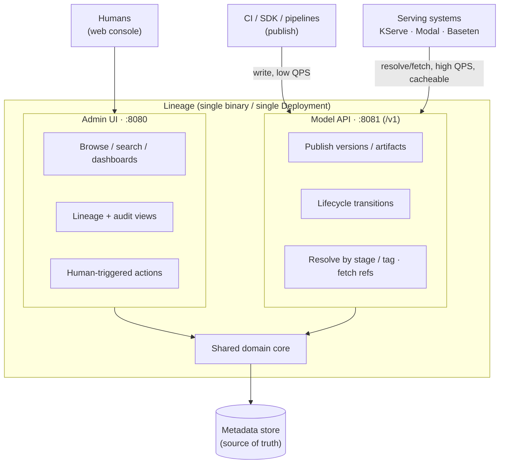
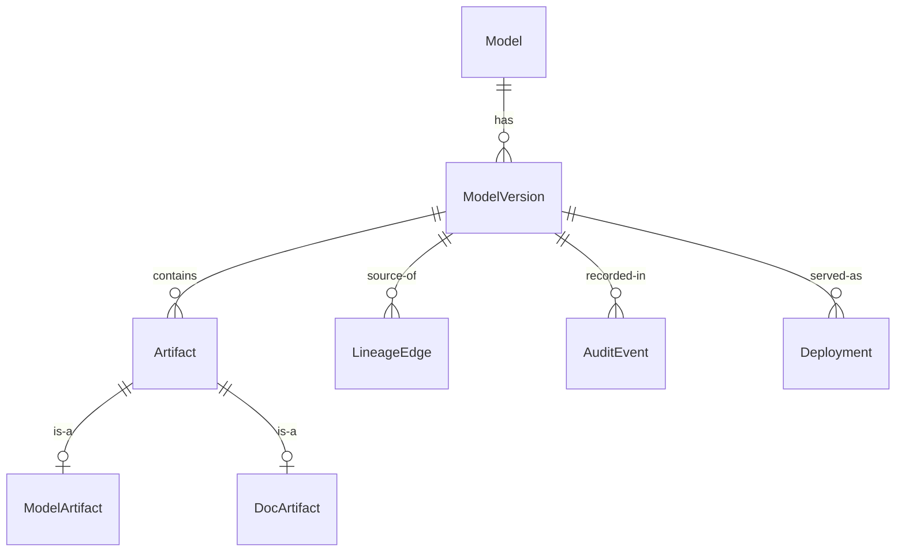

# 00 — Preplanning

> Status: **Accepted**. Frames the problem, sets axioms, records decisions. The axioms and
> §11 decisions here are binding; the behaviour they imply is specified in `01`–`12`, all of
> which are implemented.

## 1. Vision

**Lineage** is a self-hostable, feature-complete **AI model registry**: the system of
record for models from post-experimentation to production to archival. It owns
**metadata and pointers** — what models/versions exist, where artifacts live, each
version's lifecycle stage, ownership, and how consumers fetch them. It is not a model
server and not an object store.

Benchmark: **Kubeflow Model Registry**. Target: **capability parity, not API
compatibility** — match what it does, with our own cleaner data model and API.

## 2. Axioms

1. **Self-hosting is primary.** SaaS never compromises it.
2. **Helm is a first-class product surface** — versioned and tested with the code.
   One `helm install` yields a working, secure registry. No Istio dependency.
3. **Single binary, two surfaces on two ports.** One Go binary, one Deployment,
   exposing **Admin UI** (`:8080`, human web console) and **Model API** (`:8081`,
   machine-facing: publish + resolve + fetch). One process; no separate deployables in
   v1.
4. **Auth is out of scope.** AuthN/authZ belong to the infra (ingress, gateway, mesh,
   NetworkPolicy). Lineage trusts already-authenticated requests; it only records an
   infra-provided identity header for audit attribution.
5. **Capability parity, our own interface** — no MLMD, no wire compat.
6. **Storage-agnostic, metadata-authoritative** — bytes in pluggable backends.
7. **Auditable by default** — every state transition recorded.
8. **Frictionless for inference systems** — KServe, Modal, Baseten, and similar must
   consume from the Model API with near-zero glue (§5.1).

## 3. Goals & Non-Goals

**Goals (v1):** register models/versions/artifacts with queryable metadata; lifecycle
**stages**; a machine-facing **Model API** (publish + resolve + fetch) and a human
**Admin UI**; pluggable artifact storage with signed-URL delivery;
**lineage/provenance** graph (the namesake feature); first-class Helm; audit log +
event stream.

**Non-goals (v1):** model *serving* (we hold serving metadata, don't run models);
experiment tracking (we reference runs, don't host metrics); wire compat with
Kubeflow/MLMD/KServe; multi-region active-active; multi-tenancy (single-tenant per
install — §11.6).

## 4. Personas & Signature Journey

| Persona | Surface | Needs |
|---|---|---|
| ML Engineer / Researcher | Model API | Publish version + artifacts from a pipeline (SDK/CLI); tag metadata. |
| MLOps / Platform Engineer | Both | Automate promotion (Model API); operate + configure storage; browse/manage via Admin UI. |
| Governance / Compliance | Admin UI | Review audit trail; inspect lineage; export. |
| Runtime Consumer (serving, CI, edge) | Model API | Resolve "production version of model X" → artifact ref + metadata, fast. |
| App Developer | Model API | Discover models; pull the right version by stage/label. |

**Signature journey:** pipeline pushes `ModelVersion` + `ModelArtifact` to the Model API
→ CI gate or human promotes `staging → production` → serving asks the Model API for
`model=X, stage=production` and gets a resolvable artifact ref + load metadata → every
step is audited and in the lineage graph.

## 5. Architecture: One Binary, Two Surfaces on Two Ports

Lineage is a **single Go binary / single Deployment**. It listens on **two ports**, one
per surface, split by *who* talks to it — humans vs machines — not by read vs write.

**Why this split:** the two headline endpoints serve different audiences. **Admin UI**
is the human web console (a backend-for-frontend). **Model API** is the machine-facing
programmatic contract — publishing *and* consumption both live here (publishing is not
an Admin operation). Both are thin HTTP over the **same domain core** (one source of
business logic). Each binds its **own port** so infra can restrict the console
independently of the API; splitting into separate deployables is a **future option, not
v1**.

**Open (§11.8):** the Model API's resolve/fetch reads from source-of-truth DB + cache;
read replicas later.

### 5.1 Consumer Integration (KServe, Modal, Baseten, …)

Serving systems must consume with near-zero glue. Two dominant patterns:

| Pattern | Systems | How Lineage serves it |
|---|---|---|
| **In-cluster pull by URI** | KServe, KServe ModelMesh | Resolution returns a **native `storageUri`** the system already understands (`s3://`, `gs://`, `oci://`, `hf://`) + a `serviceAccountName` hint. Drop straight into `InferenceService.spec.predictor.model.storageUri`. |
| **SDK / URL download at build or startup** | Modal, Baseten (Truss), custom | Resolution returns a **time-limited signed HTTPS URL** + digest + size. SDK call `resolve(model, stage=…)` → download into a Volume / image layer. |

**Resolution contract** (detail in `04-delivery-api.md`) — one Model API call
`GET /v1/models/{name}/resolve?stage=production` returns, for the matched version:
`versionId`, `digest` (sha256), `modelFormat` (name+version), and one or more artifact
refs, each carrying **all** of: `storageUri` (native scheme), `signedUrl`, `sizeBytes`,
`mediaType`. Consumers pick whichever fits; no registry-internal knowledge needed.

**Killer feature — `lineage://` URIs.** Ship an optional **KServe cluster
storage-initializer** (a `ClusterStorageContainer`) that resolves
`storageUri: lineage://<model>/<stage>` at pull time. Users reference models by
stage, not by physical location — promotions take effect with no manifest change.

**Enablers:** signed URLs (serving pulls bytes without registry credentials);
content digests (cache + reproducibility); the OCI/ORAS driver (KServe *modelcars*,
Modal/Baseten OCI pulls) — see §11.4.

## 6. Domain Model (draft)

Finalized in `02-data-model.md`. We reject Kubeflow's MLMD indirection and model these
as first-class relational entities.

- **Model** (≈ `RegisteredModel`) — logical model. `name` (unique per install),
  `owner`, `description`, `labels`, `customProperties`, `state` (LIVE/ARCHIVED),
  timestamps.
- **ModelVersion** — concrete iteration. `version`, `author`, `description`, `stage`,
  `labels`, `customProperties`, `state`, timestamps. 1 Model → N Versions.
- **ModelArtifact** — weights/graph. `uri`, `storageBackendRef`, `storagePath`,
  `modelFormat` (name+version), `sizeBytes`, `digest`, `serviceAccount`,
  `customProperties`.
- **DocArtifact** — README, model card, license, eval report. `uri`, `mediaType`.
  (Extensible: dataset/metrics artifact refs for lineage.) 1 Version → N Artifacts.
- **Stage** — lifecycle status on a Version: `draft → staging → production → archived`
  (configurable), enforced by a state machine. Singleton stages (e.g. one `production`
  per Model) TBD. Transitions emit events. *Who* may transition is enforced by infra,
  not Lineage (§4 auth axiom).
- **LineageEdge** — typed relationship: `derived-from`, `trained-on`, `produced-by`,
  `deployed-as`.
- **Deployment** — descriptive serving metadata (parity with Kubeflow
  ServingEnvironment/InferenceService/ServeModel); we don't orchestrate serving in v1.
- **AuditEvent** — immutable record of every mutation.
- ~~Project/Namespace~~ — deferred (single-tenant v1, §11.6); scope keys reserved for
  additive multi-tenancy later.

## 7. Cross-Cutting Concerns

Detailed in dedicated docs.

| Concern | v1 approach |
|---|---|
| Auth | **Out of scope** — infra (ingress/gateway/mesh/NetworkPolicy) does authN/authZ; Lineage records an infra-provided identity header for audit only |
| Storage | `StorageBackend` drivers: S3/GCS/Azure/FS (+ OCI later); signed-URL, stream-through fallback |
| Integrity | sha256 digests first-class; artifacts immutable once published |
| Events | domain events + webhooks (version created, stage changed) |
| Observability | Prometheus metrics, structured logs, OTel traces — surfaced via chart |
| Migrations | automatic, safe under Helm upgrade/rollback |
| Clients | OpenAPI is the contract; Python SDK + CLI generated from it |

## 8. Deployment & Helm

The chart is a product surface.

- **Components:** the Lineage binary (serving both API surfaces), (later) Admin UI,
  metadata DB, migration Job/hook, optional cache (Redis), optional object store.
- **Dependencies:** metadata DB (SQLite embedded, or Postgres) + optional cache.
  Postgres runs as an optional subchart with bring-your-own / managed switches.
  `dev` uses embedded SQLite (no DB subchart, needs a PVC); `prod` points at external
  or subchart Postgres.
- **Zero-to-running:** `helm install lineage lineage/lineage` on a fresh cluster →
  working registry, secure defaults.
- **Ingress:** optional separate ingress/port per API surface. **Secrets:** from K8s Secrets / external
  managers, never baked in. **Upgrades:** migrations as pre-upgrade hooks; safe
  rollback. **Profiles:** `dev` (single replica, embedded SQLite, no external deps)
  and `prod` (HA, external/subchart Postgres).

## 9. Capability Benchmark vs Kubeflow MR

| Capability | Kubeflow MR | Lineage v1 |
|---|---|---|
| Models / versions / artifacts | ✅ (MLMD) | ✅ (relational) |
| Doc artifacts, custom properties | ✅ | ✅ |
| Lifecycle state | ✅ LIVE/ARCHIVED | ✅ + lifecycle stages |
| Serving/inference metadata | ✅ | ✅ (descriptive) |
| REST API + Python SDK | ✅ | ✅ (our own) |
| Storage-backend flexibility | partial | ✅ pluggable — **advantage** |
| Lineage/provenance graph | limited | ✅ **differentiator** |
| Human UI + machine API on separate ports | ❌ single | ✅ (one binary, two surfaces) |
| First-class Helm, no Istio | partial | ✅ **advantage** |
| Audit log + webhooks | limited | ✅ |
| Frictionless serving pulls (KServe/Modal/Baseten) | via storageUri | ✅ native URIs + signed URLs + `lineage://` initializer — **advantage** |

## 10. Doc Roadmap

`00` (this) spawns:

| Doc | Scope |
|---|---|
| `01-architecture-overview.md` | components, surfaces, request flows, topology |
| `02-data-model.md` | entities, ER, state machines, constraints |
| `03-model-api.md` | Model API: publish/register, lifecycle, resource ops, errors |
| `04-delivery-api.md` | Model API consumption: resolution contract, fetch, caching, `lineage://` storage-initializer, KServe/Modal/Baseten integration |
| `05-storage-and-artifacts.md` | drivers, addressing, integrity, delivery |
| `06-admin-ui-api.md` | Admin UI backend-for-frontend: views, search, dashboards |
| `07-lineage-and-provenance.md` | lineage graph model + queries |
| `08-deployment-helm.md` | chart structure, values, profiles, migration |
| `09-observability-and-ops.md` | metrics, logs, traces, SLOs, runbooks |
| `10-sdk-and-cli.md` | client ergonomics |
| `11-model-insights.md` | model composition as queryable metadata: params, layers, framework, precision/quantization, disk vs memory footprint, evaluations, architecture fingerprint + version diff |
| `12-version-portrait.md` | procedurally generated per-version mark in the console: mark families, encodings, determinism |
| `13-performance-and-scale.md` | optimization backlog over the implemented system: query push-down, cache topology, HTTP/runtime/engine tuning, verification harness and targets |
| `14-competitive-landscape.md` | who else occupies the registry slot, evidenced user pain points per competitor, cross-cutting failure modes, where we are exposed |
| `15-eu-ai-act-posture.md` | EU AI Act framing for `16`–`19`: what we will and will not claim, the deadlines that apply, honest coverage map, build order. No schema |
| `16-eu-risk-classification.md` | Declared `eu_system_risk_class` + `eu_gpai_tier` per model; the drift predicate; inventory query |
| `17-eu-modification-review.md` | Art. 25 — routing the `11.4` fingerprint verdict to a human when a derivation may transfer provider liability |
| `18-evidence-export.md` | Bundle profiles (Annex XII / Annex IV), bundle shape, gap reporting, determinism. **Regime-neutral** — the profile is the extension seam |
| `19-retention-and-hold.md` | Legal hold, retention floor, optional tamper-evident audit chain. **Regime-neutral** |

Docs `15`–`17` carry an `eu-` prefix because their *mechanism* is jurisdictional; `18` and
`19` do not, because theirs is not (`15.2.1`).

## 11. Decisions

This section **is** the decision record — there is no separate ADR set. Each entry carries its
own rationale; resolved is ✅, open is ◻ and resolves before the dependent doc.

1. ✅ **Language → Go.** Static binaries, best K8s/Helm ergonomics, ecosystem fit.
2. ✅ **Packaging → single binary, two surfaces on two ports.** One process serves the
   **Admin UI** (human web console, `:8080`) and the **Model API** (machine-facing
   publish + resolve + fetch, `:8081`, `/v1`). The port is the surface selector, so no
   `/admin` route prefix is needed. Publishing is a Model API operation, **not** Admin.
   Splitting into separate deployables is a future option, not v1.
3. ✅ **Metadata store → SQLite and Postgres via per-dialect adapters behind the
   `MetadataStore` port.** SQLite = zero-dependency dev/demo/small/edge tier; Postgres =
   full-power HA/prod tier. **Shared logical schema, not shared SQL** — each engine keeps
   its own queries/migrations, so Postgres uses native features (JSONB filtering,
   `FOR UPDATE`, pgvector, read replicas) instead of being capped at SQLite's floor. Core
   registry behavior is identical on both; some advanced queries are Postgres-only.
   Selected via config. Detail in `02.7`.
4. ✅ **Artifacts → pluggable blob first, signed-URL (stream-through fallback); OCI/ORAS
   driver later.** v1: S3/GCS/Azure/FS. OCI-native is a later additional driver, not
   the v1 primary path. Detail in `05`.
5. ✅ **Tenancy → single-tenant per install (v1).** No Project/Namespace entity; reserve
   scope keys so multi-tenancy is additive.
6. ✅ **API → REST + OpenAPI as contract.** OpenAPI is source of truth; Python SDK + CLI
   generated. gRPC deferred.
7. ✅ **Inference-system consumption → native, first-class.** Model API resolution
   returns native `storageUri` + signed URL + digest + model format; ship an optional
   KServe `lineage://<model>/<stage>` storage-initializer. Serves KServe, Modal,
   Baseten with near-zero glue (§5.1). Detail in `04`.
8. ✅ **Model API resolve/fetch data path → source-of-truth DB + resolution cache.**
   Confirmed as built in `04`: resolve reads the store, the cache is invalidated by
   `version.created`/`stage_changed`/`artifact.created` events rather than by direct calls,
   and a short TTL backstops a missed event. Read replicas remain a later, additive change.
9. ✅ **No Kubeflow/MLMD wire-compat adapter.** A permanent API shim contradicts axiom 5
   and means chasing someone else's evolving surface for a promise we don't value.
   Migration, *if ever needed*, is served by a one-shot CLI **importer** (read
   MLMD/Kubeflow → write Lineage entities), parked as an optional nice-to-have — not a
   live compatibility layer.
10. ✅ **Auth → out of scope.** Infra (ingress/gateway/mesh/NetworkPolicy) owns
    authN/authZ; Lineage trusts already-authenticated requests and records an
    infra-provided identity header for audit attribution only (axiom 4).
11. ✅ **Regulatory posture → evidence substrate, not a compliance product.** Lineage emits
    the facts it holds in a regulation's own structure and **names every heading it cannot
    fill** (`18.4` — Annex IV is 2 held / 5 partial / 3 not held). It does not assess
    conformity, certify, or submit. Rationale: the same boundary as `11.1` (store facts,
    don't derive them) applied one level up. A bundle that looked complete because it
    omitted unfilled headings would convert a gap into false confidence — strictly worse
    than emitting nothing. Stated in `15.3`; this also fixes the ceiling on what `14` may
    claim.
12. ✅ **Risk classification is `declared`, never inferred — and jurisdiction is in the field
    name.** `eu_system_risk_class` and `eu_gpai_tier` (`16.7.1`) are operator claims carried
    with `11.2` provenance; there is no `derived` path in the schema. `unclassified` is a
    visible state and never renders or defaults to `minimal` (`12.2` rule 1). The registry
    detects **drift** — a review date passed, or a version published/promoted/derived since
    classification (`16.5`) — and stops there; it never re-classifies. Rationale: a model is
    not an AI system (`15.3.1`), so the registry structurally lacks the context a class
    depends on, and guessing low is the expensive direction. The **`eu_` prefix** is part of
    the decision (`16.3.1`): `high_annex_iii` is a citation, not a risk level, so an
    unprefixed `system_risk_class` would falsely imply a general notion of risk the registry
    does not have. A second regime then arrives as additive `nist_*` columns rather than a
    rename of shipped ones. Purpose, basis, and review dates stay unprefixed — every
    framework wants those.
13. ✅ **Retention floor + legal hold → deletion refuses** (`19.3`, `19.4`). `legal_hold` on
    `model`/`model_version`; `DELETE` on a held subject, or on one younger than the configured
    retention floor, returns **`409 failed_precondition`** with `details.reason`
    (`legal_hold` / `retention_floor`). The floor is reported at `/healthz` and in every
    bundle so a filing can cite what the registry was actually running under.
    **Refusal beats soft-delete**: hiding the row satisfies the caller and destroys the fact
    — six months on nobody can tell whether a record was retained deliberately or merely not
    yet purged (`19.3.2`). This is the one **non-additive** change in `15`–`19`: an endpoint
    that always succeeded can now fail, so existing teardown automation may need a retry
    branch. Accepted knowingly — holds are off unless set, and the floor ships defaulted so
    an install opts into enforcement.
14. ✅ **Tamper-evident audit → Merkle epoch sealing, on by default** (`19.5`). **Not** a
    per-row hash chain. Chaining each row to its predecessor forces a total order and
    serializes every audit write behind one sequence — free on SQLite, a real contention
    point on Postgres under the load `13` targets. That cost is an artefact of the algorithm,
    not of the goal. Instead: rows carry `epoch = floor(at / interval)` (derived from the
    row's own clock, no coordination), and a background sealer computes one Merkle root per
    closed window into `audit_epoch`, epochs chained by `prev_root` — the RFC 6962
    construction. **The write path pays nothing**, so the reason for opt-in disappears and
    it defaults on, which is what axiom 7 should have meant. It also gains an `O(log n)`
    single-row inclusion proof a chain could not offer cheaply. Known bounded gap: rows in
    the open epoch are unsealed, reported as `openEpochSince` rather than glossed
    (`19.5.3`). The `13` measurement that gated this is moot.

## 12. Preplanning Done When

Axioms + single-binary/two-surface model agreed; §11 decisions resolved in place;
§10 roadmap accepted → begin `01-architecture-overview.md`.
