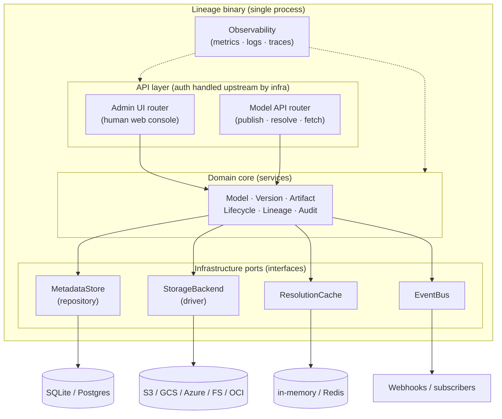
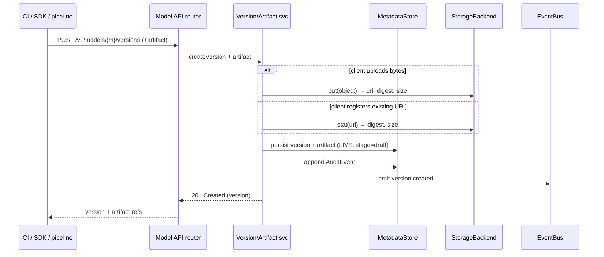
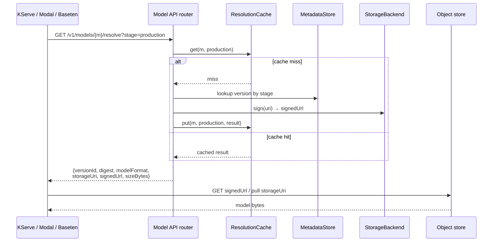
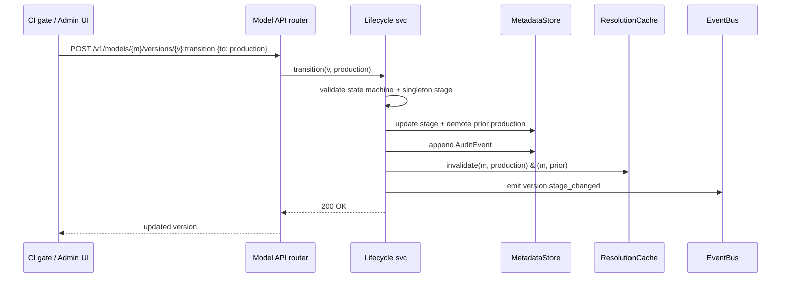
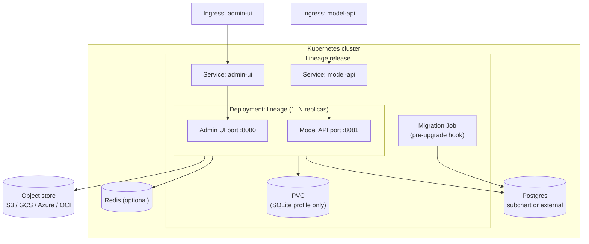

# 01 — Architecture Overview

> Status: **Draft**. Builds on `00-preplanning.md`. Defines components, the two API
> surfaces, request flows, and deployment topology. Details deferred to `02`–`08`.

## 1. Shape

One Go binary. Inside it, a layered architecture: two HTTP surfaces on two ports (Admin
UI + Model API) over a shared domain core, backed by a pluggable metadata store and
pluggable artifact storage. No inter-service network calls — the two surfaces are two
listeners in one process (§00.5).

## 2. Layers

| Layer | Responsibility | Notes |
|---|---|---|
| **API** | HTTP routing, request/response mapping, OpenAPI | Two surfaces; Admin UI = human console (BFF), Model API = publish/resolve/fetch. **No auth** — handled upstream (§3) |
| **Domain core** | Business rules: entity CRUD, lifecycle state machine, lineage edges, audit emission | Storage-agnostic; depends only on port interfaces |
| **Infrastructure ports** | Interfaces the core depends on: `MetadataStore`, `StorageBackend`, `ResolutionCache`, `EventBus` | Enables SQLite↔Postgres and blob↔OCI swaps without touching core |
| **Adapters** | Concrete implementations of the ports | `sqlite`/`postgres`; `s3`/`gcs`/`azure`/`fs`/`oci`; `memory`/`redis` |
| **Observability** | Prometheus metrics, structured logs, OTel traces | Cross-cutting middleware |

**Dependency rule:** API → core → ports (interfaces). Adapters implement ports and are
wired at startup. The core never imports an adapter — this is what keeps SQLite/Postgres
and blob/OCI genuinely pluggable.

## 3. The Two Surfaces

The two endpoints split by **who talks to them**, not by read vs write.

| | Admin UI | Model API |
|---|---|---|
| **Audience** | Humans, via the web console | Machines: CI/CD, SDK, pipelines, serving systems |
| **Purpose** | Browse/search, dashboards, lineage & audit views, human-triggered actions | **Publish** versions/artifacts, lifecycle transitions, **resolve + fetch** for serving |
| **Routes** | Console + private BFF paths (surface = the port; no prefix needed) | `/v1/…` (versioned public contract) |
| **Shape** | Backend-for-frontend (aggregations, search, pagination) tailored to the UI | Clean resource + resolution contract; the public OpenAPI surface |
| **Traffic** | Human-paced, read-mostly | Publish writes (low QPS) + **resolve/fetch** reads (high QPS, cacheable) |
| **Auth** | **Not Lineage's job** — infra handles it | **Not Lineage's job** — infra handles it |
| **Binding** | Same process, **own port** (`:8080`) | Same process, **own port** (`:8081`) |

**Publishing is a Model API operation, not an Admin operation.** Admin UI is strictly
the human console. Both surfaces are thin HTTP over the **same domain core** — the UI
invokes the same core services for any action it exposes, so there is one source of
business logic, not two write contracts. They share the DB, cache, storage drivers, and
event bus, and **each binds to its own port** (`:8080` admin UI, `:8081` model API) so
ingress/NetworkPolicy treats them independently while remaining one binary.

The high-QPS, cacheable, broadly-exposable subset is specifically the Model API's
**resolve/fetch** endpoints; publish and lifecycle are low-QPS writes on the same
surface, restrictable by infra path/policy.

**Auth is out of scope.** AuthN and authZ are the responsibility of the surrounding
infrastructure — ingress, API gateway, service mesh, NetworkPolicy. Typically: lock the
Admin console and publish paths down; expose resolve/fetch to in-cluster serving
systems. Lineage trusts the request as already authenticated. For **audit attribution**
it reads an optional infra-provided identity header (e.g. `X-Lineage-Actor`) and records
it; it never validates credentials.

## 4. Request Flows

### 4.1 Publish a version + artifact (Model API — machine write)

### 4.2 Resolve + pull for serving (Model API — consumption)

Bytes flow **directly from storage to the consumer** — the registry returns references,
not payloads (signed-URL model). This is what keeps resolve/fetch fast and cheap.

### 4.3 Promote stage (Model API — lifecycle)

Triggered by an automated gate (CI) or by a human through the Admin UI, which calls the
same lifecycle service.

Cache invalidation on promotion (4.3) is what lets the resolve cache (4.2) stay both
fast and correct — resolution results change only on stage transitions.

## 5. Runtime & Configuration

- **Single process, config-driven.** One config source (file + env + flags) selects DB
  engine (`sqlite`|`postgres`), storage driver(s), cache backend, and ports.
- **Ports:** the Admin UI and Model API surfaces bind independently (default same host,
  distinct ports); a health/metrics port for probes and Prometheus.
- **Startup:** load config → run migrations (or verify) → wire adapters into ports →
  start routers. Fail fast on misconfiguration.
- **Statelessness:** the process holds no durable state — all persistence is in the DB,
  storage backend, and (optional) external cache. Replicas are interchangeable, except
  the SQLite profile (single-writer; single replica + PVC — see §7).

## 6. Deployment Topology (Helm)

- **Two ports, always.** The single binary listens on **two distinct ports** — Admin UI
  (`:8080`) and Model API (`:8081`) — each fronted by its own Service and Ingress, so
  infra can restrict the Admin console independently of the Model API (e.g. expose
  resolve/fetch to in-cluster serving systems, lock the console to SSO/VPN).
- **`dev` profile:** 1 replica, embedded **SQLite** on a PVC, in-memory cache, no
  external deps. `helm install` → working registry.
- **`prod` profile:** N replicas (HA), external/subchart **Postgres**, optional Redis,
  external object store. Migrations run as a pre-upgrade hook.

## 7. Key Constraints Carried From `00`

- **Per-dialect persistence:** SQLite and Postgres each get their own adapter behind the
  `MetadataStore` port — shared logical schema, dialect-specific SQL and migrations; the
  core stays engine-agnostic (§00.11.3, §02.7). Core registry behavior is identical on
  both; some advanced queries are Postgres-only. SQLite = single-writer → dev profile is
  single-replica.
- **Bytes never transit the core on read:** resolve/fetch returns refs/signed URLs;
  stream-through is a fallback only where signing is impossible (§00.11.4).
- **Native consumption:** resolution output carries native `storageUri` + `signedUrl` +
  `digest` + `modelFormat` so KServe/Modal/Baseten consume with no glue (§00.5.1).
- **Auditable:** every mutating flow appends an `AuditEvent` in the same transaction as
  the change.

## 8. Deferred To Later Docs

| Topic | Doc |
|---|---|
| Entity fields, ER, state machine, constraints | `02` |
| Model API: publish/register, lifecycle, resource ops, errors | `03` |
| Model API consumption: resolution contract, fetch, caching, `lineage://` initializer | `04` |
| Storage drivers, addressing, integrity, signed URLs | `05` |
| Admin UI API (BFF): views, search, dashboards | `06` |
| Lineage graph model + queries | `07` |
| Chart structure, values, profiles, migration | `08` |
