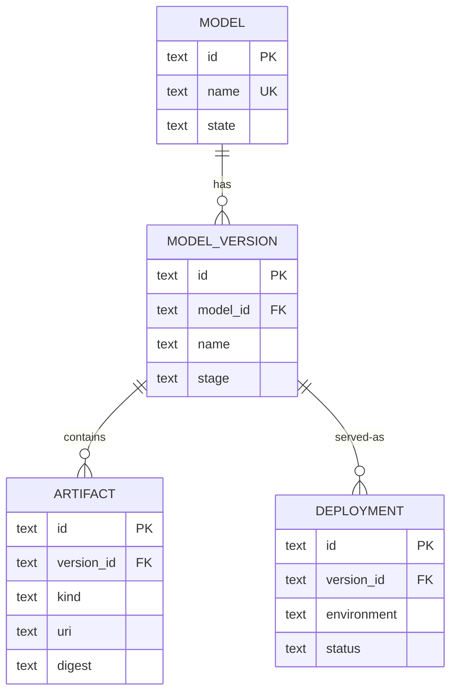
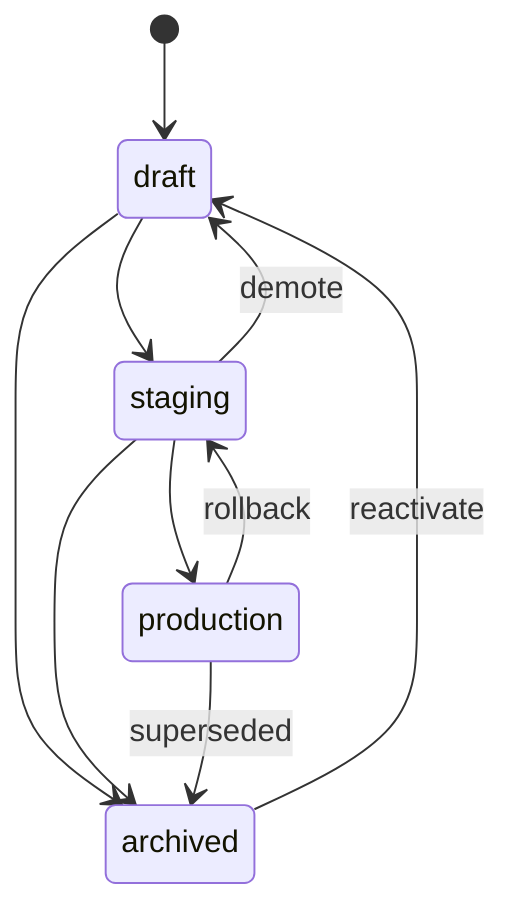

# 02 — Data Model

> Status: **Implemented**. Finalizes entities, relationships, the stage state machine, and the
> constraints/portability rules that let one schema run identically on SQLite and
> Postgres. Consumed by `03` (Model API), `04` (consumption), `05` (storage), `07`
> (lineage).

## 1. Principles

- **First-class relational, no MLMD.** Real tables for real entities (§00.6, §00.9).
- **Runs on SQLite and Postgres via per-dialect adapters behind the `MetadataStore`
  port** — shared logical schema, but each engine gets its own SQL and migrations.
  Postgres may use native features (JSONB queries, `SELECT … FOR UPDATE`, GIN, pgvector);
  SQLite covers the core. See §7 (§00.11.3).
- **Single-tenant (v1).** No tenant/project column. Uniqueness is per-install. Multi-
  tenancy later = add a `scope` column + composite keys (§00.11.5).
- **App-generated IDs.** Every entity PK is a **ULID** stored as `TEXT` — sortable by
  creation time, no DB sequence/identity dependence (portability).
- **Timestamps are `INT64` epoch-millis** (`created_at`, `updated_at`) — avoids
  `TIMESTAMP`/timezone differences between engines.
- **Lineage-first.** Provenance is a typed edge table, not an afterthought (§07).
- **Auditable.** Every mutation appends an `audit_event` in the same transaction (§5).

## 2. Entity–Relationship

Hard foreign-key relationships:

Three tables are **polymorphic** (subject referenced by `type`+`id`, so no DB-level FK —
referential cleanup is done in the repository layer): `label`, `lineage_edge`,
`audit_event`. They attach to any entity above.

## 3. Tables

Logical types (§7 maps them to each engine): `id`=ULID TEXT · `str`=TEXT · `int64` ·
`bool` · `ts`=INT64 epoch-ms · `json`=opaque document · `enum`=TEXT+CHECK.

### 3.1 `model`
| Column | Type | Notes |
|---|---|---|
| `id` | id | PK |
| `name` | str | **unique per install** |
| `description` | str? | |
| `owner` | str? | free-text owner/team |
| `state` | enum | `ACTIVE` \| `ARCHIVED` (default `ACTIVE`) |
| `custom_properties` | json? | opaque typed bag |
| `created_at`,`updated_at` | ts | |

### 3.2 `model_version`
| Column | Type | Notes |
|---|---|---|
| `id` | id | PK |
| `model_id` | id | FK→`model.id` ON DELETE CASCADE |
| `name` | str | version identifier; **unique per (`model_id`,`name`)** |
| `description` | str? | |
| `author` | str? | |
| `stage` | enum | `draft`\|`staging`\|`production`\|`archived` (default `draft`) — §4 |
| `custom_properties` | json? | |
| `created_at`,`updated_at` | ts | |

### 3.3 `artifact` (single-table inheritance)
One table, discriminated by `kind`; type-specific columns are nullable. Extensible
(future `DATASET`, `METRICS` kinds).

| Column | Type | Notes |
|---|---|---|
| `id` | id | PK |
| `version_id` | id | FK→`model_version.id` ON DELETE CASCADE |
| `kind` | enum | `MODEL` \| `DOC` |
| `name` | str | **unique per (`version_id`,`name`)** |
| `uri` | str | native storage URI (`s3://`,`gs://`,`oci://`,`hf://`,`file://`) |
| `storage_backend` | str? | name of a configured backend (§05); null = URI is self-describing |
| `storage_path` | str? | sub-path within the backend |
| `size_bytes` | int64? | |
| `digest` | str? | content hash, e.g. `sha256:…` |
| `media_type` | str? | MIME (DOC and general) |
| `model_format_name` | str? | MODEL only, e.g. `onnx` |
| `model_format_version` | str? | MODEL only, e.g. `1.16` |
| `service_account` | str? | MODEL only — in-cluster pull hint (§00.5.1) |
| `custom_properties` | json? | |
| `created_at`,`updated_at` | ts | |

### 3.4 `deployment` (descriptive serving metadata)
Records where a version **is/was** served. Lineage does **not** orchestrate serving.

| Column | Type | Notes |
|---|---|---|
| `id` | id | PK |
| `version_id` | id | FK→`model_version.id` ON DELETE CASCADE |
| `environment` | str | serving env name (e.g. `prod-cluster`) |
| `endpoint_uri` | str? | |
| `status` | enum | `ACTIVE` \| `INACTIVE` (descriptive) |
| `external_ref` | str? | e.g. KServe `InferenceService` ref |
| `created_at`,`updated_at` | ts | |

### 3.5 `label` (queryable tags — polymorphic)
Lightweight string key/value for filtering/discovery. Richer/opaque metadata goes in
each entity's `custom_properties` JSON.

| Column | Type | Notes |
|---|---|---|
| `subject_type` | enum | `model`\|`model_version`\|`artifact` |
| `subject_id` | id | |
| `key` | str | |
| `value` | str | |

PK (`subject_type`,`subject_id`,`key`). Cleanup on subject delete is app-enforced.

### 3.6 `lineage_edge` (provenance — polymorphic)
Typed directed edge; source is normally a `model_version`. Target is **either** an
internal entity **or** an external URI (dataset/run) — see §07 for query patterns.

| Column | Type | Notes |
|---|---|---|
| `id` | id | PK |
| `src_type` | enum | e.g. `model_version` |
| `src_id` | id | |
| `relation` | enum | `derived_from`\|`trained_on`\|`produced_by`\|`deployed_as` |
| `dst_type` | enum? | internal target type (nullable) |
| `dst_id` | id? | internal target id (nullable) |
| `dst_ref` | str? | external URI (nullable) |
| `created_at` | ts | |

CHECK: `dst_id IS NOT NULL` **OR** `dst_ref IS NOT NULL`.

### 3.7 `audit_event` (append-only — polymorphic)
Immutable record of every mutation. Never updated or deleted.

| Column | Type | Notes |
|---|---|---|
| `id` | id | PK |
| `at` | ts | |
| `actor` | str? | from infra `X-Lineage-Actor` header (§00 axiom 4) |
| `action` | str | e.g. `model.create`, `version.promote`, `artifact.create` |
| `subject_type` | str | |
| `subject_id` | id | |
| `summary` | str | human-readable one-liner |
| `data` | json? | structured detail (e.g. `{from,to}` on a promote) |

> Storage backends are **configuration**, not rows, in v1 — `artifact.storage_backend`
> references a backend defined in config (§05). A managed `storage_backend` table is a
> possible later addition.

## 4. Stage State Machine

`model_version.stage` is governed by a state machine (transitions validated in the
domain core). `model.state` (`ACTIVE`/`ARCHIVED`) is independent — logical retirement of
the whole model.

- **Singleton stages (configurable):** at most **one** version per model may be in
  `production` (default). Promoting version B to `production` **auto-demotes** the
  incumbent A to `archived`, in the same transaction. Rollback = promote A back.
  `staging` is non-singleton by default.
- `archived` is the terminal/retired stage; content is retained, not deleted.
- The exact allowed set and which stages are singleton are **config-driven**, but the
  default graph above is what `03`/`04` assume.

## 5. Constraints & Invariants

1. **Uniqueness is exact-match** (no engine-specific collation): `model.name`;
   (`model_id`,`name`) on versions; (`version_id`,`name`) on artifacts.
2. **Published artifacts are immutable.** Once an artifact has a `digest`, its
   `uri`/`digest`/`size_bytes` cannot change. New content ⇒ new version. (App-enforced.)
3. **Singleton stage** invariant (§4) enforced transactionally on promote — Postgres via
   `SELECT … FOR UPDATE` on the model row; SQLite via its single-writer serialization.
4. **Audit-in-transaction.** Every create/update/delete/transition appends its
   `audit_event` within the same DB transaction as the change — no change without a
   record, no record without a change. One event per write; the exception is a superseding
   change-plan declaration, which records `change_plan.declare` and `change_plan.supersede`
   (`22.7`). Mechanism: the core runs the write and `AppendAudit` inside one
   `MetadataStore.InTx` unit of work (`00.11.17`).
   - A failed audit write fails the request and rolls the change back.
   - Store methods with their own transaction (`SetStage`, `CreateChangePlan`, …) join the
     caller's, so the singleton lock (invariant 3) is held until the event commits too.
   - Non-row side effects — `EventBus` publish (cache invalidation, webhooks), metrics —
     run only after commit.
   - Uploaded bytes land in the backend before the row; if the row's unit fails they are
     unreferenced and left to the reference-counted sweeper (`05.8`).
5. **Cascade deletes:** deleting a `model` → its versions → their artifacts &
   deployments (DB FK cascade). Polymorphic rows (`label`, `lineage_edge`,
   `audit_event`) are cleaned by the repository layer, except `audit_event` which is
   **retained** (audit outlives its subject).
6. **Referential integrity** on all FK columns; `PRAGMA foreign_keys=ON` for SQLite.

## 6. Indexes

| Table | Index | Purpose |
|---|---|---|
| `model` | unique(`name`) | lookup/uniqueness |
| `model_version` | unique(`model_id`,`name`) | uniqueness |
| `model_version` | (`model_id`,`stage`) | **resolution** by stage (hot path) |
| `artifact` | unique(`version_id`,`name`) | uniqueness |
| `artifact` | (`version_id`,`kind`) | list artifacts of a version |
| `label` | (`key`,`value`) | discovery by tag |
| `lineage_edge` | (`src_type`,`src_id`), (`dst_type`,`dst_id`) | traverse both directions |
| `audit_event` | (`subject_type`,`subject_id`,`at`), (`at`) | subject history / global feed |

**Resolution path** (§04): `model` by `name` → `model_version` by
(`model_id`,`stage`) → if multiple, newest by `created_at` → its `artifact` rows.

## 7. Persistence: Per-Dialect Behind the Port

The seam is the **`MetadataStore` port** (§01). Two adapters implement it — `sqlite` and
`postgres` — each with **its own SQL and its own migration set**. The domain core is
engine-agnostic and never sees dialect. We do **not** force identical SQL; we share the
**logical schema** (§3) and let each engine use its strengths.

**Shared across both (the contract):**
- The table/column shape and relationships of §3.
- **App-generated ULID** PKs — no auto-increment/identity on either engine.
- **Epoch-millis `INT64` timestamps** set by the app — no `NOW()` defaults on either.
- Baseline type map:

| Logical type | SQLite | Postgres |
|---|---|---|
| `id` / `str` / `enum` | `TEXT` | `TEXT` (Postgres may use native `ENUM` where it helps) |
| `int64` / `ts` | `INTEGER` | `BIGINT` |
| `bool` | `INTEGER` (0/1) | `BOOLEAN` |
| `json` | `TEXT` (opaque) | `JSONB` (queryable + GIN) |

**Where they diverge (allowed and expected):**
- Postgres queries may use `JSONB` operators, `SELECT … FOR UPDATE`, partial/expression
  indexes, `ON CONFLICT`, GIN, and extensions (pgvector). SQLite uses its portable subset.
- Migrations are **per-dialect** (Postgres DDL can use `JSONB`, native enums, GIN; SQLite
  uses the plain subset). Both applied by the embedded migrator at startup (§01.5);
  versioned, forward-only with tested rollbacks; Helm pre-upgrade hook in `prod` (§08).

**Capability tiering.** The **core registry API is identical on both** engines: model/
version/artifact CRUD, stages + resolution, lineage, audit, and `label` filtering. Some
**advanced capabilities are Postgres-only**, documented per feature and unavailable (not
broken) on SQLite:

| Capability | SQLite | Postgres |
|---|---|---|
| Core registry (CRUD, stages, resolve, lineage, audit, label filter) | ✅ | ✅ |
| Filter *inside* `custom_properties` (JSONB) | ❌ | ✅ |
| Semantic / vector search over model cards (pgvector) | ❌ | ✅ |
| Read-replica delivery path (logical replication) | ❌ | ✅ (§00.11.8) |

SQLite remains the zero-dependency dev/demo/small/edge tier; Postgres is the full-power
HA/prod tier. SQLite is single-writer → its profile is single-replica (§01).

## 8. Deferred

| Item | When |
|---|---|
| `storage_backend` as a managed table (vs config) | post-v1 |
| Multi-tenancy `scope` column + composite keys | post-v1 (§00.11.5) |
| Queryable custom properties on **SQLite** (typed property table) | if SQLite parity is ever needed — Postgres already has it via JSONB (§7) |
| Additional artifact `kind`s (`DATASET`, `METRICS`) | with richer lineage (§07) |
