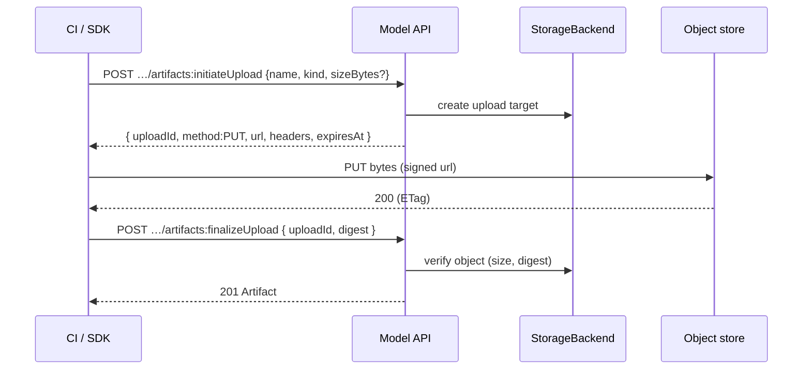

# 03 — Model API

> Status: **Implemented**. The machine-facing Model API (`:8081`, `/v1`): publish/register,
> resource CRUD, lifecycle transitions, lineage, deployments, errors. **Consumption**
> (resolve + fetch) is `04`. Entities are `02`; storage/upload internals are `05`.

## 1. Conventions

- **Base:** `/v1` on the Model API port (`:8081`). `application/json` in/out.
- **OpenAPI is the contract** (§00.11.6). The binary serves the spec at
  `/v1/openapi.json`; SDK (Python first) and CLI are generated from it.
- **No auth** (§00 axiom 4). Requests arrive already authenticated. A mutating request
  should carry the infra-provided actor header (below), recorded on the audit event.
- **Actor header — an integration contract** with the front door (ingress, gateway, mesh):

  | Term | Contract |
  |---|---|
  | Name | `LINEAGE_ACTOR_HEADER` (Helm `actorHeader`), default `X-Lineage-Actor`. Both surfaces read the same one. Any other header, including the default name once overridden, is ignored |
  | Value | **Trusted** and recorded **verbatim** as `actor` on the audit event and on server-set attribution fields (`classifiedBy`, `validatedBy`, …). Never parsed or normalised |
  | Authorization | **None.** A request without it succeeds; Model API writes are then unattributed (`actor` absent), console writes read `console` |
  | Stability | Changing the name, or what the front door puts in the value, is a **breaking change** for every client and proxy, and for any report that reads `actor` |

  Lineage trusts the header, so the front door must strip it from untrusted traffic before
  setting it. Asserted in CI by `internal/contracttest` (M19).
- **Name-addressed.** Models and versions are addressed by their unique **names**
  (`02.5`), not opaque ids: `/v1/models/{model}/versions/{version}`. IDs are returned in
  every body and accepted in list filters. Names must match
  `^[a-z0-9]([a-z0-9._-]{0,61}[a-z0-9])?$` (lowercase slug, path-safe, exact-match).
- **Artifact names are filenames**, not slugs, so they match
  `^[A-Za-z0-9_.][A-Za-z0-9._-]{0,254}$` (`.` and `..` rejected) — mixed case and a leading
  dot are allowed, since real model repos ship `README.md` and `.gitattributes`. They are
  compared **case-insensitively** for uniqueness within a version: `README.md` and
  `readme.md` would collide on a case-insensitive filesystem once downloaded together.
- **Timestamps** are epoch-millis integers (`createdAt`, `updatedAt`) — matches `02`.
- **Idempotency:** `POST` creates accept an `Idempotency-Key` header; a retry with the
  same key returns the original result. Re-publishing an existing version name without a
  matching key ⇒ `409 already_exists`.
- **Actions** use the `:verb` suffix (e.g. `…:transition`); everything else is standard
  REST.

## 2. Resource Map

| Resource | Operations |
|---|---|
| **Model** | `GET /models` · `POST /models` · `GET/PATCH /models/{m}` · `POST /models/{m}:archive` · `DELETE /models/{m}` |
| **ModelVersion** | `GET /models/{m}/versions` · `POST /models/{m}/versions` · `GET/PATCH /models/{m}/versions/{v}` · `POST /models/{m}/versions/{v}:transition` · `DELETE …/{v}` |
| **Artifact** | `GET /models/{m}/versions/{v}/artifacts` · `POST …/artifacts` (register-by-reference) · `POST …/artifacts:initiateUpload` · `POST …/artifacts:finalizeUpload` · `GET/PATCH/DELETE …/artifacts/{a}` |
| **LineageEdge** | `POST /models/{m}/versions/{v}/lineage` · `GET …/lineage` · `DELETE …/lineage/{edgeId}` (queries → `07`) |
| **Deployment** | `POST/GET /models/{m}/versions/{v}/deployments` · `PATCH/DELETE …/deployments/{id}` |
| **Audit** (read-only) | `GET /models/{m}/audit` · `GET /audit?subjectType=&subjectId=` · both take `asOf` (§3) (feed → `09`) |

## 3. List Conventions (pagination · filter · sort)

Applies to every `GET` collection.

| Param | Meaning |
|---|---|
| `pageSize` | items per page, default `50`, max `500` |
| `pageToken` | opaque cursor from the previous response |
| `orderBy` | `createdAt`\|`updatedAt`\|`name` + ` asc`\|` desc` (default `createdAt desc`) |
| `q` | case-insensitive substring match on `name` |
| `state` / `stage` | exact-match filters (where applicable) |
| `label.<key>` | filter by label value, e.g. `label.tier=gold` (repeatable, AND) |
| `asOf` | audit feeds only: epoch-millis; only events with `at <= asOf`. Pins a report to a date — the same rows however much is written later. Not a positive integer ⇒ `400 invalid_argument` |

**Cursor pagination** (portable, stable across inserts). Response envelope:

```json
{ "items": [ /* … */ ], "nextPageToken": "eyJ…" }
```

`nextPageToken` absent ⇒ last page.

**Label + custom-property filtering.** `label.<k>=<v>` works on every engine (pushed into a
Postgres JSONB `@>` containment when available, `02.7`; filtered in Go otherwise). `cp.<k>=<v>`
filters `custom_properties` and is **Postgres-only** — on SQLite/memory it returns
`400 invalid_argument`. A richer `filter` expression grammar is still deferred.

## 4. Models

**Model object**

```json
{
  "id": "01JABCDEF…",
  "name": "fraud-detector",
  "description": "XGBoost fraud scorer",
  "owner": "risk-team",
  "state": "ACTIVE",
  "labels": { "domain": "risk", "tier": "gold" },
  "customProperties": { "costCenter": "R-42" },
  "createdAt": 1730000000000,
  "updatedAt": 1730000000000
}
```

- `POST /v1/models` — create. Body: `name` (required), `description?`, `owner?`,
  `labels?`, `customProperties?`. → `201` + Model. `409 already_exists` if name taken.
- `GET /v1/models/{m}` — fetch by name. `PATCH` — partial update of mutable fields
  (`description`, `owner`, `labels`, `customProperties`).
- `POST /v1/models/{m}:archive` — set `state=ARCHIVED` (soft, reversible via `PATCH`).
- `DELETE /v1/models/{m}` — hard delete, cascades to versions/artifacts/deployments
  (`02.5`); audit rows are retained. Guarded: `409 failed_precondition` if any version
  is in `production` unless `?force=true`.

## 5. Versions (publish)

**Version object** carries `stage` (`02.4`) and a back-reference to its model.

```json
{
  "id": "01JAV…", "modelId": "01JAB…", "model": "fraud-detector",
  "name": "1.4.0", "description": "retrain on Q2 data", "author": "ci-bot",
  "stage": "draft",
  "labels": { "git.sha": "9f3c" }, "customProperties": {},
  "createdAt": 1730000000000, "updatedAt": 1730000000000
}
```

- `POST /v1/models/{m}/versions` — publish a new version. Body: `name` (required),
  `description?`, `author?`, `labels?`, `customProperties?`, and optional inline
  `artifacts[]` **registered by reference** (see §6) for the common
  "bytes already in storage" case. → `201` + Version (with any artifacts).
  `409 already_exists` on duplicate version name (unless `Idempotency-Key` matches).
- New versions start in `stage=draft`.
- `GET` / `PATCH` (mutable metadata only) / `DELETE` as usual.

**One-call publish** example (version + referenced artifact):

```json
POST /v1/models/fraud-detector/versions
{
  "name": "1.4.0",
  "author": "ci-bot",
  "artifacts": [{
    "kind": "MODEL",
    "name": "model.onnx",
    "uri": "s3://models/fraud/1.4.0/model.onnx",
    "storageBackend": "default-s3",
    "digest": "sha256:1a2b…",
    "sizeBytes": 12582912,
    "modelFormat": { "name": "onnx", "version": "1.16" },
    "serviceAccount": "kserve-sa"
  }]
}
```

## 6. Artifacts

`kind` is `MODEL` or `DOC` (`02.3`). Two ways to create one:

**(a) Register by reference** — bytes already live in a backend (CI uploaded them):
`POST …/artifacts` with `uri` (+ optional `digest`, `sizeBytes`; the backend may `stat`
to fill them). This is the default, fastest path.

**(b) Upload via signed URL** — let Lineage hand out a storage target; bytes go
**directly to the backend**, never through the API (details in `05`):



- `PATCH …/artifacts/{a}` — **metadata only**. Content fields (`uri`, `digest`,
  `sizeBytes`) are immutable once set (`02.5`): new content ⇒ new version.
  Attempting to change them ⇒ `409 failed_precondition`.
- `DELETE …/artifacts/{a}` — removes the metadata row; whether backend bytes are
  garbage-collected is a storage-policy concern (`05`).

## 7. Lifecycle Transition

Single canonical action for every stage move (`02.4` state machine):

```
POST /v1/models/{m}/versions/{v}:transition
{ "to": "production", "reason": "passed eval gate" }
```

- Validates the transition against the state machine → illegal move ⇒
  `409 failed_precondition` with the allowed targets in `details`.
- Promoting into a **singleton** stage (default `production`) auto-demotes the incumbent
  to `archived` in the same transaction (`02.4`); the response notes the demoted version.
- Emits `version.stage_changed`, appends an audit event, and invalidates the resolve
  cache (§01.4.3). "Promote" is just the common forward case of this one endpoint.

## 8. Lineage & Deployments (brief)

- **Lineage** — `POST …/versions/{v}/lineage` with
  `{ "relation": "derived_from", "to": { "version": "…" } }` or
  `{ "relation": "trained_on", "to": { "uri": "s3://datasets/…" } }`. Relations and
  graph queries are defined in `07`.
- **Deployments** — descriptive serving records (`02.3.4`):
  `POST …/versions/{v}/deployments { environment, endpointUri?, status, externalRef? }`.
  Lineage does not orchestrate serving; these are informational.

## 9. Errors

`application/problem+json` (RFC 9457). Body:

```json
{ "type": "https://lineage.dev/errors/already_exists",
  "title": "Already exists", "status": 409,
  "code": "already_exists", "detail": "model 'fraud-detector' already exists",
  "instance": "/v1/models", "details": { } }
```

| `code` | HTTP | When |
|---|---|---|
| `invalid_argument` | 400 | bad name pattern, missing required field, bad enum |
| `not_found` | 404 | unknown model/version/artifact |
| `already_exists` | 409 | duplicate name without matching idempotency key |
| `failed_precondition` | 409 | illegal stage transition; mutate immutable artifact; delete blocked |
| `payload_too_large` | 413 | inline body over limit (use signed upload) |
| `unprocessable` | 422 | well-formed but semantically invalid (e.g. digest mismatch on finalize) |
| `rate_limited` | 429 | infra/back-pressure signal |
| `internal` | 500 | unexpected |

`details` carries machine-readable context (e.g. `allowedTargets` for a bad transition,
`conflictingVersion` for a singleton demotion conflict).

## 10. Read Completeness

Every recorded fact is readable through `/v1` alone; no report needs the ops port, the
console BFF, or the database. `internal/contracttest` enforces this in CI (M19): a client
importing only the standard library assembles a reference report — version record,
`asOf`-bounded install audit, evaluations, lineage, audit history, EU classification and
modification review, MRM tier and validations, change-plan conformance, retention and hold —
on SQLite and Postgres, and two collections must be byte-identical. A heading `/v1` cannot
fill is a `/v1` gap to close, not a test to relax.

## 11. See Also

| For | Doc |
|---|---|
| Resolve by stage/tag, fetch, `lineage://`, caching | `04` |
| Storage drivers, signed upload/URL internals, integrity, GC | `05` |
| Human console over the same core | `06` |
| Lineage relations + graph queries | `07` |
| Audit feed, metrics, SLOs | `09` |
