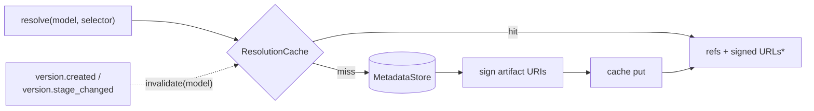

# 04 — Model API: Consumption (Delivery)

> Status: **Draft**. The consumption half of the Model API (`:8081`, `/v1`): resolve a
> model by stage/tag → get native + signed artifact refs, fetch bytes, and the
> `lineage://` KServe initializer. Read-heavy, cacheable. Publish/CRUD is `03`; storage
> internals are `05`.

## 1. Purpose

Let any serving system answer *"give me the right version of model X"* in **one call**,
then pull bytes **directly from storage** — with near-zero glue (§00 axiom 8, §00.5.1).

## 2. Resolution

```
GET /v1/models/{model}/resolve[?<selector>]
```

**Selectors** (mutually exclusive; default = the configured serving stage, `production`):

| Selector | Meaning |
|---|---|
| _(none)_ | the version in the default serving stage (`production`) |
| `stage=staging` | version in that stage (singleton → the one; else newest by `createdAt`) |
| `version=1.4.0` | exact version name |
| `label.<key>=<v>` | newest version carrying that label |

**Response** — everything a consumer needs, no registry-internal knowledge required:

```json
{
  "model": "fraud-detector",
  "versionId": "01JAV…", "version": "1.4.0", "stage": "production",
  "digest": "sha256:1a2b…",
  "modelFormat": { "name": "onnx", "version": "1.16" },
  "artifacts": [{
    "name": "model.onnx", "kind": "MODEL",
    "storageUri": "s3://models/fraud/1.4.0/model.onnx",
    "signedUrl": "https://…X-Amz-Signature=…",
    "signedUrlExpiresAt": 1730003600000,
    "sizeBytes": 12582912, "digest": "sha256:1a2b…",
    "mediaType": "application/octet-stream",
    "serviceAccount": "kserve-sa"
  }],
  "resolvedAt": 1730000000000
}
```

- `storageUri` — native scheme for in-cluster pullers (KServe). `signedUrl` — time-
  limited HTTPS for SDK/URL pullers (Modal, Baseten). Consumers pick whichever fits.
- `404 not_found` if the model or a matching version doesn't exist;
  `409 failed_precondition` if the selector matches no version in a resolvable state.
- **HTTP caching:** `ETag` = resolution digest, `Cache-Control: max-age=…`. Repeat
  callers may send `If-None-Match` → `304`.

## 3. Fetch

Most consumers never call this — they use `storageUri`/`signedUrl` from resolve. It
exists for pullers that want the registry to broker the byte transfer:

```
GET /v1/models/{model}/versions/{version}/artifacts/{artifact}/content
```

- Default → `302` redirect to a fresh signed URL (registry never touches bytes).
- `?mode=stream` → `200` with the bytes, streamed through, **only** where the backend
  can't sign (e.g. `file://`) — the fallback of §00.11.4. Supports `Range` and
  `If-None-Match` (`ETag` = digest → `304`).

## 4. Caching & Consistency

Resolution is highly cacheable — a `(model, selector)` result changes only on a publish
or stage transition.



- **Backend:** in-memory (dev) or Redis (prod) — the `ResolutionCache` port (§01).
- **Invalidation is event-driven:** `version.created` and `version.stage_changed`
  (§03.7) invalidate all resolve entries for that model → near-immediate correctness,
  not TTL-bound staleness. A short TTL backstops missed events.
- `*` **signed URLs are minted per response**, never cached (they expire); only the
  version/artifact *selection* is cached.
- **Data path** (§00.11.8, open): source-of-truth DB + cache in v1; Postgres read
  replicas later for the resolve hot path.

## 5. `lineage://` — Reference Models by Stage

The killer integration (§00.5.1). A stable URI that resolves at pull time, so promotions
take effect with **no manifest change**.

**Grammar:**
```
lineage://<model>[/<stage>][@<version>][#<artifact>]
# lineage://fraud-detector                 → default stage (production), MODEL artifact
# lineage://fraud-detector/staging          → staging
# lineage://fraud-detector@1.4.0            → exact version
# lineage://fraud-detector/production#model.onnx  → a named artifact
```

**KServe** — ship an optional **`ClusterStorageContainer`** whose init container
understands `lineage://`. It calls `resolve`, picks the `MODEL` artifact, and pulls it
into the model dir via `storageUri` (or `signedUrl`):

```yaml
apiVersion: serving.kserve.io/v1beta1
kind: InferenceService
spec:
  predictor:
    model:
      storageUri: lineage://fraud-detector/production   # promote in Lineage, no redeploy
      modelFormat: { name: onnx }
```

## 6. Consumer Integration Matrix

| System | Pattern | How |
|---|---|---|
| **KServe** (native) | in-cluster pull by URI | resolve → put `storageUri` in `InferenceService` |
| **KServe** (`lineage://`) | stage-referenced | `storageUri: lineage://model/stage` + our `ClusterStorageContainer` |
| **KServe modelcars / OCI** | OCI pull | resolve an `oci://` artifact (OCI driver, `05`) |
| **Modal** | SDK/URL download | `resolve()` → `signedUrl` → download into a Volume at build/startup |
| **Baseten (Truss)** | SDK/URL download | `resolve()` → `signedUrl` during build/deploy |
| **Anything** | HTTPS | `signedUrl`, or `…/content` broker fetch (§3) |

## 7. See Also

| For | Doc |
|---|---|
| Publish, lifecycle, resource CRUD | `03` |
| Storage drivers, signing, OCI, integrity | `05` |
| Lineage graph the `deployed_as` edge feeds | `07` |
| Cache/DB metrics, resolve SLOs | `09` |
| SDK `resolve()`/`download()`, CLI `pull` | `10` |
