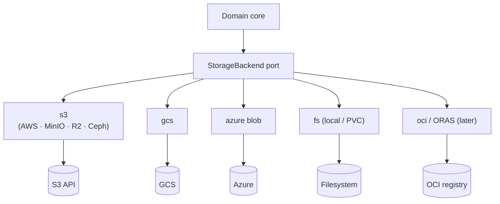
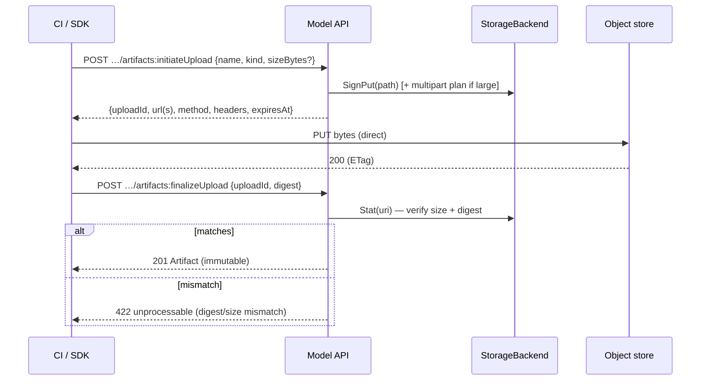
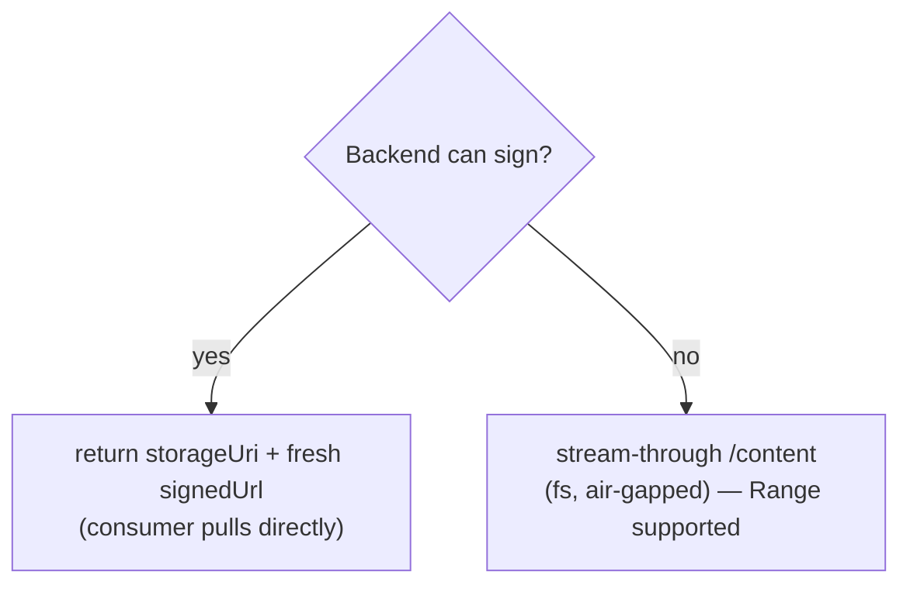

# 05 — Storage & Artifacts

> Status: **Draft**. The `StorageBackend` port, its drivers, artifact addressing,
> content integrity, signed upload/download, stream-through fallback, and garbage
> collection. Metadata is `02`; the APIs that call this are `03` (upload) and `04`
> (fetch).

## 1. Principle

Lineage is **metadata-authoritative, storage-agnostic** (§00 axiom 6). It owns the
`artifact` row and its pointer; **bytes live in a pluggable backend** and, on the read
path, **flow directly between the backend and the consumer** — the core never proxies
them unless a backend can't sign.

## 2. The `StorageBackend` Port

One interface, many drivers, wired at startup (§01). The core depends only on this.

| Method | Purpose |
|---|---|
| `Stat(uri) → {exists, sizeBytes, digest?}` | verify/fill metadata on register & finalize |
| `SignGet(uri, ttl) → signedUrl` | mint a time-limited download URL (if capable) |
| `SignPut(path, ttl) → {url, method, headers}` | mint a direct-upload target (if capable) |
| `Get(uri) → stream` | stream-through read (fallback) |
| `Put(path, reader) → uri` | server-side write (optional; small/DOC artifacts) |
| `Delete(uri)` | remove object (GC) |
| `Capabilities() → {signing, ranges, multipart, oci}` | feature probe |

The API adapts to `Capabilities()`: no `signing` ⇒ resolve/fetch fall back to
stream-through (§04.3); no `multipart` ⇒ single-PUT uploads only.

## 3. Drivers



| Driver | URI scheme | Signing | Notes |
|---|---|---|---|
| `s3` | `s3://` | ✅ | any S3-compatible (MinIO, Cloudflare R2, Ceph) via endpoint override |
| `gcs` | `gs://` | ✅ | signed URLs via SA / workload identity |
| `azure` | `az://` | ✅ | SAS tokens |
| `fs` | `file://` | ❌ | local/PVC; uses stream-through (dev, air-gapped) |
| `oci` | `oci://…@sha256:` | n/a (pull) | **later** (§00.11.4): ORAS; enables KServe modelcars |

## 4. Configuration

Backends are **config, not rows** (v1). Each has a `name` referenced by
`artifact.storageBackend` (`02.3.3`):

```yaml
storage:
  backends:
    - name: default-s3
      type: s3
      bucket: models
      endpoint: https://s3.amazonaws.com     # or MinIO/R2 endpoint
      region: us-east-1
      credentials: { source: irsa }          # env | secret | irsa | workloadIdentity
  default: default-s3
```

- **Credentials never live in Lineage responses.** Least-privilege backend creds are
  resolved from the environment (IRSA / workload identity / mounted Secret).
- The in-cluster `serviceAccount` hint on a `MODEL` artifact (`02.3.3`) is *for the
  serving system's* pull, not for Lineage.

## 5. Addressing & Integrity

- **Native URIs** are canonical (`artifact.uri`), so consumers pull with their existing
  tooling. Optional path convention when Lineage writes:
  `<root>/<model>/<version>/<artifactName>` (`storagePath`).
- **Digests are first-class.** `digest = sha256:…` is the identity and the `ETag`
  (§04). Computed at upload finalize, or via `Stat` at register-by-reference.
- **Immutable once set** (`02.5`): a digest'd artifact's bytes/pointer never change; new
  content ⇒ new version. This makes artifacts safely cacheable and reproducible.

## 6. Upload (finalize verifies)

Expands §03.6. Bytes bypass the core entirely when the backend can sign.



- **Large files:** if `Capabilities().multipart`, `initiateUpload` returns a multipart
  plan (part URLs); `finalizeUpload` completes it. Otherwise a single signed PUT.
- **Small / DOC artifacts** may use server-side `Put` (streamed through the API) for
  convenience.

## 7. Delivery Decision



Signed-URL is always preferred (offloads bytes, scales the resolve path). Stream-through
is a correctness fallback, not the default.

## 8. Garbage Collection

- **Default = retain.** `DELETE` on an artifact removes the **metadata row**, not the
  bytes — safe, and bytes may be shared/referenced.
- **Optional GC** (`storage.gc: retain | sweep`): a periodic job deletes backend objects
  with **no** referencing artifact row (reference-counted by `uri`), honoring a grace
  period. Never deletes objects Lineage didn't write (path-scoped to configured roots).

## 9. See Also

| For | Doc |
|---|---|
| Artifact schema, immutability, digests | `02` |
| Upload API surface | `03` |
| Resolve/fetch, signed-URL delivery, `lineage://` | `04` |
| Backend credential mounting, PVC for `fs` | `08` |
| Storage metrics (signing, upload latency, errors) | `09` |
