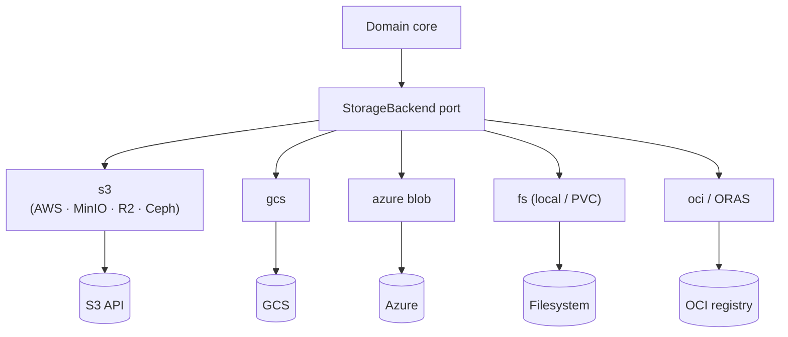
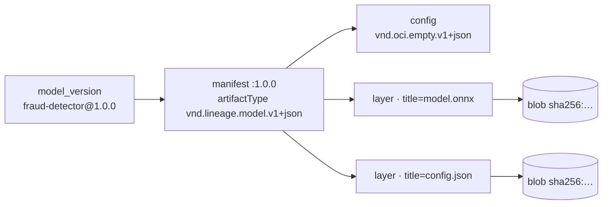
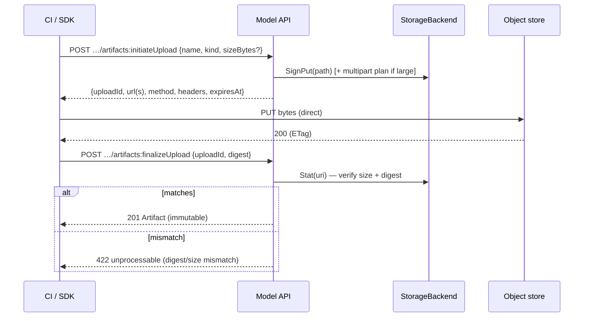
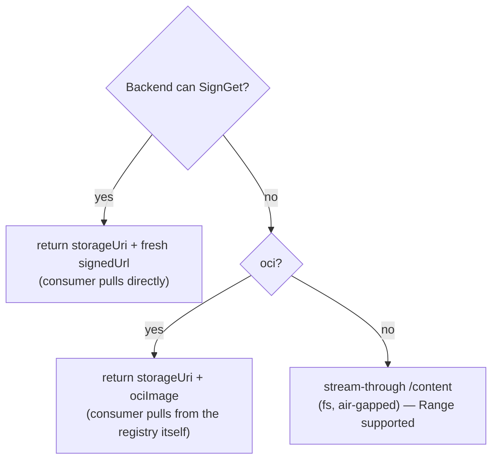

# 05 — Storage & Artifacts

> Status: **Implemented**. The `StorageBackend` port, its drivers, artifact addressing,
> content integrity, signed upload/download, stream-through fallback, and garbage
> collection. Metadata is `02`; the APIs that call this are `03` (upload) and `04`
> (fetch).

## 1. Principle

Lineage is **metadata-authoritative, storage-agnostic** (§00 axiom 6). It owns the
`artifact` row and its pointer; **bytes live in a pluggable backend** and, on the read
path, **flow directly between the backend and the consumer** — the core never proxies
them unless a backend can't sign.

## 2. The `StorageBackend` Port

One interface, many drivers, wired at startup (§01). The core depends only on this.

| Method | Purpose |
|---|---|
| `Stat(uri) → {exists, sizeBytes, digest?}` | verify/fill metadata on register & finalize |
| `SignGet(uri, ttl) → signedUrl` | mint a time-limited download URL (if capable) |
| `SignPut(path, ttl) → {url, method, headers}` | mint a direct-upload target (if capable) |
| `Get(uri) → stream` | stream-through read (fallback) |
| `Put(path, reader) → uri` | server-side write (optional; small/DOC artifacts) |
| `Delete(uri)` | remove object (GC) |
| `ListObjects(prefix)` | enumerate for GC; `ErrStorageUnsupported` ⇒ backend opts out (§8) |
| `Capabilities() → {signing, signPut, ranges, multipart, oci}` | feature probe |

The API adapts to `Capabilities()`:

| Missing capability | Consequence |
|---|---|
| `signing` | resolve/fetch fall back to stream-through (§04.3) |
| `signPut` | uploads stream through the API instead of going direct (§6) |
| `multipart` | single-PUT uploads only |

**`signing` and `signPut` are separate on purpose.** They are not one capability: an OCI
registry redirects blob reads to a presigned URL but has no presignable *write* target, so
it offloads the read path while uploads still stream through.

## 3. Drivers



| Driver | URI scheme | SignGet | SignPut | Notes |
|---|---|---|---|---|
| `s3` | `s3://` | ✅ | ✅ | any S3-compatible (MinIO, Cloudflare R2, Ceph) via endpoint override |
| `gcs` | `gs://` | ✅ | ✅ | signed URLs via SA / workload identity |
| `azure` | `az://` | ✅ | ✅ | SAS tokens |
| `fs` | `file://` | ❌ | ❌ | local/PVC; uses stream-through (dev, air-gapped) |
| `oci` | `oci://…:tag#file` | ⚠️ | ❌ | ORAS over the distribution API; §3.1 |

⚠️ = the registry decides: object-store-backed registries redirect blob reads to a presigned
URL, which Lineage passes through; registries that serve bytes inline fall back to
stream-through.

### 3.1 The `oci` driver

Stores **one manifest per model version, one layer per artifact**, so
`oci://<registry>/<repo>:<version>` is a single reference to the whole model directory.



**Addressing.** `oci://<registry>[:port]/<repository>[:<tag>][@sha256:…][#<layer title>]`.
The `#fragment` names one layer by its `org.opencontainers.image.title` annotation — the ORAS
convention, and the same shape as `lineage://…#artifact` (§04.5). An `artifact.uri` always
carries the fragment (it points at a file); `Image()` drops it to get the pullable reference.

| Property | Consequence |
|---|---|
| Layers hold artifact bytes **verbatim** — no tar, no gzip | a layer's digest **is** the artifact's content digest (§5), so `Stat` is one manifest read and integrity needs no unpacking |
| `oci://…:<version>` collects every artifact of a version | one `oras pull` yields the complete model dir; surfaced as `ociImage` on resolve (§04.2) |
| Auth: Docker registry v2 token flow | tokens cached per scope; a `pull,push` token satisfies later pulls |
| Manifest updates are read-modify-write | serialized per `(repo, tag)` **in-process**; see the replica caveat below |

**What this is not.** Lineage pushes an OCI *artifact*, not a runnable container image — its
layers are raw bytes, not a filesystem. KServe **modelcars** mounts a real image and needs
tar layers, so build that image in your pipeline and **register it by reference**
(`POST …/artifacts` with the `oci://` uri); Lineage `Stat`s the manifest, records digest and
size, and resolution hands the consumer back the same reference. Register-by-reference is the
primary OCI path; push is for producers that want Lineage to do the packaging.

**Replica caveat.** The per-`(repo,tag)` manifest lock is process-local. Two Lineage replicas
concurrently finalizing *different* artifacts of the *same* version can lose one layer to a
manifest read-modify-write race. Publishing one version from one CI job — the normal case —
is unaffected. A registry-side conditional PUT would fix this properly; the distribution spec
has no portable one.

## 4. Configuration

The backend is **config, not rows** (v1: one active backend, env-driven). Selected by
`LINEAGE_STORAGE_DRIVER` (`fs` | `s3` | `oci`); its `name` (`default`) is referenced by
`artifact.storageBackend` (`02.3.3`).

```bash
LINEAGE_STORAGE_DRIVER=s3
LINEAGE_S3_BUCKET=models
LINEAGE_S3_REGION=us-east-1
LINEAGE_S3_ENDPOINT=https://s3.amazonaws.com   # override for MinIO / R2 / Ceph
LINEAGE_S3_PATH_STYLE=true                     # required for MinIO / Ceph
# credentials: omit the two below to use the auto chain (recommended in-cluster)
LINEAGE_S3_ACCESS_KEY=…  LINEAGE_S3_SECRET_KEY=…   # pins static keys
```

### 4.1 Credential resolution

**Credentials never live in Lineage responses.** They are resolved from the environment
with least privilege. Setting the two static keys pins them; otherwise a provider **chain**
is tried, first non-empty wins, and **temporary credentials are cached and refreshed 5 min
before expiry** so signing never races an expiring token:

| Order | Source | Trigger |
|---|---|---|
| 1 | static keys | `LINEAGE_S3_ACCESS_KEY` + `_SECRET_KEY` set |
| 2 | env | `AWS_ACCESS_KEY_ID` / `AWS_SECRET_ACCESS_KEY` [/ `AWS_SESSION_TOKEN`] |
| 3 | **IRSA / EKS Pod Identity** | `AWS_ROLE_ARN` + `AWS_WEB_IDENTITY_TOKEN_FILE` → STS `AssumeRoleWithWebIdentity` |
| 4 | ECS task role | `AWS_CONTAINER_CREDENTIALS_{RELATIVE,FULL}_URI` |
| 5 | EC2 instance role | IMDSv2 |

The in-cluster `serviceAccount` hint on a `MODEL` artifact (`02.3.3`) is *for the serving
system's* pull, not for Lineage.

### 4.2 OCI registry

```bash
LINEAGE_STORAGE_DRIVER=oci
LINEAGE_OCI_REGISTRY=ghcr.io            # host[:port] only, no path
LINEAGE_OCI_REPOSITORY=acme/models      # prefix Lineage owns; repo = <prefix>/<model>
LINEAGE_OCI_USERNAME=…  LINEAGE_OCI_PASSWORD=…   # omit for an anonymous (public) pull
LINEAGE_OCI_PLAIN_HTTP=true             # in-cluster/dev registries only
```

Credentials are a robot account or registry token, and are used **only** by Lineage. A
consumer pulling `oci://…` authenticates to the registry itself, exactly as it would for any
other image — which is why an `oci` artifact needs no signed URL to be usable.

## 5. Addressing & Integrity

- **Native URIs** are canonical (`artifact.uri`), so consumers pull with their existing
  tooling. Optional path convention when Lineage writes:
  `<root>/<model>/<version>/<artifactName>` (`storagePath`).
- **Digests are first-class.** `digest = sha256:…` is the identity and the `ETag`
  (§04). Computed at upload finalize, or via `Stat` at register-by-reference.
- **Immutable once set** (`02.5`): a digest'd artifact's bytes/pointer never change; new
  content ⇒ new version. This makes artifacts safely cacheable and reproducible.

## 6. Upload (finalize verifies)

Expands §03.6. Bytes bypass the core entirely when the backend can sign.



- **Large files:** if `Capabilities().multipart`, `initiateUpload` returns a multipart
  plan (part URLs); `finalizeUpload` completes it. Otherwise a single signed PUT.
- **Small / DOC artifacts** may use server-side `Put` (streamed through the API) for
  convenience.
- **Backends without `signPut`** (`fs`, `oci`) always stream through: `initiateUpload`
  returns a `contentUrl` on the Model API instead of a signed target.
- **Rejected bytes are taken back.** When finalize fails verification, bytes that streamed
  *through us* are deleted. A client's direct signed PUT is left alone — it landed in the
  operator's bucket, and GC reference-counts it. On `oci` this is load-bearing rather than
  tidy: a rejected layer would otherwise sit inside the version's manifest, visible to anyone
  pulling the image, with no artifact row and no sweeper that could reap it (§8).

## 7. Delivery Decision



Signed-URL is always preferred (offloads bytes, scales the resolve path). Stream-through
is a correctness fallback, not the default.

## 8. Garbage Collection

- **Default = retain.** `DELETE` on an artifact removes the **metadata row**, not the
  bytes — safe, and bytes may be shared/referenced.
- **Optional GC** (`LINEAGE_STORAGE_GC=retain|sweep`): a periodic sweeper (`ListObjects` +
  `ArtifactRefsURI`) deletes backend objects with **no** referencing artifact row
  (reference-counted by `uri`), honoring `LINEAGE_GC_GRACE`. Path-scoped to
  `LINEAGE_GC_PREFIX` so Lineage never deletes objects it didn't write.
- **`oci` opts out.** `ListObjects` returns `ErrStorageUnsupported` and the sweeper skips the
  backend — a no-op, not an error. Blob lifetime in a registry follows *manifest
  reachability*, and Lineage cannot see the other manifests that may share a blob; a sweeper
  that guessed would delete bytes another image still needs. Registry retention (Harbor, ECR
  lifecycle, zot) owns this. `DELETE` on an artifact still drops its layer from the manifest.

## 9. See Also

| For | Doc |
|---|---|
| Artifact schema, immutability, digests | `02` |
| Upload API surface | `03` |
| Resolve/fetch, signed-URL delivery, `lineage://` | `04` |
| Backend credential mounting, PVC for `fs` | `08` |
| Storage metrics (signing, upload latency, errors) | `09` |
