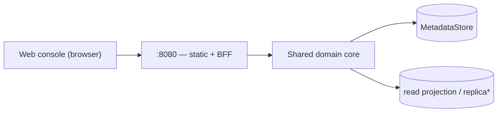

# 06 — Admin UI API

> Status: **Draft**. The human web console's backend-for-frontend on `:8080`. Shaped for
> the UI (aggregations, search, dashboards, lineage/audit views); **not** the public
> contract — that's the Model API (`03`/`04`). Mutations reuse the same domain core.

## 1. Role & Boundaries

- **Admin = UI / human interaction only** (§00 axiom 3). This surface serves the web
  console (static assets + BFF endpoints) on `:8080`. Publishing and machine ops live on
  the Model API (`:8081`).
- **One binary, in-process core.** The BFF calls the **same domain services** as the
  Model API directly (no internal HTTP hop, shared transactions) — so there is one
  source of business logic, one audit path. It only *shapes* data for the UI.
- **BFF, not a contract.** These endpoints are UI-versioned and may change with the
  console; external integrations must use `/v1` (`03`/`04`), never this.
- **Auth** is infra's job (§00 axiom 4) — lock this surface to SSO/VPN. The
  authenticated user arrives via `X-Lineage-Actor`, recorded on any action's audit event.

`*` reads may target a Postgres read replica when configured (§00.11.8); dev reads hit
the primary.

## 2. Views the Console Needs

| View | Data |
|---|---|
| **Overview / dashboard** | counts (models, versions, artifacts), stage distribution, recent activity |
| **Models list** | paged models + per-model aggregates: version count, current `production`, last updated |
| **Model detail** | version timeline, stage badges, owner/labels |
| **Version detail** | artifacts (+ sizes/digests/format), lineage graph (`07`), audit timeline, deployments |
| **Search** | cross-entity by name/label; Postgres-only semantic search (pgvector, `02.7`) |
| **Activity / audit** | filterable audit feed (`09`) |

## 3. Read Endpoints (illustrative, UI-shaped)

Served under `:8080` (e.g. `/api/…`). Aggregation-first — one call fills a screen.

| Endpoint | Returns |
|---|---|
| `GET /api/overview` | dashboard aggregates + recent activity |
| `GET /api/models?q=&label.<k>=&stage=&page…` | models with rollup fields |
| `GET /api/models/{m}` | model + versions summary + `production` pointer |
| `GET /api/models/{m}/versions/{v}` | full detail: artifacts, lineage subgraph, audit, deployments |
| `GET /api/search?q=` | cross-entity results (name/label; semantic when Postgres) |
| `GET /api/activity?subject=&actor=&page…` | audit feed |

Pagination/filter/sort follow the Model API conventions (`03.3`).

## 4. Actions

The console triggers the **same core operations** as the Model API — create/edit model,
edit version metadata, `:transition` stage, `:archive`, manage lineage edges,
deployments. Semantics, validation, state machine, immutability, and audit are identical
to `03` (they *are* `03`'s services). The BFF adds no new business rules — it exists so
the UI isn't coupled to the raw `/v1` shape.

Because Admin is human-facing, this is where a human approver performs a promotion —
but the *permission* to do so is enforced by infra, not Lineage (§00 axiom 4).

## 5. See Also

| For | Doc |
|---|---|
| The `/v1` contract these actions map to | `03` |
| Lineage graph rendered in version detail | `07` |
| Audit feed, activity metrics | `09` |
| Serving the console + `:8080` ingress | `08` |
