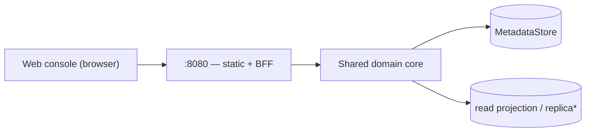

# 06 — Admin UI API

> Status: **Implemented**. The human web console's backend-for-frontend on `:8080`. Shaped for
> the UI (aggregations, search, dashboards, lineage/audit views); **not** the public
> contract — that's the Model API (`03`/`04`). Mutations reuse the same domain core.

## 1. Role & Boundaries

- **Admin = UI / human interaction only** (§00 axiom 3). This surface serves the web
  console (static assets + BFF endpoints) on `:8080`. Publishing and machine ops live on
  the Model API (`:8081`).
- **One binary, in-process core.** The BFF calls the **same domain services** as the
  Model API directly (no internal HTTP hop, shared transactions) — so there is one
  source of business logic, one audit path. It only *shapes* data for the UI.
- **BFF, not a contract.** These endpoints are UI-versioned and may change with the
  console; external integrations must use `/v1` (`03`/`04`), never this.
- **Auth** is infra's job (§00 axiom 4) — lock this surface to SSO/VPN. The
  authenticated user arrives in the configured actor header (§03.1, default
  `X-Lineage-Actor`), recorded on any action's audit event; absent, the actor is `console`.

`*` reads may target a Postgres read replica when configured (§00.11.8); dev reads hit
the primary.

## 2. Views the Console Needs

| View | Data |
|---|---|
| **Overview / dashboard** | counts (models, versions, artifacts), stage distribution, recent activity |
| **Models list** | paged models + per-model aggregates: version count, current `production`, last updated |
| **Model detail** | version timeline, stage badges, owner/labels |
| **Version detail** | artifacts (+ sizes/digests/format), lineage graph (`07`), audit timeline, deployments |
| **Search** | cross-entity by name/label; Postgres-only semantic search (pgvector, `02.7`) |
| **Activity / audit** | filterable audit feed (`09`) |

## 3. Read Endpoints (illustrative, UI-shaped)

Served under `:8080` (e.g. `/api/…`). Aggregation-first — one call fills a screen.

| Endpoint | Returns |
|---|---|
| `GET /api/overview` | dashboard aggregates + recent activity |
| `GET /api/models?q=&label.<k>=&stage=&page…` | models with rollup fields |
| `GET /api/models/{m}` | model + versions summary + `production` pointer |
| `GET /api/models/{m}/versions/{v}` | full detail: artifacts, lineage subgraph, audit, deployments |
| `GET /api/search?q=` | cross-entity results (name/label; semantic when Postgres) |
| `GET /api/activity?subject=&actor=&page…` | audit feed |

Pagination/filter/sort follow the Model API conventions (`03.3`).

## 4. Actions

The console triggers the **same core operations** as the Model API — create/edit model,
edit version metadata, `:transition` stage, `:archive`, manage lineage edges,
deployments. Semantics, validation, state machine, immutability, and audit are identical
to `03` (they *are* `03`'s services). The BFF adds no new business rules — it exists so
the UI isn't coupled to the raw `/v1` shape.

Because Admin is human-facing, this is where a human approver performs a promotion —
but the *permission* to do so is enforced by infra, not Lineage (§00 axiom 4).

## 5. Console Implementation

- **Stack:** Vite + React + TypeScript, Tailwind v4, shadcn-style components
  (`cn`/`cva`/`tailwind-merge`, hand-authored `components/ui/*`). Source in
  `internal/api/adminui/web/`.
- **Design system:** cool slate background, white surfaces, one brand blue (the fingerprint's
  topology hue), and three status colours — green ok, amber needs attention, red problem —
  each always paired with an icon or a word. IBM Plex Sans for UI, Plex Mono for ids and
  digests only; fonts are bundled so air-gapped installs render the same. Sentence case, no
  all-caps labels. Auto light/dark via `prefers-color-scheme`.
- **Plain language:** every API code (actions, enums, verdicts, stale reasons) is shown through
  one label table (`web/src/lib/labels.ts`); raw codes never reach the screen.
- **Using a model:** model and version pages open on a **Use** tab with
  copyable snippets — `curl` against `resolve`/`content`, the Python SDK, the CLI, and a KServe
  `InferenceService` with a `lineage://` URI — filled in with the model, a stage (model page) or
  the exact version, and this registry's Model API address. The sidebar always shows that
  address with links to the API reference (`/v1/openapi.json`) and the documentation. The
  address comes from `GET /api/config` (`LINEAGE_PUBLIC_MODEL_API_URL`, Helm
  `publicModelApiUrl`); unset, the console assumes its own host on the Model API port and says
  so. `LINEAGE_DOCS_URL` points the documentation link.
- **Governance explained:** every governance label (risk class, tier, validation, verdict, plan
  check, hold) opens a card on hover or click — what it means, why it matters, an example, what
  to do, and its source — from one table (`web/src/lib/explain.ts`). Each Governance tab opens
  with a collapsible "How this works": a summary, three steps, and the meaning of every label on
  the tab. Forms explain each choice. All marked as guidance, not legal advice.
- **Embedding:** `make web` (pnpm build) emits `web/dist`, embedded under the `console` build
  tag and served by the BFF — one binary, no runtime Node. `dist` is not committed; a plain
  `go build` compiles a stub console.
- **Serving:** static assets by path; any other path returns `index.html` so client-side
  routes resolve. BFF routes (`/api/*`) are matched first.
- **Pages:**

| Page | Answers |
|---|---|
| Home | What needs attention across every governance area, what is in production, what just happened |
| Models | Every model with its production version, EU risk class and model-risk tier; views for needs attention / in production / archived |
| Model | Summary, then tabs: versions by stage, governance, details |
| Version | Summary (artifacts, deployments, change from previous, governance), then tabs: overview, structure & evaluations, lineage, governance, history |
| Compare | What kind of change one version is from another, from the fingerprints |
| Governance | Tabs: to do, EU AI Act, modification reviews, model risk, change control, audit integrity |
| Activity | Every audit event, grouped by day, filterable by area |

Tabs are kept in the URL (`?tab=`), so any view can be linked.

## 6. See Also

| For | Doc |
|---|---|
| The `/v1` contract these actions map to | `03` |
| Lineage graph rendered in version detail | `07` |
| Audit feed, activity metrics | `09` |
| Serving the console + `:8080` ingress | `08` |
