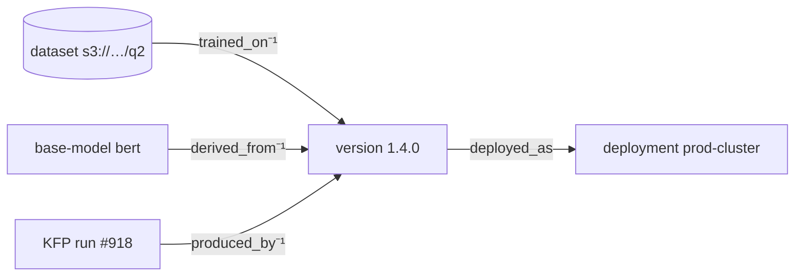

# 07 — Lineage & Provenance

> Status: **Draft**. The graph that gives the project its name: typed provenance edges,
> their semantics, and the traversal queries (ancestry, impact analysis). Edge storage is
> `02.3.6`; the edge API is `03.8`.

## 1. Why This Is the Differentiator

Kubeflow's lineage is thin; HF encodes only an informal `base_model` tag (§ "does HF do
MLMD"). Lineage makes provenance a **first-class typed graph** — answering both *"what
produced this model?"* and *"if this dataset is bad, what's affected?"*

## 2. Graph Model

Nodes are **internal** entities (`model_version`, `deployment`) or **external refs**
(a dataset/run URI). Edges are directed and typed (`lineage_edge`, `02.3.6`); the source
is normally a `model_version`.

| Relation | src → dst | Meaning |
|---|---|---|
| `derived_from` | version → version / base-model ref | fine-tune, distill, continue-train (HF `base_model`) |
| `trained_on` | version → dataset (uri or internal) | training data provenance |
| `produced_by` | version → run/pipeline ref | the job that built it (MLflow run, KFP, git SHA) |
| `deployed_as` | version → `deployment` | where it is/was served (feeds §04 consumers) |

External targets use `dst_ref` (a URI); internal targets use `dst_type`+`dst_id`
(`02.3.6` CHECK: exactly one). Relations are extensible.



## 3. Queries

```
GET /v1/models/{m}/versions/{v}/lineage?direction=upstream|downstream&depth=N&relations=…
→ { "nodes": [ {type, id|ref, label, …} ], "edges": [ {src, relation, dst} ] }
```

| Query | Direction | Answers |
|---|---|---|
| **Ancestry / provenance** | upstream | "what produced this version?" — walk `derived_from`,`trained_on`,`produced_by` |
| **Impact analysis** | downstream | "what derives from / was deployed off this?" — reverse walk from a version **or a dataset ref** |
| **Deployments** | downstream, `deployed_as` | where a version runs |
| **Neighborhood** | both, `depth=N` | subgraph for the console (`06`) |

- **Bounded + cycle-safe:** `depth` capped; traversal tracks visited nodes.
- **Implementation:** recursive traversal via `WITH RECURSIVE` — supported on **both**
  SQLite and Postgres, per-dialect behind the port (`02.7`); Postgres scales it further.
- Impact analysis can start from an **external** dataset ref, not just an internal node.

## 4. Recording Edges

- **Asserted at publish** by CI/SDK (best), or added later via `03.8`. Lineage is only as
  complete as what's recorded — the SDK (`10`) auto-captures `produced_by` (run/git) and
  `derived_from` (base model) where it can.
- Edges are **mutable** (corrections) but every add/remove is **audited** (`02.5`).
- `deployed_as` edges are typically created from `deployment` records (`03.8`), tying the
  registry to real serving state.

## 5. See Also

| For | Doc |
|---|---|
| `lineage_edge` schema + CHECK | `02` |
| Edge create/list/delete API | `03` |
| `deployed_as` ↔ consumers | `04` |
| Graph rendering in version detail | `06` |
| SDK lineage auto-capture | `10` |
