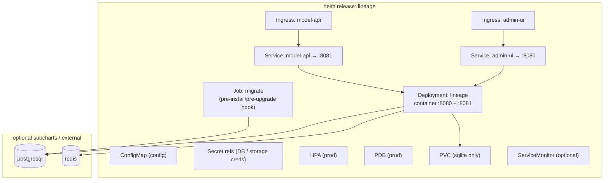
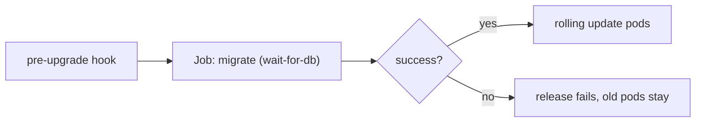

# 08 — Deployment & Helm

> Status: **Implemented**. The Helm chart as a product surface (§00 axiom 2): structure,
> values, `dev`/`prod` profiles, migrations, upgrade/rollback, secrets, HA. Topology is
> introduced in `01.6`.

## 1. Axioms Restated

- One `helm install` on a fresh cluster → a **working, secure** registry (§00.8).
- **Two surfaces on two ports** in one Deployment (`:8080` Admin UI, `:8081` Model API),
  each with its own Service + Ingress (§00 axiom 3).
- **No Istio dependency.** Dependencies (Postgres, Redis) are **optional** subcharts.
- `dev` = zero external deps (SQLite + PVC); `prod` = HA + Postgres.

## 2. Rendered Resources



## 3. Values Shape

```yaml
image: { repository: lineage, tag: "" }        # tag defaults to appVersion
replicaCount: 1

database:
  engine: sqlite                                # sqlite | postgres
  sqlite:   { pvc: { size: 5Gi, storageClass: "" } }
  postgres: { subchart: false, host: "", existingSecret: "" }

cache:
  engine: memory                                # memory | redis
  redis: { subchart: false, host: "" }

storage:
  backends: [ { name: default-s3, type: s3, bucket: models, credentials: { source: irsa } } ]
  default: default-s3
  gc: retain                                    # retain | sweep

ingress:
  adminUi:  { enabled: false, host: "", tls: {} }
  modelApi: { enabled: true,  host: "", tls: {} }

autoscaling: { enabled: false, min: 2, max: 10 }
podDisruptionBudget: { enabled: false }
observability:                                   # otlpEndpoint "" = tracing off (09.4)
  metrics: true
  serviceMonitor: { enabled: false }
  otlpEndpoint: ""                               # host:port or http(s):// collector
  traceSampleRatio: 1.0
  prometheusRule: { enabled: false }             # SLO alerts (09.5)
migrations: { auto: true }                       # run migrate hook
actorHeader: X-Lineage-Actor
```

## 4. Profiles

| | `values-dev.yaml` | `values-prod.yaml` |
|---|---|---|
| DB | `sqlite` + PVC | `postgres` (external or subchart) |
| Cache | `memory` | `redis` |
| Replicas | 1 (SQLite single-writer) | ≥2 + HPA + PDB |
| Ingress | model-api only, no TLS | both, TLS |
| Deps installed | none | postgresql/redis if `subchart: true` |

**SQLite ⇒ single replica** is enforced by the chart (a `replicaCount>1` with
`engine: sqlite` fails template validation) — single-writer (`02.7`).

## 5. Migrations

- The **migrate Job** runs the embedded, **per-dialect** migrator (`02.7`) as a Helm
  `pre-install` + `pre-upgrade` hook, gated on DB readiness. App pods start only after it
  succeeds.
- **Forward-only**, versioned, with tested downs. Use **expand/contract** so a rollback
  of the app image stays compatible with the migrated schema within a minor (zero-
  downtime upgrades).
- `dev` (SQLite) runs the same migrator against the PVC file at startup.



## 6. Secrets & Security

- DB and storage credentials come from **`existingSecret` refs / external-secrets**,
  never plaintext values. Storage creds resolve via IRSA / workload identity where
  possible (`05.4`).
- **NetworkPolicy:** restrict `:8080` (Admin UI) to SSO/VPN sources; expose `:8081`
  (Model API, resolve/fetch) to in-cluster serving. Auth itself is infra's job (§00
  axiom 4).
- Non-root container, read-only rootfs, dropped caps.

## 7. Upgrade / Rollback

1. `helm upgrade` → migrate hook runs → pods roll.
2. Migration fails → release aborts, **old pods keep serving**.
3. `helm rollback` → safe because migrations are expand/contract compatible within the
   supported window. Cross-minor rollback caveats documented in release notes.

## 8. Backup/DR pointers → `09`. See Also: topology `01`, storage creds `05`, metrics/SLOs `09`.
