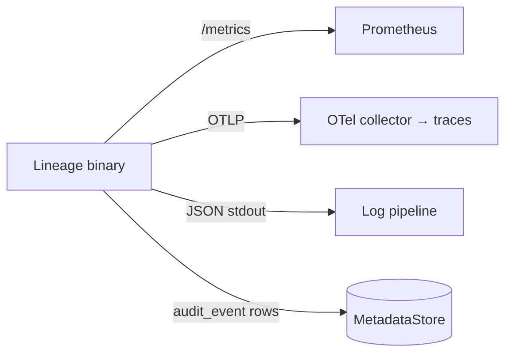

# 09 — Observability & Ops

> Status: **Draft**. Metrics, health, logs, traces, SLOs, backup/DR, and runbooks — all
> surfaced through the chart (§00.7). Complements deployment `08`.

## 1. Signals

Audit is a **durable domain record** (`02.3.7`), not just a log line — it survives log
rotation and is queryable (`06`/§4).

## 2. Metrics (Prometheus)

Exposed on the health/metrics port; optional `ServiceMonitor` (`08`).

| Group | Metrics |
|---|---|
| **API (RED)** | request rate, error rate, duration histogram — labeled `surface`(admin/model), `route`, `method`, `status` |
| **Resolve** | cache hit/miss ratio, resolve latency, signed-URLs minted |
| **Publish/lifecycle** | versions published, transitions by `to`-stage, singleton demotions |
| **Storage** | upload/finalize latency, digest-mismatch count, backend errors, stream-through bytes |
| **DB** | query latency, pool in-use/idle, migration version/status |
| **Domain (gauges)** | models/versions/artifacts totals, stage distribution |

## 3. Health

| Probe | Endpoint | Checks |
|---|---|---|
| Liveness | `/healthz` | process up |
| Readiness | `/readyz` | DB reachable, cache reachable, default storage `Stat` ok, migrations applied |

Readiness gates traffic during startup/migration.

## 4. Logs & Traces

- **Logs:** structured JSON — `ts`, `level`, `requestId`, `actor`, `surface`, `route`,
  `status`, `latencyMs`. **Never** log secrets, signed URLs, or artifact bytes.
- **Traces:** OpenTelemetry, `traceparent` propagated; spans API → core → store; OTLP/HTTP
  export to `observability.otlpEndpoint` (`08`). Off unless an endpoint is set.
- **Correlation:** `requestId` on every log/trace; `actor` from `X-Lineage-Actor`.

| Span | Opened by | Attributes |
|---|---|---|
| `<METHOD> <route>` | API middleware (server span) | `http.request.method`, `http.route`, `http.response.status_code`, `lineage.surface` |
| `core.Resolve` | core | `lineage.model`, `lineage.version`, `lineage.cache` (hit/miss) |
| `core.PublishVersion` | core | `lineage.model`, `lineage.version`, `lineage.artifacts` |
| `core.Transition` | core | `lineage.stage.from`, `lineage.stage.to`, `lineage.demoted` |
| `core.FinalizeUpload` | core | `lineage.upload.mode`, `lineage.size_bytes` |
| `store.<Method>` | store decorator | `lineage.stage` on `SetStage` |

Span names are templated routes (`/v1/models/{model}`), never concrete paths — the same
cardinality rule as the metric labels. 5xx marks the span errored; 4xx does not.

## 5. SLOs (starting targets)

| SLO | Target |
|---|---|
| Resolve availability (`04`) | 99.9% |
| Resolve p99 latency (cache hit) | < 50 ms |
| Publish success rate | ≥ 99.5% |
| Migration-hook success | 100% (else release aborts, `08.7`) |

Error budgets drive alerting on the RED metrics above. The chart ships these as a
`PrometheusRule` (`observability.prometheusRule.enabled`, thresholds in values):

| Alert | Fires on | Severity |
|---|---|---|
| `LineageResolveAvailability` | resolve 5xx share over budget | critical |
| `LineageResolveLatencyP99` | resolve p99 over target | warning |
| `LineagePublishSuccessRate` | publish 5xx share over budget | critical |
| `LineageDigestMismatches` | any sustained finalize digest rejection (`05.6`) | warning |
| `LineageProductionSingletonViolated` | >1 version in `production` (`02.4`) | critical |
| `LineageDown` | ops port not scrapeable | critical |

The duration histogram is labelled by `route`, not by cache outcome, so the p99 alert covers
all resolves; isolating the cache-hit p99 the SLO names would need a new label (§2).
Migration-hook success is not alertable here — a failed hook aborts the release (`08.7`).

## 6. Backup & DR

| Component | Strategy |
|---|---|
| **Postgres** | managed backups / PITR; test restores |
| **SQLite** (dev) | snapshot the PVC / copy the file (quiesce writers) |
| **Artifacts** | live in the object store — its **own** durability/versioning; Lineage holds only pointers |
| **Config/secrets** | GitOps + secret manager |

Recovery = restore metadata store + keep object store intact; pointers re-resolve. Losing
the metadata store loses *registry state*, not the model bytes.

## 7. Runbooks (symptom → check → action)

| Symptom | Check | Action |
|---|---|---|
| Resolve 5xx / slow | cache hit ratio, DB latency | scale replicas; verify Redis; check replica lag (`00.11.8`) |
| Publish `422` on finalize | digest/size mismatch | client re-hash/re-upload; verify backend write |
| Readiness failing | `/readyz` detail | DB/cache/storage reachability; creds (`05.4`) |
| Stuck singleton (two `production`) | invariant check | re-run transition; inspect `audit_event` for the failed demote |
| `fs` backend slow reads | stream-through bytes metric | move to a signing backend (`05.7`) |
| SQLite PVC full | disk usage | grow PVC; migrate to Postgres (`08`) |
| Migration hook failed | Job logs | fix/rollback image; old pods still serving (`08.7`) |

## 8. Implementation

- **Registry:** hand-rolled, dependency-free (`internal/observability/metrics`) — counters,
  gauges, histograms with labels + the 0.0.4 text format (same minimal-dependency spirit as the
  SigV4 signer). Gauges that reflect live state (domain totals, DB pool) refresh via an
  `OnScrape` hook, so there is no background polling.
- **Core stays clean:** a `domain.Meter` port (no-op default) is injected with `core.WithMeter`;
  the core never imports the metrics package (§01). The API RED middleware records via a small
  `HTTPRecorder` interface — `route` is the matched ServeMux **pattern** (templated), so label
  cardinality is bounded.
- **Logs:** `slog` JSON on stderr; `requestId` (echoed as `X-Request-Id`) and the W3C
  `traceparent` trace-id give correlation. With tracing on, `requestId` falls back to the live
  span's trace id, so a request with no upstream `traceparent` still joins logs to its trace.
- **Traces:** the OTel SDK sits behind a `domain.Tracer` port (no-op default) injected with
  `core.WithTracer` — the same shape as `Meter`, so the core never imports the SDK (§01). The
  `internal/observability/tracing` adapter owns the provider, the OTLP/HTTP exporter, and W3C
  propagation. Store spans come from a decorator over the `MetadataStore` **port**, so SQLite,
  Postgres, and memory are instrumented once and the store adapters stay telemetry-free.
  Sampling is parent-based, so an upstream decision wins and a trace is never half-recorded.
  With no endpoint configured the tracer is disabled and is not in the call path at all.
- **Readiness:** `observability.Ready(StoreReady, StorageReady)` composes checks; a `Stat` on the
  default backend proves reachability (and, for signing backends, credentials).

## 9. See Also: chart wiring `08`, resolve/cache `04`, storage `05`, audit views `06`.
