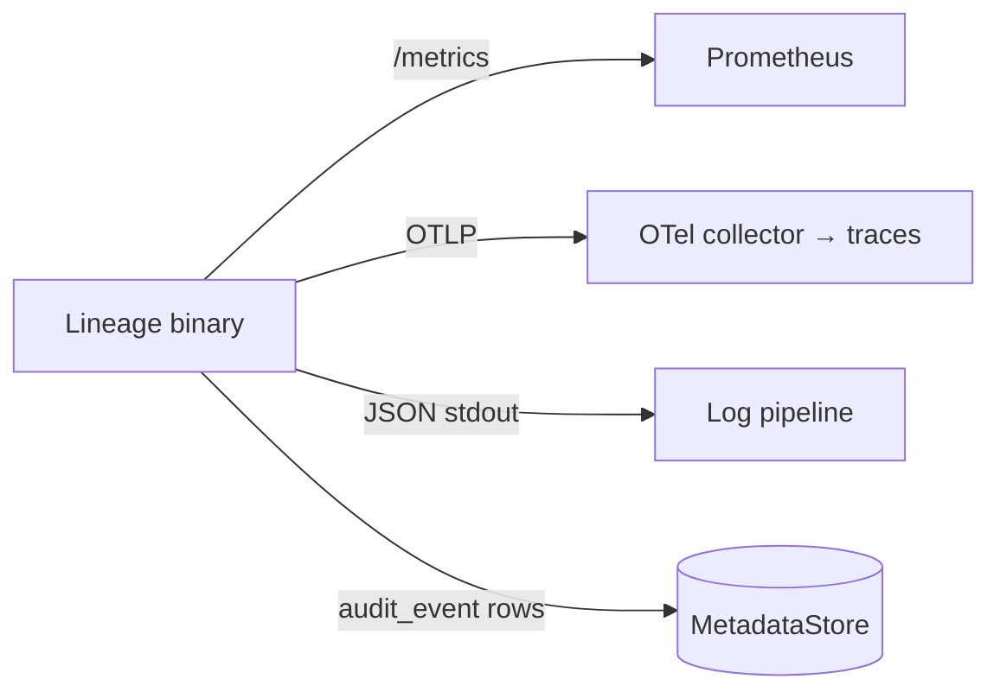

# 09 — Observability & Ops

> Status: **Draft**. Metrics, health, logs, traces, SLOs, backup/DR, and runbooks — all
> surfaced through the chart (§00.7). Complements deployment `08`.

## 1. Signals

Audit is a **durable domain record** (`02.3.7`), not just a log line — it survives log
rotation and is queryable (`06`/§4).

## 2. Metrics (Prometheus)

Exposed on the health/metrics port; optional `ServiceMonitor` (`08`).

| Group | Metrics |
|---|---|
| **API (RED)** | request rate, error rate, duration histogram — labeled `surface`(admin/model), `route`, `method`, `status` |
| **Resolve** | cache hit/miss ratio, resolve latency, signed-URLs minted |
| **Publish/lifecycle** | versions published, transitions by `to`-stage, singleton demotions |
| **Storage** | upload/finalize latency, digest-mismatch count, backend errors, stream-through bytes |
| **DB** | query latency, pool in-use/idle, migration version/status |
| **Domain (gauges)** | models/versions/artifacts totals, stage distribution |

## 3. Health

| Probe | Endpoint | Checks |
|---|---|---|
| Liveness | `/healthz` | process up |
| Readiness | `/readyz` | DB reachable, cache reachable, default storage `Stat` ok, migrations applied |

Readiness gates traffic during startup/migration.

## 4. Logs & Traces

- **Logs:** structured JSON — `ts`, `level`, `requestId`, `actor`, `surface`, `route`,
  `status`, `latencyMs`. **Never** log secrets, signed URLs, or artifact bytes.
- **Traces:** OpenTelemetry, `traceparent` propagated; spans API → core → DB/storage;
  OTLP export to `observability.otlpEndpoint` (`08`).
- **Correlation:** `requestId` on every log/trace; `actor` from `X-Lineage-Actor`.

## 5. SLOs (starting targets)

| SLO | Target |
|---|---|
| Resolve availability (`04`) | 99.9% |
| Resolve p99 latency (cache hit) | < 50 ms |
| Publish success rate | ≥ 99.5% |
| Migration-hook success | 100% (else release aborts, `08.7`) |

Error budgets drive alerting on the RED metrics above.

## 6. Backup & DR

| Component | Strategy |
|---|---|
| **Postgres** | managed backups / PITR; test restores |
| **SQLite** (dev) | snapshot the PVC / copy the file (quiesce writers) |
| **Artifacts** | live in the object store — its **own** durability/versioning; Lineage holds only pointers |
| **Config/secrets** | GitOps + secret manager |

Recovery = restore metadata store + keep object store intact; pointers re-resolve. Losing
the metadata store loses *registry state*, not the model bytes.

## 7. Runbooks (symptom → check → action)

| Symptom | Check | Action |
|---|---|---|
| Resolve 5xx / slow | cache hit ratio, DB latency | scale replicas; verify Redis; check replica lag (`00.11.8`) |
| Publish `422` on finalize | digest/size mismatch | client re-hash/re-upload; verify backend write |
| Readiness failing | `/readyz` detail | DB/cache/storage reachability; creds (`05.4`) |
| Stuck singleton (two `production`) | invariant check | re-run transition; inspect `audit_event` for the failed demote |
| `fs` backend slow reads | stream-through bytes metric | move to a signing backend (`05.7`) |
| SQLite PVC full | disk usage | grow PVC; migrate to Postgres (`08`) |
| Migration hook failed | Job logs | fix/rollback image; old pods still serving (`08.7`) |

## 8. See Also: chart wiring `08`, resolve/cache `04`, storage `05`, audit views `06`.
