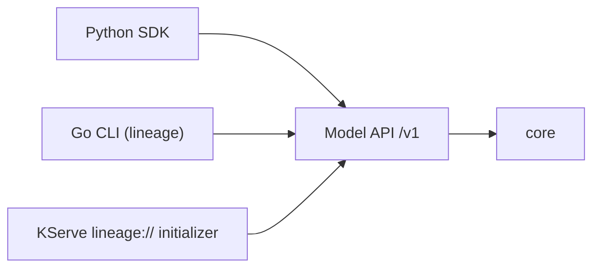

# 10 — SDK & CLI

> Status: **Draft**. Client ergonomics over the Model API (`/v1`). Python SDK first, then
> a Go CLI, both generated from the OpenAPI contract (§00.11.6). APIs are `03`/`04`.

## 1. Principles

- **OpenAPI is the source.** A generated low-level client (from `/v1/openapi.json`) plus
  a thin hand-written ergonomic layer. The contract never drifts from the clients.
- **No auth in the client** (§00 axiom 4) — configure a base URL; infra handles authN.
  An optional actor value is passed as `X-Lineage-Actor` for audit.
- **Publish and consume are the two hot paths** — both must be one-liners.



## 2. Python SDK

```python
from lineage import Client
lin = Client("https://lineage.internal", actor="ci-bot")

# publish (uploads bytes via signed URL, or registers a uri) — §03/§05
v = lin.publish(
    model="fraud-detector", version="1.4.0",
    artifacts=[lin.model_file("model.onnx", format=("onnx","1.16"))],
    lineage=[("derived_from", "bert-base"), ("trained_on", "s3://datasets/q2")],
)

lin.transition("fraud-detector", "1.4.0", to="production")   # §03.7

# consume — §04
r = lin.resolve("fraud-detector", stage="production")
print(r.storage_uri, r.signed_url, r.digest, r.model_format)
path = lin.download("fraud-detector", stage="production", dest="./model")  # Modal/Baseten
```

- `publish` picks upload vs register per artifact, handles multipart + digesting, records
  lineage edges (`07`).
- `resolve`/`download` wrap the resolution contract (`04.2`).
- **Auto-capture:** in a detectable training context, the SDK fills `produced_by`
  (git SHA / run id) and `derived_from` automatically (`07.4`).

## 3. Go CLI (`lineage`)

```bash
export LINEAGE_SERVER=https://lineage.internal
lineage model list
lineage version publish -m fraud-detector -n 1.4.0 \
        -a model.onnx --format onnx:1.16
lineage version promote -m fraud-detector -n 1.4.0 --to production   # → :transition
lineage resolve fraud-detector --stage production -o json
lineage pull fraud-detector --stage production --dest ./model        # mirrors lineage://
lineage lineage fraud-detector@1.4.0 --direction upstream            # §07
```

- Ships in the same repo/binary family (Go); talks Model API `/v1`.
- `pull` performs the same resolve→fetch the KServe initializer does (`04.5`), for local
  and CI use.

## 4. Versioning & Compat

- Clients are versioned with the API; generated code is regenerated per release.
- Backward-compatible `/v1` changes are additive; breaking changes ⇒ `/v2` (clients
  target a major).

## 5. See Also

| For | Doc |
|---|---|
| Publish / lifecycle / errors | `03` |
| Resolve / download / `lineage://` | `04` |
| Upload internals the SDK wraps | `05` |
| Lineage relations auto-captured | `07` |
