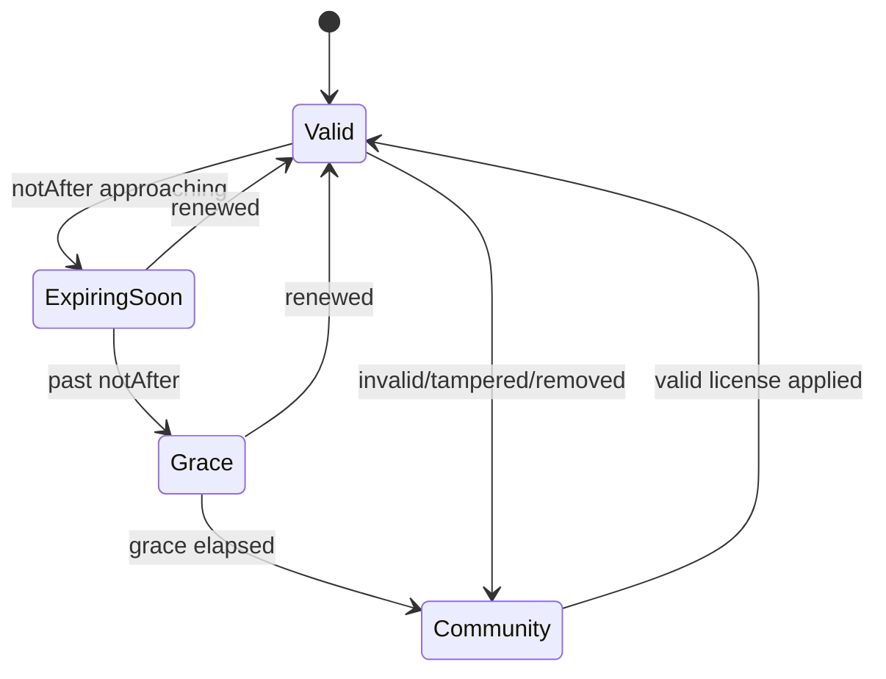

# 11 — Licensing & Entitlements

> Status: **Draft**. How Lineage is licensed as a **self-hosted product**: an open-core
> split, a cryptographically signed offline license, entitlement gating, and graceful
> degradation. Deployment wiring is `08`; observability is `09`.

## 1. Constraints (from the axioms)

Licensing must not fight what Lineage is (§00).

1. **Offline / air-gapped first.** Validation is **fully offline** — no mandatory
   phone-home. A signed license file is enough. Telemetry, if ever, is opt-in.
2. **Single binary.** Enforcement is built into the binary and driven by config/secret
   (`08`), not a separate license server.
3. **Never hold data hostage.** An expired/absent license degrades to the free feature
   set — it **never** blocks reading, resolving, or exporting your own models/metadata.
   This is a hard rule (§7).
4. **Boring & auditable.** Every license load/change and entitlement decision is
   observable (`09`) and audited (`02.3.7`).

## 2. Open-Core Split

Community is free and complete as a registry; Enterprise unlocks scale/governance
features via **entitlements** (feature flags + optional numeric limits). Packaging is
flag-driven, so editions are illustrative, not hard-coded:

| Capability | Community | Enterprise |
|---|---|---|
| Core registry: models/versions/artifacts, stages, resolution, lineage, audit | ✅ | ✅ |
| SQLite **and** Postgres, Model API, Admin UI, Helm | ✅ | ✅ |
| `lineage://` KServe initializer, signed-URL delivery | ✅ | ✅ |
| Semantic search (pgvector), read-replica delivery scaling | — | ✅ |
| Governance: approval-gated promotions, long audit retention, SIEM export | — | ✅ |
| Model-license governance module (see below) | — | ✅ |
| OCI/ORAS driver, webhooks/eventing, cross-registry air-gapped mirror | — | ✅ |
| Multi-tenancy / projects (post-v1) | — | ✅ |
| Limits (models / versions / seats) | capped | unlimited / per-license |

> Entitlements are **additive flags**, so a customer's license can carry any subset —
> edition names are just common bundles.

## 3. The License Artifact

A compact, **signed** token (JWT-style, `EdDSA`/Ed25519) — human-inspectable, offline-
verifiable:

```json
{
  "licensee": "Acme Corp",
  "licenseId": "LIC-01J…",
  "edition": "enterprise",
  "entitlements": ["pgvector_search", "approval_gates", "audit_export", "oci_driver"],
  "limits": { "models": 0, "seats": 50 },        // 0 = unlimited
  "issuedAt": 1730000000000,
  "notAfter": 1761536000000,
  "gracePeriodDays": 30
}
```

- **Signed by Lineage's private key**; the binary **embeds the public key(s)** → verifies
  with zero network. Signatures use a `keyId` so keys can rotate (embed current + prior).
- Delivered as a file/secret, wired via Helm (`licensing.secretRef`) or env (`08`, §5).

## 4. Validation & Gating

```mermaid
flowchart TB
    start["startup / license reload"] --> load{license present?}
    load -- no --> comm["Community entitlements"]
    load -- yes --> verify{signature valid?<br/>(embedded pubkey)}
    verify -- no --> comm
    verify -- yes --> exp{within notAfter<br/>+ grace?}
    exp -- no --> comm
    exp -- yes --> ent["Entitlements service<br/>(cached flags + limits)"]
    ent --> gate["feature gates query it"]
    comm --> gate
```

- A central **`Entitlements`** service in the core answers `has(flag)` and
  `within(limit)`. Feature code guards itself:

  ```go
  if !ent.Has("pgvector_search") { return errFeatureLocked("pgvector_search") }
  ```

- Locked feature ⇒ `403 feature_locked` (problem+json, `03.9` style) with the required
  entitlement in `details` — never a crash, never a data block.
- **Limits:** soft first (warn + metric + Admin banner) at threshold; hard-stop only on
  **new writes** past a hard cap (e.g. block *creating* the 101st model) — existing data
  stays fully readable/exportable.

## 5. License Lifecycle & Degradation



| State | Behavior |
|---|---|
| **Valid** | full entitlements |
| **Expiring soon** | full entitlements + warning banner/metric |
| **Grace** | full entitlements, prominent warnings (default 30 days) |
| **Community** | licensed features locked (`403`); **all core registry + export stays available** |

## 6. Model-License Governance (an Enterprise module)

The *other* meaning of "licensing" ships as a **paid governance module** (not the product
license itself): a `license` field/label on versions (SPDX id — `Apache-2.0`, `llama-3`,
proprietary), **policy gates** that can block `:transition`/publish on disallowed
licenses, and compliance reporting. It reuses labels (`02.3.5`) + the approval-gate
engine. Detailed later if pursued.

## 7. Trust Boundary (honest note)

Lineage's core is open source — a determined operator can recompile without checks. The
license is a **commercial trust boundary enforced by terms + signed official builds**,
not DRM. Design goals are therefore: make honest compliance effortless, make state
obvious (audit + metrics), and **never punish** users of their own data. We optimize for
trust, not lock-in.

## 8. Observability & Config

- **Metrics (`09`):** `license_state`, `license_expiry_seconds`, `entitlement_denied_total{flag}`, `limit_usage_ratio{limit}`.
- **Audit (`02`):** `license.loaded`, `license.changed`, `license.expired` events.
- **Admin UI (`06`):** license/edition badge, expiry + limit-usage banners.
- **Helm (`08`):**
  ```yaml
  licensing:
    secretRef: lineage-license        # mounts the signed token; empty = Community
    warnBeforeDays: 14
  ```

## 9. Deferred

| Item | When |
|---|---|
| Metered / usage-based billing, optional cloud license service | if a managed offering emerges |
| Per-feature time-limited trials | with go-to-market |
| Full model-license governance spec (§6) | when the module is scheduled |

## 10. See Also: entitlement-gated features across `04`/`05`/`07`; wiring `08`; signals `09`.
