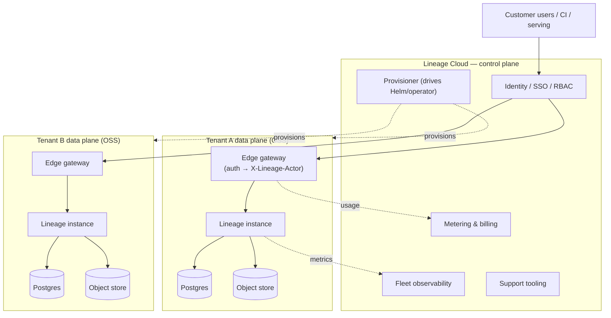
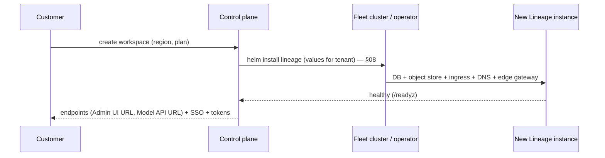

# 11 — Managed Service

> Status: **Draft**. How Lineage is monetized: a **managed (hosted) service**, not
> licensing. The self-hosted binary stays **100% open and unrestricted**; we sell
> operations, access, delivery, and support. Deployment primitives are `08`.

## 1. Strategy

- **Monetize operations, not features.** The OSS self-hosted product is the *whole*
  product — no license keys, no entitlement gates, no crippled "community edition."
  Revenue comes from running it well, not from withholding.
- **Fits axiom 1 exactly.** "Self-hosting is primary; SaaS never compromises it" (§00).
  Managed *adds* a paid path beside self-host without touching the free one.
- **No DRM, no trust problem.** Nothing to recompile around; the honest trust-boundary
  caveat of a license model disappears.
- **No lock-in** is a feature (§10). Customers can export and move to self-host anytime —
  that promise is what makes teams comfortable starting on managed.

## 2. Principles

1. **One codebase.** Managed runs the **same binary and the same Helm chart** (`08`) as
   self-host — no fork, no hidden features. Our control plane orchestrates the OSS chart.
2. **Deployment-level isolation.** v1 is single-tenant per install (§00.11.5), so managed
   = **one isolated Lineage instance per customer/workspace**, provisioned by the control
   plane. No in-app multi-tenancy required.
3. **Auth lives at the managed edge.** Self-host defers authN/authZ to infra (§00 axiom
   4); in managed, **we are that infra** — the control plane's gateway provides SSO, orgs,
   RBAC, and injects `X-Lineage-Actor`. This is a value-add, cleanly consistent with the
   OSS design.

## 3. What You Pay For

| Category | Value delivered |
|---|---|
| **Zero-ops** | provisioning, upgrades, patching, scaling, HA, backups/DR, monitoring/alerting (`08`/`09`) |
| **Access & identity** | hosted SSO (SAML/OIDC), orgs/workspaces, RBAC, API-token management, edge audit — the "infra" self-host asks you to bring |
| **Global delivery** | CDN/edge for resolve + signed-URL fetch, multi-region, data residency |
| **Assurance** | uptime SLA, support tiers, security/compliance (SOC 2, etc.) |
| **Convenience** | managed object storage option, usage dashboards, cost controls |

Tiers (illustrative): **Free** (small workspace) · **Team** (SLA, SSO, backups) ·
**Enterprise** (BYOC, residency, compliance, premium support). Priced by workspace/seats
+ stored volume + delivery throughput.

## 4. Architecture

A thin **control plane** over many **per-tenant Lineage data planes** (each the plain
OSS deployment).

Metering happens at the **edge/control plane**, never inside the OSS binary — so no
telemetry is baked into self-host.

## 5. Provisioning

Reusing the Helm chart (`08`) as the provisioning primitive keeps managed and self-host
in lock-step — every chart improvement benefits both.

## 6. Deployment Topologies

| Topology | Compute | Metadata + artifacts | For |
|---|---|---|---|
| **Fully hosted** | our cloud | our infra | fastest onboarding |
| **BYOC data plane** | customer VPC/cluster (via operator) | customer's cluster + bucket | data residency, egress control, enterprise |
| **Hybrid** | our cloud | metadata hosted; **artifacts in customer bucket** | keep large model bytes in-house |

BYOC = the control plane drives a **Lineage operator** (or Helm) inside the customer's
cluster; the data never leaves their boundary.

## 7. Isolation, Security, Compliance

- **Per-tenant isolation** at the instance/DB/bucket level (not shared rows) — strong
  blast-radius containment, enabled by the single-tenant design.
- Encryption in transit + at rest; per-tenant credentials; network isolation.
- Regions + **data residency**; compliance posture (SOC 2, and enterprise asks) is a
  managed-plane responsibility, unavailable to (and unneeded by) self-host.

## 8. Metering & Billing

- Collected at the **edge gateway / control plane**: workspaces/seats, stored bytes,
  resolve/fetch throughput, retention.
- The OSS binary emits only its standard Prometheus metrics (`09`); billing derives from
  edge signals, keeping the open product telemetry-free.

## 9. No Lock-In (a selling point)

- Same schema, same API, same artifacts. `lineage export` / import (`10`) moves a
  workspace between managed and self-host **either direction**.
- Because managed runs the identical OSS build, "eject to self-host" is a supported,
  documented path — not a threat to us but a reason to trust us.

## 10. Relationship to the OSS Repo

- The managed control plane, edge gateway, operator, and billing live in a **separate
  (proprietary) repo**; the OSS repo stays pure registry + chart.
- The chart (`08`) is the contract between them. No managed-only hooks leak into the OSS
  binary.

## 11. Deferred

| Item | When |
|---|---|
| Multi-tenant **shared** instances (needs in-app multi-tenancy, §00.11.5) | if density/cost demands it over isolated instances |
| Cloud-marketplace listings (AWS/GCP/Azure), private offers | go-to-market |
| Global multi-region active-active per tenant | scale |

## 12. See Also: chart/provisioning `08`; fleet metrics/SLOs `09`; export/import `10`; single-tenant rationale `00.11.5`.
