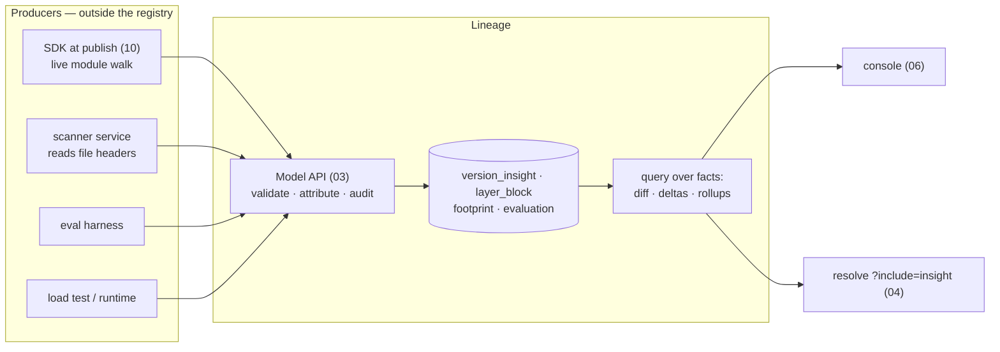
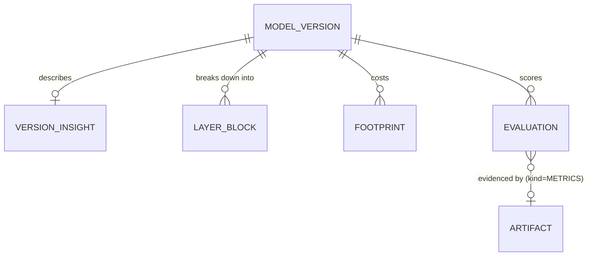

# 11 — Model Insights

> Status: **Implemented**. The fact API for model composition: parameter counts, layer breakdown,
> framework, precision/quantization, disk vs memory footprint, evaluation results, and an
> architecture fingerprint that classifies the difference between two versions. Lineage
> stores and queries these facts; producers outside the registry derive them. Storage is
> `02` (new tables, §3); API is `03`; console panels are `06`.

## 1. Scope & Boundary

**The registry stores facts; it does not derive them.** Lineage provides a typed,
validated, audited API for recording model composition, and a query/diff layer over the
recorded values. It does not open model files — neither weights nor headers.

Derivation belongs to separate systems: the SDK at publish time, a CI step, a scanner
service, an eval harness, a load test. Each submits what it found.

| Lineage does | Lineage does not |
|---|---|
| Validate writes against a versioned schema | Parse safetensors / GGUF / ONNX / pickles |
| Store facts with attribution (§2) | Load or execute a framework |
| Compute over stored facts — diff, deltas, rollups (§4, §6) | Compute over artifact bytes |
| Index and serve them to consumers and the console | Assess whether a claim is correct (§9) |
| Audit every write; reject contradictions (§7) | Fetch an artifact to answer a metadata query |

Rationale:

1. **Axioms 6 and 1.** Parsing bytes server-side requires a framework runtime in the binary
   and a multi-GB read on the metadata path. Lineage owns metadata and pointers, not bytes.
2. **Producers upgrade without a registry upgrade.** Support for a new format or a
   corrected parameter-counting method ships by redeploying the producer. Deriving facts in
   the server would put that knowledge in the binary, making every format change a Lineage
   release and a Helm upgrade for every self-hosted install. Only a genuinely new *field*
   requires a registry release, and open-ended detail already has homes in `arch_doc`,
   `basis`, and `params`.
3. **Third parties can extend it.** Nothing in the registry enumerates supported formats or
   tools, so a producer we did not write — for an in-house format, or one that postdates
   this design — works as long as it satisfies the schema.



## 2. Provenance of Facts

Every record carries a `source`, so a reader can weigh a value against how it was obtained.

| `source` | Meaning | Interpretation |
|---|---|---|
| `declared` | Publisher asserted it in the request body | A claim: attributed, not verified. |
| `derived` | Computed by a producer from the model itself | Reproducible from the artifact. |
| `measured` | Reported by a runtime or benchmark harness | Valid within its stated basis only. |

- An unknown field is `null`, never an estimate. The registry rejects writes it cannot
  validate and does not fill gaps.
- `coverage` records which fields the producer could fill for that format, distinguishing
  "the format does not expose this" from "not attempted".
- Unverifiable facts (accuracy, quantization method) record who claimed them, with which
  tool at which version, on which basis or split.
- **The registry does not adjudicate.** It records who reported what and when, rejects
  writes that contradict an immutable fact (§7), and exposes provenance on read. Choosing
  which producer to believe is the reader's decision.

**Provenance is per field, not per record.** Facts about one version arrive from several
producers: a scanner supplies shapes, an eval harness supplies accuracy, a load test
supplies the resident footprint. `version_insight` therefore carries a row-level default
`source` plus a `field_sources` map (§3.1); `evaluation` and `footprint` are multi-writer
by construction (append / upsert-per-scenario). Writes merge per field (§6.1).

## 3. Tables

Logical types per `02.3`. These are first-class tables rather than `custom_properties`,
which is opaque, unqueryable, and cannot be diffed. They are not artifacts either: insights
have no bytes and no URI. (The reserved `METRICS` artifact kind holds evaluation report
blobs, §3.4.)



### 3.1 `version_insight` (1:1 with `model_version`, optional)

| Column | Type | Notes |
|---|---|---|
| `version_id` | id | **PK**, FK→`model_version.id` ON DELETE CASCADE |
| `framework_name`,`framework_version` | str? | `pytorch` / `2.4.1` |
| `producer_name`,`producer_version` | str? | the library that wrote the files, e.g. `transformers` / `4.44` |
| `param_count_total` | int64? | |
| `param_count_trainable` | int64? | |
| `param_count_method` | enum | `from_tensors`\|`from_config`\|`declared`; these can disagree (tied embeddings, shards) |
| `tensor_count` | int64? | |
| `dtype_dominant` | enum | `fp32`\|`fp16`\|`bf16`\|`int8`\|`int4`\|`mixed` |
| `quant_method` | str? | `gptq`\|`awq`\|`bnb-nf4`\|`Q4_K_M`\|`ptq-static`; null = not quantized |
| `quant_scope` | json? | which modules were quantized / held out in higher precision |
| `disk_bytes` | int64? | Σ `MODEL` artifact `size_bytes` |
| `weights_bytes` | int64? | Σ tensor nbytes; differs from `disk_bytes` under sharding, zip, or compression |
| `topology_hash` | str | §4 |
| `shape_hash` | str | §4 |
| `dtype_hash` | str | §4 |
| `weights_hash` | str? | §4 — publish-time only |
| `arch_doc` | json? | canonical normalized graph summary (the hashed input) |
| `source` | enum | §2 — row-level default |
| `field_sources` | json? | per-field override: `{field: {source, reporter, reporter_version, at}}` (§2) |
| `reporter_name`,`reporter_version` | str? | the tool that wrote this row; distinct from `producer_*` above |
| `coverage` | json? | per-field: filled · unavailable-for-format · not-attempted |
| `created_at`,`updated_at` | ts | |

### 3.2 `layer_block` (breakdown, collapsed over repeats)

Each distinct block is stored once with a `repeat_count`; the path uses `*` for the
repeated index. An 80-layer decoder therefore contributes one set of rows, not eighty —
which keeps both row counts and diffs tractable.

| Column | Type | Notes |
|---|---|---|
| `version_id` | id | FK→`model_version.id` ON DELETE CASCADE |
| `ordinal` | int64 | position in the canonical order |
| `path` | str | e.g. `model.layers.*.self_attn.q_proj` |
| `op_type` | str | `Linear`\|`Conv2d`\|`LayerNorm`\|`Attention`\|… |
| `repeat_count` | int64 | 80 for a repeated decoder block |
| `shape_signature` | str? | e.g. `[4096,4096]` |
| `dtype` | str? | per-block precision (mixed models differ per block) |
| `param_count`,`bytes` | int64? | **per single instance** — multiply by `repeat_count` for the rollup |

PK (`version_id`,`ordinal`).

### 3.3 `footprint` (many per version)

In-memory footprint is a function of dtype, batch, sequence length, KV cache, and framework
overhead, so a single `memory_bytes` column would be ambiguous. Each row records one
scenario together with the assumptions behind it.

| Column | Type | Notes |
|---|---|---|
| `id` | id | PK |
| `version_id` | id | FK→`model_version.id` ON DELETE CASCADE |
| `scenario` | str | **unique per (`version_id`,`scenario`)** |
| `device_class` | str? | `cpu`\|`t4`\|`a100-80g`\|… |
| `batch`,`seq_len` | int64? | the axes that dominate everything but weights |
| `weights_bytes` | int64? | |
| `kv_cache_bytes` | int64? | |
| `activation_bytes` | int64? | |
| `runtime_overhead_bytes` | int64? | allocator/framework slack |
| `total_bytes` | int64? | the figure a scheduler provisions against |
| `source` | enum | `estimated`\|`measured` (§2) |
| `basis` | json? | assumptions: kv dtype, paged attention, flash impl, runtime + version |
| `created_at`,`updated_at` | ts | |

### 3.4 `evaluation` (many per version)

| Column | Type | Notes |
|---|---|---|
| `id` | id | PK |
| `version_id` | id | FK→`model_version.id` ON DELETE CASCADE |
| `suite` | str | `mmlu`\|`imagenet-val`\|`internal-holdout` |
| `metric` | str | `acc`\|`f1`\|`perplexity`\|`wer` |
| `split` | str? | `test`\|`val`\|`5shot` |
| `value` | float | |
| `higher_is_better` | bool | required; the sign of a delta cannot be inferred from the metric name |
| `n_samples` | int64? | |
| `harness_name`,`harness_version` | str? | comparability depends on these |
| `params` | json? | shots, temperature, prompt template, seed |
| `evidence_artifact_id` | id? | FK→`artifact.id` where `kind=METRICS` — the verbatim report |
| `source` | enum | §2 |
| `run_at`,`created_at` | ts | |

The accuracy tradeoff is not stored; it is derived on read (§6) by intersecting
(`suite`,`metric`,`split`,`harness_version`) between two versions and differencing the
values. An empty intersection returns `"comparable": false` rather than comparing results
from different configurations (e.g. 5-shot against 0-shot MMLU).

### 3.5 Indexes

| Table | Index | Purpose |
|---|---|---|
| `version_insight` | (`topology_hash`), (`shape_hash`), (`weights_hash`) | find versions sharing an architecture or identical weights |
| `version_insight` | (`param_count_total`), (`dtype_dominant`) | discovery filters |
| `layer_block` | (`version_id`,`ordinal`) | ordered breakdown (PK) |
| `layer_block` | (`op_type`) | find versions containing a given op type |
| `footprint` | unique(`version_id`,`scenario`) | upsert by scenario |
| `evaluation` | (`version_id`,`suite`,`metric`,`split`) | the diff join |

### 3.6 Change to `lineage_edge`

`02.3.6` has no properties column, so a `derived_from` edge cannot record *how* the version
was derived. Add `properties json?` rather than extending the relation enum: the enum stays
the four relations of `07`, and `{"method":"quantize","from_dtype":"fp16"}` is carried
alongside. This allows a diff verdict (§4) to be corroborated by declared intent.

## 4. Architecture Fingerprint

The arch doc is canonicalized (sorted tensor names, normalized op names, collapsed
repeats), then hashed at four separable levels. Separating them makes the diff a table
lookup rather than a heuristic.

| Hash | Covers | Excludes |
|---|---|---|
| `topology_hash` | ordered op graph: op types, connectivity, non-weight attrs (`num_heads`, kernel, stride, activation, norm placement) | shapes, dtypes, weights |
| `shape_hash` | topology + every tensor shape | dtypes, weights |
| `dtype_hash` | the per-tensor dtype vector | weights |
| `weights_hash` | merkle root over per-tensor content digests, sorted by name | — |

### 4.1 Verdict table

| `topology` | `shape` | `dtype` | `weights` | Verdict |
|---|---|---|---|---|
| = | = | = | = | **`identical`** — repackage / re-publish |
| = | = | = | ≠ | **`reweighted`** — fine-tune, continued training, RL |
| = | = | ≠ | ≠ | **`recast`** — same shape, different precision (quantize/cast) |
| = | ≠ | * | ≠ | **`rescaled`** — same family, different width or depth |
| ≠ | ≠ | * | ≠ | **`rearchitected`** — new blocks or backbone |

### 4.2 Per-tensor digests

The merkle root is built from per-tensor digests, and those digests are retained in
`arch_doc`. This supports a partial diff that a checkpoint-level digest cannot express —
for example, *97% of tensors unchanged; only `*.q_proj`, `*.v_proj`, `lm_head` differ*.
That pattern indicates a merged LoRA adapter, whereas a full fine-tune alters nearly all
tensors.

### 4.3 Cost tiering (producer guidance)

The registry receives these hashes and does not compute them. For producer implementers,
the four split into two cost classes:

| Hashes | Input | Implication |
|---|---|---|
| `topology`,`shape`,`dtype` | file header only — safetensors JSON header, GGUF header, ONNX protobuf graph; a range GET of the first few KB | inexpensive enough to backfill existing versions |
| `weights` | all bytes | best computed while the artifact is already streaming at publish, rather than by re-downloading |

The three header-derived hashes are independently useful, so a producer may submit them and
leave `weights_hash` null. The diff (§6) degrades predictably: it still separates
`rescaled` and `rearchitected` from an unchanged shape, but cannot distinguish `identical`
from `reweighted`, and reports that rather than inferring one.

### 4.4 Limitation

Hashes cannot distinguish quantization from retraining, since both alter every weight. The
ladder establishes that topology and shape are unchanged; `quant_method` (§3.1) and the
edge `method` (§3.6) remain declared values. Separating the two numerically requires
per-tensor dequantized cosine similarity — a producer-side concern, not the registry's.

### 4.5 Canonical form (normative)

Two producers must derive the same hash for the same model, or every diff between their
models reads as `rearchitected`. The registry cannot verify this — it does not read
artifacts — so the rules are normative here and fixed by the fixtures shipped with the
JSON Schema (§6.4).

**Common rules.** UTF-8, LF line endings, no trailing whitespace. Tensor names are taken
verbatim from the format, never renamed. Ordering is byte-wise ascending on the tensor
name. Integers serialize as plain decimal; floats as the shortest round-tripping form.
Every hash is `sha256:` + lowercase hex over the byte stream defined below.

| Hash | Byte stream |
|---|---|
| `topology` | one line per op in graph order: `opType\x00input_indices(comma-sep)\x00k=v;…\n`, where the attribute list excludes anything shape-, dtype-, or weight-derived and is sorted by key |
| `shape` | the `topology` stream, then one line per tensor: `name\x00d0,d1,…\n` |
| `dtype` | one line per tensor: `name\x00dtype\n`, using the canonical dtype vocabulary below |
| `weights` | one line per tensor: `name\x00tensorDigest\n`, where `tensorDigest` is `sha256:` + hex of that tensor's raw bytes |

**Canonical dtype vocabulary:** `fp64`, `fp32`, `fp16`, `bf16`, `fp8e4m3`, `fp8e5m2`,
`int64`, `int32`, `int16`, `int8`, `uint8`, `int4`, `uint4`, `bool`. Framework spellings
(`float16`, `torch.bfloat16`, `F16`) normalize to these. An unmappable dtype is passed
through verbatim rather than guessed at, which makes the disagreement visible in a diff
instead of hiding it.

**Scope.** Hashes are computed over the canonical arch doc only. The `layer_block`
breakdown (§3.2) is a presentational rollup and is never hashed — collapsing repeats there
must not change a fingerprint.

## 5. Producers (reference)

No component in this section ships with the registry. It is included as context for
producer implementers and as the rationale for the schema in §3. Producers dispatch on
`artifact.model_format_name` (`02.3.3`).

| Producer | Supplies | Cost |
|---|---|---|
| SDK helper at publish (`10`) | exact params/dtypes/nbytes from a live `torch.nn.Module` (`named_parameters()` + module tree); per-tensor digests during upload | negligible — the model is already resident |
| Scanner service | hashes 1–3, shapes, layer breakdown, disk bytes, from file headers | seconds per model; can backfill existing versions |
| Eval harness | `evaluation` rows | cost of the evaluation run |
| Load test / serving runtime | `footprint` rows with `source=measured` | cost of a real deployment |
| Human or CI declaration | `quant_method` and other facts nothing can infer | none |

Reachability by format, for a scanner:

| Format | Params / layers | Shapes + dtypes | Framework required? |
|---|---|---|---|
| live `torch.nn.Module` | ✅ exact | ✅ | already loaded |
| `safetensors` | ✅ header tensor map | ✅ header | ❌ header is JSON |
| `gguf` | ✅ header | ✅ header (incl. quant type) | ❌ |
| `onnx` | ✅ graph nodes + initializers | ✅ | ❌ protobuf |
| `tf-savedmodel` | ⚠️ signature + variables | ⚠️ partial | ❌ partial |
| pickled `.pt` / `joblib` | ❌ | ❌ | unsafe to unpickle — `declared` only |

The final row is the reason `source` and `coverage` exist: some formats expose nothing, and
the record must state that explicitly.

## 6. API

Facts are written by producers and read by inference systems, so the endpoints live on the
Model API (`:8081/v1`), not Admin (axiom 3).

```
PATCH  /v1/models/{m}/versions/{v}/insight      merge per field — the normal write (§6.1)
PUT    /v1/models/{m}/versions/{v}/insight      full replace — single authoritative producer
GET    /v1/models/{m}/versions/{v}/insight      ?include=layers,sources
POST   /v1/models/{m}/versions/{v}/evaluations  append (never overwrite)
GET    /v1/models/{m}/versions/{v}/evaluations
PUT    /v1/models/{m}/versions/{v}/footprints/{scenario}   upsert one scenario
GET    /v1/models/{m}/versions/{v}/footprints
GET    /v1/models/{m}/diff?from=3&to=4          verdict + deltas (§6.2)
GET    /v1/diff?from=teacher@2&to=student@1     cross-model (distillation)
```

### 6.1 Write semantics

Multiple independent producers write facts about the same version, so the default write
must not require them to share ownership of one document.

- **`PATCH` merges per field.** Absent fields are left unchanged; an explicit `null`
  clears. Each merged field records a `field_sources` entry — source, reporter, reporter
  version, timestamp (§2). This lets a scanner, an eval harness, and a load test write
  independently.
- **`PUT` replaces the whole document.** Appropriate only where one producer owns every
  field, which is why it is not the default.
- Both are idempotent and support `Idempotency-Key` as other creates do (`03`).
- **Schema-validated.** The payload declares a `schemaVersion`; unknown versions return
  `400` with no partial write. Unknown fields are rejected rather than dropped, so a
  producer can detect an older registry.
- A write that contradicts an immutable fact is rejected (§7).
- **Sub-resources are separate writes.** `evaluation` is append-only; `footprint` upserts
  by `scenario`; `layer_block` rows are written with the insight document in one
  transaction.

### 6.2 Diff

`diff` is computed entirely over stored facts, with no artifact access — the same posture
as lineage traversal (`07`). It returns:

| Field | Content |
|---|---|
| `verdict` | one of §4.1 |
| `hashes` | the four-hash ladder for both sides, with per-hash `changed` flags |
| `tensors` | `{unchanged, changed, added, removed}` counts + the changed name patterns (§4.2) |
| `params`, `footprint` | scalar deltas, each tagged with its `source` |
| `metrics[]` | per (`suite`,`metric`,`split`) delta with `higher_is_better` applied → `better`/`worse`, plus `comparable` |
| `basis` | which hashes were present on each side, so a partial verdict is identifiable as partial (§4.3) |

Where the required facts were never submitted, the result is `"verdict": "unknown"` with
the missing inputs named. The registry does not infer a verdict from absent data.

### 6.3 Read paths

- **`?include=insight` on resolve** (`04`) returns a compact block — `paramCount`, `dtype`,
  `diskBytes`, `minDeviceMemoryBytes` — allowing a scheduler to select a device class in a
  single call (axiom 8). It is opt-in, to keep the cached hot path small.
- **Filtering** follows the `02.7` capability tiering: scalar columns work on both engines;
  predicates inside `arch_doc`/`quant_scope` are Postgres-only (JSONB).
- **`?include=sources`** returns `field_sources`, so a consumer can distinguish a `measured`
  footprint from an `estimated` one without a second call.

### 6.4 The producer contract

```
GET /v1/insight-schema.json     the versioned submission schema this registry enforces
```

Served by the registry itself, not only documented, so a producer can fetch the exact
schema the server it is talking to will apply. It is versioned independently of the
OpenAPI document, since producers track it on their own cadence (§1).

The contract has three parts:

| Part | Where |
|---|---|
| Submission schema | `GET /v1/insight-schema.json`; `x-schemaVersion` matches the `schemaVersion` the registry accepts |
| Canonical hash derivation | §4.5, normative |
| Golden fixtures | `internal/api/modelapi/testdata/producers/` — one per producer shape, asserted against a running registry in CI |

A registry test compares the schema's published field list against the set the code
actually accepts, so the two cannot drift.

### 6.5 Worked example

A header scanner reports what it can read cheaply, and marks what it could not:

```bash
curl -X PATCH "$LINEAGE/v1/models/llama-guard/versions/fp16/insight" \
  -H 'Content-Type: application/json' -d '{
    "schemaVersion": "1",
    "source": "derived",
    "reporter": "lineage-scanner", "reporterVersion": "0.3.1",
    "facts": {
      "framework": {"name": "pytorch", "version": "2.4.1"},
      "tensorCount": 291,
      "dtypeDominant": "bf16",
      "hashes": {"topology": "sha256:…", "shape": "sha256:…", "dtype": "sha256:…"},
      "coverage": {"paramCountTotal": "not_attempted", "quantMethod": "unavailable_for_format"}
    }
  }'
```

Later, the SDK adds what only a publish-time walk can supply. It names no other field, so
nothing the scanner reported is disturbed:

```bash
curl -X PATCH "$LINEAGE/v1/models/llama-guard/versions/fp16/insight" \
  -H 'Content-Type: application/json' -d '{
    "schemaVersion": "1",
    "source": "derived",
    "reporter": "lineage-sdk", "reporterVersion": "1.0.0",
    "facts": {
      "paramCountTotal": 8030261248,
      "paramCountMethod": "from_tensors",
      "hashes": {"weights": "sha256:…"}
    }
  }'
```

A format that reveals nothing still produces an honest record — `declared` facts plus a
coverage map saying why the rest is absent:

```bash
curl -X PATCH "$LINEAGE/v1/models/churn/versions/3/insight" \
  -H 'Content-Type: application/json' -d '{
    "schemaVersion": "1", "source": "declared", "reporter": "release-checklist",
    "facts": {
      "framework": {"name": "scikit-learn", "version": "1.5.1"},
      "coverage": {"paramCountTotal": "unavailable_for_format", "hashes": "unavailable_for_format"}
    }
  }'
```

## 7. Governance

- **Audited.** Every insight, evaluation, and footprint write appends an `audit_event` in
  the same transaction (`02.5` invariant 4).
- **Fingerprint conflict returns `409`.** A write reporting a `weights_hash` that differs
  from one already recorded for that version is rejected unless `?force=true` is set, which
  is itself audited. Versions are immutable (`02.5` invariant 2), so a changed weights hash
  indicates the artifact content changed under a published version. This is the only case
  where the registry rules on an incoming fact, and it does so structurally — it does not
  assess correctness, only refuses to hold two irreconcilable values in one immutable slot.
- **Evaluations are append-only.** A re-run is a new row with its own `run_at` and harness
  version rather than an overwrite, so regressions remain visible.
- **Promotion policy hook.** With `evaluation` in place, a stage transition (`02.4`) can be
  gated on it — for example, blocking promotion to `production` without a passing result on
  a required suite. Config-driven and off by default; an extension, not v1 scope.

## 8. Console (`06`)

- **Version detail — Insights panel:** params, framework, precision, disk vs memory, and
  the layer breakdown table (repeats collapsed), each value labelled with its `source`.
- **Compare view:** two versions side by side — verdict, hash ladder, changed-tensor
  summary, and metric delta table.
- Estimated footprints render with their basis, not as a bare byte count.
- Absent facts render as "not reported", distinct from a zero or an empty value.

## 9. Non-Goals

| Not in scope | Reason |
|---|---|
| Deriving any fact from an artifact | §1. Includes weights, headers, and config files. The registry stores facts; producers derive them. |
| Server-side framework execution | §1. Creates version coupling, large images, and artifact reads on the metadata path. |
| Shipping a scanner in this repo | §5 is reference material, not a component list. A scanner is a separate system using this API. |
| Verifying accuracy claims | Lineage records the claim and its attribution; it cannot re-run an evaluation. |
| Benchmark running / eval orchestration | A separate concern. Harnesses report in; `evidence_artifact_id` retains the raw report. |
| Establishing *why* weights changed | §4.4. Topology and shape are determinable from stored hashes; intent is declared. |
| Interpretability / activation analysis | Outside the scope of a registry. |

## 10. Deferred

| Item | Where / when |
|---|---|
| A reference scanner producer | Separate system. The contract it builds against is published (§6.4). |
| Per-tensor numeric similarity (quantization confirmation) | Producer-side, if declared values prove insufficient. |
| Promotion gating on evaluations (§7) | With a policy engine. |
| pgvector semantic search over insights + model cards | Here; Postgres-only, per `02.7` tiering. |
| Dataset-side facts (`DATASET` artifact kind) | Here; with richer lineage (`07`). |

## 11. See Also

| For | Doc |
|---|---|
| Entity/table conventions, dialect tiering | `02` |
| Endpoint conventions, errors, idempotency | `03` |
| `?include=insight` on resolve | `04` |
| Artifact digest + upload streaming | `05` |
| Insights panel + compare view | `06` |
| `derived_from` edge `method` property | `07` |
| SDK producer helper at publish | `10` |
