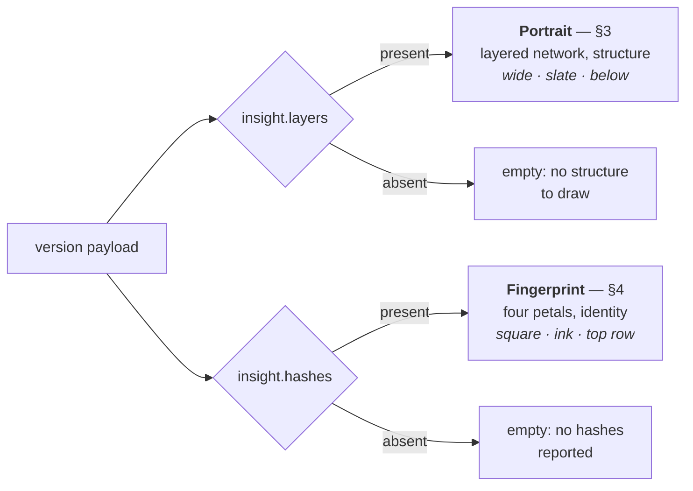
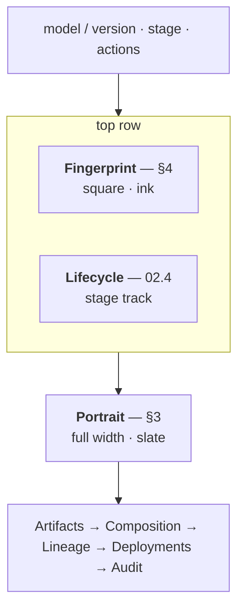

# 12 — Version Portrait

> Status: **Implemented**. Two procedurally generated marks for a model version in the console —
> a square **Fingerprint** (identity) and a wide **Portrait** (structure). Independent
> sections, deterministic, drawn only from facts a producer already reported. Facts are `11`;
> console placement is `06`.

## 1. Scope & Boundary

A version gets generated marks so it can be recognised at a glance and compared side by side
without reading numbers.

| The marks are | The marks are not |
|---|---|
| A rendering of facts already stored (`11`) | A new fact, field, or table |
| Computed in the browser, at paint time | Persisted, cached, or served by an API |
| Deterministic — same facts, same pixels | Stable across a producer resubmitting different facts |
| Decoration that happens to be honest | Evidence, or a substitute for the diff (`11.4`) |
| Two independent sections | Alternatives, or fallbacks for one another |

Nothing in `02`, `03`, `04`, or `06` changes. The mark is a pure function of the version
payload the console already fetches.

## 2. The Honesty Rule

Most versions have no reported insight — `11.1` puts derivation outside the registry, so a
version whose producer never ran has layers `null` and hashes empty. A mark that looked
structural in that case would assert a shape nobody measured.

**There are two marks, and they are independent.** Each is drawn from its own input, each is
absent on its own terms, and neither ever substitutes for the other:



This split is what makes the pair honest. An earlier draft picked *one* family per version —
portrait if layers existed, otherwise fingerprint — so a version with hashes and no layers
silently received an identity mark in the slot a reader had learned to read structurally, and
the section had to carry a sentence of prose explaining which family it had chosen and why.
Two independent sections remove the substitution rather than annotate it: different places,
different sizes, different tones, and a missing input shows as an empty section instead of as
a different picture.

Three rules follow, and all are load-bearing:

1. **Never fill a gap.** A block with `paramCount: null` draws dashed nodes, not guessed
   ones. A hash nobody reported is a dotted petal and a hollow marker, never a pattern.
   Absent is a visible state, exactly as in the Composition panel where absent reads
   `not reported` and never `0`.
2. **Never substitute.** Neither mark may stand in for the other, at any size or placement.
3. **Never draw the uninterpretable.** A version with nothing reported gets no mark at all.
   A digest alone is drawable — it is a stable seed — but a mark made from it says only
   *these bytes, and not other bytes*, which the Artifacts table already states in text.
   Drawing it would spend the reader's attention on a shape that cannot be interpreted and
   train them to see the sections as decoration (§8).

Both empty states are real in the demo dataset. `sentiment-classifier/2.2.0-rc1` has all four
hashes and no layer breakdown, so it draws a fingerprint beside an empty portrait;
`legacy-recommender/1.9.3` has neither and draws two empty sections.

## 3. Portrait — structure

Drawn from `insight.layers: LayerBlock[]`, in `ordinal` order: **the stack itself, as a
layered network read left to right.** One column of nodes per layer, edges between adjacent
columns.

| Channel | Encodes | Rule |
|---|---|---|
| Columns | `repeatCount`, expanded | A block with `repeatCount: 6` draws **six columns**, not one annotated column. Capped at 20 |
| Nodes per column | Layer output width | `o` = last dim of `shapeSignature`. `o ≤ 6` → `o` nodes exactly; otherwise `clamp(round(2 + 4 · log(o)/log(oMax)), 2, 6)` |
| Column extent | Node count relative to the widest layer | `H · nodes/maxNodes`, vertically centred — the stack visibly narrows and widens |
| Edges | Adjacency, not wiring | Every node to every node in the next column, at 18% opacity |
| Dashed node | The fact is missing | `paramCount` null or shape unparseable → dashed node ring, edges at 9% |

Edges are drawn in `--portrait`, a low-chroma slate (`oklch(0.53 0.045 245)` light,
`oklch(0.72 0.05 245)` dark). Nodes cycle through four matched low-chroma
`--portrait-block-*` tones by reported block ordinal; every expanded repeat keeps its source
block's tone. The hue is a stable visual discriminator only, not an encoding of a reported
model fact. The console's UI is monochrome because its surface is 1px furniture — rules,
borders, tables — and a drawn network sitting inside that furniture needs to read as a
different kind of object, not as more of it. Below 24px the colour drops with the nodes and
edges (§6.2) — at tick size it would read as a stray highlight.

Two choices carry the design:

**`repeatCount` becomes literal repetition.** Six transformer layers draw as six columns.
This is the one thing a stack diagram says better than a bar chart — depth is depth, not a
number you have to read. `sentiment-classifier/2.1.0` expands from 4 blocks to 14 columns.

**Node count comes from the output width, not the widest dimension.** A `[768,2]`
classifier is two nodes wide, so the head visibly pinches at the end of the stack — which is
what the model actually does. Using the widest dim would have drawn it as wide as the
attention projections and lost the shape of the thing.

**The edges are schematic, and the section says so.** Producers report block shapes and
repeat counts (`11.3`); nothing in the fact API describes which unit connects to which. The
edges show that two layers are *adjacent*, not how they are joined — a real gap between the
picture and the data, stated in the section's own footer rather than left for a reader to
discover. This is the one place the mark draws something the facts do not contain, and it is
allowed only because a layered stack is universally read as a schematic.

**Precision is deliberately not encoded here.** A post-training quantization has the same
topology, the same shapes, and the same repeat structure as its source — `11.4.1` classes
it `recast`, not `rearchitected`. A portrait that shaded int8 differently would suggest the
structure moved when it did not. Precision is a hash-level fact and reads in §4, where the
precision petal changes and the architecture and shape petals do not.

**Parameter counts are not encoded at all.** The earlier draft of this mark was a stack of
bars whose heights were log parameter share; it was cut with the network. Node counts are
widths, not magnitudes, and the exact counts are in the layer table directly below.

## 4. Fingerprint — identity

Drawn from `insight.hashes`. Four petals, one per level, clockwise from the top left:

| Petal | Hash | Direction |
|---|---|---|
| 1 | `topology` (architecture) | top left |
| 2 | `shape` (layer shapes) | top right |
| 3 | `dtype` (precision) | bottom right |
| 4 | `weights` | bottom left |

Each petal's outline is seeded from its hash by the stream (§5): its width, the ripple along its
edge, and how many nested contours it has (3–4). Each petal is drawn as a **point cloud**: dots
gather along its contours and scatter more thinly inside, every dot's position, size and opacity
taken from the same stream, so the same hash lays the same cloud. Under 64px — the thumbnails in
the review and plan queues — a cloud is dust and a comparison cannot be read off it, so each
petal is a solid filled shape instead. The cloud is graded two ways: from tip to centre the dots shrink
sharply (large at the outline, fine specks at the centre) and fade gently, and across the petal
its centre line keeps the level's own colour while its edges blend up to 25% toward the
neighbouring petals', so the four read as one flower. In a
delta pair only the tip-to-centre fade applies — a changed petal keeps its colour unmixed and an
unchanged one stays grey — so no petal can borrow a neighbour's hue. The same hash always draws the same petal and a different hash a
visibly different one; the shape encodes nothing beyond that. **A hash that is absent is drawn
as a plain dotted petal in the muted tone** — present-but-different and absent-entirely must
not look alike. In a pair, a side with no hashes at all draws four dotted petals rather than
nothing.

Earlier cuts drew concentric rings — first 24 on/off arc segments per ring, then guilloche
bands. Both read as nested circles rather than one emblem, so they were replaced by petals, and
the petals by point clouds for a lighter, less diagrammatic texture.

### 4.1 Petal colour

Each level carries its own hue, so a petal can be named at a glance:

| Level | Token | Light | Dark |
|---|---|---|---|
| `topology` | `--fp-topology` | `oklch(0.52 0.07 255)` | `oklch(0.72 0.075 255)` |
| `shape` | `--fp-shape` | `oklch(0.54 0.07 165)` | `oklch(0.74 0.075 165)` |
| `dtype` | `--fp-dtype` | `oklch(0.56 0.075 75)` | `oklch(0.78 0.08 75)` |
| `weights` | `--fp-weights` | `oklch(0.53 0.08 25)` | `oklch(0.72 0.085 25)` |

Chroma stays low and lightness is matched across the four, so no petal dominates and the
flower reads as one object.

Three rules hold the colour honest:

1. **Colour means reported.** An absent level stays muted grey and dotted; it never borrows a
   hue. Absence must not be able to pass as a category.
2. **Colour is never the only signal.** Each petal has a fixed direction, and the roll-call
   under the flower repeats every level as a coloured marker *and* its name in text. The mark
   is fully readable in greyscale, in print, and with colour vision loss — the hues are an
   accelerator, not the channel.
3. **Nothing else may use these tokens.** They name the four fingerprint levels and only
   those.

In a side-by-side delta (§4 table), petals that did not change drop to muted so the ones that
did carry their colour alone.

This makes the `11.4.1` verdict readable directly off two marks placed side by side:

| What differs | Verdict | Reads as |
|---|---|---|
| Nothing, all four present | `identical` | Both flowers match, all grey |
| Weights only | `reweighted` | Bottom-left petal changes |
| Precision and weights | `recast` | Top two match; the bottom two change |
| Shapes, precision, weights | `rescaled` | Only the architecture petal matches |
| Architecture | `rearchitected` | Nothing matches |
| Weights dotted on either side | `unknown` | A petal is visibly missing, not zero |

The last row is the one that earns the design. `demand-forecast` `0.4.0` → `0.4.1` is a
weekly retrain whose producer never hashed weights: three identical petals and a dotted
one, which is precisely `11.4.3`'s "narrows to two candidates and names what is missing".

Under the disc the section repeats the four levels as a roll-call — a marker in the level's
own colour for a reported hash, a hollow dashed grey one for an absent hash — so the disc can
be read without matching colours, and so both the colour and the absence have a second, textual
form. The hash strings themselves are not repeated here; they are in the Composition panel
below.

What the coverage means for a diff ("all four levels reported — a diff can name exactly what
moved", or "*n* of 4 … a diff can only narrow to where the hashes reach") sits behind an info
icon in the card header. It is an aside about diffing, not a fact about this version, so it
does not spend a line of a card that has to stay square beside Lifecycle.

## 5. Determinism

Same input, same mark, on every machine and every render. No `Math.random`, no time, no
layout-dependent values.

```
fnv1a32(s):  h ← 0x811c9dc5
             for each UTF-8 byte b:  h ← (h XOR b) · 0x01000193  mod 2³²
xorshift32:  x ^= x << 13;  x ^= x >>> 17;  x ^= x << 5
```

Seed each mark with `fnv1a32` of its source string, then take successive `xorshift32`
words; every choice a mark makes — a petal's width, ripple and contour count, each dot's position, size and opacity — is drawn from that stream. Seeds are the hash strings
verbatim (`hashes.topology`, …) — never the version name or a registry-assigned id, which
would make two byte-identical republishes draw differently.

## 6. Placement

### 6.1 Two sections on the version page

The marks are two separate cards, deliberately not adjacent — a reader should never have to
work out which of them they are looking at.



| Section | Component | Where | Form |
|---|---|---|---|
| Fingerprint | `VersionFingerprint.tsx` | Top row, left, beside Lifecycle in a `19rem / 1fr` grid | Square card; 168px flower, level roll-call beneath |
| Portrait | `VersionPortrait.tsx` | Immediately below the top row | Full-width card; `880 × 260` viewBox scaled to the container, legend beneath in two columns |

**Why the fingerprint sits with the lifecycle.** Identity and stage are the two facts a reader
wants in the first second — *which* model this is, and *where* it is. They are both small,
both glanceable, and they answer the header's implicit question together. The fingerprint card
stays compact for this reason: the flower, four present/absent level markers, and one line of
reading. The full hashes are in the Composition panel below and are not repeated here.

**Why the portrait is full width and below.** It is a left-to-right stack, and squeezed into a
square it wastes the axis it runs along. At full width the 14 columns of
`sentiment-classifier/2.1.0` land ~60px apart and the edge bundle resolves into visible
connections instead of a grey wash. It is also the slower read of the two — a thing to study,
not to glance at — so it takes the row after.

Neither section carries a "which family is this" line any more. The earlier single-card
design needed one sentence of prose to stop the fingerprint being read as a structural claim;
with the two split apart, position and form do that work and the prose is gone (§2).

### 6.2 Sizes

A generated mark only becomes legible through repetition; one section is a feature, the
same mark in three places is an identity.

| Placement | Size | Reduction |
|---|---|---|
| Fingerprint section (`VersionDetail`) | 168px square | Full |
| Portrait section (`VersionDetail`) | `880 × 260`, responsive | Full |
| Compare, one per side (`Compare`) | 64px | Full |
| Version rows (`ModelDetail`) | 20px | Portrait: columns as ticks, no nodes, no edges, no colour. Fingerprint: four filled petals, no dots |

Below 24px the detail channels collide into grey, so the reduction is mandatory, not an
optimisation. `PortraitMark` takes `width`/`height` plus `responsive`; `FingerprintMark`
takes `size`. Both default `reduced` on below 24px.

## 7. Accessibility

- The mark is `aria-hidden`; every fact in it is already text on the same page.
- `title` carries a one-line plain reading (`"portrait · 14 layers from 4 blocks"`,
  `"fingerprint · 3 of 4 hashes reported"`).
- Static. The header cube (`Cube.tsx`) keeps its rotation and stays the brand mark; the
  portrait does not animate, so `prefers-reduced-motion` needs no branch.
- 1px `currentColor` strokes only — both marks inherit the theme and flip light/dark like
  everything else. Every colour is a token with light and dark values (§3, §4.1), never a
  fixed value, and never the sole carrier of meaning: the portrait states each channel as
  text in the legend beneath, and each fingerprint petal is identified by a fixed direction and a
  named marker as well as a hue. Both marks are fully readable in greyscale.
- The header info icon carries its text in `title` and `aria-label`, so the same sentence
  reaches a pointer, a screen reader, and a keyboard user.

## 8. Empty States

Each section is empty on its own terms, and empty is the common case — `11.1` puts derivation
outside the registry, so a version whose producer never ran has neither input. Across the
eleven seeded demo versions:

| Version(s) | Fingerprint | Portrait |
|---|---|---|
| `sentiment-classifier/2.1.0` | drawn, 4 of 4 | drawn, 14 columns |
| `sentiment-classifier/2.2.0-rc1`, `-int8` | drawn, 4 of 4 | **empty** |
| `demand-forecast/0.4.0`, `0.4.1` | drawn, 3 of 4 — dotted core | **empty** |
| `fraud-detector/1.1.0`, `1.2.0-rc1` | drawn, 3 of 4 — dotted core | **empty** |
| `churn-predictor` (both), `fraud-detector/1.0.0`, `legacy-recommender/1.9.3` | **empty** | **empty** |

Only one seeded version draws a portrait. That is a fair picture of reality — a layer
breakdown needs a producer that walks the module tree — but it does mean the richer of the
two marks is currently demonstrated by a single record.

Each empty section names the input it would have needed rather than vanishing:

> **Fingerprint** — No fingerprint hashes reported. Without them a diff cannot separate an
> untouched republish from a fine-tune.
>
> **Portrait** — No layer breakdown reported, so there is no structure to draw. The registry
> does not open model files — a layer breakdown arrives from the SDK at publish or from a
> scanner.

This matches the Composition panel, which renders its own empty card rather than
disappearing. A section that vanishes teaches nothing; one that names its missing input is a
prompt to go run a producer.

## 9. Alternatives Rejected

| Alternative | Why not |
|---|---|
| **Strata** — the original portrait: stacked bars, width = widest dim, height = log parameter share, `repeatCount` as internal hairlines | Drawn and then cut for the network. It encoded more (parameter share) but read as a bar chart of an unlabelled quantity, and its best channel — repeats as six hairlines inside one bar — is strictly weaker than six actual columns |
| **Digest extrusion** — isometric wireframe columns seeded by the artifact digest, for versions with neither layers nor hashes | Drawn and then cut. It is deterministic and honest, but its entire content is *these bytes and not other bytes*, which the Artifacts table already gives in text. A mark that cannot be interpreted trains the reader to treat the sections as decoration, which costs the two marks that do carry meaning |
| **One card, one family** — a single Portrait section that drew the network when layers existed and the fingerprint otherwise | Cut for the split in §2. It forced a line of prose explaining which family had been chosen, and still put an identity mark in a slot readers had learned to read structurally |
| Generic identicon (Blockies / jdenticon) over the version ID | Seeded by a registry-assigned ID, so it encodes nothing about the model and changes on reseed of the demo DB |
| Precision plate — cells shaded by dtype | Real, but it duplicates the precision petal and tempts a portrait/plate hybrid that implies structure changed under quantization (§3) |
| Subdividing the existing rotating cube per digest | Cheapest, but overloads the brand mark: the cube means *Lineage*, and making it per-version costs that |
| Force-directed layout of the layer graph | The layered left-to-right layout in §3 is fixed and deterministic; a force simulation is neither, and would draw the same model differently on every render |
