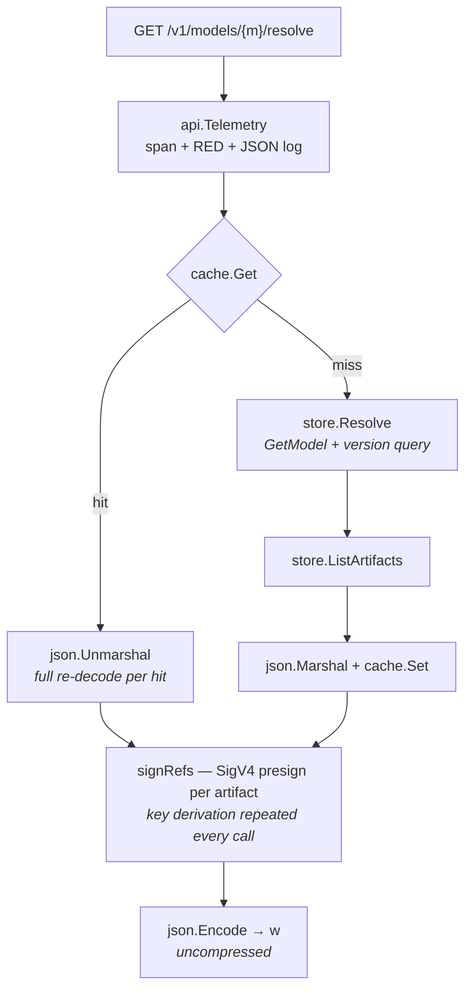
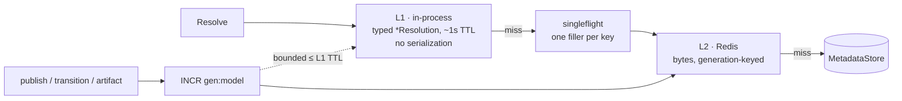

# 13 — Performance & Scale

> Status: **Proposed**. Every capability in `01`–`12` is implemented and correct; this doc is
> the optimization backlog that takes the implementation from *correct* to *state of the art*.
> Nothing here changes an API contract, a stored fact, or a locked decision (`00.11`). Items
> that would are marked **⚠ decision** and need a `00.11` entry first.

## 1. Scope & Method

| In scope | Out of scope |
|---|---|
| Read/write path latency, allocation, query shape | New features, new entities, new endpoints |
| Index and schema tuning (additive migrations) | Wire-format changes (`03`, `04` stay fixed) |
| Cache topology, HTTP transport, Go runtime, build | The marketing site (`site/`) |
| Multi-replica behaviour of in-process state | Auth (axiom 4 — infra owns it) |

**Rule: measure, then change.** Each item below names the code path it targets and the signal
that proves it worked (§10). No item lands without a benchmark or a load profile showing the
delta on the metric in §11.

**Workload model.** The registry is read-dominated and write-rare, with a bimodal read mix:

| Class | Caller | Frequency | Shape |
|---|---|---|---|
| **Resolve** (`04.2`) | inference pods, storage-initializer | very high, bursty, spiky on rollout | 1 model, tiny response, cacheable |
| **Fetch** (`04.3`) | storage-initializer, CI | moderate | GB-scale bytes, redirected off-box |
| **Console reads** (`06`) | humans | low | wide aggregates, N+1-prone |
| **Publish / transition** (`03`) | CI, humans | low | write, invalidates cache |
| **Scrape / probe** (`09`) | Prometheus, kubelet | fixed rate | must be O(1), currently is not |

Optimization effort is ranked by that table: resolve first, probes second (they are free to
fix and currently expensive), console third.

## 2. Where Time Goes Today



Confirmed cost centres, read from the code rather than assumed:

| # | Path | Cost | Site |
|---|---|---|---|
| 1 | Every `List*` | **Full table materialized in Go, then sliced** — `domain.Page` paginates a fully-scanned slice | `sqlstore/store.go:100,189,489`, `domain/pagination.go:52` |
| 2 | `/readyz` | Readiness probe = full `model` table scan, every few seconds, per pod | `observability/observability.go:59` |
| 3 | `/metrics` | Every scrape runs `Stats()`: 1 + N + 2N queries, no timeout, `context.Background()` | `core/service.go:147`, `metrics/app.go:95` |
| 4 | Console model list | N+1: `ListVersions` per model, each of which re-runs `GetModel` and scans all versions | `adminui/bff.go:254` |
| 5 | Any `model+version` op | 2 round trips — `GetVersion` does `GetModel` then the version query | `sqlstore/store.go:167` |
| 6 | Lineage traversal | N+1 per node (`ListLineage`) + N+1 hydration (`GetVersionByID`), on an **unusable index** | `core/lineage_graph.go:63,88` |
| 7 | `ListLineage` | `WHERE src_id=? OR dst_id=?` — `idx_lineage_src` leads with `src_type`, `dst_id` has no index at all → two full scans | `sqlstore/store.go:363`, `migrations.go:63` |
| 8 | GC sweep | `ArtifactRefsURI` per object with **no index on `artifact.uri`** → O(objects × artifacts) | `core/gc.go:49`, `migrations.go:34` |
| 9 | Resolve cache hit | `json.Unmarshal` of the whole resolution on every hit | `core/resolve.go:78` |
| 10 | Redis cache | 2 round trips per `Get` and per `Set` (generation lookup, then the key) | `cache/redis/cache.go:50` |
| 11 | Label-selector resolve | Lists **all** versions, filters in Go | `sqlstore/store.go:275` |
| 12 | Stream-through fetch | `io.Copy` into a wrapper without `ReadFrom` → loses the `sendfile` fast path | `api/telemetry.go:142`, `modelapi/router.go:325` |
| 13 | All responses | No compression negotiation anywhere in the binary | — |
| 14 | HTTP servers | No `ReadTimeout` / `WriteTimeout` / `IdleTimeout` / `MaxHeaderBytes` | `cmd/lineage/main.go:130` |
| 15 | Postgres pool | No `SetMaxOpenConns` / `SetMaxIdleConns` / `SetConnMaxLifetime` | `store/postgres/store.go:57` |
| 16 | SQLite | Only 3 pragmas set; one connection serializes **readers** as well as writers | `store/sqlite/store.go:29` |
| 17 | Go runtime | `GOMAXPROCS` sees node CPUs, not the cgroup limit; `GOMEMLIMIT` unset | `Dockerfile`, `deploy/helm` |
| 18 | Unbounded maps | Idempotency keys and pending uploads expire only on access | `modelapi/idempotency.go:31`, `core/service.go:27` |

Items 1–3 are the ones that turn a healthy registry into a slow one purely by growing.

## 3. Tier 1 — Push Work Into the Database

The single highest-value theme: the store currently reads whole tables and finishes the job in
Go. Every fix is an additive migration plus an adapter change, behind the existing
`MetadataStore` port — the core and both APIs are untouched.

### 3.1 Keyset pagination in SQL

`domain.Page` is a correct cursor implementation applied to the wrong place: it slices a slice
that already cost a full scan. Push the cursor into the predicate.

```sql
-- ListVersions, page 2+ (created_at DESC, id DESC)
SELECT … FROM model_version v JOIN model m ON m.id=v.model_id
WHERE v.model_id = ?
  AND (v.created_at < ? OR (v.created_at = ? AND v.id < ?))
ORDER BY v.created_at DESC, v.id DESC
LIMIT ?         -- pageSize + 1: the extra row decides nextPageToken
```

Keep `domain.Page` for the memory adapter (it has no SQL) and as the conformance oracle — the
`storetest` suite already asserts both adapters agree, so the pushed-down version is verified
against the in-Go one for free.

**Supporting indexes** (new migration entries — forward-only, `IF NOT EXISTS`):

| Index | Serves |
|---|---|
| `model (created_at DESC, id DESC)` | `ListModels` keyset |
| `model_version (model_id, created_at DESC, id DESC)` | `ListVersions` keyset |
| `audit_event (at DESC, id DESC)` | global activity feed (`/v1/audit`, console overview) |
| `artifact (uri)` | GC reference counting (#8) |
| `lineage_edge (src_id)`, `lineage_edge (dst_id)` | traversal (#7) — the existing composite is unusable for these predicates |

`idx_lineage_src (src_type, src_id)` stays for type-scoped queries; it is not a substitute.

### 3.2 Aggregate counts instead of counting rows in Go

`Stats()` (`core/service.go:147`) and the console rollup (`adminui/bff.go:254`) both compute
counts by listing. They are also silently wrong past 500 rows — `bigPage`/`ClampPageSize` caps
the list, so `VersionCount` and `Stats.Versions` under-report on any large registry.

Add to the `MetadataStore` port (additive, both adapters implement):

```go
// Counts returns registry-wide totals and the stage histogram in one round trip (§09.2).
Counts(ctx context.Context) (Counts, error)
// VersionRollups returns per-model version count + production pointer for a page of models.
VersionRollups(ctx context.Context, modelIDs []string) (map[string]Rollup, error)
```

SQL: four `COUNT(*)` in one statement (`SELECT (SELECT COUNT(*) FROM model), …`) plus one
`GROUP BY stage`; the rollup is a single `GROUP BY model_id` with a
`MAX(CASE WHEN stage='production' THEN name END)` — turning the console list from 1+2N queries
into 2, and fixing the >500 truncation as a side effect.

### 3.3 Cheap readiness

`/readyz` should cost one row, not one table: replace `ListModels(PageSize:1)` with
`SELECT 1` (`db.PingContext` plus a trivial select), and give the storage `Stat` probe its own
short timeout. Probes run forever at a fixed rate; they must be O(1) by construction.

### 3.4 Kill the mandatory extra round trip

`GetVersion` resolves the model first purely to get its id. Fold it into one statement:

```sql
SELECT v.…, m.name FROM model_version v JOIN model m ON m.id = v.model_id
WHERE (m.name = ? OR m.id = ?) AND v.name = ?
```

Same for `ListVersions` and `Resolve` (the join replaces the lookup). Distinguishing "no such
model" from "no such version" for the error message costs a second query **only on the miss
path**, which is where an extra query is free.

### 3.5 Recursive traversal in one query

`TraverseLineage` is a correct BFS in Go that pays a query per node plus a query per node
label. Both engines support `WITH RECURSIVE`; the walk becomes one statement per direction,
depth-bounded and cycle-safe via a visited path:

```sql
WITH RECURSIVE walk(id, depth) AS (
  SELECT ?, 0
  UNION
  SELECT CASE WHEN e.src_id = w.id THEN e.dst_id ELSE e.src_id END, w.depth + 1
  FROM walk w JOIN lineage_edge e ON e.src_id = w.id OR e.dst_id = w.id
  WHERE w.depth < ?
)
SELECT … FROM walk JOIN model_version v ON v.id = walk.id …
```

Keep the Go walk as the memory-adapter implementation and as the differential test oracle —
identical results on both paths is the acceptance criterion. Node hydration becomes one
`WHERE id IN (…)` batch instead of one lookup per node.

### 3.6 Selector and filter push-down

- **Label selector resolve** (#11): today `Resolve` with `label.k=v` lists every version. Push
  it down — Postgres `labels::jsonb @> ?`, SQLite `json_extract(labels,'$.k') = ?` (JSON1 is
  compiled into the modernc driver).
- **Custom-property filters** are currently a hard `Invalid` on SQLite (`sqlstore/store.go:67`).
  The same `json_extract` push-down **lifts that restriction**, making `cp.*` work on both
  engines. ⚠ decision — `00.11.3` says "some advanced queries are Postgres-only"; narrowing
  that list is a decision-record edit, not a silent change.
- **Substring search** (`name LIKE '%…%'`) is unindexable. Postgres: `pg_trgm` GIN. SQLite: an
  FTS5 shadow table, or accept the scan on a table that is small by definition. Recommend
  `pg_trgm` only, gated on the extension being available.

### 3.7 Make the JSONB push-down actually use an index

`JSONContainsClause` emits `labels::jsonb @> ?::jsonb` against a **TEXT** column. A GIN index
on `labels` cannot serve that cast. Two options:

| Option | Cost | Result |
|---|---|---|
| Expression index: `CREATE INDEX … USING gin ((labels::jsonb) jsonb_path_ops)` | additive migration, Postgres-only | Push-down becomes indexed, no schema change |
| Migrate the column to `JSONB` | rewrite migration, per-dialect divergence | Cleaner, but the shared logical schema drifts |

Recommend the expression index — it matches `00.11.3` ("shared logical schema, per-dialect
power") without forking the column type.

## 4. Tier 2 — Caching

Today: one cache tier, JSON-encoded, decoded on every hit, with no protection against a
stampede when a hot model is invalidated.



| Item | Change | Why |
|---|---|---|
| **L1 typed tier** | Cache `*Resolution` (deep-copied on read) in-process ahead of L2 | Removes `json.Unmarshal` per hit (#9); a resolve hit becomes a map lookup + presign |
| **Single-flight** | `golang.org/x/sync/singleflight` around the miss filler | A rollout invalidates a hot model and N pods resolve simultaneously; today all N hit the DB |
| **Negative caching** | Cache `NotFound` / "no version matches" for a few seconds | A misconfigured deployment loops on a missing model at full request rate |
| **TTL jitter** | ±10% on the 60s backstop (`core/resolve.go:117`) | Prevents synchronized expiry across pods |
| **Redis round trips** | One Lua script (or `GETEX` + pipeline) for gen+value; cache the generation in L1 for its TTL | Halves Redis RTTs (#10) |
| **Memory cache hygiene** | Bounded size + LRU + a sweeper goroutine | `cache/memory/cache.go` grows without bound; entries never re-read are never evicted |
| **Signing-key cache** | Cache the SigV4 derived key per (date, region, secret) | 4 HMACs per artifact per response → once per day |

**Staleness contract.** L1 makes a resolution stale for at most its TTL on pods that did not
handle the mutation. That is acceptable only if stated: **L1 TTL ≤ 1s, and the L1 tier is
disabled when `cache.engine=memory` with `replicaCount > 1`** (see §8). Document it in `04.4`
alongside the existing event-invalidation contract.

**Should signed URLs be cached?** No. `04.4` says they are minted per response and that stays —
it is what keeps TTLs honest per consumer. The signing-key cache above gets ~all of the win
without touching the contract.

## 5. Tier 3 — HTTP & Transport

| Item | Change | Notes |
|---|---|---|
| **Server timeouts** | `ReadHeaderTimeout` 5s, `ReadTimeout` 30s, `IdleTimeout` 120s, `MaxHeaderBytes` 1MiB on all three servers | Currently unset (#14) — a slow client pins a goroutine indefinitely. `WriteTimeout` must stay **0** on the Model API: stream-through fetch is unbounded in duration. Bound it per-handler with `http.ResponseController` instead |
| **Compression** | Negotiated `gzip` (and `zstd` when offered) on JSON responses above ~1KiB | Resolve responses, `openapi.json` (~100s of KiB), console list payloads. Never on `/content` — artifact bytes are already compressed and the redirect path never touches the process |
| **Precompressed statics** | Serve `.br`/`.gz` siblings from the embedded FS; `Cache-Control: public, max-age=31536000, immutable` for hashed Vite assets, `no-cache` for `index.html` | `static_embed.go` sets no cache headers at all — every console load refetches every asset |
| **`sendfile` fast path** | Implement `io.ReaderFrom` + `Unwrap()` on `statusRecorder` (`api/telemetry.go:142`) | Wrapping the `ResponseWriter` hides its `ReadFrom`, so stream-through `io.Copy` (#12) copies through userspace instead of `sendfile`. One method restores it |
| **HTTP/2 (h2c)** | Enable h2c on the Model API listener | Storage-initializers and SDKs open many concurrent resolves per pod; multiplexing beats connection churn behind a plaintext mesh |
| **BFF payload shape** | ETag + `304` on console reads; `?fields=` projection on `versionDetail` | `versionDetail` fetches artifacts, lineage, deployments, audit, insight, footprints and evaluations on every view |
| **Response encoding** | `json.Encoder` straight to the `ResponseWriter` with a pooled buffer | Avoids the intermediate `[]byte` in `api.WriteJSON` on large lists |

## 6. Tier 4 — Go Runtime & Build

| Item | Change | Expected |
|---|---|---|
| **GOMAXPROCS** | Set from the cgroup CPU limit (`automaxprocs`, or Helm downward API `resourceFieldRef: limits.cpu`) | On a 64-core node with a 500m limit, Go runs 64 Ps against half a core: scheduler thrash and latency tails. This is the largest free win in the doc |
| **GOMEMLIMIT** | Set to ~90% of the memory limit (`automemlimit`, or an explicit value) | Turns OOMKill into GC pressure |
| **PGO** | Collect a CPU profile under the §10 load profile, commit `cmd/lineage/default.pgo`, refresh per release | 2–7% typical, zero code change; Go picks the file up automatically |
| **pprof** | `net/http/pprof` on the **ops port only** (9090), off by default via `LINEAGE_PPROF=1` | Ops port is not exposed by the chart's ingress; needed to collect the PGO profile and to debug a live tail |
| **Allocation** | `sync.Pool` for the JSON encode buffer; preallocate scan slices from the page size; avoid `append([]func…)` copy per `Publish` (`events/bus.go:28`) | The event bus copies its subscriber slice on every publish |
| **Build** | Already `-trimpath -s -w`, cgo-free, distroless — no change | — |

Chart-side, expose `resources` → runtime env wiring in `values.yaml` so a self-hoster gets the
GOMAXPROCS/GOMEMLIMIT behaviour without knowing it exists. That is axiom 2: one `helm install`
yields a *correctly tuned* registry.

## 7. Tier 5 — Engine Tuning

### 7.1 SQLite (dev / small / edge tier)

Current DSN sets `foreign_keys`, `busy_timeout`, `journal_mode=WAL` and caps the pool at 1
connection — which serializes **reads** as well as writes, though WAL exists precisely so
readers never block.

| Change | Effect |
|---|---|
| `_pragma=synchronous(1)` (NORMAL) | The standard WAL durability/throughput trade; a fsync per commit becomes a fsync per checkpoint |
| `_pragma=cache_size(-64000)`, `temp_store(2)` | 64MiB page cache, temp tables in memory |
| `_pragma=mmap_size(268435456)` | Reads via mmap, fewer syscalls |
| **Split pools** | A **reader** pool (`SetMaxOpenConns(N)`, `?mode=ro`) plus a **single writer** connection | Concurrent resolves stop queueing behind each other. The single-writer invariant that `SetStage` relies on (`00.11.3`) is preserved because only the writer pool mutates — this must be asserted in `storetest`, not assumed |
| `wal_autocheckpoint` tuning + a periodic `PRAGMA optimize` | Bounds WAL growth; keeps the planner's stats fresh |

⚠ decision: the reader/writer split changes the concurrency story documented in `02.7`. Worth
an entry — it is the difference between SQLite being a demo tier and being a genuinely fast
small-deployment tier.

### 7.2 Postgres (HA / prod tier)

| Change | Effect |
|---|---|
| `SetMaxOpenConns` / `SetMaxIdleConns` / `SetConnMaxLifetime` / `SetConnMaxIdleTime` from config | Unbounded today (#15): a request spike opens connections until Postgres or pgbouncer refuses |
| Expose pool sizing in `values.yaml` with a documented relationship to `max_connections` | Self-hosters otherwise discover this during an incident |
| Verify pgx statement caching mode; prefer `QueryExecModeCacheStatement` unless behind a transaction-pooling pgbouncer (then `CacheDescribe`/`Exec`) | Wrong mode + pgbouncer = protocol errors under load, not just slowness |
| Expression GIN indexes (§3.7); `pg_trgm` for search (§3.6) | Indexed label/property/search filtering |
| **Read replicas** for resolve/list, writes to primary | `00.11.8` already parks this as "additive, later". Requires a `MetadataStore` that can route by intent — add a read-only variant of the port rather than a flag on every method |
| `pg_stat_statements` + `EXPLAIN (ANALYZE, BUFFERS)` in the runbook (`09`) | Makes the next regression diagnosable |

## 8. Multi-Replica Correctness That Reads as Performance

Three pieces of state live in process memory. With `replicaCount: 2` (the shipped prod profile,
`values-prod.yaml:7`) they are not merely slow — they are wrong, and the failure looks like a
performance problem.

| State | Site | Failure at 2 replicas | Fix |
|---|---|---|---|
| Idempotency keys | `modelapi/idempotency.go` | A retried `POST` routed to the other pod creates a **second** resource | Back with Redis (or a store table) when a shared cache is configured |
| Pending uploads | `core/service.go:27` | `initiate` on pod A, `finalize` on pod B → upload lost | Persist the ticket; it is already digest-verified on finalize |
| Memory resolution cache | `cache/memory` | Pod B serves a stale resolve for up to the 60s backstop | Chart should **fail** on `replicaCount>1` with `cache.engine=memory`, as it already does for `sqlite` (`_helpers.tpl:47`) |

Both maps also grow without bound (#18) — a sweeper is needed regardless of the tier.

## 9. Artifact Path (the actual bytes)

Resolve latency is milliseconds; pulling a 40GB checkpoint is minutes. The registry is not on
that path by design (`05.1`) — but it controls the plan the client executes.

| Item | Change |
|---|---|
| **Parallel ranged download** in the SDK / `lineage://` storage-initializer | N concurrent ranged GETs against the signed URL, written to a sparse file. This is the single biggest end-to-end win available to a consumer, and it lives in `10`, not the server |
| **Checksum offload** | Request `x-amz-checksum-sha256` on signed PUTs so `finalize` trusts the backend's computed digest instead of re-streaming under the size cap (`05.6`) |
| **Adaptive part size** | Scale multipart part size with declared size (cap at ~10k parts) rather than a fixed size |
| **Sign once, fan out** | One presign per artifact reused across ranges — already true; assert it in the initiator |
| **GC** | `artifact(uri)` index (§3.1) plus paginated `ListObjects`; sweep in batches with a bounded `IN (…)` reference check instead of one query per object |

## 10. Verification Harness

Nothing above ships on intuition. Add to the repo (and to `make`):

| Layer | Tool | Gate |
|---|---|---|
| Micro | `go test -bench` + `benchstat` on `core.Resolve` (hit/miss), `sqlstore` list/paginate, SigV4 presign | Committed baseline; regression fails CI |
| Query | `EXPLAIN QUERY PLAN` (SQLite) / `EXPLAIN (ANALYZE, BUFFERS)` (Postgres) asserted in `storetest` for the hot queries | An index that stops being used fails a test, not an incident |
| Seed | Extend `cmd/lineage-seed` with a `--scale` profile (10k models × 20 versions × 5 artifacts) | Makes #1–#4 visible at all |
| Load | `k6`/`vegeta` profiles: sustained resolve, resolve-after-invalidation burst, console browse, publish mix | Run against the seeded scale set |
| Profile | `pprof` CPU + heap under the resolve profile → also the PGO input | Two artifacts from one run |

`storetest` is the leverage point: it already runs every adapter against one conformance suite,
so a pushed-down query is validated against the in-Go implementation automatically.

## 11. Targets

`09.5` sets the current SLOs. These are the post-optimization targets, at the seeded scale set
(10k models / 200k versions) — they are the acceptance criteria for this doc, not aspirations.

| Metric | Today (unmeasured, structural estimate) | Target |
|---|---|---|
| Resolve p99, cache hit | < 50 ms (`09.5`) | **< 5 ms** (typed L1, no unmarshal) |
| Resolve p99, cache miss | grows with artifacts per version | < 25 ms |
| Resolve throughput per pod | limited by unmarshal + presign | ≥ 10k rps at 1 core |
| `ListModels` p99 @ 10k models | O(table) — hundreds of ms | < 20 ms (keyset + index) |
| `/metrics` scrape | O(models × versions), unbounded | < 50 ms, hard-bounded by timeout |
| `/readyz` | full table scan | < 1 ms |
| Lineage traversal, depth 3 | O(nodes) queries | 1–2 queries, < 30 ms |
| Resolve DB queries after invalidation of a hot model | N (one per caller) | 1 (single-flight) |
| Memory per pod, steady | unbounded (3 leaking maps) | bounded, `GOMEMLIMIT`-governed |

Add two SLIs to `09.2` to make these observable: resolve cache hit **ratio** (the counters
exist; the ratio needs a recording rule) and a store-query duration histogram labeled by
method — the store decorator (`tracing.Store`) is already the seam for it.

## 12. Sequencing

Ordered by (impact ÷ effort), and by what unblocks measurement.

```mermaid
flowchart LR
    subgraph w1["Wave 1 · free wins"]
        a["GOMAXPROCS/GOMEMLIMIT"]
        b["server timeouts"]
        c["cheap /readyz"]
        d["missing indexes"]
        e["ReadFrom passthrough"]
    end
    subgraph w2["Wave 2 · measure"]
        f["seed --scale"]
        g["benchmarks + benchstat"]
        h["pprof on ops port"]
    end
    subgraph w3["Wave 3 · the real work"]
        i["keyset push-down"]
        j["Counts / rollup aggregates"]
        k["L1 + single-flight"]
        l["pool tuning both engines"]
    end
    subgraph w4["Wave 4 · depth"]
        m["recursive lineage CTE"]
        n["compression + statics"]
        o["shared idempotency/uploads"]
        p["PGO"]
    end
    w1 --> w2 --> w3 --> w4
```



| Wave | Effort | Risk | Touches a contract? |
|---|---|---|---|
| 1 | S | low | no |
| 2 | M | none | no |
| 3 | M–L | medium (query rewrites, guarded by `storetest`) | no |
| 4 | L | medium | `04.4` staleness note; ⚠ `02.7` for the SQLite pool split |

## 13. Considered and Rejected

| Idea | Why not |
|---|---|
| Cache signed URLs | Breaks the per-response TTL contract (`04.4`) for a win the signing-key cache already delivers |
| Proxy artifact bytes through the registry for a "unified" path | Contradicts `05.1`; makes the registry a bandwidth bottleneck and a scaling problem |
| Denormalize a `production_version_id` onto `model` | A second source of truth for the singleton invariant (`02.4`); the indexed `(model_id, stage)` lookup is already fast |
| Materialized counts table | Same reasoning — aggregate queries at this scale are cheap once indexed; a counter table is a consistency bug waiting to happen |
| gRPC for resolve | `00.11.6` defers it; HTTP/2 + a small JSON body gets most of the latency win without a second contract |
| Swap `encoding/json` for a codegen encoder | Measure first — with typed L1 caching the encode is no longer the hot spot, and it costs a generated-code dependency |
| In-process query cache keyed by SQL | The resolution cache already covers the hot path at the right semantic layer, with correct invalidation |
