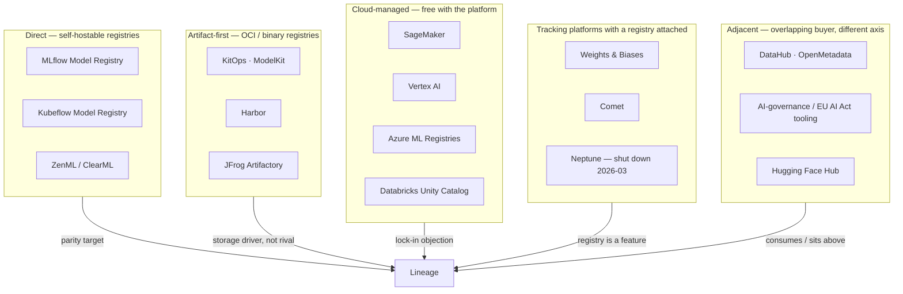

# 14 — Competitive Landscape

This chapter looks at the products that compete with—or overlap with—Lineage. It
focuses on three practical questions:

1. What alternatives are available?
2. What problems do their users report?
3. Which of those problems is Lineage designed to solve?

The evidence comes from issue trackers, vendor documentation, and practitioner
reports. Marketing claims are excluded unless a primary source supports them.
Claims that come from a competitor's own blog are marked ⚠ and should be treated
with extra caution.

---

## 1. Market overview

| Band | Threat | Why |
|---|---|---|
| Direct | **High** | Solves the same problem for the same self-hosted buyer |
| Artifact-first | Medium | Strong artifact delivery, but limited model metadata and lifecycle support |
| Cloud-managed | Medium | Often included with the cloud platform, but tied to one provider |
| Tracking platforms | Low | The registry is secondary to experiment tracking |
| Adjacent | Low | Mostly complementary; catalogs can consume data from Lineage |

---

## 2. MLflow Model Registry

MLflow is the established option. It has a large self-hosted user base and, as a
result, the clearest public record of user-reported problems.

| Pain | Evidence |
|---|---|
| 1 GB upload takes 5+ min; server RAM climbs past 30 GB | [#22665](https://github.com/mlflow/mlflow/issues/22665) |
| Models >50 MB throw urllib3 protocol errors | [#8963](https://github.com/mlflow/mlflow/issues/8963) |
| 1.3 GiB download dies at 500 MB | [#13447](https://github.com/mlflow/mlflow/issues/13447) |
| UI download fills ephemeral storage, crashes server | [#10331](https://github.com/mlflow/mlflow/issues/10331) |
| Hard 5 GB ceiling on `log_model` (S3 artifact repo) | [#5083](https://github.com/mlflow/mlflow/issues/5083) |
| No native RBAC — one shared namespace unless proxied | [lakeFS](https://lakefs.io/blog/mlflow-model-registry/) |
| No approval gates → "data scientists overwriting production models" | [Mindful Chase](https://www.mindfulchase.com/explore/troubleshooting-tips/machine-learning-and-ai-tools/troubleshooting-mlflow-in-enterprise-ml-pipelines-tracking,-registry,-and-artifact-issues.html) |
| Stages deprecated 2.9 → aliases; promotion automation rewritten | [MLflow docs](https://mlflow.org/docs/latest/ml/model-registry/workflow/) |
| Default file backend has no indexing; Postgres effectively mandatory | [lakeFS](https://lakefs.io/blog/mlflow-model-registry/) |

**What is causing these problems?** Model data passes through the tracking server.
For models larger than 50 GB, an MLflow maintainer recommends storing the weights in
S3 and using MLflow only for metadata
([#21127](https://github.com/mlflow/mlflow/discussions/21127)). That workaround matches
Lineage's axiom 6: the metadata service should not sit in the path of large artifact
transfers. In Lineage, this separation is part of the original design.

**Lifecycle migrations remain a concern.** MLflow replaced stages with aliases, and
Databricks later introduced another migration in Unity Catalog (§5). Teams that
depended on fixed stages have therefore had to update their workflows twice.

---

## 3. Kubeflow Model Registry — the closest feature benchmark

| Pain | Evidence |
|---|---|
| Still **alpha** with "limited support" after 2+ years | [Kubeflow docs](https://www.kubeflow.org/docs/components/hub/overview/) |
| Project renamed/absorbed into Kubeflow Hub mid-flight | [kubeflow/hub](https://github.com/kubeflow/model-registry) |
| MLMD removed for "long-term maintainability" | [architecture](https://www.kubeflow.org/docs/components/model-registry/reference/architecture/), [OpenShift AI 2.23](https://docs.redhat.com/en/documentation/red_hat_openshift_ai_cloud_service/1/html/release_notes/support-removals_relnotes) |
| MLMD failed opaquely — `Cannot find context`, lost pipeline records | [manifests#2800](https://github.com/kubeflow/manifests/issues/2800) |
| KServe custom storage initializer broken against MinIO-registered models | [#1532](https://github.com/kubeflow/model-registry/issues/1532) |
| No metadata export/import — open since inception | [#7](https://github.com/kubeflow/model-registry/issues/7) |
| Thin registration/management UI | practitioner reports |

**Why this matters for Lineage:** after two difficult years, Kubeflow moved toward a
similar architecture. Its removal of ML Metadata (MLMD) in July 2025 supports the
reasoning behind Lineage's axiom 5 and decision §11.9. The storage-initializer issue
also demonstrates the registry-to-serving integration problem described by axiom 8.

The benchmark table in §9 remains useful. It should also list *metadata export* as a
capability that Kubeflow does not currently provide.

---

## 4. Artifact-first tools — KitOps, Harbor, and JFrog

This category provides some of the clearest performance evidence, with meaningful
advantages as well as important limits.

**Where OCI helps:** node-cached OCI delivery adds a warm replica for a 70B-class artifact in
**11.7 s vs 40.7 min** re-downloading from object storage — **208×**
([arXiv 2607.16596](https://arxiv.org/abs/2607.16596)). KServe shipped
`serving.kserve.io/enable-model-cache` and Modelcars in response.

**Where OCI struggles:** common registry limits become significant at model scale:

| Product | Limitation |
|---|---|
| Harbor | **128 GB per-layer cap**; a quantized Llama-3-70B is ~140 GB, frontier multimodal >1 TB ([CNCF](https://www.cncf.io/blog/2026/03/27/the-weight-of-ai-models-why-infrastructure-always-arrives-slowly/)) |
| JFrog | Format-agnostic model loading **requires a single file, not a directory** — every HF-format model is a directory ([docs](https://jfrog.com/help/r/jfrog-artifactory-documentation/machine-learning-limitations-in-artifactory)) |
| JFrog | HF proxying inherits the configured Hub identity's rate limits; surface-level Xet ≈ **2× storage footprint** ⚠ ([HF](https://huggingface.co/blog/jeffboudier/jfrog-artifactory-june-2026)) |
| KitOps | Requires OCI registry; CLI-only (visualisation needs the paid Jozu Hub); Kitfile learning curve |
| KitOps | Independent criticism is nearly absent — a low-adoption signal, not a quality signal |

**The opportunity for Lineage:** Harbor notes that images cannot *"capture crucial
metadata of the model such as hyperparameters, training indicators, and storage
formats,"* which *"scales poorly as models and versions multiply"*
([Harbor](https://goharbor.io/blog/cloud-native-ai-model-management/)).

**How these tools fit with Lineage:** they are more complementary than competitive.
Lineage manages lifecycle, governance, and resolution, while OCI can serve as one
implementation behind the storage interface (decision §11.4).

---

## 5. Cloud-managed registries

| Product | Pain | Evidence |
|---|---|---|
| **SageMaker** | Collections **unsupported in VPC mode** — disqualifying for regulated buyers | [limits](https://docs.aws.amazon.com/sagemaker/latest/dg/modelcollections-limitations.html) |
| | 10 Model Groups per Collection, 48 Collections per Group, 1 000-model quota | ibid. |
| | Model Cards and Registry built on **separate APIs**; governance metadata didn't join up | [AWS](https://aws.amazon.com/blogs/machine-learning/improve-governance-of-models-with-amazon-sagemaker-unified-model-cards-and-model-registry/) |
| | SDK churn broke `RegisterModel` → `ModelStep` | [re:Post](https://repost.aws/knowledge-center/sagemaker-model-registry-issues) |
| **Vertex AI** | **Region-scoped models** — cross-region artifacts cost latency and egress | [Cake](https://www.cake.ai/blog/google-vertex-alternatives-portability-compliance-and-control) |
| | *"You still need to implement promotion/approval workflows — there is no automatic governance"* | ibid. |
| | Deletion silently breaks dependent deployments; idle validation endpoints bill | ibid. |
| **Azure ML** | **Cross-workspace ops unsupported in MLflow**; org registries unsupported for MLflow model management — the cross-workspace registry doesn't work with the API people use | [MS Learn](https://learn.microsoft.com/en-us/azure/machine-learning/how-to-manage-models-mlflow?view=azureml-api-2) |
| | Exfiltration protection blocks sharing when storage public access is disabled — **the secure config breaks the feature** | [MS Learn](https://learn.microsoft.com/en-us/azure/machine-learning/how-to-registry-network-isolation?view=azureml-api-2) |
| | Data sharing still preview, no SLA | ibid. |
| **Unity Catalog** | Forced migration off Workspace Registry: **comments unsupported**, email notifications must be rebuilt, **every model now requires a signature** | [Databricks](https://docs.databricks.com/aws/en/machine-learning/manage-model-lifecycle/migrate-to-uc) |
| | Stages → aliases rewrite on top of MLflow's own | ibid. |

**Common pattern:** these platforms added governance after building their storage
systems. SageMaker splits related features across APIs, Vertex leaves approval
workflows to the user, and Unity Catalog loses comments during migration. In each
case, customers must build or rebuild part of the lifecycle and approval process.

---

## 6. Tracking platforms that also include a registry

| Product | Pain |
|---|---|
| **W&B** | Self-hosted server *"requires careful tuning and occasional upgrades break it"* — reported **~3 engineer-weeks to stabilise + ~1 engineer-week/quarter** ⚠ ([practitioner](https://enterprisedna.co/resources/blog/practitioner-weights-biases/)) |
| | Self-hosting is **enterprise-tier only** |
| | Cost surprises are the top complaint; Pro *"scales poorly past 20 seats"*; storage a separate negotiation; media-heavy teams see storage dominate spend |
| | Free-tier rate limits cause **silent** sweep-run loss |
| **Comet** | Little independent evidence; overlapping tracking + registry + monitoring |
| **Neptune** | **Acquired by OpenAI; SaaS shut down 2026-03-06; all cloud data permanently deleted, no recovery** ([support](https://support.neptune.ai/en/articles/13925412-faq), [InfoWorld](https://www.infoworld.com/article/4101200/openai-to-acquire-ai-training-tracker-neptune.html)) |
| **ZenML** | Registry **only usable if you also adopt their experiment tracker** ([docs](https://docs.zenml.io/stacks/stack-components/model-registries)) |
| **ClearML** | Storage/logging quota overages billed; whole-platform adoption required for one component |

**Shared weakness:** customers must adopt a larger platform to use the registry.
Neptune provides the clearest support for axiom 1: a hosted registry closed with
three months' notice, and the provider permanently deleted its customers' cloud data.

---

## 7. Adjacent products and market drivers

| Segment | Position |
|---|---|
| **DataHub / OpenMetadata** | ML models are first-class entities with MLflow/SageMaker/Vertex ingestion, but purely descriptive — no artifact delivery, no promotion gates, no resolve API. They sit **above** Lineage and consume from it. |
| **Hugging Face Hub** | Enterprise Hub *"remains a multi-tenant cloud service and doesn't solve the core need for a truly self-hosted, physically isolated platform"* ⚠. Emerging pattern: vet and approve upstream, then sync approved models into a private instance — a Lineage ingestion use case. |
| **AI-governance tooling** | Demand-side tailwind, not a competitor. |

### EU AI Act timing

There are two relevant timelines. The obligation most closely related to a model
registry is already in force, even though discussions often focus on the later
high-risk deadlines.

| Obligation | Binds | Registry-shaped? |
|---|---|---|
| **GPAI** — Art. 53, Annex XI/XII | **in force** since 2 Aug 2025 | **Yes.** Annex XII is substantially a model card |
| High-risk — Art. 6–15, Annex III | **2 Dec 2027** | Partly — 2 of 10 Annex IV headings |
| High-risk — Annex I, product-embedded | **2 Aug 2028** | Same |

The high-risk dates changed. The **Digital Omnibus on AI** (in force July 2026) deferred them
from Aug 2026/2027 to fixed dates in Dec 2027/Aug 2028, dropping the originally proposed
standards-availability trigger. An August 2026 high-risk deadline is therefore no
longer accurate. Meanwhile, the GPAI obligation—a much closer fit for a model
registry—has already been in force for a year. See `15` for the full analysis.

The documented status quo closely matches the problem Lineage aims to solve: *"model inventories often live in
spreadsheets, approvals run through email, and risk classifications get assigned once and
drift out of date… it would take weeks to answer which AI systems they have in production"*
([Lyceum](https://lyceum.technology/magazine/eu-ai-act-technical-requirements-ml-teams/),
[Alation](https://www.alation.com/blog/eu-ai-act-compliance-guide/)). Lineage maps
these needs to specific features: inventory queries and drift detection in `16`, the
approval trail in axiom 7, and provenance in `07`.

**Important limitation:** the Act's record-keeping articles (12 and 19) govern *runtime
inference logs*, not registry audit logs — a distinction `15.3.3` draws explicitly because it
is an important distinction. Registry audit logs should not be presented as a
substitute for runtime inference logs.

---

## 8. Cross-cutting failure modes

| # | Failure mode | Seen in | Lineage answer |
|---|---|---|---|
| 1 | Bytes flow through the metadata service | MLflow, Harbor, JFrog | Axiom 6 + signed-URL delivery (`05`) |
| 2 | Governance bolted on after storage | SageMaker, Vertex, UC | Audit-by-default (axiom 7), lifecycle in `02` |
| 3 | Registry→serving handoff is glue code | Kubeflow #1532, KServe | Native `storageUri` + `lineage://` initializer (`04`) |
| 4 | Access control is the universal hole | MLflow, Azure, W&B | Axiom 4 — delegated, **must be argued not dodged** |
| 5 | Lifecycle models redesigned under users | MLflow, UC | Designed once in `02`; stages are ours, not inherited |
| 6 | Platform-adoption tax for one component | ZenML, ClearML, W&B | Single-purpose binary, `08` Helm install |
| 7 | Hosted service can vanish | Neptune | Axiom 1 |

---

## 9. Opportunities not yet well served

| Gap | Detail |
|---|---|
| **GenAI-era objects** | Registries assume one model = one artifact. LoRA adapters need base-model pinning; *"when a hosted provider updates their base model, your adapter may degrade silently"* ([huuphan](https://www.huuphan.com/2026/04/lora-assumption-mistakes.html)). Nobody tracks that dependency. Our provenance edges (`07`) are the right primitive — verify `02` can express base↔adapter. |
| **Provider-liability blind spot** | Fine-tuning a third-party model can transfer the full provider burden under Art. 25, and no registry surfaces it. We already compute the technical delta (`11.4`); `17` routes it to a human. Nobody else holds the primitive. |

---

## 10. Lineage's current weaknesses

| Exposure | Detail |
|---|---|
| **OCI deferred (§11.4)** | The best-quantified pain in the field — 208× cold start — is answered by OCI node-caching, which v1 does not ship. Blob + signed URL does not close it. Either accept the gap explicitly or reconsider driver ordering. |
| **RBAC question (§11.10)** | MLflow's top complaint is "no RBAC". Our answer is "infra owns it" — correct, but it *sounds* like the same gap. Needs a positioned answer in `08`, not silence. |
| **Kubeflow is a moving target** | Alpha, renamed to Hub, post-MLMD. The §9 parity table needs re-checking against Hub v1, not the 2024 component. |

---

## 11. Positioning summary

Lineage's clearest response to each major competitor category is:

| Against | Objection | Answer |
|---|---|---|
| MLflow | "We already have one" | Audit-by-default, real lifecycle governance, machine-facing resolve API, artifacts that don't melt the server |
| OCI / Artifactory / Harbor | "It's just artifacts" | Metadata-authoritative, storage-agnostic; OCI becomes a driver, not a competitor |
| Cloud registries | "Free with the platform" | Self-hosting first, one `helm install`, no region scoping, and no SaaS that can vanish — there is no hosted tier at all, by decision (`00.11.15`) |
