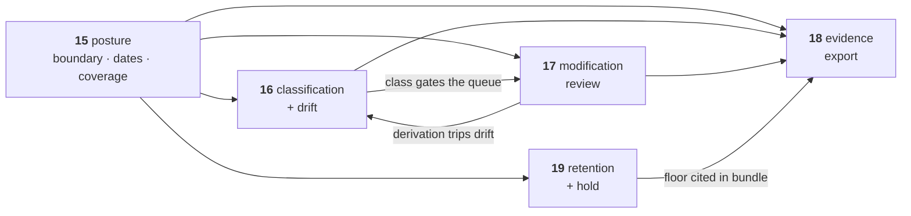

# 15 — EU AI Act Posture

> **Regime: EU AI Act.** This doc is entirely jurisdictional — every date, article, and
> coverage claim is EU. It does not generalize, and it should not be read as Lineage's
> position on regulation broadly. §2.1 says which of `16`–`19` share that scope.
>
> Status: **Proposed**. The framing doc for `16`–`19`: what Lineage will and will not claim
> about the EU AI Act, the deadlines that actually apply, how far our coverage honestly
> reaches, and the order we build in. **No schema, no API** — those live in the four docs
> this one governs.

## 1. What This Is

The EU AI Act makes companies produce a dossier about each model they put into production.
Today they assemble it by hand — the facts are scattered across a registry, a wiki, and a
spreadsheet.

**Lineage already stores most of those facts. `16`–`19` make it print them in the shape a
regulator asks for, and state plainly which parts it does not hold.**

Nothing in these four docs is a new source of truth. Every capability is a query, an export,
or a lock over data `02`–`11` already own.

## 2. The Four Capabilities

| Doc | Capability | In one line |
|---|---|---|
| `16` | **EU risk classification & drift** | Record how risky a model is, then notice when that answer goes out of date |
| `17` | **EU modification review** | Warn when editing someone else's model may make you legally responsible for it |
| `18` | **Evidence export** | One call produces the dossier — including a list of what is missing |
| `19` | **Retention & legal hold** | Records that must be kept for years cannot be deleted |

### 2.1 Which of these are EU-only

Three of the five carry `eu-` in their name. Two deliberately do not, and the split is a
design claim rather than a filing convention.

| Doc | EU-marked | Why |
|---|---|---|
| `15` this doc | **yes** | Every date, article, and coverage claim is jurisdictional |
| `16` classification | **yes** | The enums *are* EU citations — `high_annex_iii` is not a risk level. Fields are `eu_*`-prefixed (`16.3.1`) |
| `17` modification review | **yes** | Art. 25 is the entire reason it exists; the queue gate reads `16`'s EU class |
| `18` evidence export | **no** | The mechanism is a **profile** — a mapping from stored facts to one document structure. Both shipped profiles are EU; NIST AI RMF and ISO/IEC 42001 are named as future profiles (`18.11`). Marking the doc EU would contradict its own extension seam |
| `19` retention & hold | **no** | Legal hold and retention floors are jurisdiction-neutral — the term comes from US litigation practice. Only the *default values* (3650 days) cite Art. 18, and they are config, not schema |

The rule this follows: **mark the doc EU when the mechanism is EU, not when the current
content happens to be.** `18` and `19` would survive a second regime untouched; `16` and `17`
would each gain a sibling.

## 3. The Boundary

**Lineage is an evidence substrate, not a compliance product.** It shapes facts; it does not
adjudicate them. The same distinction `11.1` draws — the registry stores facts and does not
derive them — applied one level up.

| Lineage does | Lineage does not |
|---|---|
| Emit stored facts in a regulation's structure | Say a filing is complete or correct |
| Record a **declared** risk class and flag staleness | Decide a risk class |
| Report what changed technically between versions | Rule on whether that change is *substantial* in law |
| Refuse deletions that would destroy evidence | Advise on retention periods |
| Make export an audited, reproducible act | Sign, certify, or submit anything |

Three rules follow. Each is load-bearing, and each is enforced in a specific doc.

### 3.1 A model is not an AI system

The Act regulates AI *systems* (risk tiers) and GPAI *models* (Art. 53/55) under two separate
regimes. Lineage registers models. One system may embed several models; one model may serve
several systems.

So every system-level fact is **a claim by the operator**, carried with `11.2` provenance —
never an inference by the registry, which structurally lacks the context such a judgement
needs. Enforced in `16.3` (two fields, not one) and `16.7` (`source` is always `declared`).

### 3.2 Never fill a gap

An unfilled dossier heading is emitted as an explicit `"not_held_by_registry"`, never as an
absent key. A blank reads as finished; a gap that announces itself is a to-do list.

This is `12.2` rule 1 applied to a legal artifact, where the cost of a silent omission is
borne by whoever files it. Enforced in `18.4` (the ten-heading status table) and `18.6`
(fixed gap-note strings).

### 3.3 The audit log is not Art. 12 logging

Art. 12 and 19 require the *deployed system* to record its own inferences at runtime.
`audit_event` records who changed the *registry*. Two logs, two questions.

The only genuine overlap is Art. 12(2)(a) — detecting a substantial modification — which is a
registry event and is handled in `17`. This is the easiest overclaim available here and the
easiest for a buyer's engineer to catch.

## 4. The Clock

The **Digital Omnibus on AI** (Parliament 16 Jun 2026, Council 29 Jun 2026, in force Jul 2026)
deferred the high-risk obligations to **fixed** dates — the originally proposed
standards-availability trigger was dropped.

| Obligation | Binds |
|---|---|
| GPAI models — Art. 53, Annex XI/XII | **in force** (2 Aug 2025) |
| Transparency — Art. 50 | **in force** (2 Aug 2026) |
| High-risk, Annex III stand-alone — Art. 6–15, 16–27, 49 | **2 Dec 2027** |
| High-risk, Annex I product-embedded | **2 Aug 2028** |

**The registry-shaped obligation that binds today is GPAI, not high-risk.** Annex XII is
substantially a model-card schema plus a 14-day response deadline to downstream integrators —
so it is the export profile that ships first (`18.3`, §7 here).

High-risk work has a 16-month runway landing ahead of a 2027 procurement cycle: worth
designing now, worth nobody's crash schedule.

## 5. Coverage Map

Articles 9–15 mostly govern the *provider's process*, not a metadata store. The honest
coverage is narrower than the article range suggests.

| Article | Fit | Where |
|---|---|---|
| **53 + Annex XII** — GPAI to downstream | **direct** | `18.3` — the profile that binds now |
| **25** — modification makes you the provider | **direct** | `17` |
| **11 + Annex IV** — technical documentation | **partial, strongest** | `18.4` — 2 held / 5 partial / 3 not held |
| **18** — documentation kept 10 years | gap → `19` | `archived` retains, but no hold and no stated floor |
| **10** — data governance | pointer only | `trained_on` names the dataset; curation methodology lives elsewhere |
| **49** — EU database registration | thin | registration fields are mostly `02` already |
| **12 / 19** — record-keeping, log retention | **no — see §3.3** | Runtime inference logs, not registry logs |
| **9** risk mgmt · **14** oversight · **15** cybersecurity | none | Process obligations with no registry surface |

## 6. Non-Goals

Global to `16`–`19`. Per-doc non-goals sit in each doc.

| Not in scope | Reason |
|---|---|
| Determining a risk class | §3.1. A legal judgement about a system, from context the registry does not hold. |
| Asserting substantial modification | `17.3`. The registry reports the technical delta only. |
| Conformity assessment, CE marking, EU database submission | Filing workflows. The bundle is an input to them. |
| Art. 12/19 runtime inference logging | §3.3. A concern for the deployed system. |
| Risk management, human oversight, cybersecurity | Process obligations. Named as gaps in the bundle (`18.6`). |
| Advising on retention periods | `19`. Lineage enforces a configured floor and reports it. |
| Jurisdictions beyond the EU AI Act | The profile mechanism (`18.2`) is the extension point if ever needed. |

## 7. Build Order

Sequenced so each phase ships something usable and nothing blocks on an open decision it
doesn't need.

| Phase | Ships | Doc | Depends on |
|---|---|---|---|
| **1** | `classification` table, `PUT`/`GET`, drift predicate, inventory filter | `16` | — |
| **2** | `annex-xii` bundle + `evidence_bundle` + determinism test | `18` | 1 |
| **3** | Console inventory + compliance panel | `16`, `18` | 1, 2 |
| **4** | `legal_hold`, retention floor, config keys | `19` | — |
| **5** | `modification_review`, queue, console review view | `17` | 1, `11.4` |
| **6** | `annex-iv` profile + gap notes | `18` | 2, 5 |
| **7** | `audit_epoch`, sealer, `:verify`, `:proof` | `19` | — |

**Nothing is blocked.** `00.11.13` and `00.11.14` are both resolved (deletion refuses; Merkle
epoch sealing, on by default), so the sequence is now ordering by value rather than by which
decision is open.

**Phases 1–3 are the shippable near-term slice** — they answer a live GPAI obligation (§4).
Phase 4 comes next because a retention story is what makes phases 2 and 6 credible rather than
decorative. Phase 7 is last only because it is independent, not because it is uncertain: the
`13` measurement that once gated it is moot now that sealing costs the write path nothing
(`19.5.2`).

## 8. See Also

| For | Doc |
|---|---|
| Risk classification, drift predicate | `16` |
| Art. 25 modification review queue | `17` |
| Bundle profiles, shape, determinism | `18` |
| Legal hold, retention floor, Merkle epoch sealing | `19` |
| Entities, audit invariants | `02` |
| Fingerprint verdicts | `11.4` |
| Regulatory positioning | `14.7` |
