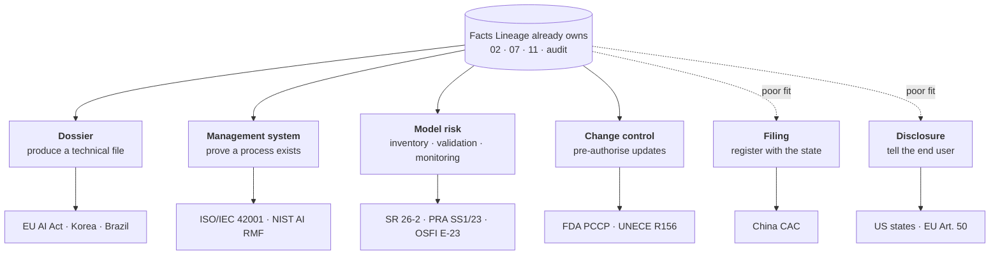
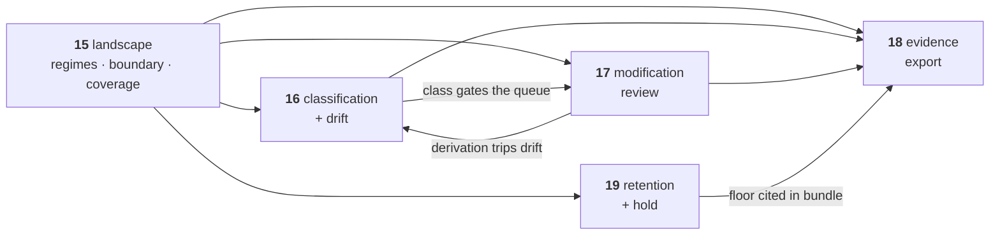

# 15 — Regulatory Landscape

> **Regime: neutral.** This doc maps the governing bodies that ask for model evidence, what
> each one asks for, and where Lineage sits against them. The EU AI Act is the regime `16`–`19`
> build out; §4 scopes it, and §4.3 says which of those four docs are EU-only.
>
> Status: **Proposed**. The framing doc for `16`–`19`: what Lineage will and will not claim,
> which obligations actually bind, how far our coverage honestly reaches, and the order we
> build in. **No schema, no API** — those live in the four docs this one governs.
>
> ⚠️ **Volatile.** Every status below was verified **August 2026** against the primary source
> linked. This area moves faster than any other regulatory domain — Colorado repealed its AI
> Act before it took effect, Canada's AIDA died with a Parliament, and SR 11-7 was superseded
> after fifteen years. Treat the **shapes** (§2.6) as durable and the **dates** as needing a
> re-check before anyone cites them.

## 1. What This Is

Regulators, auditors and buyers increasingly ask a company to produce a dossier about each
model it puts into production. Today it is assembled by hand — the facts are scattered across
a registry, a wiki, and a spreadsheet.

**Lineage already stores most of those facts. `16`–`19` make it print them in the shape
someone asks for, and state plainly which parts it does not hold.**

Nothing in those four docs is a new source of truth. Every capability is a query, an export,
or a lock over data `02`–`11` already own. That is why this doc leads with the landscape
rather than one statute: the *evidence* is regime-agnostic, and only the *packaging* is
jurisdictional (`18.2`).

## 2. The Landscape

### 2.1 Comprehensive AI statutes

| Jurisdiction | Governing body | Instrument | Status (Aug 2026) |
|---|---|---|---|
| **EU** | European Commission — [AI Office](https://digital-strategy.ec.europa.eu/en/policies/ai-office); national market surveillance authorities | [AI Act — Reg. (EU) 2024/1689](https://eur-lex.europa.eu/eli/reg/2024/1689/oj) | In force. GPAI binds since 2 Aug 2025; the Digital Omnibus deferred high-risk to fixed dates (§4.1) |
| **South Korea** | Ministry of Science and ICT (MSIT) | [Framework Act on AI Development and Establishment of Trust](https://cset.georgetown.edu/publication/south-korea-ai-law-2025/) | **In force 22 Jan 2026** — the first comprehensive national AI law actually enforced. High-impact tier + genAI labelling |
| **China** | [Cyberspace Administration of China](http://www.cac.gov.cn/) (CAC), with MIIT, MPS, NRTA | Algorithmic Recommendation Provisions (2022); Deep Synthesis (2023); [Interim Measures for Generative AI](https://www.chinalawtranslate.com/en/generative-ai-interim/) (15 Aug 2023); [AI content labelling Measures](https://www.chinalawtranslate.com/en/ai-labeling/) (1 Sep 2025) | In force. A **filing/registration** regime, not a dossier regime — §2.6 |
| **Brazil** | National Congress — Chamber of Deputies | [PL 2338/2023](https://www25.senado.leg.br/web/atividade/materias/-/materia/157233) | Senate-approved 10 Dec 2024; still pending in the Chamber. EU-modelled risk tiers |
| **Japan** | Cabinet Office / METI | AI Promotion Act (2025) | In force. Promotion-oriented, no penalties |
| **US — federal** | — (no comprehensive statute) | [EO 14365, "Ensuring a National Policy Framework for AI"](https://en.wikipedia.org/wiki/Executive_Order_14365) (11 Dec 2025) | Executive policy favouring a uniform national framework over divergent state law |
| **US — California** | Attorney General; [CPPA](https://cppa.ca.gov/) | [SB 53 — Transparency in Frontier AI Act](https://leginfo.legislature.ca.gov/faces/billNavClient.xhtml?bill_id=202520260SB53) (eff. 1 Jan 2026); CPPA ADMT regulations | In force. Frontier-developer transparency reports + safety incident reporting |
| **US — Texas** | Attorney General | [TRAIGA (HB 149)](https://capitol.texas.gov/BillLookup/History.aspx?LegSess=89R&Bill=HB149) (eff. 1 Jan 2026) | In force. **Intent-based prohibitions**, not risk tiers |
| **US — Colorado** | Attorney General | [SB 24-205](https://leg.colorado.gov/bills/sb24-205) **repealed**; replaced by SB 26-189 (ADMT disclosure) | SB 24-205 never took effect — enforcement paused Apr 2026, repealed May 2026. Replacement eff. 1 Jan 2027 |
| **Canada** | — | AIDA (Bill C-27) **died** with Parliament, Jan 2025 | No comprehensive law. [OSFI E-23](https://www.osfi-bsif.gc.ca/en/guidance/guidance-library/model-risk-management-guideline) and Quebec Law 25 carry the load |
| **UK** | [DSIT](https://www.gov.uk/government/organisations/department-for-science-innovation-and-technology) + [AI Security Institute](https://www.aisi.gov.uk/); sector regulators ([ICO](https://ico.org.uk/), FCA, MHRA, CMA) | No AI act — principles-based, sector-led | Ongoing. Existing regulators apply existing powers |
| **India** | [MeitY](https://www.meity.gov.in/) | India AI Governance Guidelines; DPDP Act 2023 | Sectoral. No standalone AI act |
| **Singapore** | [IMDA](https://www.imda.gov.sg/) / PDPC | [Model AI Governance Framework](https://www.imda.gov.sg/resources/press-releases-factsheets-and-speeches/factsheets/2026/updated-model-ai-governance-framework-for-agentic-ai) (GenAI 2024; Agentic AI 2026); AI Verify | Voluntary, testing-toolkit led |

### 2.2 Model risk management — the oldest regime, and the closest fit

Banking supervisors have required a governed **model inventory** since 2011. This is not
anticipated future compliance; it is a mature regime with fifteen years of examiner precedent
and staffed teams. Its three pillars — inventory, validation records, ongoing monitoring — map
onto `02`+`07`, `11`, and `16` respectively.

| Jurisdiction | Body | Instrument | Note |
|---|---|---|---|
| **US** | Federal Reserve · OCC · FDIC | [SR 26-2 — Revised Guidance on Model Risk Management](https://www.federalreserve.gov/supervisionreg/srletters/SR2602.htm) (17 Apr 2026) | **Supersedes SR 11-7 (2011)** and SR 21-8. Mainly >$30bn total assets. ⚠️ Expressly places **generative and agentic AI out of scope** as "novel and rapidly evolving" |
| **UK** | Bank of England — PRA | [SS1/23 — Model Risk Management Principles](https://www.bankofengland.co.uk/prudential-regulation/publication/2023/may/model-risk-management-principles-for-banks-ss) (in force 17 May 2024) | Requires a complete model inventory with risk tiering, documented development, independent validation |
| **Canada** | OSFI | [Guideline E-23 — Model Risk Management](https://www.osfi-bsif.gc.ca/en/guidance/guidance-library/guideline-e-23-model-risk-management-2027) | Takes effect **1 May 2027** for all federally regulated financial institutions. Scope widened to **all** models regardless of technology, AI/ML explicitly included |

The SR 26-2 genAI carve-out is a **scope** statement, not a governance holiday: institutions
still need a parallel framework for the models it excludes. That gap is a registry-shaped
problem, not a reason to skip the regime.

### 2.3 Standards and voluntary frameworks

| Body | Instrument | Why it matters here |
|---|---|---|
| ISO/IEC JTC 1/SC 42 | [ISO/IEC 42001:2023](https://www.iso.org/standard/42001.html) — AI management system | **The only certifiable one.** Auditors want inventory, records, change control — buyers ask for the certificate |
| ISO/IEC JTC 1/SC 42 | ISO/IEC 23894:2023 (AI risk mgmt); ISO/IEC 42005 (impact assessment); ISO/IEC 5338 (lifecycle) | The guidance 42001 leans on |
| [NIST](https://www.nist.gov/itl/ai-risk-management-framework) (US Dept of Commerce) | AI RMF 1.0 (26 Jan 2023) + [Generative AI Profile, NIST AI 600-1](https://nvlpubs.nist.gov/nistpubs/ai/NIST.AI.600-1.pdf) (26 Jul 2024) | Voluntary, but the de facto US reference — pulled into procurement and state law by reference. **1.0 is under revision** |
| OECD | [AI Principles](https://oecd.ai/en/ai-principles) | Definitional backbone; its "AI system" definition was adopted into the EU AI Act |

### 2.4 Sectoral regimes

| Sector | Body | Instrument | Registry-shaped hook |
|---|---|---|---|
| Medical devices | US FDA (+ Health Canada, UK MHRA) | [Predetermined Change Control Plans](https://www.fda.gov/medical-devices/software-medical-device-samd/predetermined-change-control-plans-machine-learning-enabled-medical-devices-guiding-principles) — final guidance Dec 2024; joint guiding principles Aug 2025 | A PCCP **pre-authorises model updates**. That is version lineage + a modification review (`17`) with a regulator attached |
| Medical devices | EU | MDR/IVDR, interacting with the AI Act Annex I path | Product-embedded high-risk, binds 2 Aug 2028 |
| Automotive | UNECE WP.29 | R155 (cybersecurity) / R156 (software update management) | Software update provenance |
| Aviation | EASA | AI roadmap / concept papers | Not yet binding |

### 2.5 International instruments

| Body | Instrument | Status |
|---|---|---|
| Council of Europe | [Framework Convention on AI (CETS 225)](https://www.coe.int/en/web/artificial-intelligence/the-framework-convention-on-artificial-intelligence) | First binding international AI treaty. Adopted 17 May 2024, opened 5 Sep 2024. **EU became the first party to ratify, 15 May 2026.** Signed by the UK, US, Canada, Japan, Israel and others |
| G7 | Hiroshima Process code of conduct | Voluntary |

### 2.6 What each shape asks of a registry

Geography is the wrong axis. **Shape** is what decides whether a `18` profile is a mapping
table or a research project.

| Shape | Wants | Lineage fit | Profile cost |
|---|---|---|---|
| **Dossier** | A structured technical file, per model, before market | Direct — this is `18` | Built (EU); a sibling per regime |
| **Management system** | Evidence a process is followed: inventory, records, change control | Direct — the audit log *is* the evidence | Low — mapping table + fixtures |
| **Model risk** | Governed inventory, validation records, ongoing monitoring | Direct — a registry is the native artifact | Low |
| **Change control** | Pre-declared update envelope + what actually changed | Strong — `17` verdicts + `11.4` fingerprints | Medium — needs the regulator's form |
| **Filing** | Register the algorithm with a state body | Weak — the output is a submission, not a dossier | Out of scope (§5) |
| **Disclosure** | Tell the end user an AI was involved | None — a runtime/UI concern | Out of scope (§5) |

**The seam is `18.2`.** A third profile is a mapping table and a fixture set, not new schema.
`16` and `17` would each gain a sibling for a second dossier regime; `18` and `19` would
survive untouched (§4.3).

### 2.7 What we would have to build, per regime

Plain terms. "Profile" means a mapping from facts we already store to someone else's document
structure (`18.2`) — no new tables, no new API.

| Regime | What it asks us for | What we build | Effort |
|---|---|---|---|
| **EU AI Act** — GPAI, Annex XII | A model card to hand downstream users | `annex-xii` profile | **Specced** — phase 2 |
| **EU AI Act** — high-risk, Annex IV | A technical file, with the holes named | `annex-iv` profile + gap notes | **Specced** — phase 6 |
| **EU AI Act** — Art. 25 | A warning when editing someone else's model makes you the provider | Modification review queue | **Specced** — phase 5 |
| **EU AI Act** — Art. 18 | Keep the records ten years | Retention floor + legal hold | **Specced** — phase 4 |
| **ISO/IEC 42001** | Proof a process is actually followed: what models exist, who changed them, when | `iso-42001` profile over the model inventory + audit log | **Small** — mapping only. Nothing new to store |
| **NIST AI RMF** | The same facts, filed under GOVERN / MAP / MEASURE / MANAGE | `nist-ai-rmf` profile | **Small** — mapping only |
| **SR 26-2 · PRA SS1/23 · OSFI E-23** | A model inventory with a risk tier per model, validation records, and evidence of monitoring | A `tier` field on the model, a *validation record* alongside evaluations (`11`), and an `mrm` profile | **Medium** — one field, one record type, one profile |
| **FDA PCCP** | What you pre-declared you would change, next to what actually changed | Attach the PCCP document to a model; diff each new version against it | **Medium** — reuses `17` verdicts and `11.4` fingerprints |
| **Korea AI Framework Act** | A high-impact declaration, plus labelling for generative output | A sibling of `16` with Korean enums | **Small** — `16` was built to be twinned |
| **Brazil PL 2338** | An EU-shaped dossier, if it passes | A sibling of `16` + a third profile | **Medium**, and not yet worth starting |
| **China CAC** | Register the algorithm with a government body | — | **Not building.** The output is a state filing, not a dossier (§5) |
| **US states · EU Art. 50** | Tell the end user an AI was involved | — | **Not building.** A runtime and UI concern (§5) |

Two things this table is meant to make obvious:

1. **The expensive column is empty.** Every buildable row is a profile, a field, or a record
   type. Nothing asks for a new subsystem, because the facts are already stored — which is the
   claim §1 makes and the reason `18` was written regime-neutral in the first place.
2. **The financial regimes are the cheapest serious win.** One field, one record type and one
   profile cover three jurisdictions, against budget that already exists (§2.2).

## 3. Where Lineage Sits

**Lineage is an evidence substrate, not a compliance product.** It shapes facts; it does not
adjudicate them. The same distinction `11.1` draws — the registry stores facts and does not
derive them — applied one level up. This holds for every regime in §2, not just the EU.

| Lineage does | Lineage does not |
|---|---|
| Emit stored facts in a regulation's structure | Say a filing is complete or correct |
| Record a **declared** risk class and flag staleness | Decide a risk class |
| Report what changed technically between versions | Rule on whether that change is *substantial* in law |
| Refuse deletions that would destroy evidence | Advise on retention periods |
| Make export an audited, reproducible act | Sign, certify, or submit anything |

Three rules follow. Each is load-bearing, and each is enforced in a specific doc.

### 3.1 A model is not an AI system

The EU Act regulates AI *systems* (risk tiers) and GPAI *models* (Art. 53/55) under two
separate regimes; Korea's high-impact tier and Brazil's draft draw the same line. Lineage
registers models. One system may embed several models; one model may serve several systems.

So every system-level fact is **a claim by the operator**, carried with `11.2` provenance —
never an inference by the registry, which structurally lacks the context such a judgement
needs. Enforced in `16.3` (two fields, not one) and `16.7` (`source` is always `declared`).

### 3.2 Never fill a gap

An unfilled dossier heading is emitted as an explicit `"not_held_by_registry"`, never as an
absent key. A blank reads as finished; a gap that announces itself is a to-do list.

This is `12.2` rule 1 applied to a legal artifact, where the cost of a silent omission is
borne by whoever files it. Enforced in `18.4` (the ten-heading status table) and `18.6`
(fixed gap-note strings).

### 3.3 The audit log is not runtime logging

EU Art. 12 and 19 require the *deployed system* to record its own inferences at runtime.
`audit_event` records who changed the *registry*. Two logs, two questions. The same trap
exists under every regime that mandates operational logging.

The only genuine overlap is Art. 12(2)(a) — detecting a substantial modification — which is a
registry event and is handled in `17`. This is the easiest overclaim available here and the
easiest for a buyer's engineer to catch.

## 4. The EU AI Act — the Regime We Build Out

Chosen first because it is the most prescriptive, because a live obligation already binds
(§4.1), and because a dossier regime exercises the widest surface of what Lineage stores.

### 4.1 The clock

The **Digital Omnibus on AI** (Parliament 16 Jun 2026, Council 29 Jun 2026, in force Jul 2026)
deferred the high-risk obligations to **fixed** dates — the originally proposed
standards-availability trigger was dropped.

| Obligation | Binds |
|---|---|
| GPAI models — Art. 53, Annex XI/XII | **in force** (2 Aug 2025) |
| Transparency — Art. 50 · AI literacy — Art. 4 | **in force** (2 Aug 2026) — *not* deferred |
| High-risk, Annex III stand-alone — Art. 6–15, 16–27, 49 | **2 Dec 2027** |
| High-risk, Annex I product-embedded | **2 Aug 2028** |

**The registry-shaped obligation that binds today is GPAI, not high-risk.** Annex XII is
substantially a model-card schema plus a 14-day response deadline to downstream integrators —
so it is the export profile that ships first (`18.3`, §6 here).

High-risk work has a runway landing ahead of a 2027 procurement cycle: worth designing now,
worth nobody's crash schedule.

### 4.2 Coverage map

Articles 9–15 mostly govern the *provider's process*, not a metadata store. The honest
coverage is narrower than the article range suggests.

| Article | Fit | Where |
|---|---|---|
| **53 + Annex XII** — GPAI to downstream | **direct** | `18.3` — the profile that binds now |
| **25** — modification makes you the provider | **direct** | `17` |
| **11 + Annex IV** — technical documentation | **partial, strongest** | `18.4` — 2 held / 5 partial / 3 not held |
| **18** — documentation kept 10 years | gap → `19` | `archived` retains, but no hold and no stated floor |
| **10** — data governance | pointer only | `trained_on` names the dataset; curation methodology lives elsewhere |
| **49** — EU database registration | thin | registration fields are mostly `02` already |
| **12 / 19** — record-keeping, log retention | **no — see §3.3** | Runtime inference logs, not registry logs |
| **9** risk mgmt · **14** oversight · **15** cybersecurity | none | Process obligations with no registry surface |

### 4.3 Which of `16`–`19` are EU-only

Three of the five carry `eu-` in their name. Two deliberately do not, and the split is a
design claim rather than a filing convention.

| Doc | EU-marked | Why |
|---|---|---|
| `15` this doc | **no** | Retitled from *EU AI Act Posture*: the landscape is the frame, and the EU is one regime inside it (§2) |
| `16` classification | **yes** | The enums *are* EU citations — `high_annex_iii` is not a risk level. Fields are `eu_*`-prefixed (`16.3.1`) |
| `17` modification review | **yes** | Art. 25 is the entire reason it exists; the queue gate reads `16`'s EU class |
| `18` evidence export | **no** | The mechanism is a **profile** — a mapping from stored facts to one document structure. Both shipped profiles are EU; ISO/IEC 42001 and NIST AI RMF are named as future profiles (`18.11`). Marking the doc EU would contradict its own extension seam |
| `19` retention & hold | **no** | Legal hold and retention floors are jurisdiction-neutral — the term comes from US litigation practice. Only the *default values* (3650 days) cite Art. 18, and they are config, not schema |

The rule this follows: **mark the doc EU when the mechanism is EU, not when the current
content happens to be.** `18` and `19` would survive a second regime untouched; `16` and `17`
would each gain a sibling.

## 5. Non-Goals

Global to `16`–`19`. Per-doc non-goals sit in each doc.

| Not in scope | Reason |
|---|---|
| Determining a risk class | §3.1. A legal judgement about a system, from context the registry does not hold. |
| Asserting substantial modification | `17.3`. The registry reports the technical delta only. |
| Conformity assessment, CE marking, EU database submission | Filing workflows. The bundle is an input to them. |
| Runtime inference logging (EU Art. 12/19 and equivalents) | §3.3. A concern for the deployed system. |
| Risk management, human oversight, cybersecurity | Process obligations. Named as gaps in the bundle (`18.6`). |
| Advising on retention periods | `19`. Lineage enforces a configured floor and reports it. |
| Legal advice on which regime applies | §2 is a map, not counsel. Jurisdictional scope is the operator's call. |
| Filing and disclosure regimes | §2.6. No dossier to produce — the output is a state submission or a UI notice. |

## 6. Build Order

Sequenced so each phase ships something usable and nothing blocks on an open decision it
doesn't need.

| Phase | Ships | Doc | Depends on |
|---|---|---|---|
| **1** | `classification` table, `PUT`/`GET`, drift predicate, inventory filter | `16` | — |
| **2** | `annex-xii` bundle + `evidence_bundle` + determinism test | `18` | 1 |
| **3** | Console inventory + compliance panel | `16`, `18` | 1, 2 |
| **4** | `legal_hold`, retention floor, config keys | `19` | — |
| **5** | `modification_review`, queue, console review view | `17` | 1, `11.4` |
| **6** | `annex-iv` profile + gap notes | `18` | 2, 5 |
| **7** | `audit_epoch`, sealer, `:verify`, `:proof` | `19` | — |

**Nothing is blocked.** `00.11.13` and `00.11.14` are both resolved (deletion refuses; Merkle
epoch sealing, on by default), so the sequence is now ordering by value rather than by which
decision is open.

**Phases 1–3 are the shippable near-term slice** — they answer a live GPAI obligation (§4.1).
Phase 4 comes next because a retention story is what makes phases 2 and 6 credible rather than
decorative. Phase 7 is last only because it is independent, not because it is uncertain: the
`13` measurement that once gated it is moot now that sealing costs the write path nothing
(`19.5.2`).

**The candidate 8th phase is a non-EU profile** (§2.6). ISO/IEC 42001 and SR 26-2 are the two
worth costing first — the former because it is certifiable and buyers ask for the certificate,
the latter because it governs budget that already exists rather than compliance that is coming.

## 7. See Also

| For | Doc |
|---|---|
| Risk classification, drift predicate | `16` |
| Art. 25 modification review queue | `17` |
| Bundle profiles, shape, determinism | `18` |
| Legal hold, retention floor, Merkle epoch sealing | `19` |
| Entities, audit invariants | `02` |
| Fingerprint verdicts | `11.4` |
| Regulatory positioning | `14.7` |
