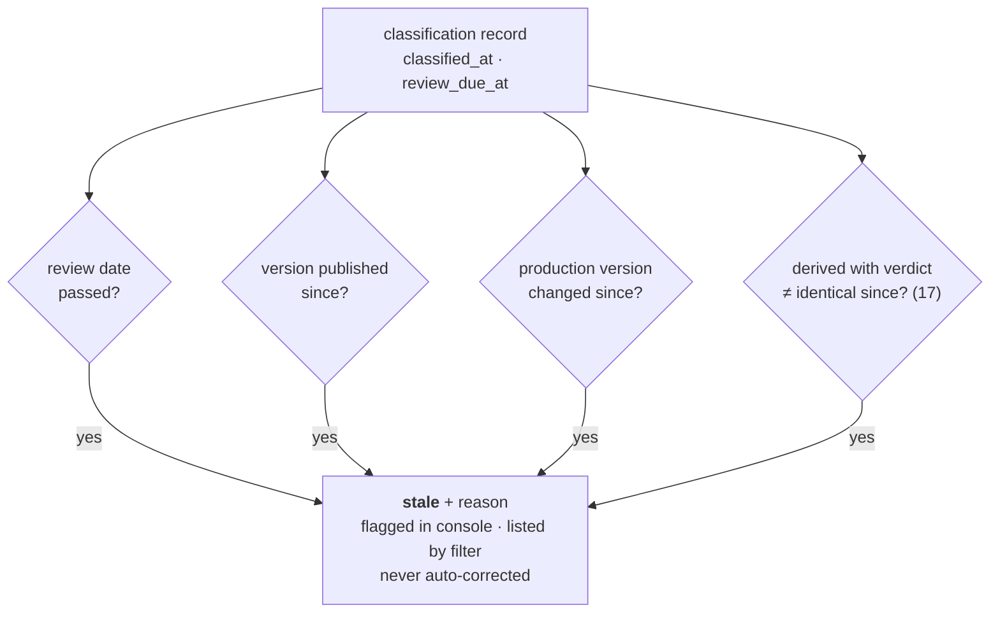

# 16 — EU Risk Classification & Drift

> **Regime: EU AI Act.** Every field in §3 is EU vocabulary and is named `eu_*` to say so
> (§3.1). The drift machinery in §5 is regime-agnostic and would be reused as-is by a second
> regime.
>
> Status: **Proposed**. Records how risky a model is — as a **declared** operator claim, never
> an inference — and detects when that claim has gone out of date. Posture and boundary rules
> are `15`; the queue this feeds is `17`; the bundle that carries it is `18`.

## 1. Scope

| In scope | Out of scope |
|---|---|
| Storing a declared **EU AI Act** risk class per model | Deciding a risk class (`15.3.1`) |
| Detecting when a classification has drifted | Re-classifying, downgrading, or blocking on drift |
| The inventory query — "which high-risk models do we have" | Tracking systems, deployments, or filings |
| — | Non-EU frameworks (NIST AI RMF, ISO/IEC 42001) — §3.1 |

## 2. The Problem

Someone labels a model "low risk" in January. The team retrains it three times by June. The
label is now wrong and nobody noticed.

The documented status quo is that classifications *"get assigned once and drift out of date"*
— so **drift is the feature, and the field is just what makes drift measurable.** A registry
that only stored the label would reproduce the spreadsheet it replaces.

## 3. Two Fields, Because There Are Two Regimes

The Act regulates AI systems and GPAI models separately (`15.3.1`), so one field cannot carry
both. A GPAI model is not "high-risk" or "low-risk" — it is on a different axis.

| Field | About | Values |
|---|---|---|
| `eu_gpai_tier` | the model itself (Art. 53/55) | `none` · `gpai` · `gpai_systemic` |
| `eu_system_risk_class` | systems this model serves — **declared** | `unclassified` (default) · `minimal` · `limited` · `high_annex_iii` · `high_annex_i` · `prohibited` |

`unclassified` is a visible state. It never renders as, or defaults to, `minimal` — guessing
low is the expensive direction.

`gpai_systemic` covers the largest models, presumed above a 10²⁵ FLOP training threshold. Most
self-hosted installs will never use it; it exists because "not systemic" cannot be recorded
without the value.

### 3.1 Why the fields are `eu_`-prefixed

`high_annex_iii` is not a risk level — it is a citation. A column called `system_risk_class`
holding `high_annex_iii` reads as though the registry has a general notion of risk that the EU
happens to be one expression of. It does not. **These enums are one jurisdiction's vocabulary,
and the name should say so.**

The prefix buys two things:

1. **A second regime is additive, not a migration.** NIST AI RMF tiers or ISO/IEC 42001
   controls arrive as `nist_*` columns on the same row, with no ambiguity about which
   framework a stored value belongs to and no renaming of what is already there.
2. **It stops a false generalization.** Without the prefix, the first non-EU framework forces
   a choice between overloading an EU enum and renaming a shipped column. Both are worse than
   a prefix nobody minded typing.

**Not everything here is EU.** `intended_purpose`, `basis`, `classified_at`, `classified_by`,
and `review_due_at` stay unprefixed: every framework wants a stated purpose, a rationale, and
a review date. Only the enums are jurisdictional. The table itself stays `classification` — it
is the per-model classification record, and one row should be able to carry more than one
regime.

This is the same posture as `00.11.5` on tenancy: reserve the shape, do not build the
generality.

## 4. `classificationState` — Three Values, Not a Boolean

A model is in exactly one state. Unclassified is **not** a kind of stale; a filter must be
able to ask for either.

| State | Meaning |
|---|---|
| `unclassified` | no `classification` row, or `eu_system_risk_class = 'unclassified'` |
| `stale` | classified, but at least one drift trigger fired (§5) |
| `current` | classified, no trigger fired |

**The state name is regime-agnostic; today it is computed from the EU record only.** When a
second regime lands this becomes per-regime (`classificationState.eu`, `.nist`) — an additive
change, since a single-regime install reads the same either way.

## 5. The Drift Predicate (normative)

Computed on read from facts already held, so it cannot itself go stale. Given classification
`c` for model `m` and current time `now`:

```
stale(m) :=  (c.review_due_at IS NOT NULL AND c.review_due_at < now)               → review_due_passed
          OR EXISTS(model_version v : v.model_id = m
                    AND v.created_at > c.classified_at)                             → version_published_since
          OR EXISTS(model_version v : v.model_id = m
                    AND v.stage = 'production'
                    AND v.updated_at > c.classified_at)                             → production_changed_since
          OR EXISTS(open review item d on m (17.4)
                    AND d.created_at > c.classified_at)                             → derivation_since
```

Each disjunct names a reason. `staleReasons[]` returns **every** one that fired, not the first
— a reader deciding whether to re-open a classification wants the full picture.



**Index use.** Clauses 2–3 ride the existing `model_version(model_id, stage)` index (`02.6`);
clause 1 uses `classification(review_due_at)` (§7.3); clause 4 reuses the `17.4` queue join.

**Known false positive, accepted deliberately.** Clause 3 keys on `updated_at`, so a
metadata-only edit to the production version (a description fix) trips it. The precise
alternative — scanning `audit_event` for `version.stage_changed` — turns a list query into a
per-row audit scan. Erring toward *"re-check this classification"* is the safe direction for
this particular field, and the reason string tells the reader exactly what fired.

**The registry marks staleness and stops.** It does not re-classify, downgrade, or block a
promotion. A registry that silently adjusted a legal field would be worse than one that never
had it.

## 6. Validation

| Rule | On violation |
|---|---|
| `euSystemRiskClass`, `euGpaiTier` must be in the enum | `400 invalid_argument`, `details.allowedValues` |
| `euSystemRiskClass != 'unclassified'` requires non-empty `intendedPurpose` | `422 unprocessable` — a class without a stated purpose cannot be reviewed |
| `euSystemRiskClass` in (`high_annex_iii`, `high_annex_i`) requires non-empty `basis` | `422 unprocessable` |
| `reviewDueAt`, if set, must be `> now` | `400 invalid_argument` |
| `classifiedAt` server-set; `classifiedBy` from `X-Lineage-Actor` | request values ignored |

Codes are the `03.9` vocabulary — no new ones.

## 7. Data Model

Additive only — no existing table changes shape, so both dialects take a forward-only
migration with no data rewrite (`02.7`).

### 7.1 `classification` (1:1 with `model`, optional)

| Column | Type | Regime | Notes |
|---|---|---|---|
| `model_id` | id | — | **PK**, FK→`model.id` ON DELETE CASCADE |
| `eu_gpai_tier` | enum | **EU** | `none`\|`gpai`\|`gpai_systemic` (default `none`) |
| `eu_system_risk_class` | enum | **EU** | `unclassified` (default) \| `minimal` \| `limited` \| `high_annex_iii` \| `high_annex_i` \| `prohibited` |
| `intended_purpose` | str? | shared | required unless `unclassified` (§6) |
| `basis` | str? | shared | why this class — the reasoning, not the conclusion. Required for high-risk |
| `classified_at` | ts | shared | drift anchor (§5) |
| `classified_by` | str? | shared | `X-Lineage-Actor` at write |
| `review_due_at` | ts? | shared | null = no scheduled review, itself surfaced |

The **Regime** column is part of the contract, not commentary: a future `nist_*` column set
lands in the `EU` rows' place without touching the `shared` ones (§3.1).

### 7.2 Provenance

`source` is always `declared` (`11.2`). **There is no `derived` path for a legal class and the
schema must not imply one** — a nullable `source` column would invite a future producer to
write `derived` into it.

### 7.3 Indexes

| Index | Purpose |
|---|---|
| (`eu_system_risk_class`), (`eu_gpai_tier`) | the inventory query |
| (`review_due_at`) | drift sweep, clause 1 (§5) |

## 8. API

Model API (`:8081`, `/v1`), conventions per `03.1`. JSON fields carry the same `eu`
prefix in camelCase (§3.1).

```
GET  /v1/models/{m}/classification
PUT  /v1/models/{m}/classification
GET  /v1/models?euSystemRiskClass=&euGpaiTier=&classificationState=
```

**`PUT`, not `PATCH`** — full replace, actor recorded. A partial write to a legal field
invites a stale `basis` sitting under a new class.

Audit action: `classification.set`, appended in the same transaction (`02.5` invariant 4).

### 8.1 Classify a model

```bash
curl -X PUT "$LINEAGE/v1/models/fraud-detector/classification" \
  -H 'Content-Type: application/json' -H 'X-Lineage-Actor: risk@acme.example' -d '{
    "euSystemRiskClass": "high_annex_iii",
    "euGpaiTier": "none",
    "intendedPurpose": "Scores card-not-present transactions for manual review.",
    "basis": "Annex III §5(b) — creditworthiness adjacent; counsel review 2026-03-11.",
    "reviewDueAt": 1804500000000
  }'
```

### 8.2 The inventory query

The *"weeks to work out which AI systems are in production"* complaint, answered in one call:

```
GET /v1/models?euSystemRiskClass=high_annex_iii&classificationState=stale
```

```json
{ "items": [
    { "name": "fraud-detector", "owner": "risk-eng",
      "classification": {
        "regime": "eu_ai_act",
        "euSystemRiskClass": "high_annex_iii", "euGpaiTier": "none",
        "state": "stale", "staleReasons": ["version_published_since"],
        "classifiedAt": 1773000000000, "reviewDueAt": 1804500000000,
        "source": "declared" } }
  ], "nextPageToken": null }
```

`regime` is echoed as a constant `"eu_ai_act"` — redundant while there is one regime, and the
field a client would otherwise have to infer from the key names when there are two.

## 9. Console (`06`)

- **Inventory view** — models by `eu_system_risk_class`, stale ones marked **with their reason**.
  A bare "stale" badge sends the reader hunting; the reason is the actionable part.
- **Version detail — Compliance panel** — class, intended purpose, basis, drift state.
- `unclassified` renders as `unclassified`, never as `minimal` (§3).
- Drift is surfaced, never auto-resolved: there is no "mark current" button that does not
  write a new classification.

## 10. Deferred

| Item | When |
|---|---|
| Scheduled drift sweep + webhook on `classification.stale` | With the event surface (`00.7`); §5 is already the whole query |
| Multi-system classification (one model → N systems) | With multi-tenancy (`00.11.5`) — the `scope` key is the natural carrier |
| Classification history (who changed a class, when, from what) | `audit_event` already records it; a dedicated read view if asked for |

## 11. See Also

| For | Doc |
|---|---|
| Boundary rules, the clock, build order | `15` |
| The queue that class gates, and that trips drift clause 4 | `17` |
| How class travels into a filing | `18` |
| Entities, audit invariants | `02` |
| API conventions, error codes | `03` |
| Provenance vocabulary (`declared`) | `11.2` |
