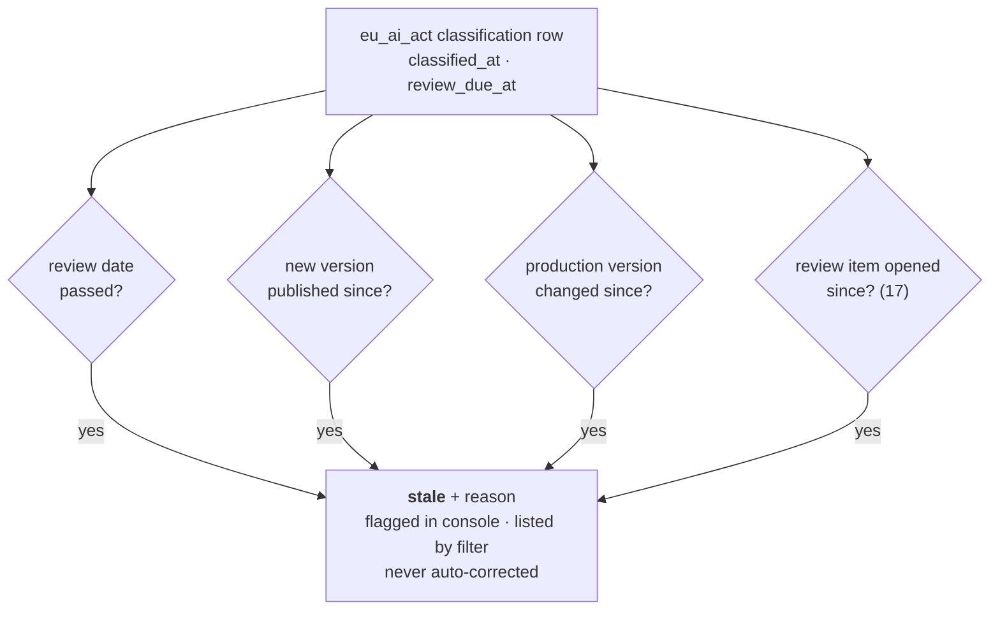

# 16 — EU Risk Classification & Drift

> **This doc is about the EU AI Act.** Every field in §3 uses EU wording, so every one of
> them is named `eu_*` to make that obvious (§3.1). The drift machinery in §5 has nothing
> EU-specific in it and a second country's rules would reuse the same shape.
>
> Status: **Proposed**. This is how we store how risky a model is — as something a person
> **states**, never something we guess — and how we notice when that statement has gone out
> of date. Who decides what, and by when, is `15`; the review queue this feeds is `17`; the
> report that carries it out the door is `18`.
>
> Throughout, **regime** means "one body of rules" — the EU AI Act is one, US model risk
> supervision (`20`) is another. It's the word the rest of these docs use and it's a column
> name (§7.1), so it's worth pinning down once.

## 1. Scope

| We do this | We don't do this |
|---|---|
| Store the risk class someone declared for a model under the **EU AI Act** | Decide what the risk class should be (`15.3.1`) |
| Notice when a stored class has gone out of date | Change, downgrade, or block anything when it does |
| Answer "which high-risk models do we have?" | Track systems, deployments, or regulatory filings |
| — | Non-EU rules — see §3.1; those are specced in `20`–`22` |

## 2. The Problem

Someone marks a model "low risk" in January. The team retrains it three times by June. The
label is now wrong and nobody noticed.

The complaint we keep hearing is that risk classes *"get assigned once and drift out of
date"* — so **noticing the drift is the actual feature. The stored field only exists to make
drift measurable.** A registry that just held the label would be the spreadsheet it replaces.

## 3. Two Fields, Because the Act Covers Two Different Things

The Act treats *AI systems* and *general-purpose models* separately (`15.3.1`), so one field
can't hold both. A general-purpose model isn't "high risk" or "low risk" — that's a different
question entirely.

| Field | What it describes | Allowed values |
|---|---|---|
| `eu_gpai_tier` | the model itself (Art. 53/55) | `none` · `gpai` · `gpai_systemic` |
| `eu_system_risk_class` | the systems this model is used in — **as declared by a person** | `unclassified` (default) · `minimal` · `limited` · `high_annex_iii` · `high_annex_i` · `prohibited` |

`unclassified` is a real, visible answer meaning "nobody has said yet". It never shows up as
`minimal` and never quietly becomes it. Guessing "low" is the guess that costs you.

`gpai_systemic` is for the very largest models — roughly, those trained above 10²⁵ FLOP. Most
self-hosted installs will never touch it. It exists so that "we checked, and we're not in that
bucket" is something you can actually record.

### 3.1 Why the enum columns start with `eu_`

`high_annex_iii` isn't a level of risk — it's a pointer to a paragraph of EU law. A column
called plain `system_risk_class` holding that value reads as if the registry has some universal
idea of risk that the EU happens to be one flavour of. It doesn't. **These values are one
jurisdiction's vocabulary, and the column name should say so.**

So a second regime never renames anything: a US supervisory tier arrives as `mrm_*` columns,
and there's never any doubt which rulebook a stored value came from. `20.4` is exactly that
happening.

### 3.2 One row per regime, not one row per model

The prefix keeps two regimes' *values* apart. It does nothing about everything wrapped around
them, and that's the part that actually has to be separated.

A classification is an **assessment**: somebody made it, on a date, for a stated reason, with
their own review cycle. Those facts belong to the assessment, not to the model. A single row
per model has one `classified_at`, one `classified_by`, one `basis`, one `review_due_at` — one
set of answers for what will be N assessments by N different teams.

**That breaks the drift check, not just the tidiness.** Every clause in §5 measures against
`classified_at`. Suppose risk@ classifies for the EU in January, a new version ships in March
(correctly making the EU classification `stale`), and in June the model-risk team records an
`mrm_tier`. If both live on one row, `classified_at` moves to June, the March version now looks
older than the classification, and **the EU staleness silently clears.** A legal field would
un-flag itself because a different team touched a different regime's column.

So `classification` holds **one row per model per regime**, keyed `(model_id, regime)` (§7.1).
Each regime gets its own date, its own author, its own reason, its own review cycle. Adding a
regime adds rows plus a small group of nullable enum columns — nothing already stored is
renamed or rewritten, which was the point of the prefix in the first place.

**Only the enum columns are jurisdictional.** `intended_purpose`, `basis`, `classified_at`,
`classified_by`, and `review_due_at` keep plain names, because every regime wants a stated
purpose, a reason, and a review date — it just wants *its own*. Per-regime rows are what let
them stay one column each instead of sprouting `eu_basis` and `mrm_basis`.

Same posture as `00.11.5` on tenancy: leave room for it, don't build it yet. The room here is
one discriminator column.

## 4. `classificationState` — Three Values, Not a Yes/No

A model is in exactly one of these **per regime**. "Nobody classified it" is **not** a kind of
"out of date", and someone filtering the list needs to ask for one without getting the other.

| State | Meaning |
|---|---|
| `unclassified` | no `classification` row for this regime, or `eu_system_risk_class = 'unclassified'` |
| `stale` | classified, but something has changed since (§5) |
| `current` | classified, nothing has changed since |

**The state names don't mention the EU because the ladder isn't EU-specific** — `20.7` uses the
same three plus one. Since the row is per regime, so is the state: a filter applies within the
regime being asked about, and an install using one regime reads exactly as it always did.

## 5. When Is a Classification Stale? (normative)

Worked out fresh on every read, from facts we already store, so the answer itself can't go
stale. For model `m`'s `eu_ai_act` classification row `c` at time `now`:

```
stale(m) :=  (c.review_due_at IS NOT NULL AND c.review_due_at < now)               → review_due_passed
          OR EXISTS(model_version v : v.model_id = m
                    AND v.created_at > c.classified_at)                             → version_published_since
          OR EXISTS(model_version v : v.model_id = m
                    AND v.stage = 'production'
                    AND v.updated_at > c.classified_at)                             → production_changed_since
          OR EXISTS(open review item d on m (17.4)
                    AND d.created_at > c.classified_at)                             → derivation_since
```

In plain terms, a classification goes stale when any of these is true:

1. its review date has passed,
2. a new version of the model was published after it was classified,
3. the production version changed after it was classified, or
4. a review item was opened on the model after it was classified (`17.4`).

Each line has a name. `staleReasons[]` returns **all** the reasons that apply, not just the
first one — someone deciding whether to redo a classification wants the whole picture.

Because `c` is this regime's own row, writes under another regime can't move the anchor
(`3.2`).



**This stays fast.** Checks 2 and 3 use the `model_version(model_id, stage)` index we already
have (`02.6`); check 1 uses `classification(regime, review_due_at)` (§7.3); check 4 reuses the
`17.4` queue join.

**One false alarm we're keeping on purpose.** Check 3 looks at `updated_at`, so fixing a typo
in the production version's description marks the classification stale. Getting that exactly
right would mean scanning the audit log for `version.stage_changed` on every row, turning a
list query into a per-row audit scan. For a legal field, erring toward *"take another look at
this"* is the right direction, and the reason string tells the reader precisely what tripped
it.

**We flag it and stop there.** The registry never re-classifies a model, never downgrades it,
and never blocks a promotion over this. A registry that quietly edited a legal field would be
worse than one that never had the field.

### 5.1 The shape, not the code

`20.7` runs the same kind of check for model risk management, and it is worth being precise
about what it reuses. Not this query: `20` anchors on a **validation record per version**,
where this one anchors on a **classification per model**, and its ladder has four states rather
than three. What carries over is the shape — a list of independent triggers, evaluated on read,
returning every reason that fired and never repairing anything.

If that shape gets built once as a trigger list evaluated against a supplied anchor, both
regimes are configuration. Until then they're two implementations that agree, and the claim is
"same design", not "same code".

## 6. Validation

| Rule | If broken |
|---|---|
| `euSystemRiskClass`, `euGpaiTier` must be one of the listed values | `400 invalid_argument`, with `details.allowedValues` |
| Anything other than `unclassified` needs a non-empty `intendedPurpose` | `422 unprocessable` — nobody can review a class with no stated purpose |
| `high_annex_iii` and `high_annex_i` also need a non-empty `basis` | `422 unprocessable` |
| `reviewDueAt`, if given, must be in the future | `400 invalid_argument` |
| `classifiedAt` is set by the server; `classifiedBy` comes from `X-Lineage-Actor` | values sent in the request are ignored |

These are the existing `03.9` error codes — no new ones.

## 7. Data Model

Purely additive — no existing table changes shape, so both dialects get a forward-only
migration with no data rewrite (`02.7`).

### 7.1 `classification` (one row per model per regime)

| Column | Type | Regime | Notes |
|---|---|---|---|
| `model_id` | id | — | **PK** with `regime`; FK→`model.id` ON DELETE CASCADE |
| `regime` | enum | — | **PK** with `model_id`. `eu_ai_act` here; `mrm` in `20` |
| `eu_gpai_tier` | enum? | **EU** | `none`\|`gpai`\|`gpai_systemic` (default `none` on EU rows) |
| `eu_system_risk_class` | enum? | **EU** | `unclassified` (default on EU rows) \| `minimal` \| `limited` \| `high_annex_iii` \| `high_annex_i` \| `prohibited` |
| `intended_purpose` | str? | shared | required unless `unclassified` (§6) |
| `basis` | str? | shared | *why* this class — the reasoning, not the conclusion. Required for high risk |
| `classified_at` | ts | shared | this regime's "since when", the anchor §5 measures against |
| `classified_by` | str? | shared | `X-Lineage-Actor` at time of write |
| `review_due_at` | ts? | shared | null means no review scheduled — which we surface too |

A per-dialect `CHECK` ties each enum group to the discriminator: `regime = 'eu_ai_act'` requires
`eu_system_risk_class` non-null and every other regime's group null. Sparsity stays bounded at
two or three columns per regime, and each one stays a real enum with a real index.

The **Regime** column is part of the contract, not a note: a future `nist_*` group lands beside
the `EU` one and takes its own rows, without touching a `shared` column or anything already
stored (§3.2).

### 7.2 Where the value came from

`source` is always `declared` (`11.2`). **There is no computed path for a legal class, and the
schema must not hint that there could be** — a nullable `source` column would tempt some future
code path into writing `derived` there.

### 7.3 Indexes

| Index | What it's for |
|---|---|
| (`regime`, `eu_system_risk_class`), (`regime`, `eu_gpai_tier`) | the inventory query |
| (`regime`, `review_due_at`) | the review-date check, §5 check 1 |

Every index leads with `regime`, so one regime's queries never scan another's rows.

## 8. API

Model API (`:8081`, `/v1`), following `03.1`. JSON field names keep the same `eu` prefix, in
camelCase (§3.1).

```
GET  /v1/models/{m}/classifications                  every regime's row
GET  /v1/models/{m}/classifications/eu_ai_act
PUT  /v1/models/{m}/classifications/eu_ai_act
GET  /v1/models?euSystemRiskClass=&euGpaiTier=&classificationState=
```

**The regime is in the path**, so a client writing one regime's assessment cannot see or touch
another's. That is what makes the next rule safe.

**`PUT`, not `PATCH`** — you replace that regime's row whole, and we record who did it. Letting
people edit one field at a time invites an old `basis` sitting underneath a brand-new class.

Audit action: `classification.set`, written in the same transaction (`02.5` invariant 4), with
the regime recorded.

### 8.1 Classify a model

```bash
curl -X PUT "$LINEAGE/v1/models/fraud-detector/classifications/eu_ai_act" \
  -H 'Content-Type: application/json' -H 'X-Lineage-Actor: risk@acme.example' -d '{
    "euSystemRiskClass": "high_annex_iii",
    "euGpaiTier": "none",
    "intendedPurpose": "Scores card-not-present transactions for manual review.",
    "basis": "Annex III §5(b) — creditworthiness adjacent; counsel review 2026-03-11.",
    "reviewDueAt": 1804500000000
  }'
```

### 8.2 The inventory query

The *"it takes us weeks to work out which AI systems are in production"* problem, answered in
one call:

```
GET /v1/models?euSystemRiskClass=high_annex_iii&classificationState=stale
```

```json
{ "items": [
    { "name": "fraud-detector", "owner": "risk-eng",
      "classification": {
        "regime": "eu_ai_act",
        "euSystemRiskClass": "high_annex_iii", "euGpaiTier": "none",
        "state": "stale", "staleReasons": ["version_published_since"],
        "classifiedAt": 1773000000000, "reviewDueAt": 1804500000000,
        "source": "declared" } }
  ], "nextPageToken": null }
```

Filtering on `euSystemRiskClass` selects the EU row, so `classification` is that one row and
`regime` names which one — the same object `18.4` embeds in a bundle. `GET
/v1/models/{m}/classifications` returns the list instead.

## 9. Console (`06`)

- **Inventory view** — models grouped by `eu_system_risk_class`, with stale ones marked **and
  the reason shown**. A bare "stale" badge just sends the reader hunting; the reason is the
  part they can act on.
- **Version detail — Compliance panel** — class, intended purpose, basis, and whether it's
  gone stale. One section per regime once there is more than one; the section header is the
  regime.
- `unclassified` shows as `unclassified`, never as `minimal` (§3).
- Staleness is shown, never cleared for you: there's no "mark as current" button that doesn't
  write a real new classification.

## 10. Deferred

| Item | When |
|---|---|
| Background staleness sweep + webhook on `classification.stale` | With the event surface (`00.7`); §5 is already the entire query |
| A shared trigger-list evaluator behind both regimes' staleness checks | When a third regime wants one (`5.1`) |
| One model classified against several systems | With multi-tenancy (`00.11.5`) — the `scope` key is the natural place to hang it |
| A history view of class changes | `audit_event` already records them; we'll add a read view if someone asks |

## 11. See Also

| For | Doc |
|---|---|
| Who decides what, by when, and in what order we build it | `15` |
| The review queue that class gates, and that trips §5 check 4 | `17` |
| How the class ends up in a filing | `18` |
| The second regime, on its own row | `20.4` |
| Entities, audit invariants | `02` |
| API conventions, error codes | `03` |
| What `declared` means | `11.2` |
