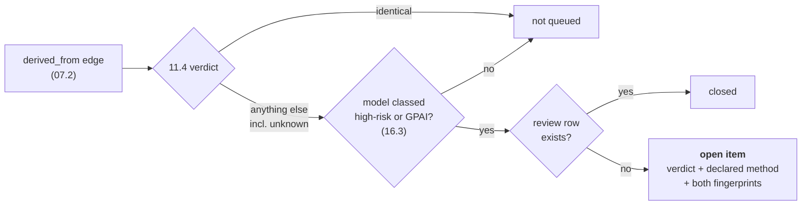

# 17 — EU Modification Review

> **Regime: EU AI Act.** Art. 25 is the entire reason this exists, and the queue gate reads
> `16`'s EU class. The routing mechanism — verdict plus declared intent to a human — is
> generic, but nothing here is currently reachable without an EU classification.
>
> Status: **Proposed**. Routes the `11.4` fingerprint verdict to a human when a derivation may
> have made the modifier legally responsible for the model (Art. 25). Posture and boundary
> rules are `15`; the classification that gates the queue is `16`.

## 1. Scope

| In scope | Out of scope |
|---|---|
| Surfacing derivations whose technical delta warrants review | Deciding whether a change is *substantial* in law |
| Recording a human's review outcome, append-only | Blocking a publish or a promotion on an open item |
| Freezing the verdict a reviewer actually saw | Re-deriving or verifying the verdict |

## 2. Why This Exists

Take a third-party model, fine-tune it, and you can become its **provider** in law —
inheriting the full documentation, conformity, and registration burden. Under Art. 25 this
also happens on rebranding, or on changing the intended purpose such that the system becomes
high-risk.

Teams find this out late, usually from counsel rather than from a tool. `11.4` already
computes what changed between two versions; nothing routes it to anyone.

## 3. Verdict Routing

`11.4.1` produces a verdict across a `derived_from` edge. This doc maps each to what the
registry may state:

| `11.4.1` verdict | What the registry states | What it must not state |
|---|---|---|
| `identical` | bytes match — a repackage | — |
| `reweighted` | weights changed; topology and shapes did not | that this is a fine-tune *in law* |
| `recast` | precision changed only | that quantization is or isn't substantial |
| `rescaled` | width or depth changed | — |
| `rearchitected` | new blocks or backbone | — |
| `unknown` | hashes do not reach — **names the missing input** (`11.4.3`) | any verdict at all |

**It flags; it does not decide.** Art. 3(23) turns on whether a change affects compliance or
intended purpose — a question about a system, its context, and its documentation, none of
which the registry holds. Asserting "substantial modification" from a weights hash is exactly
the fabricated completeness `15.3.2` rejects.

The declared `method` on the edge's `properties` (`11.3.6`) — `{"method":"quantize"}` — is
carried alongside the verdict, so a reviewer sees the intent and the measurement together and
can notice when they disagree.

## 4. The Queue (normative)

An item is **open** when all four hold:

1. A `derived_from` edge exists on version `v` (`07.2`).
2. The `11.4` verdict across that edge is **not** `identical`.
3. `v`'s model is classed `high_annex_iii` or `high_annex_i` (`16.3`), **or** carries
   `eu_gpai_tier != 'none'` — a derived GPAI can pick up its own Art. 53 duties.
4. No `modification_review` row exists for (`version_id`, `edge_id`).



**`unknown` is eligible, deliberately.** "We cannot tell what changed" is precisely the case
that wants human eyes — excluding it would make a missing `weights_hash` look like a clean
bill of health. `11.4.3` already names which input was missing, and the queue passes that
through.

Closing an item is one `POST` (§6). Rows are **append-only**, like `evaluation` (`11.7`) — a
re-review is a new row, and the queue keys on the **latest** row per (`version_id`,`edge_id`).

`verdict_at_review` freezes the verdict as it stood at review time, so a producer later
submitting a `weights_hash` cannot rewrite what a reviewer actually saw.

## 5. Data Model

Additive only (`02.7`).

### 5.1 `modification_review` (many per version)

| Column | Type | Notes |
|---|---|---|
| `id` | id | PK |
| `version_id` | id | FK→`model_version.id` ON DELETE CASCADE |
| `edge_id` | id | the `derived_from` edge reviewed (`02.3.6`) |
| `verdict_at_review` | str | the `11.4.1` verdict when reviewed — **server-set**, frozen |
| `outcome` | enum | `not_substantial` \| `substantial` \| `undetermined` |
| `note` | str? | |
| `reviewed_by` | str? | `X-Lineage-Actor` at write |
| `reviewed_at` | ts | server-set |

`undetermined` is a real outcome, not a placeholder: a reviewer who needs counsel should be
able to close the loop on "looked at it, cannot resolve yet" rather than leaving the item
indistinguishable from one nobody opened.

### 5.2 Indexes

| Index | Purpose |
|---|---|
| (`version_id`, `edge_id`, `reviewed_at`) | latest-row-per-pair; open-queue anti-join |

## 6. API

Model API (`:8081`, `/v1`), conventions per `03.1`.

```
GET   /v1/reviews?status=open|closed
POST  /v1/models/{m}/versions/{v}/reviews
GET   /v1/models/{m}/versions/{v}/reviews
```

Audit action: `review.record`, appended in the same transaction (`02.5` invariant 4).

### 6.1 Close an item

```bash
curl -X POST "$LINEAGE/v1/models/fraud-detector/versions/1.4.0/reviews" \
  -H 'Content-Type: application/json' -H 'X-Lineage-Actor: counsel@acme.example' -d '{
    "edgeId": "01JAE…",
    "outcome": "not_substantial",
    "note": "Quantization only; intended purpose and performance envelope unchanged."
  }'
```

→ `201`, with `verdictAtReview` filled in **by the server** from `11.4` at that moment.
**A client-supplied `verdictAtReview` is rejected** with `400 invalid_argument` — the whole
value of the field is that the registry witnessed the verdict rather than accepting a claim
about it.

### 6.2 The open queue

```
GET /v1/reviews?status=open
```

```json
{ "items": [
    { "model": "fraud-detector", "version": "1.4.0", "versionId": "01JAV…",
      "edgeId": "01JAE…",
      "derivedFrom": { "model": "fraud-detector", "version": "1.3.0" },
      "verdict": "recast",
      "declaredMethod": "quantize",
      "basis": ["topology", "shape", "dtype", "weights"],
      "euSystemRiskClass": "high_annex_iii",
      "edgeCreatedAt": 1773400000000 }
  ], "nextPageToken": null }
```

`basis` mirrors `11.6.2` — which hashes were present on each side, so a partial verdict is
identifiable as partial rather than read as confident.

### 6.3 Errors

`03.9` vocabulary, no new codes.

| Situation | Code | HTTP | `details` |
|---|---|---|---|
| `edgeId` not a `derived_from` edge on this version | `invalid_argument` | 400 | `field` |
| Client supplied `verdictAtReview` | `invalid_argument` | 400 | `field` |
| Unknown `outcome` | `invalid_argument` | 400 | `allowedValues` |

## 7. Console (`06`)

- **Review queue** — open derivations with the `11.4` verdict, the declared method, and **both
  fingerprints side by side** (`12.6.2` already renders these at 64px). The rings that changed
  carry their colour and the rest drop to muted, so the delta is visible before any text is
  read.
- A closed item shows `verdict_at_review` next to the current verdict when they differ — that
  divergence means a producer submitted a hash after the review, and it is worth seeing.
- The queue never blocks an action. It is a list, not a gate (§1).

## 8. Deferred

| Item | When |
|---|---|
| Blocking promotion on an open item | With the policy engine `11.7` also wants — same hook, same config-driven posture |
| Queue items for `trained_on` changes (dataset swapped under a model) | Needs dataset-side facts (`11.10`) |
| Notifying an owner when an item opens | With the event surface (`00.7`) |

## 9. See Also

| For | Doc |
|---|---|
| Boundary rules, why we do not adjudicate | `15.3` |
| The classification that gates the queue | `16.3` |
| Fingerprint hashes, verdict table, `basis` | `11.4`, `11.6.2` |
| Edge `properties.method` | `11.3.6` |
| `derived_from` semantics | `07.2` |
| Fingerprint rendering | `12.4`, `12.6.2` |
