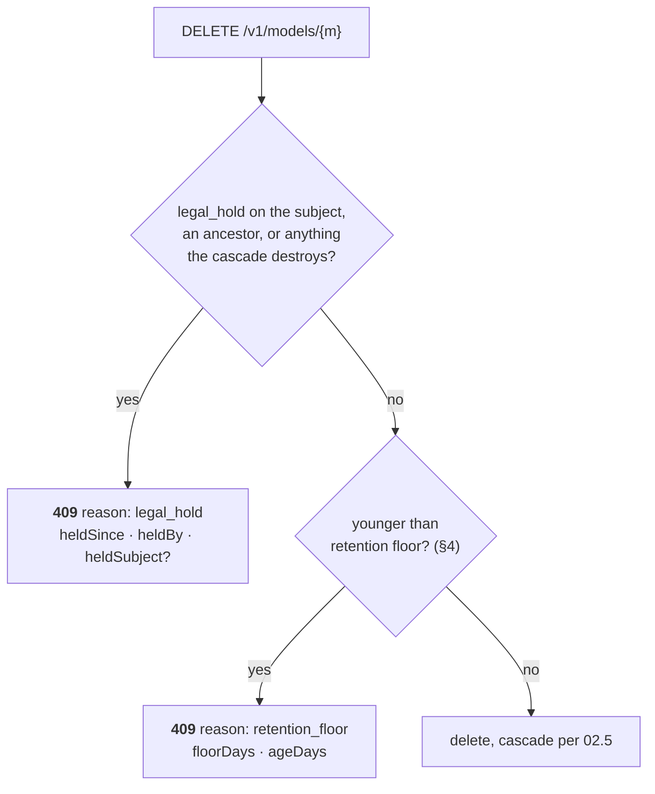
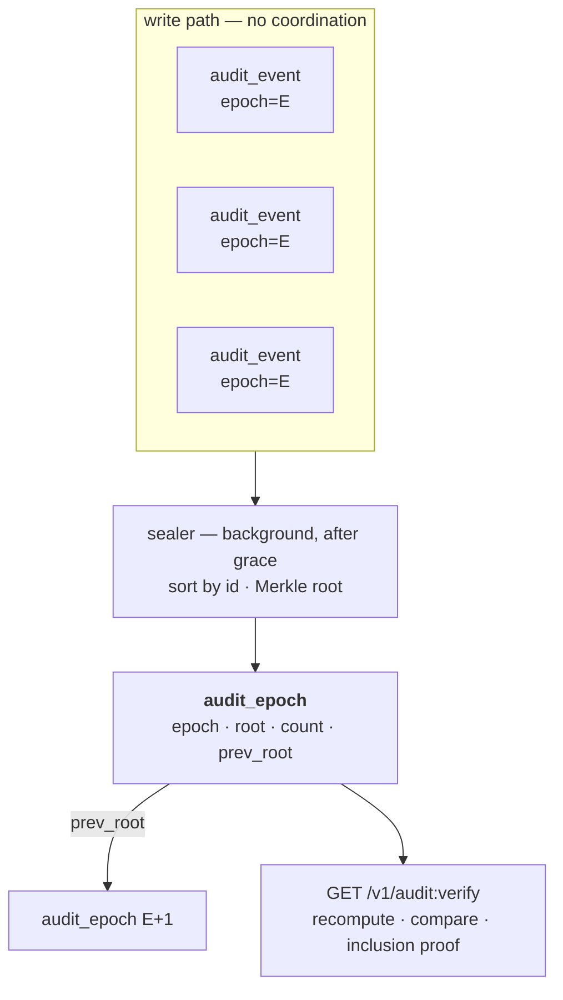

# 19 — Retention & Legal Hold

> **Regime: neutral.** Deliberately *not* marked EU. Legal hold and retention floors are
> jurisdiction-neutral — the term comes from US litigation practice, and every framework that
> asks for records asks for them to still exist. Only the **default values** (3650 days, §4)
> cite Art. 18, and those are config, not schema. Rule in `15.4.3`.
>
> Status: **Implemented** (M15). Both decisions resolved — `00.11.13` ✅ deletion **refuses**;
> `00.11.14` ✅ tamper-evidence by **Merkle epoch sealing**, on by default. Makes evidence
> survive: deletion refuses where the law requires retention, and the audit log proves it was
> not rewritten. Posture is `15`.
>
> `18`'s bundle used to be where the floor was cited. Export is commercial now (`24 §4.1`), so
> core reports the floor itself — `/healthz` **and** `GET /v1/retention` (§4).

## 1. Scope

| In scope | Out of scope |
|---|---|
| Refusing deletions that would destroy retained evidence | Advising what retention period applies |
| Reporting the configured floor so a filing can cite it | Automatic expiry or deletion of anything |
| Tamper-evidence over `audit_event` (§5), on by default | Art. 12/19 runtime inference logs (`15.3.3`) |

**Nothing here deletes anything.** Every mechanism is a refusal or an attestation. A registry
that garbage-collected on a retention timer would be a liability, not a feature.

## 2. What Is Missing Today

Art. 18 requires documentation kept ten years past withdrawal; Art. 19 requires provider-held
logs for at least six months. `02.5` invariant 5 already retains `audit_event` past subject
deletion — the spirit is there. Three gaps:

| Gap | Addition |
|---|---|
| Deletion can destroy evidence | `legal_hold` on `model` / `model_version` (§3) |
| No stated floor | Config keys (§4), reported at `/healthz` and in every bundle |
| No tamper evidence | Merkle epoch sealing (§5) |

## 3. Legal Hold (`00.11.13` ✅)

A hold marks a subject as evidence in an active matter. It is set by a human and it blocks
exactly one thing.

### 3.1 Semantics

- **Explicit both ways.** `hold.set` and `hold.release` are separate audited actions.
  Clearing a hold is the event an auditor cares about, so it is never implicit and never a
  side effect of another operation.
- **`DELETE` on a held subject ⇒ `409 failed_precondition`** with
  `details: { reason: "legal_hold", heldSince, heldBy }`. `heldBy` is the **actor** who set
  it, as everywhere else in the system (`00.2.4`).
- **`?force=true` overrides neither guard.** `03.4`'s force exists for the production-version
  check, which protects an operator from their own mistake; a hold protects evidence *from*
  the operator, and a flag that clears it is not a hold. The floor is excluded for a narrower
  reason: an override that leaves no trace is not an override anyone can audit, and one flag
  must not mean both "yes, I know it is in production" and "yes, I know it is legally
  retained". They are independent checks, and the evidence guard runs first so a refusal never
  offers a `force` hint that would not work.
- **Inheritance runs both ways**, because both directions destroy evidence. The refusal names
  the holder in `details.heldSubject` (`model/fraud-detector`, `version/fraud-detector@3`) —
  without it the caller is told no and given nothing to release. A subject's **own** hold wins
  when both apply: it is the more specific statement, and `heldSubject` is then absent.
  - *down* — a hold on a `model` refuses deleting its versions.
  - *up* — a hold on any version refuses deleting the model, whose cascade would destroy it.
    This is the larger destruction of the two.
- **Re-holding a held subject is refused** (`already_held`), not treated as a refresh. The date
  a hold was placed is evidence; moving it forward silently would rewrite it.
- **A reason is required in both directions.** It is one string, the event is permanent, and a
  release with no recorded reason is exactly the record an auditor asks about and nobody can
  reconstruct.
- **Blocks destruction only.** Metadata `PATCH`, stage transitions, and archival all still
  work. A held model keeps moving through its lifecycle — a hold is not a freeze.
- **Independent of `state`.** `model.state = ARCHIVED` is lifecycle; `legal_hold` is
  evidence. Either can be set without the other.



### 3.2 Why refusal rather than soft-delete

A soft-delete hides the row and satisfies the caller. Six months later nobody can tell whether
the record was retained on purpose or merely not yet purged. A `409` puts the decision in
front of a human at the moment it matters, and the refusal itself is not audited as a change
because nothing changed — the attempt is visible in access logs (`09`), not the audit trail.

## 4. Retention Floor (`00.11.13` ✅)

```yaml
compliance:
  retention:
    minAuditAgeDays: 3650          # Art. 18 — 10 years. 0 disables the floor.
    minArchivedVersionDays: 3650
  auditAttestation:
    enabled: true                  # §5.2 — on by default; costs nothing on the write path
    sealIntervalSeconds: 60        # §5.3 — also the unsealed-window bound
    sealGraceSeconds: 5              # §5.5 — must be shorter than the interval
```

Env equivalents: `LINEAGE_RETENTION_MIN_AUDIT_AGE_DAYS`,
`LINEAGE_RETENTION_MIN_ARCHIVED_VERSION_DAYS`, `LINEAGE_AUDIT_ATTESTATION` (`on`/`off`),
`LINEAGE_SEAL_INTERVAL_SECONDS`, `LINEAGE_SEAL_GRACE_SECONDS`. All parse strictly — a value
nobody can interpret fails startup rather than silently becoming a default, because a typo in
a retention floor would otherwise turn into an install with no floor at all.

- A `DELETE` targeting a subject younger than the floor is refused exactly like a hold, with
  `details.reason = "retention_floor"`, `floorDays`, `ageDays`.
- **The floor measures the youngest record the delete would destroy**, not the subject's own
  age. A model predates all of its versions, so measuring the model would let a decade-old one
  be deleted the day after it published a version — cascading away a record one day into a
  ten-year floor.
- **`minAuditAgeDays` is reported, not enforced.** Nothing in core deletes an audit event
  (`02.5` invariant 5 already retains them past their subject), so there is no guard to attach
  it to. It is the number a filing cites.
- `/healthz` **and `GET /v1/retention`** echo the configured values, so a filing can cite the
  floor the registry was actually running under rather than the one someone believes was
  configured. It is on `/v1` and not only the ops port because export is commercial (`24 §4.1`)
  and `24 §4.3` requires every fact to be reachable through the public API — an exporter
  reading over HTTP has no access to `/healthz`.
- `0` disables a floor. It is a real choice and must not be confused with an unset value. A
  negative value is a startup error, never read as "extra disabled".
- **The binary's own default is `0`; every way of actually running Lineage sets `3650`** — the
  chart, and `make run`. The zero default exists so a `Service` built by a test or an
  embedding program imposes nothing it was not asked to, not as the experience anyone gets.
- **Starting over is a fresh registry, not a batch of deletes.** Nothing overrides the floor,
  so a tool that needs an empty registry gets one by discarding state, not by asking the
  registry to destroy retained records. The seed loader is additive for exactly this reason.

## 5. Tamper-Evident Audit — Merkle Epoch Sealing (`00.11.14` ✅)

**The write path takes no coordination.** A per-row hash chain would have — each row needing
the previous row's hash forces a total order and serializes every audit write behind one
sequence. That was the whole objection, and it is an artefact of the algorithm, not of the
goal.

Sealing in **epochs** removes it. Rows are written concurrently and unordered; a background
sealer periodically computes one Merkle root over a closed window. This is the Certificate
Transparency construction (RFC 6962), applied to a much smaller log.



### 5.1 Construction (normative)

**Epoch assignment**, at write, from the server clock — no read of any other row:

```
epoch = floor(at / sealIntervalMs)
```

**Leaf and node hashing**, domain-separated per RFC 6962 so a leaf can never be forged as an
internal node:

```
leaf(row)      = sha256( 0x00 ‖ canonical(row) )
node(l, r)     = sha256( 0x01 ‖ l ‖ r )
canonical(row) = id ‖ at ‖ actor ‖ action ‖ subject_type ‖ subject_id ‖ summary ‖ data
```

Fields joined with `\x00` and canonicalized per `11.4.5`.

**The leaf commits to the whole row.** Anything left out can be rewritten while the log still
verifies clean. `summary` is the line a human reads in the console; omitting it would allow
every entry to be silently reworded. `id` is what an inclusion proof is looked up by. `epoch`
is the one column deliberately excluded — moving a row between windows changes both leaf sets,
so membership already covers it. Leaves are ordered by `audit_event.id`
byte-wise ascending — ULIDs are already sortable by creation time (`02.1`), so the order is
deterministic without a sequence. An odd node is promoted unchanged to the next level.

**Epoch chaining.** Each `audit_epoch` row carries `prev_root`, so the epochs form the chain
the rows no longer need to. There are ~525k epochs per decade at a 60s interval, not millions
of rows — chaining at that granularity is free.

### 5.2 Why this can now default **on**

| | Per-row chain | Merkle epochs |
|---|---|---|
| Write path | Serialized behind a per-install sequence | **One derived integer column. No coordination.** |
| Postgres under `13` load | A real contention point | No effect |
| Cost location | Every write, synchronously | A background job, once per interval |
| Detects row edit | ✅ | ✅ |
| Detects row deletion | ✅ | ✅ — leaf count and root both change |
| Single-row proof | Walk the whole chain | `O(log n)` inclusion proof |

The reason the chain was opt-in was its write cost. That cost is gone, so **`auditAttestation`
defaults on** — which is what axiom 7 ("auditable by default") should have meant all along.

### 5.3 The honest gap: the open epoch

**Rows in the currently-open epoch are not yet protected.** A tamper inside the sealing window
is undetectable, because there is no root to disagree with yet.

This is real and bounded by `sealIntervalSeconds` (default 60). It is the price of removing
write-path coordination, and it is the correct trade: an attacker who can write to the
database can also do so faster than any interval, so the property that matters is *durable
history is provably intact*, not *the last second is*. `:verify` reports `openEpochSince` so
the unsealed window is explicit rather than assumed.

The sealer waits `sealGraceSeconds` (default 5) past an epoch's end before sealing it, so a
transaction that began inside the window commits before its epoch closes.

### 5.4 Enabling it later

Attestation enabled after the fact **starts at the current epoch**. It does not backfill — a
backfilled root proves nothing, since whoever could rewrite history could recompute the root
over the rewrite.

`:verify` reports `attestationStartedAt`, derived from the earliest window any row actually
carries — not a stored "enabled at", which would be a claim rather than a fact.

### 5.5 Changing `sealIntervalSeconds` after sealing

Re-numbering windows on a log that already has seals is a footgun, and a quiet one. A
**widened** interval produces lower epoch indices, so a new row can land in a window sealed
long ago; the extra leaf surfaces as `leaf_count_mismatch`, which reads exactly like tampering.

Each `audit_epoch` therefore records the `interval_ms` its root was computed under, and the
sealer **refuses to seal** when the configured interval differs from the last seal's
(`reason: "seal_interval_changed"`). Refusing costs nothing — the rows are still there, and
sealing resumes as soon as the interval is restored or the operator commits to the new one
deliberately.

Already-sealed epochs are unaffected either way: `epoch` is stored on the row at write and
never recomputed, so a window's membership cannot change under it.

`sealGraceSeconds` must be **shorter** than `sealIntervalSeconds`. Equal or longer means a
window is still accepting writes when the next is due to seal.

## 6. Data Model

Additive columns on existing tables; no table changes shape (`02.7`).

| Table | Column | Notes |
|---|---|---|
| `model` | `held_since` int64?, `held_by` str | NULL `held_since` **is** "not held" (§3) |
| `model_version` | `held_since` int64?, `held_by` str | same |
| `audit_event` | `epoch` int64? | `floor(at / sealIntervalMs)`, set at write. NULL = not attested — predates §5, or written while it was off |

**There is no `legal_hold` boolean.** A flag beside a timestamp is two encodings of one fact,
and an update that clears one and not the other leaves a row held by one column and free by
the other. One nullable column cannot be half-set. It also avoids a portability wart: SQLite
has no boolean and Postgres will not take `DEFAULT 0` for one.

**`epoch` is NULL, never 0, when unattested.** 0 is a real epoch — the first minute of 1970 —
so a defaulted zero would make a row that was never covered read as sealed.

The hold columns appear in no `INSERT` and no `UPDATE` set-list; only `:hold` / `:release`
write them. That is the schema half of "a `PATCH` can never set or clear a hold".

### 6.1 `audit_epoch` (one row per sealed window)

| Column | Type | Notes |
|---|---|---|
| `epoch` | int64 | **PK** — the window index (§5.1) |
| `root` | str | `sha256:` Merkle root over the epoch's leaves |
| `prev_root` | str? | the previous **sealed** epoch's `root`, not epoch−1's; null at `attestationStartedAt` |
| `leaf_count` | int64 | rows sealed — deletion changes this as well as the root |
| `interval_ms` | int64 | the window width this root was computed under (§5.5) |
| `sealed_at` | ts | |

Empty windows are never sealed, so the chain **skips** them and a gap in epoch numbers is
normal. What proves nothing was removed is that the chain links.

Append-only and never updated. A sealed epoch is immutable by construction: re-sealing would
be indistinguishable from tampering.

### 6.2 Indexes

| Index | Purpose |
|---|---|
| `audit_event` (`epoch`) | the sealer's window scan; inclusion-proof lookup |

`audit_epoch` needs none beyond its PK — it is scanned in `epoch` order or hit by key.

Hold state does not need an index either: it is read on the delete path by primary key, never
scanned.

## 7. API

Model API (`:8081`, `/v1`), conventions per `03.1`.

```
POST /v1/models/{m}:hold               ·  POST /v1/models/{m}:release
POST /v1/models/{m}/versions/{v}:hold  ·  …:release
GET  /v1/retention
GET  /v1/audit:verify
GET  /v1/audit/{id}:proof
```

A subject's own hold rides on the entity (`model.legalHold`, `modelVersion.legalHold`), so
every existing `GET` already carries it and the console needs no second call. Inheritance is
resolved at the delete guard and never written onto rows — releasing a model leaves no stale
marks on its versions.

Audit actions: `hold.set`, `hold.release` (`02.5` invariant 4).

### 7.1 Set a hold

```bash
curl -X POST "$LINEAGE/v1/models/fraud-detector:hold" \
  -H 'Content-Type: application/json' -H 'X-Lineage-Actor: counsel@acme.example' \
  -d '{ "reason": "Regulator inquiry REF-2026-118" }'
```

`reason` is recorded on the audit event, not on the row — the row carries only the boolean and
its provenance, and the *why* belongs in the trail with everything else.

### 7.2 Verify

```
GET /v1/audit:verify[?fromEpoch=&toEpoch=]
```

Recomputes each sealed epoch's root from its rows and compares, then checks `prev_root`
linkage between epochs.

A detected break is **`200` with `ok: false`**, not an error status: the request succeeded and
the answer is bad news. A `4xx` would be indistinguishable from the endpoint being broken.

```json
{ "ok": true,
  "attestationStartedAt": 1780000000000,
  "epochsChecked": 8642,
  "leavesChecked": 48211,
  "openEpochSince": 1785000000000,
  "firstBreak": null }
```

A break names the epoch and what disagreed — `root_mismatch` (a row was edited),
`leaf_count_mismatch` (a row was deleted or added), or `prev_root_mismatch` (an epoch was
removed wholesale). Leaf count is reported in preference to the root when both changed:
"17 sealed, 16 present" is the sharper diagnosis.

**A full scan also checks that the first epoch has no `prev_root`.** The chain catches an
epoch removed from the middle, because its successor stops matching. It cannot catch one
removed from the *head* — there is no later epoch to disagree, and every survivor still
verifies alone. The genesis check is the only thing that does. A bounded scan (`fromEpoch`)
skips it, since there the predecessor is legitimately out of range.

```json
{ "ok": false,
  "firstBreak": { "epoch": 29738, "kind": "leaf_count_mismatch",
                  "expected": 17, "found": 16, "sealedAt": 1784200000000 } }
```

### 7.3 Prove a single row

```
GET /v1/audit/{id}:proof
```

Returns the `O(log n)` inclusion path — the sibling hashes from leaf to root, plus the epoch's
sealed `root`. Lets a third party verify one event without reading the log, which is the thing
a per-row chain could not do cheaply.

Which side each sibling is on follows from `leafIndex` and `leafCount`, so the path carries
hashes only. The response also carries `leafHash`, so a verifier can confirm its own
canonicalization of the row matches before concluding anything — without it, a disagreement
over §5.1 is indistinguishable from tampering.

### 7.4 Errors

`03.9` vocabulary, no new codes — `details.reason` carries the specificity, which keeps that
error table stable.

| Situation | Code | HTTP | `details` |
|---|---|---|---|
| `DELETE` on a held subject | `failed_precondition` | 409 | `reason: "legal_hold"`, `heldSince`, `heldBy`, `heldSubject` when inherited |
| `DELETE` inside the retention floor | `failed_precondition` | 409 | `reason: "retention_floor"`, `floorDays`, `ageDays` |
| `:hold` on a subject already held | `failed_precondition` | 409 | `reason: "already_held"`, `heldSince`, `heldBy` (§3.1) |
| `:release` on a subject not held | `failed_precondition` | 409 | `reason: "not_held"` |
| `:hold` / `:release` with no `reason` | `invalid_argument` | 400 | — |
| `:verify` / `:proof` when attestation is disabled | `failed_precondition` | 409 | `reason: "attestation_disabled"` |
| `:proof` for a row in the open epoch | `failed_precondition` | 409 | `reason: "epoch_unsealed"`, `sealsAt` (§5.3) |
| `:proof` for a row written before attestation | `failed_precondition` | 409 | `reason: "not_attested"` — permanent, not "come back later" (§5.4) |
| sealing when `sealIntervalSeconds` changed | `failed_precondition` | — | `reason: "seal_interval_changed"` (§5.5); logged by the sealer, not returned to a caller |

## 8. Console (`06`)

- A held subject shows a hold marker with `heldSince` and `heldBy` on its detail page, saying
  what the hold blocks and — when inherited — **which subject is actually held**. Without the
  holder's name the reader is told no and given nothing to release.
- The console exposes no destructive action, so there is nothing to disable. Were one added,
  it would be disabled with the reason inline rather than hidden.
- Attestation status (`enabled`, `attestationStartedAt`, `openEpochSince`, last verify result)
  is a property of the **install**, so it stays off model pages. It sits on the install-level
  compliance page: "can this record be trusted?" comes before "what does it say?"
- The recompute is an **explicit action**, not part of a page load — verifying reads every
  audit row ever written.
- A clean verify is never reported alone. The open window and `attestationStartedAt` are shown
  beside it, or `ok` would read as a wider guarantee than the one that holds (§5.3, §5.4).

## 9. Deferred

| Item | When |
|---|---|
| Hold expiry dates | Post-v1. An expiring hold is a scheduler, and a hold that lapses silently is worse than one someone has to clear |
| Per-model retention overrides | If an install needs two floors. One configured floor is the honest v1 |
| External anchoring of an epoch root (timestamping authority, or a public log) | Post-v1. The epoch root is already the right thing to anchor — one hash per interval, not per row. Signing is commercial (`24 §4`); the root it signs is core |
| Retention floor on artifacts in the backend | `05.8` GC already refuses to touch objects it did not write; a floor there is a storage-driver concern |

## 10. See Also

| For | Doc |
|---|---|
| Posture, boundary, build order | `15` |
| The commercial boundary this doc sits inside | `24 §4.1`, `24 §4.3` |
| Audit invariants, cascade rules | `02.5` |
| Error codes, `details` conventions | `03.9` |
| Chart values, config surface | `08` |
| Write-path cost of the chain | `13` |
| Artifact GC and backend deletion | `05` |
