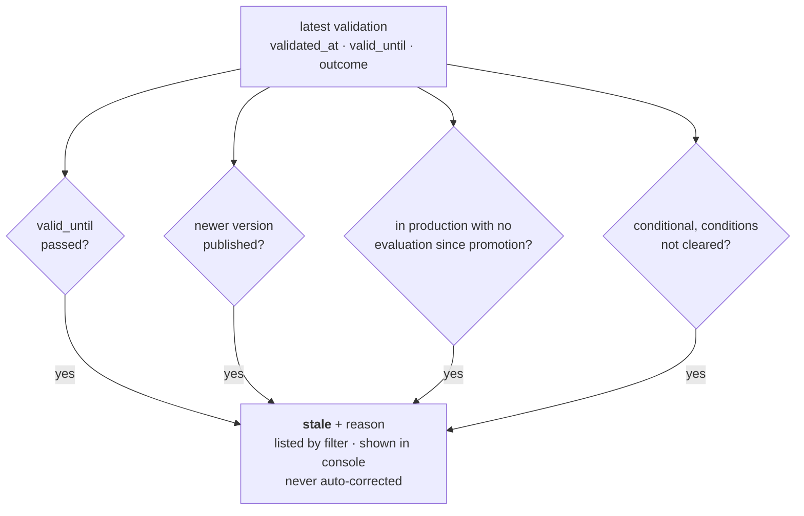

# 20 — Model Risk Management

> **Regime: financial supervision (US · UK · Canada).** Serves [SR 26-2](https://www.federalreserve.gov/supervisionreg/srletters/SR2602.htm),
> [PRA SS1/23](https://www.bankofengland.co.uk/prudential-regulation/publication/2023/may/model-risk-management-principles-for-banks-ss)
> and [OSFI E-23](https://www.osfi-bsif.gc.ca/en/guidance/guidance-library/guideline-e-23-model-risk-management-2027)
> from one field set, because the three ask for the same three things (§3). The tier field is
> `mrm_*`-prefixed and takes its own `classification` row, per `16.3.1` and `16.3.2`.
>
> Status: **Implemented (M17).** A governed model inventory: a risk tier per model, an
> independent validation record per version, and evidence that production models are still
> being watched. The landscape is `15.2.2`.

## 1. Scope

| In scope | Out of scope |
|---|---|
| A declared **risk tier** per model | Deciding a tier, or computing one (`15.3`) |
| Recording an **independent validation** and its outcome | Performing validation, or judging its quality |
| Flagging models whose validation has gone stale or unmonitored | Blocking a promotion, or downgrading a tier |
| — | The firm's MRM policy, capital impact, or committee minutes |

## 2. Why This One Fits

Every other regime in `15` asks Lineage to describe a model. This one asks for a **governed
inventory of models** — which is what the registry already is. The three pillars map onto
things that mostly exist:

| Pillar | Where it already lives | What is missing |
|---|---|---|
| Model inventory | `model`, `model_version` (`02`) | a risk **tier** |
| Development documented | `11` insights, `07` lineage, `audit_event` | — |
| **Independent validation** | — | the record itself (§5) |
| Ongoing monitoring | `evaluation` (`11.3.4`), `deployment` | a way to notice its **absence** (§7) |

This is also the only regime here with fifteen years of examiner precedent and staffed teams
behind it — the budget exists rather than arriving with a deadline.

## 3. What the Three Regimes Agree On

One field set serves all three because the disagreements are about *who is in scope*, not
*what to record*.

| | SR 26-2 (US) | SS1/23 (UK) | E-23 (Canada) |
|---|---|---|---|
| In force | 17 Apr 2026 | 17 May 2024 | **1 May 2027** |
| Applies to | mostly >$30bn assets | firms with internal model approval | **all** FRFIs |
| Model inventory + risk tiering | ✅ | ✅ | ✅ |
| Independent validation / effective challenge | ✅ | ✅ | ✅ |
| Ongoing monitoring | ✅ | ✅ | ✅ |
| AI/ML explicitly in scope | ⚠️ **genAI and agentic excluded** | yes | yes, technology-neutral |

**The SR 26-2 carve-out is a scope statement, not a governance holiday.** A firm still governs
the models it excludes, under its own framework. Lineage does not guess which side a model
falls on — that is `15.3` again — so scope is **declared**, via an `out_of_scope` tier that
requires a stated basis (§4).

## 4. `mrm_tier` — a Second Regime on the Existing Table

`16.3` promised that a second regime arrives as a prefixed enum column plus its own row on the
same `classification` table, with no renaming and no migration of what is there. This is that
promise being collected: one column, one new `regime` value, `mrm`.

**Its own row, not its own columns on the EU row** (`16.3.2`). The model-risk team tiers a model
on its own schedule, for its own reasons, on its own validation cycle — so `classified_at`,
`classified_by`, `basis` and `review_due_at` are answered separately here, using the same
columns one row down. Sharing the EU row would mean a tiering write in June moving the anchor
that the EU drift check measures against (`16.5`), silently clearing a staleness raised in
March.

| Value | Meaning |
|---|---|
| `untiered` | default. A visible state, never rendered as low risk |
| `tier_1` · `tier_2` · `tier_3` | firm-assigned, `tier_1` highest |
| `out_of_scope` | deliberately outside the firm's MRM framework — **requires `basis`** |

**Why three numbered tiers and not the firm's own labels.** Supervisors require tiering
without mandating names, and every firm has its own. A free-text tier makes the inventory
query useless; three ordered buckets keep it a real query, and the console maps them onto
local names as a display concern. A firm needing a fourth bucket is the signal to revisit
this, not a reason to pre-build it (`00.11.5`).

`basis` carries *why this tier* — the reasoning, not the conclusion — and is required for
`tier_1` and `out_of_scope`. Same rule as `16.6`: the two answers that most need a reason are
the most severe and the one that opts out. It is the shared `16.7.1` column, holding this
regime's reasoning because this is this regime's row — there is no `mrm_basis`.

`intended_purpose` is optional on this row: `16.6` requires it for an EU class, but this regime
asks for a tier and its reasoning, and the reasoning is `basis`. An omitted tier is stored as
`untiered`, the same way `16` materialises `unclassified`.

## 5. `validation` — a Judgement, Not a Measurement

`11` already stores `evaluation`. Validation is a different kind of fact and must not be
folded into it.

| | `evaluation` (`11.3.4`) | `validation` (this doc) |
|---|---|---|
| Is | a measurement | a **judgement** |
| Produced by | a harness | a person or team independent of the developer |
| `source` | `measured` \| `declared` | always `declared` (`11.2`) |
| Answers | "what did it score" | "is it fit to rely on, and who says so" |
| Repeats | per suite/metric/split | per version, append-only |

An `outcome` is one of four. `conditional` exists because it is the common real answer, and a
registry that forced it into approved-or-not would lose the conditions that make it true.

| Outcome | Meaning |
|---|---|
| `approved` | fit for use as scoped |
| `conditional` | fit **subject to `conditions`** — required non-empty |
| `rejected` | not fit for use |
| `undetermined` | reviewed, cannot conclude yet — the `17.5.1` precedent |

Append-only, like `evaluation`: a re-validation is a new row, and the current answer is the
latest row per version. Nothing is ever overwritten, because *what we believed in March* is
the question an examiner asks. The one later write is `conditions_cleared_at`, set once (§9).

**Recording a validation does not require a tier**, for the `17.4` reason: refusing a
validator's judgement because nobody filled in a tier would lose the one thing here that
cannot be recomputed.

## 6. Independence Is Evidenced, Not Enforced

"Effective challenge" means the validator is not the developer. Lineage holds both names —
`model_version.author` and `validation.validated_by` — so it can say when they match.

```
independenceEvidenced(v) := validation.validated_by IS NOT NULL
                            AND validation.validated_by != model_version.author
```

**It flags, it does not refuse.** A one-person team, a shared service account, or an actor
header that carries a team rather than a person are all legitimate and would all trip it. The
API returns `independenceEvidenced: false`, and a human decides whether that is a finding —
`15.3` applied to a field where the registry genuinely cannot know.

Read literally, a version with no recorded `author` evidences independence whenever a
validator is named: there is no name to have matched. The flag is computed on read, never
stored, and `validation.record` carries it on the audit event.

## 7. `mrmState` — Reusing the Drift Machinery

`16.5.1` is precise about what carries over: the **shape**, not the query. This one anchors on
a validation record per **version**, where `16.5` anchors on a classification per **model**, and
the ladder below has four states rather than three. What is identical is the design — a list of
independent triggers, evaluated on read, returning every reason that fired, repairing nothing.
Two of the four triggers are this regime's own.

| State | Meaning |
|---|---|
| `untiered` | no `mrm` classification row, or `mrm_tier = 'untiered'` |
| `unvalidated` | tiered, but no validation row, or the latest is `rejected` or `undetermined` |
| `stale` | validated, and at least one trigger fired |
| `current` | tiered, validated, nothing fired |

**`undetermined` is `unvalidated`, not validated** (corrected in M17). An undetermined
validation is someone saying they cannot yet conclude the version is fit; reading it as
`current` would tell an examiner the model is covered when the validator said it is not. Only
`approved` and `conditional` reach the stale/current rungs. `out_of_scope` runs the same
ladder — such a model usually reads `unvalidated`, which is true, and the tier says why that is
fine.

**The model-level state is about one version** (added in M17). The predicate is per version;
the inventory is per model. A model's state is evaluated for its **subject version: the
production version if it has one, else its newest**. Production is what clause 3 is about, and
the newest is what a validator looks at before anything is in production. One SQL statement
chooses it for the inventory and the single-model read alike, so the choice exists once. The
response names the version (`version`), and `GET …/validations` answers the same question for
any other version.

Computed on read, so it cannot itself go stale. Given the latest validation `val` for version
`v` of model `m`:

```
stale(v) :=  (val.valid_until IS NOT NULL AND val.valid_until < now)          → validation_expired
          OR EXISTS(model_version v2 : v2.model_id = m
                    AND v2.created_at > val.validated_at)                      → version_published_since
          OR (v.stage = 'production'
              AND NOT EXISTS(evaluation e : e.version_id = v.id
                             AND e.run_at > v.stage_changed_at))               → unmonitored_in_production
          OR val.outcome = 'conditional'
             AND val.conditions_cleared_at IS NULL                             → conditions_outstanding
```

Every reason that fired is returned, not the first (`16.5`). Comparisons are strict both ways
`16.5` needs: a version published in the validation's millisecond is not *since* it, and an
evaluation run in the promotion's millisecond is not monitoring *since* it. The state type is
shared with `16.4` — `stale` and `current` mean the same under both regimes — and the ladder a
row reads is its own regime's.



**Clause 3 is the one worth the trouble.** "A model went to production and nobody has measured
it since" is precisely the ongoing-monitoring failure all three regimes are written to catch,
and it is answerable from rows Lineage already has. It needs `stage_changed_at` on
`model_version` — the one non-additive-looking change here, and it is a nullable column
backfilled from `audit_event`, so it is still a forward-only migration (`02.7`). A new
promotion restarts the clock; an edit to the version does not.

## 8. Data Model

Additive only (`02.7`).

### 8.1 `classification` — one new column, one new `regime` value

| Column | Type | Regime | Notes |
|---|---|---|---|
| `mrm_tier` | enum? | **MRM** | `untiered` (default on MRM rows) \| `tier_1` \| `tier_2` \| `tier_3` \| `out_of_scope` |

`regime` gains the value `mrm`; the `16.7.1` CHECK gains a branch — `regime = 'mrm'` requires
`mrm_tier` non-null and the `eu_*` group null — and the EU branch gains `mrm_tier IS NULL`, so
a cross-regime enum is refused by the engine in both directions. An MRM assessment is a row
with `(model_id, 'mrm')`.

**The CHECK is changed by rebuilding the table** (corrected in M17). SQLite cannot alter a
CHECK in place, and migrations are one shared list (`16`, as corrected in M14). So the
migration creates the new shape, copies, drops, renames and recreates the indexes — portable
to both engines, and still forward-only. Nothing references `classification`, so the drop
cascades nowhere.

No existing column changes shape. `intended_purpose`, `basis`, `classified_at`, `classified_by`
and `review_due_at` are the shared `16.7.1` columns, answered again on this row — which is why
this regime needs no `mrm_basis` of its own (§4).

### 8.2 `validation` (many per version, append-only)

| Column | Type | Notes |
|---|---|---|
| `id` | id | PK |
| `version_id` | id | FK→`model_version.id` ON DELETE CASCADE |
| `outcome` | enum | `approved` \| `conditional` \| `rejected` \| `undetermined` |
| `scope` | str? | what was validated — "credit decisioning use only" |
| `findings` | str? | what the validator concluded |
| `conditions` | str? | required non-empty when `outcome = 'conditional'` |
| `conditions_cleared_at` | ts? | set by a later write; drives clause 4 (§7) |
| `valid_until` | ts? | null = no expiry, itself surfaced |
| `evidence_artifact_id` | id? | →`artifact.id` where `kind` in (`DOC`,`METRICS`) — the report itself. **No FK** (below) |
| `validated_by` | str? | `X-Lineage-Actor` at write; §6 compares it to `model_version.author` |
| `validated_at` | ts | server-set |

**`evidence_artifact_id` carries no foreign key** (corrected in M17), for the `17.5.1`
`edge_id` reason: a cascade would erase the record that a validation happened when its report
is deleted, and `SET NULL` would rewrite what the record says it rested on. It is checked at
write instead: an artifact of kind `DOC` or `METRICS` on the **same version**, else `400`.
`METRICS` is `02`'s reserved kind; the artifact table does not enforce kinds, so it can
already exist.

### 8.3 `model_version` — one new column

| Column | Type | Notes |
|---|---|---|
| `stage_changed_at` | ts? | when the version last entered its current stage; backfilled from `audit_event` |

Set on create, and on every stage move **including a demotion**, so an archived version never
claims it entered production. The backfill takes the latest `version.stage_changed` event, and
`created_at` for a version that never moved. A version demoted before M17 has no event of its
own, so its backfilled value is its own last move — it is archived, and clause 3 only reads
production.

### 8.4 Indexes

| Table | Index | Purpose |
|---|---|---|
| `classification` | (`regime`, `mrm_tier`) | the inventory query |
| `validation` | (`version_id`, `validated_at`) | latest-row-per-version |
| `validation` | (`valid_until`) | staleness sweep, clause 1 |
| `evaluation` | (`version_id`, `run_at`) | clause 3 anti-join |

## 9. API

Model API (`:8081`, `/v1`), conventions per `03.1`.

```
GET   /v1/models/{m}/classifications/mrm
PUT   /v1/models/{m}/classifications/mrm         mrmTier + the shared 16.7.1 fields
POST  /v1/models/{m}/versions/{v}/validations
GET   /v1/models/{m}/versions/{v}/validations
POST  /v1/models/{m}/versions/{v}/validations/{id}:clearConditions
GET   /v1/models?mrmTier=&mrmState=
```

`16.8`'s endpoint, with `mrm` in the regime slot. The EU row is written at
`…/classifications/eu_ai_act` and the two never collide — which is what lets both stay
full-replace `PUT`s. An EU field on the `mrm` path, or `mrmTier` on the EU path, is `400`
with `details.field`.

`GET …/validations` returns the history newest first **plus that version's own `state` and
`staleReasons`** (added in M17) — the only way to ask §7 about a version other than the
subject. `:clearConditions` takes no body and is the one later write on a validation
(added in M17: §8.2 named the column but no endpoint).

Audit actions: `validation.record`, `validation.conditions_cleared`, appended in the same
transaction (`02.5` invariant 4).

### 9.1 Record a validation

```bash
curl -X POST "$LINEAGE/v1/models/fraud-detector/versions/1.4.0/validations" \
  -H 'Content-Type: application/json' -H 'X-Lineage-Actor: mrm@acme.example' -d '{
    "outcome": "conditional",
    "scope": "Card-not-present decisioning only. Not validated for merchant onboarding.",
    "findings": "AUC stable across segments; PSI elevated on the travel MCC group.",
    "conditions": "Re-measure PSI on travel MCC monthly; escalate above 0.25.",
    "validUntil": 1830000000000,
    "evidenceArtifactId": "01JAV…"
  }'
```

→ `201`. `validatedBy` and `validatedAt` are **server-set**; supplying either is
`400 invalid_argument`, for the `17.6.1` reason — the value of the field is that the registry
witnessed it.

### 9.2 The inventory query

The question an examiner opens with, in one call:

```
GET /v1/models?mrmTier=tier_1&mrmState=stale
```

```json
{ "items": [
    { "name": "fraud-detector", "owner": "risk-eng",
      "mrm": {
        "regime": "mrm",
        "mrmTier": "tier_1",
        "basis": "Drives automated card-not-present declines above $500.",
        "classifiedAt": 1772000000000, "classifiedBy": "mrm@acme.example",
        "state": "stale",
        "staleReasons": ["unmonitored_in_production", "conditions_outstanding"],
        "version": "1.4.0",
        "latestValidation": {
          "id": "01JAW…", "outcome": "conditional", "validatedAt": 1773000000000,
          "validatedBy": "mrm@acme.example", "validUntil": 1830000000000,
          "independenceEvidenced": true, "source": "declared" },
        "source": "declared" } }
  ], "nextPageToken": null }
```

**`mrm` is the `mrm` row's classification view** (corrected in M17), the same object
`GET …/classifications/mrm` returns: so the tier is `mrmTier`, not `tier`, and the row's own
anchor fields come with it. It is absent when the model has no `mrm` row — absence is
`untiered`, as `16.8.2` treats `unclassified`.

The lens is on when `mrmTier` or `mrmState` is set, or with `include=mrm` or `regime=mrm`.
With EU filters as well, the response carries both `classification` and `mrm` and returns the
models that pass **both** — the console's one table with two regimes' columns (§10). The tier
is pushed into SQL; the state is computed and paged after filtering, as in `16.8.2`.

### 9.3 Errors

`03.9` vocabulary, no new codes.

| Situation | Code | HTTP | `details` |
|---|---|---|---|
| `mrmTier` in (`tier_1`,`out_of_scope`) without `basis` | `unprocessable` | 422 | `field: "basis"` |
| `outcome = conditional` without `conditions` | `unprocessable` | 422 | `field: "conditions"` |
| `validUntil` not `> now` | `invalid_argument` | 400 | `field` |
| `evidenceArtifactId` not a `DOC`/`METRICS` artifact on this version | `invalid_argument` | 400 | `field` |
| Unknown `outcome`, `mrmTier` or `mrmState` | `invalid_argument` | 400 | `field`, `allowedValues` |
| Client-supplied `validatedBy` / `validatedAt` | `invalid_argument` | 400 | |
| Clearing conditions on a non-`conditional` validation | `failed_precondition` | 409 | `reason: "not_conditional"` |
| Clearing conditions a second time | `failed_precondition` | 409 | `reason: "already_cleared"` |

## 10. Console (`06`)

- **Inventory view** gains a tier column and an `mrmState` filter, beside `16`'s EU columns —
  the same table, a second regime's lens.
- **Stale is shown with its reason**, as in `16.9`. `unmonitored_in_production` is the one
  worth surfacing loudest: it is a live gap, not a paperwork one.
- `untiered` renders as `untiered`, never as `tier_3`. Guessing low is the expensive direction.
- Validation history is a timeline, not a current-value field — the supersession is the point.

As built (M17): a model-risk tier column on the model table, honouring `mrmTier`/`mrmState` from
the URL, whose stale or unvalidated marker links to the version the state is about; a
model-risk panel on the model page (state of the subject version, latest validation) and on the
version page (this version's state and full timeline, a self-validation flagged); and a
model-risk worklist on the compliance page. The console records nothing for this regime yet —
tiering and validating are `/v1` writes.

## 11. Deferred

| Item | When |
|---|---|
| A fourth tier, or firm-defined tier names | When a real install needs it (§4) |
| Monitoring **thresholds** (PSI limits, drift bounds) | These are a monitoring system's facts; Lineage would be storing someone else's config |
| Model-family (rather than version) validation | If a firm validates at the model level; the table would move, not change shape |
| Automatic scope inference for the SR 26-2 genAI carve-out | Never. `15.3` — the registry does not decide what a regulation covers |
| Committee workflow, sign-off routing | Not a registry concern. Registry facts are an input to whatever tool does it |
| Console forms to tier, validate and clear conditions | When a user asks; `16`'s classify dialog is the pattern |
| Moving `16.5` clause 3 onto `stage_changed_at` | Now possible, removing its deliberate false positive; a behaviour change to `16`, so its own decision |

## 12. See Also

| For | Doc |
|---|---|
| The regime landscape and why this one is the cheapest serious win | `15.2.2`, `15.2.7` |
| The prefixed-column rule this collects on, and the per-regime row | `16.3.1`, `16.3.2` |
| The drift predicate reused here | `16.5` |
| Append-only review precedent (`undetermined`, frozen server-set fields) | `17.5` |
| `evaluation` — the measurement this is not | `11.3.4` |
| Entities, audit invariants, migrations | `02` |
