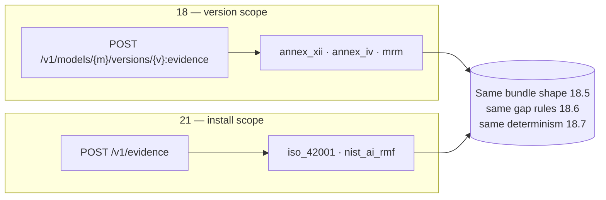

# 21 — Assurance Profiles (ISO/IEC 42001 · NIST AI RMF)

> **Regime: neutral.** Two voluntary frameworks that ask the same question — *can you show the
> process is actually followed?* — answered from facts `02`–`11` already hold.
>
> Status: **Proposed**. **No schema, no new tables, no new entities.** Two profiles on the
> `18.2` seam and one new scope for them to run at (§3). This doc exists to prove the seam
> works: if adding a framework needs a migration, the seam was a claim rather than a design.
> The landscape is `15.2.3`; the export mechanism is `18`.

## 1. Scope

| In scope | Out of scope |
|---|---|
| Mapping stored facts onto both frameworks' structures | Certifying, or predicting an audit outcome |
| A registry-wide bundle, not just a per-model one (§3) | The organisation's AI policy, training records, or committee minutes |
| Naming what the registry cannot evidence | Reproducing ISO control text (§4.1) |

## 2. One Shape, Two Vocabularies

Both are **management-system** regimes (`15.2.6`): they do not ask what a model *is*, they ask
for evidence that an organisation does what it says. That makes the audit log the primary
artefact rather than a supporting one.

| | ISO/IEC 42001:2023 | NIST AI RMF 1.0 |
|---|---|---|
| Body | ISO/IEC JTC 1/SC 42 | NIST (US Dept of Commerce) |
| Structure | 9 control objectives (A.2–A.10), 38 controls | 4 functions, 19 categories, 72 subcategories |
| Certifiable | **yes** — accredited, 3-year cycle | no — voluntary |
| Text is | copyrighted, paywalled (§4.1) | public domain |
| Asks for | a management system, evidenced | risk practices, evidenced |

**Why both, and why together.** The mapping work is the same work: each is a table from a
framework's headings to the queries that answer them. Shipping one and not the other would
duplicate the effort later for no saving now.

## 3. The Subject Is the Install, Not a Version

`18` exports evidence about **one version of one model**. Neither framework here asks about a
model — they ask about the *organisation*. A per-version bundle would answer a question nobody
asked.

So these profiles run at a new scope, and it is the only genuinely new mechanism in this doc:



Everything downstream is unchanged: same envelope, same `held`/`partial`/`not_held_by_registry`
statuses, same `gapSummary`, same self-digest. Only `subject` differs.

```json
"subject": {
  "scope": "install",
  "registryVersion": "1.2.0",
  "asOf": 1785000000000,
  "modelCount": 47,
  "classifiedModelCount": 41
}
```

### 3.1 `asOf`, because an install is a moving target

`18.7` requires that the same facts and the same profile produce a byte-identical bundle. At
version scope that is nearly free — a published version is immutable. At install scope the
inventory changes under you.

`asOf` is therefore **required, not defaulted to now**: every query in the profile is bounded
by it, and re-running with the same `asOf` reproduces the bundle exactly. Omitting it is
`400 invalid_argument` rather than a silent "now", because a bundle that cannot be regenerated
is not evidence.

## 4. `iso-42001`

Mapped at **control-objective** level (A.2–A.10). Nine sections.

| Objective | Theme | Status | Source |
|---|---|---|---|
| A.2 | AI policy | ✗ | An organisational document, not a registry fact |
| A.3 | Internal organisation — roles, responsibilities | ◐ | `model.owner`, `X-Lineage-Actor` on every audit row; **reporting lines not held** |
| A.4 | Resources — **AI system inventory**, data, tooling | ✅ | `model`, `model_version`, `artifact` — the inventory *is* the registry |
| A.5 | Impact assessment | ◐ | `classification.intended_purpose`, `basis` (`16.7.1`); **the assessment itself not held** |
| A.6 | AI life cycle — development, verification, deployment | ✅ | stage machine (`02.4`), `evaluation` (`11.3.4`), `deployment`, full `audit_event` history |
| A.7 | Data for AI systems | ◐ | `trained_on` edges (`07.2`); **curation and labelling methodology not held** — same gap as `18.4` §3 |
| A.8 | Information for interested parties | ✅ | `DOC` artifacts, model cards, the `annex_xii` bundle itself |
| A.9 | Responsible use | ✗ | A deployment-side concern |
| A.10 | Third-party and customer relationships | ◐ | `derived_from` edges name third-party base models; **supplier agreements not held** |

**Three held, four partial, two not held.** Coverage is better than `annex_iv` because A.4 and
A.6 — inventory and lifecycle — are exactly what a registry is, and worse than `mrm` because
two objectives are purely organisational.

### 4.1 What this profile deliberately does not contain

ISO standards are **copyrighted and sold**. The profile ships:

- objective identifiers and short theme labels (facts, not the standard's text), and
- Lineage's evidence, keyed to them.

It does **not** ship control text, control-by-control interpretation, or a statement of
applicability. An auditor works from a licensed copy; the bundle tells them which of our facts
answer which objective. Anything more would be redistributing the standard and pretending to
be a certification body — two different problems, both ours to avoid.

## 5. `nist-ai-rmf`

Mapped at **category** level (GOVERN 1–6, MAP 1–5, MEASURE 1–4, MANAGE 1–4). Public domain, so
the profile can name categories directly.

| Function | Where the registry lands | Status |
|---|---|---|
| **GOVERN** | Accountability is the strong part: every state change carries an actor and a timestamp (`02.5`), ownership is a field, and the audit log is tamper-evident once `19.5` sealing is on. Policy and culture are not registry facts | ◐ |
| **MAP** | Context and categorisation come from `classification.intended_purpose` and `basis` (`16`); capabilities and limitations from `11.3` insights and `evaluation` by split. Stakeholder identification is not held | ◐ |
| **MEASURE** | The strongest function. `evaluation` with harness, version, split and `evidence_artifact_id` (`11.3.4`) is precisely what MEASURE asks to see recorded, and `11.4` fingerprints let two versions be compared honestly | ✅ |
| **MANAGE** | Lineage records what was decided and when — stage transitions, `17` review outcomes, `20` validation conditions. Incident response and risk treatment plans are not held | ◐ |

**One held, three partial, none absent.** The shape differs from ISO's: NIST's functions are
broad enough that no function is entirely outside a registry, which makes `partial` the honest
status almost everywhere. A profile reporting three of four as "held" would be the overclaim
`15.3.2` exists to prevent.

### 5.1 Category-level, not subcategory-level

72 subcategories, and a registry speaks to perhaps a third of them. Mapping at subcategory
level would produce a document that is mostly `not_held_by_registry` — technically true,
useless to read, and expensive to keep current across an AI RMF revision (**1.0 is under
revision**, `15.2.3`).

Category level keeps the document readable and the mapping stable. If a buyer needs
subcategory granularity, that is a fixture change, not a redesign.

## 6. Why There Is No Schema Here

Worth stating plainly, because it is the load-bearing claim of `15.2.7`:

| Framework | New tables | New columns | New entities |
|---|---|---|---|
| ISO/IEC 42001 | 0 | 0 | 0 |
| NIST AI RMF | 0 | 0 | 0 |

Both are satisfied by queries over `model`, `model_version`, `artifact`, `classification`,
`evaluation`, `lineage_edge`, `deployment` and `audit_event`. What made that true was not luck:
it is `18` being written regime-neutral (`15.4.3`), and `16.3.1` refusing to let one
jurisdiction's vocabulary occupy an unprefixed column.

The only new mechanism is install scope (§3), and it is shared by both.

## 7. API

Model API (`:8081`, `/v1`), conventions per `03.1`.

```
POST /v1/evidence        body {profile, asOf}, query ?include=docs
GET  /v1/evidence        generation history at install scope
```

```bash
curl -X POST "$LINEAGE/v1/evidence" \
  -H 'Content-Type: application/json' -H 'X-Lineage-Actor: compliance@acme.example' -d '{
    "profile": "iso_42001",
    "asOf": 1785000000000
  }'
```

→ `201` + an `18.5` bundle with the §3 subject block.

Audit action: `evidence.generate`, as `18.7` — with `subjectType: "install"`.

### 7.1 Errors

`03.9` vocabulary, no new codes.

| Situation | Code | HTTP | `details` |
|---|---|---|---|
| Missing `asOf` | `invalid_argument` | 400 | `field: "asOf"` — §3.1 |
| `asOf` in the future | `invalid_argument` | 400 | |
| Unknown `profile` | `invalid_argument` | 400 | `allowedValues` |
| Install-scope profile requested at version scope, or the reverse | `invalid_argument` | 400 | `reason: "wrong_scope"`, `expectedScope` |

The last one matters: `annex_iv` at install scope and `iso_42001` at version scope are both
category errors, and silently coercing either would produce a confident, meaningless document.

### 7.2 `evidence_bundle` gains a scope

`18.8.1` keys bundles to `version_id`. Install-scope bundles have none, so the column becomes
nullable and a `scope` discriminator joins it — the `02.3.3` single-table pattern, reused.

| Column | Change |
|---|---|
| `scope` | new. `version` (default) \| `install` |
| `version_id` | nullable — required when `scope = 'version'`, null when `install` |
| `as_of` | new, nullable. Required when `scope = 'install'` (§3.1) |

## 8. Console (`06`)

- A **Compliance** page at install scope, beside the per-version panel `18.10` describes.
- The gap list renders as a checklist, never a score (`18.10`). "Two objectives not held" is
  the correct result for a model registry and must not read as a failing grade — nobody
  expects a registry to hold an AI policy.
- Each held section links to the live query behind it, so a reader can check the claim rather
  than trust the bundle.

## 9. Deferred

| Item | When |
|---|---|
| Subcategory-level NIST mapping | If a buyer asks (§5.1). A fixture change |
| A statement of applicability for ISO | Never — that is a certification body's artefact (§4.1) |
| Tracking AI RMF 1.0 → its revision | When the revision lands. The category level is chosen partly to survive it |
| ISO/IEC 42005 impact-assessment profile | If A.5 coverage turns out to be the gap buyers care about |
| Continuous / scheduled generation | With the event surface (`00.7`), as `16.10` |

## 10. See Also

| For | Doc |
|---|---|
| The landscape, and why these two are the cheapest profiles | `15.2.3`, `15.2.7` |
| Bundle shape, gap rules, determinism, canonicalization | `18.5`–`18.7` |
| The prefixed-column rule that kept this schema-free | `16.3.1` |
| `mrm` — the third profile, which *does* need schema | `20` |
| `evaluation`, insights, fingerprints | `11.3`, `11.4` |
| Audit invariants and actor attribution | `02.5` |
| Audit sealing that strengthens GOVERN evidence | `19.5` |
