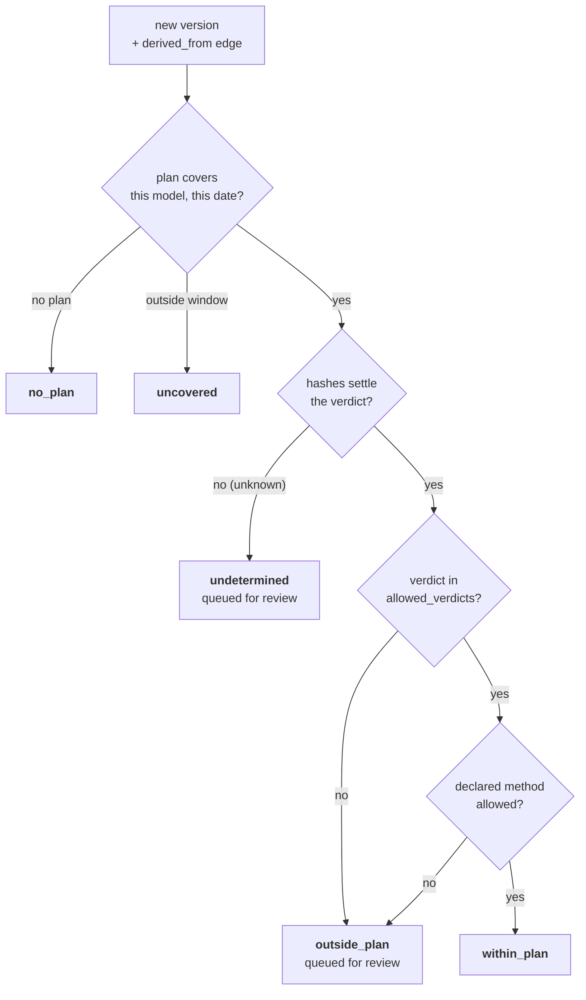

# 22 — Change Control Plans

> **Regime: sectoral pre-market (US FDA, with Health Canada and UK MHRA).** Serves the
> [Predetermined Change Control Plan](https://www.fda.gov/medical-devices/software-medical-device-samd/predetermined-change-control-plans-machine-learning-enabled-medical-devices-guiding-principles)
> shape: declare in advance which model changes are pre-authorised, then show what actually
> changed. UNECE R156 asks the same question of vehicle software (§8).
>
> Status: **Implemented (M18).** One new table and a derived predicate. The comparison it rests
> on already exists — `11.4` fingerprint verdicts — so this doc is mostly about **not**
> adjudicating with them. The landscape is `15.2.4`; the review precedent is `17`.

## 1. Scope

| In scope | Out of scope |
|---|---|
| Recording a declared change envelope against a model | Authoring, filing, or amending a submission |
| Reporting whether a new version falls inside it | Deciding whether a new submission is required (`15.3`) |
| Flagging versions that fall outside, or cannot be judged | Blocking a publish or a promotion |
| — | Clinical evidence, labelling, or device-level documentation |

## 2. The Problem

A PCCP is a bargain struck up front: *"we may retrain this model on new data using the same
architecture, and you have already approved that."* Changes inside the envelope ship without a
new marketing submission. Changes outside it do not.

The failure mode is not detecting the change — it is **noticing, months later, that a shipped
version drifted outside what was agreed.** By then it is in the field.

Lineage already knows what changed between two versions, precisely and cheaply, from hashes a
producer submitted at publish (`11.4`). What it lacks is the other half of the comparison: the
envelope. One table supplies it, and the check becomes a lookup.

## 3. What a Plan Declares

A real PCCP has three parts. Only the first is mechanically checkable, and the doc is explicit
about that rather than pretending otherwise.

| PCCP part | Checkable here | Why |
|---|---|---|
| **Description of Modifications** — what may change | ✅ | Maps onto the `11.4.1` verdict vocabulary |
| **Modification Protocol** — how it will be validated | ◐ | `evaluation` shows tests ran; the protocol itself is a document |
| **Impact Assessment** — why it stays safe | ✗ | A clinical and engineering judgement |

The envelope is expressed in the vocabulary the registry can actually evaluate:

| Field | Example | Meaning |
|---|---|---|
| `allowed_verdicts` | `["identical","reweighted"]` | which `11.4.1` verdicts are pre-authorised |
| `allowed_methods` | `["retrain","fine_tune"]` | which declared `derived_from` methods (`11.3.6`) are pre-authorised |

Validated against the real verdict enum (corrected in M18): `allowed_verdicts` is non-empty
and **excludes `unknown`** — it is the absence of a verdict, not a kind of change a plan can
approve. `allowed_methods` is omitted or `null` for unconstrained; an **empty list is
refused**, since it would read as "no declared method may ship". Duplicates are dropped.

**Why the verdict vocabulary and not free text.** A plan saying *"minor retraining only"* is
unfalsifiable — no query can evaluate it, so nothing would ever be flagged. `reweighted` is a
statement about topology, shape, dtype and weights that the registry can check against hashes
it holds. Anything richer is a document, and documents attach as artifacts (§6).

## 4. The Conformance Predicate (normative)

**Derived on read, never stored** — the same rule as `16.5` drift and `11.6` diffs. A stored
verdict would be a second truth that disagrees with the hashes the moment either side moves.

For version `v` of model `m`, with `derived_from` edge `e` to a predecessor, `P` the model's
plans, and `p` the plan in `P` covering `v.created_at`:

```
conformance(v, e) :=
    P IS EMPTY                                           → no_plan
  | p IS NULL  -- no window [effective_from,
               -- effective_to) holds v.created_at       → uncovered
  | verdict(11.4.1) IS NULL OR 'unknown'                 → undetermined
  | verdict NOT IN p.allowed_verdicts                    → outside_plan
  | e.properties.method IS NOT NULL
      AND p.allowed_methods IS NOT NULL
      AND method NOT IN p.allowed_methods                → outside_plan
  | otherwise                                            → within_plan
```



Implemented as `ConformanceOf`, a pure function over supplied facts (the `ReviewEligible` /
`MRMStateOf` shape); the per-version read, the queue and the console all call it. Corrections
from M18:

| Spec said | Built | Why |
|---|---|---|
| `p IS NULL → no_plan`, then a window test | `no_plan` = the model has **no plans at all**; `uncovered` = it has plans but **none was in force** at publish | `p` cannot be both "absent" and "the plan whose window is tested" |
| `BETWEEN … AND COALESCE(effective_to, ∞)` | **Half-open** `[effective_from, effective_to)` | At a supersession instant exactly one plan covers; the boundary belongs to the new plan |
| The flowchart's "`weights_hash` present both sides?" | **Any `unknown` verdict** is `undetermined` | A missing topology or shape hash leaves the verdict just as open; a verdict the present hashes *do* settle (a changed topology with no weights hash is `rearchitected`) is judged normally |
| One `outside_plan` branch per test | `outside_plan` carries **`reasons`**: `verdict_not_allowed`, `method_not_allowed`, both when both hold | The `16.5` "every reason" rule |
| The §6.2 index serves "the §4 join" | The plan in force is chosen in Go by `PlanInForce` over the model's plans; the index serves that read | One choice, shared by both reads, cannot disagree with itself |

A version with **no `derived_from` edge** has nothing to compare and is not in the queue. That
leaves a producer who never records lineage as invisible as §4.1 warns about for hashes;
flagging it is deferred (§9).

### 4.1 `undetermined` is queued, not passed

A missing `weights_hash` makes `identical` and `reweighted` indistinguishable (`11.4.3`). The
registry says so and queues the version, rather than assuming the benign reading.

This is `17.4`'s rule — *"we cannot tell what changed" is precisely the case wanting human
eyes* — applied to a regime where the downside of a silent pass is a device in the field
outside its clearance. Treating an absent hash as conformant would make a producer who never
computes `weights_hash` invisible to the whole mechanism.

### 4.2 `uncovered` is not `outside_plan`

A version published before the plan took effect, or after it lapsed, is **not** a violation —
it is simply not governed by that plan. Collapsing the two would fill the queue with history
every time a plan is superseded, and a queue that is mostly noise gets ignored.

As built, a plan closes only when superseded, and the successor starts where it ends — so in
practice `uncovered` means *published before the model's first plan*.

## 5. The Registry Reports; It Does Not Adjudicate

`outside_plan` does not mean "a new submission is required." It means **the change is outside
what this plan declared**, which is a fact. Whether that triggers a submission depends on the
device, the predicate, and regulatory judgement the registry does not hold — `15.3` again, and
the same line `17.3` draws for Art. 25.

| Lineage does | Lineage does not |
|---|---|
| Say the change was `rescaled` and the plan allowed only `reweighted` | Say a 510(k) is required |
| Queue the version for a human | Block the publish or the promotion |
| Record that a new plan was declared, and when | File, amend, or transmit anything |

**Publishing is never blocked.** A registry that refused a publish on a derived legal judgement
would be wrong more often than it was right, and would be routed around within a week.

## 6. Data Model

Additive only (`02.7`). One table.

### 6.1 `change_plan` (many per model, append-only)

| Column | Type | Notes |
|---|---|---|
| `id` | id | PK |
| `model_id` | id | FK→`model.id` ON DELETE CASCADE |
| `ref` | str? | the submission or clearance identifier — e.g. a 510(k) number |
| `summary` | str | what the plan permits, in the operator's words |
| `allowed_verdicts` | json | array from the `11.4.1` vocabulary (§3) |
| `allowed_methods` | json? | array of declared `derived_from` methods; null = unconstrained |
| `protocol_artifact_id` | id? | FK→`artifact.id` where `kind=DOC` — the PCCP document itself |
| `effective_from` | ts | |
| `effective_to` | ts? | null = open-ended; set when superseded |
| `declared_by` | str? | `X-Lineage-Actor` at write |
| `declared_at` | ts | server-set |

Append-only, like `validation` (`20.5`) and `modification_review` (`17.5.1`). Superseding a
plan writes a new row and stamps `effective_to` on the old one — **the history is the point**,
because the question is always *which plan was in force when that version shipped*.

As built (M18): `allowed_verdicts` and `allowed_methods` are JSON arrays in `TEXT`, the labels
encoding. **`protocol_artifact_id` carries no foreign key**, for the `17.5.1` `edge_id` reason —
a cascade would erase the plan with its document, `SET NULL` would rewrite what it rested on. It
is checked at write: a `DOC` artifact on one of this model's versions. The overlap check and the
stamp run in one transaction under the model's write lock, so two concurrent declarations
cannot both pass.

### 6.2 Indexes

| Index | Purpose |
|---|---|
| (`model_id`, `effective_from`, `effective_to`) | plan-in-force lookup, the §4 join |

**No conformance column anywhere.** §4 is computed from `change_plan`, `lineage_edge` and
`version_insight`, all of which already carry the facts.

## 7. API

Model API (`:8081`, `/v1`), conventions per `03.1`.

```
POST /v1/models/{m}/change-plans
GET  /v1/models/{m}/change-plans
GET  /v1/models/{m}/versions/{v}/conformance
GET  /v1/change-plans/conformance?status=outside_plan|undetermined
```

Audit actions: `change_plan.declare`, `change_plan.supersede`, with the envelope and window as
event data. As built they are written by the core's shared audit path right after the plan
commits — the same path every other write uses — not inside the store transaction that
`02.5` invariant 4 describes.

### 7.1 Declare a plan

```bash
curl -X POST "$LINEAGE/v1/models/lesion-classifier/change-plans" \
  -H 'Content-Type: application/json' -H 'X-Lineage-Actor: ra@acme.example' -d '{
    "ref": "K243117",
    "summary": "Periodic retraining on additional de-identified sites. Architecture frozen.",
    "allowedVerdicts": ["identical", "reweighted"],
    "allowedMethods": ["retrain", "fine_tune"],
    "protocolArtifactId": "01JAV…",
    "effectiveFrom": 1780000000000
  }'
```

`effectiveFrom` defaults to now; a past value is legitimate. `declaredBy`/`declaredAt` are
server-set, and `effectiveTo` is written only by a supersession — sending any of them is `400`.
**Supersession is explicit** (added in M18): `"supersedes": "<planId>"` names the open plan
being replaced, and closes it at the new `effectiveFrom`. Without it, a second plan is an
overlap. Replacing an envelope is deliberate, never the side effect of a second `POST`.

`GET …/change-plans` returns every plan, superseded ones included, newest `effectiveFrom`
first. `GET …/versions/{v}/conformance` returns `{"items": [...]}`, **one item per
`derived_from` edge** (a merge has two).

### 7.2 The queue

```
GET /v1/change-plans/conformance?status=outside_plan
```

```json
{ "items": [
    { "model": "lesion-classifier", "version": "3.0.0", "versionId": "01JB2…",
      "edgeId": "01JB3…", "derivedFrom": { "model": "lesion-classifier", "version": "2.4.0" },
      "plan": { "id": "01JAX…", "ref": "K243117" },
      "conformance": "outside_plan",
      "reasons": ["verdict_not_allowed", "method_not_allowed"],
      "verdict": "rescaled",
      "allowedVerdicts": ["identical", "reweighted"],
      "allowedMethods": ["retrain", "fine_tune"],
      "declaredMethod": "distill",
      "hashes": { "topology": { "from": "t1", "to": "t1", "changed": false, "present": true },
                  "shape":    { "from": "s1", "to": "s2", "changed": true,  "present": true }, "…": {} },
      "basis": { "fromHashes": ["topology", "shape", "dtype", "weights"],
                 "toHashes":   ["topology", "shape", "dtype", "weights"] },
      "publishedAt": 1784000000000 }
  ], "nextPageToken": "" }
```

`basis` shows which hashes drove the verdict, so a reader can see *why* rather than trust the
label — the same reason `17.6.2` carries its basis. **As built it is `17.6.2`'s exact pair**
(corrected in M18): `hashes` per level, both sides, with `changed` — the `=`/`≠` sketched
here — and `basis` as the two lists of which levels each side supplied, so an `undetermined`
row says which side was missing what. The two queues read alike.

`status` takes one or more values, comma-separated or repeated; `outside_plan,undetermined` is
what wants a human. **No default**: omitting it returns every row, for the `/v1/reviews`
reason. The queue scans only models with at least one plan, so `no_plan` never appears in it.
**Publishing is never gated**: a `rescaled` version under an `identical`/`reweighted` plan
publishes, queues and promotes.

### 7.3 Errors

`03.9` vocabulary, no new codes.

| Situation | Code | HTTP | `details` |
|---|---|---|---|
| `allowedVerdicts` empty, or not in the `11.4.1` vocabulary | `invalid_argument` | 400 | `allowedValues` |
| `effectiveFrom` overlaps any existing plan's window, other than the one superseded | `failed_precondition` | 409 | `reason: "plan_overlap"`, `planId` |
| `supersedes` names a plan already superseded | `failed_precondition` | 409 | `reason: "already_superseded"`, `planId` |
| `supersedes` unknown on this model, or `effectiveFrom` not after its `effectiveFrom` | `invalid_argument` | 400 | `field` |
| `protocolArtifactId` not a `DOC` artifact on one of the model's versions | `invalid_argument` | 400 | `field` |
| Conformance requested for a version with no `derived_from` edge | `failed_precondition` | 409 | `reason: "no_predecessor"` |

The overlap rule keeps "which plan was in force" a single-valued question. Two live plans
would make the §4 predicate ambiguous, and resolving it by picking the newest would hide a
data-entry error that matters.

### 7.4 Console (added in M18)

The compliance workspace gains a change-control section: `outside_plan` and `undetermined`
rows first, with side-by-side fingerprints (changed rings emphasised), the verdict, the
reasons and the envelope; `within_plan` and `uncovered` rows collapsed beneath; then the plan
register, superseded plans kept and marked. Nothing on it acts or gates. It renders nothing
until a model has a plan.

## 8. UNECE R156 Is the Same Shape

Vehicle software update management asks the same question — *was this update within what the
type approval covers* — against the same two facts: a declared envelope and an observed
change. The `change_plan` table serves it with different `ref` semantics.

Not built now: nothing in `15.2.4` suggests an automotive buyer before a medical one, and a
second regime over the same table is a fixture, not a redesign. Recorded here so the table is
not named `pccp_plan` and boxed in.

## 9. Deferred

| Item | When |
|---|---|
| Per-tensor envelope (*"only `lm_head` and `*.q_proj` may change"*) | `11.4.2` retains per-tensor digests, so the predicate could tighten. Wait for a plan that needs it |
| Metric floors in the envelope (*"AUC must not fall below 0.94"*) | Natural and tempting; needs `evaluation` comparability rules (`11.6`) to be load-bearing rather than advisory |
| R156 support | §8 |
| Plan-level approval workflow | Not a registry concern; the plan is recorded, not routed |
| Blocking publish on `outside_plan` | Never. §5 |
| Flagging a version under a plan that records **no `derived_from` edge** | When a plan needs it; today it is simply not in the queue (§4) |
| Declaring a plan from the console | The console shows plans and the queue (compliance workspace); declaring stays on `/v1`, where the RA pipeline writes |

## 10. See Also

| For | Doc |
|---|---|
| The landscape and the change-control shape | `15.2.4`, `15.2.6` |
| Fingerprint hashes and the verdict table this rests on | `11.4` |
| `derived_from` edges and the declared `method` | `07.2`, `11.3.6` |
| The review precedent — queue an `unknown`, freeze what was witnessed | `17.4`, `17.5` |
| Boundary: report, never adjudicate | `15.3` |
