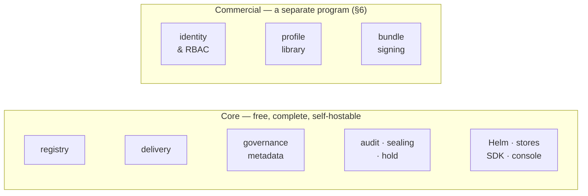
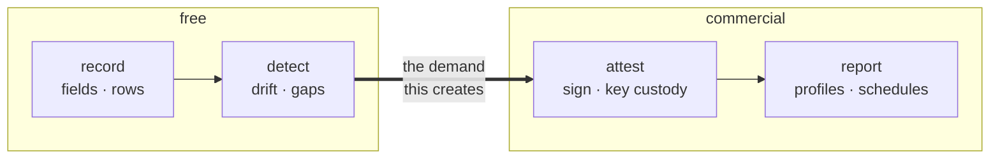
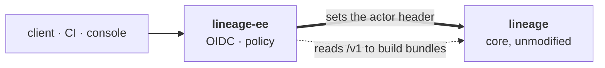

# 23 — Open-Core Split

> Status: **§3–§5 proposed, §6 decided.** Where a commercial tier sits relative to the free
> registry, why the line falls where it does, and what remains open before code exists.
>
> The split itself is *derived* from the axioms — most of it is already implied by what `00.2`
> chose to exclude — and it adds no entity, endpoint or table to any other doc. **§6 is a
> settled build decision**: the commercial tier is a **separate proprietary program** that sits
> in front of core and reads its public API, never a fork, a plugin or a linked library. Core
> is unchanged by all of it. Recorded here rather than in `00.11` because it constrains
> packaging, not the product.

## 1. The Question

Not "what could we charge for". The axioms make that the wrong question, because `00.2.1` —
self-hosting is the only distribution model, and `00.11.15` rules out a hosted service
permanently — forbids the usual answer. There is no tier that runs somewhere the customer
cannot reach, and no data of theirs we hold. The question is therefore:

> **What can a commercial tier add such that someone who never pays still gets a complete,
> honest registry?**

If the free tier is a demo, the project fails on its own terms. Every rule below exists to
keep that from happening quietly.

## 2. The Test

A capability may sit in the commercial tier only if **all three** hold.

| # | Rule | Derived from |
|---|---|---|
| 1 | Removing it leaves a **complete and correct** registry, not a crippled one | `00.2.1`, `00.2.2` |
| 2 | It is **not** in the publish → resolve → fetch path | `00.2.8` |
| 3 | Its buyer is an **organisation**, not a developer | — commercial reality |


Rule 1 is the one that does the work. It rules out the tempting choices — Postgres, the audit
log, Helm — because each is load-bearing for the free tier's correctness, not a luxury on top
of it.

## 3. The Split



The upper band reaches the lower one only through contracts that already exist (§5); it never
replaces or gates anything in it.

| Capability | Tier | Why |
|---|---|---|
| Registry, artifacts, delivery, console, SDK/CLI, Helm | **core** | rule 1 and rule 2 — this *is* the product |
| Audit log, retention floor, legal hold (`19`) | **core** | `00.2.7` makes auditability an axiom; a paid audit log contradicts it |
| Classification, drift, validation records (`16` · `17` · `20`) | **core** | §4 |
| One self-serve export profile (`18`) | **core** | the value has to be visible without a sales call |
| **Identity & RBAC** | commercial | `00.2.4` leaves the slot empty by design — §3.1, split further in §6.3 |
| Tamper-evident audit chain (`19.5`) | **core** | `00.11.14` settled this — Merkle epoch sealing costs the write path nothing, so it defaults **on**. A paid tamper-evidence tier would contradict a resolved decision and `00.2.7` |
| **Profile library + scheduled bundles** (`18` · `21` · `22`) | commercial | §4 |
| **Signing** bundles with a managed key (`18.11`) | commercial | distinct from sealing: the self-digest is core, key management is not |
| ~~Multi-tenancy~~ | **core, if ever** | §6.2 — it is a data-model change, and §6's shape cannot deliver it from outside |

### 3.1 Auth is the cleanest line in the product

`00.2.4` puts authN/authZ on the infra and has Lineage record `X-Lineage-Actor` for
attribution. For a platform team behind a mesh that is correct and sufficient.

For a regulated buyer it is not: anyone who can reach `:8081` can set a legal risk class and
write any actor string they like into the audit trail. The attribution is only as good as the
network in front of it.

SSO plus per-model authorisation ("only the risk function may write an `eu_ai_act` row") is
therefore additive by construction — **the free tier keeps trusting the header exactly as
specced today**, and nothing is taken away from anyone. That is rule 1 satisfied in the
strongest possible form: the feature did not exist to remove.

## 4. Why the Compliance Layer Splits Down the Middle

The tempting move is to make all of `15`–`22` commercial. It is the only part of Lineage that
is not parity with something free, and `20.2` already identifies the buyer with a budget —
*"the only regime here with fifteen years of examiner precedent and staffed teams behind it —
the budget exists rather than arriving with a deadline."*

**Don't.** Split it by verb instead:

| Verb | Example | Tier | Reason |
|---|---|---|---|
| **Record** | `eu_system_risk_class`, `mrm_tier`, a `validation` row | core | it is metadata on a model — the registry's actual job. Cheap to build, and it is what makes anyone choose Lineage over MLflow in the first place |
| **Detect** | the drift predicate (`16.5`), unmonitored-in-production (`20.7`) | core | computed on read from rows already held. Costs nothing to give away and creates the problem the paid tier solves |
| **Attest** | signing a bundle with a managed key | commercial | the *sealing* half is core and on by default (`00.11.14`); what is left is key custody, which is a service, not a fact |
| **Report** | profile library, scheduled and diffed bundles | commercial | the buyer is a compliance function with a recurring obligation, not an engineer with a question |



**Neither commercial item is being taken away.** Signed bundles are deferred post-v1 in `18.11`
("signing needs key management Lineage does not have") and scheduled generation is deferred in
`21.9` pending the event surface. Both are unbuilt roadmap items, so the free tier loses
nothing it has today — the same rule-1 argument as §3.1.

**Tamper-evidence stays free**, and this is a correction to an earlier draft of this doc:
`00.11.14` resolved that Merkle epoch sealing costs the write path nothing and therefore
defaults **on**, in core. The free tier's audit log is already tamper-*evident*, and its
bundles already carry a self-digest (`18.7`). What the commercial tier adds is **key custody** —
a signature a third party can verify against an identity we manage — not the integrity
property itself.

The logic: **free detection manufactures the demand.** A registry that tells a team "nine of
your high-risk models are stale" for nothing is the most persuasive possible argument for the
tier that produces the document fixing it. Gating the detection hides the problem, and nobody
buys a solution to a problem they cannot see.

## 5. The Seam Already Exists

**Core needs no change to support any of this** — no new port, no plugin registry, no exported
Go API. Two contracts it already has are enough.

| Contract | Where it is today | What it carries |
|---|---|---|
| A **trusted identity header** | `internal/config`, `LINEAGE_ACTOR_HEADER`, default `X-Lineage-Actor` | `00.2.4` — core trusts an infra-supplied actor and records it for audit |
| The **public Model API** | `03`, `04` | every fact a bundle is built from |

The first was designed for an ingress or mesh to populate. A commercial front door is exactly
that ingress. The second means anything that only *reads* facts — every profile in `18`, `21`
and `22` — needs no privileged access at all.



**Removing the tier is a downgrade, never a break.** Point clients at core directly and the
result is precisely the free tier, behaving exactly as documented — which is rule 1 satisfied
structurally rather than by discipline.

## 6. How the Commercial Tier Ships

| | **A** — one repo, `ee/` tree | **B** — private repo, core as a Go module | **C** — a separate commercial program |
|---|---|---|---|
| Commercial source | published | closed | **closed** |
| Core changes needed | build tags, dormant code | ports promoted to exported packages | **none** |
| Coupling | compile-time, same tree | compile-time, versioned module | **a header and a REST API** |
| Deployables per install | 1 | 1 | 2 |

**Decision: C.** Commercial source is not published, which rules out A. B is rejected for two
independent reasons: it couples the two codebases at compile time, and **core's packages all
live under `internal/`**, which Go forbids another module from importing — B would require
promoting the port set to exported packages and maintaining it as public API forever.

```
lineage        public · Apache-2.0 · unchanged by any of this
lineage-ee     private · proprietary · a separate program, no dependency on core
```

### 6.1 A front door, not a called service

Earlier drafts rejected C, and the objections were real — but they assumed core *calls out* to
a commercial service. **Reverse the direction and each one dissolves.**

| Objection, arrow inward | With the arrow reversed |
|---|---|
| a second deployable contradicts `00.2.3` | it is an ingress-layer component, and `00.2.4` already assigns that layer to the infrastructure. Core remains one binary, one Deployment |
| a network hop per authorised request | requests pass *through* rather than triggering a side call — no extra round trip |
| fail open is theatre; fail closed lets a paid component take down a free registry | neither applies. If the front door is down it fails like any ingress; core, addressed directly, is untouched |

So `lineage-ee` **authenticates the caller, decides, stamps the actor header, and forwards**.
The header it sets is the one core has always trusted, which is why core needs no code change:
the integration was designed in `00.2.4` before there was anything to integrate.

It runs in a second mode for the compliance tier: an ordinary **client of core's `/v1` API**,
reading facts and shaping them into `18`/`21`/`22` profiles. In that mode it is not in the
request path at all, and it can sign what it produces with a key core never holds (§4).

### 6.2 What this shape cannot deliver

Honest limit, and it costs one item from §3's original list.

**Multi-tenancy cannot be built this way.** Isolation is a data-model property — the reserved
`scope` key in `00.11.5` — and nothing outside core can retrofit it. It therefore moves to
core-if-ever rather than remaining a commercial line item. Anything else needing a schema
change lands the same way.

The rule that follows: **the commercial tier may add identity, judgement and paperwork, but it
may never need a column.** That is a sharper and more testable boundary than §2's three rules
alone, and it falls out of the architecture rather than from restraint.

### 6.3 Identity and authorisation are different problems

Both live in `lineage-ee`, but they behave differently and the distinction drives the design:

| | Shape | Frequency | Consequence |
|---|---|---|---|
| **Identity** — verify an OIDC token from the customer's IdP | already an API call, to *their* provider | once per session, cacheable | a genuine network dependency, and an acceptable one |
| **Authorisation** — map claims to per-model policy | a decision, not a lookup | every request | evaluated **locally, in-process**; no call per decision |

"Consume SSO as an API" is correct and is the shape — the call goes to the customer's identity
provider, not to us. Policy evaluation stays local, so the front door adds one hop total, not
one hop per rule.

### 6.4 Licensing

| Question | Answer |
|---|---|
| Core licence | Apache-2.0 — genuinely so: core contains no commercial code, no build tags, nothing dormant |
| Commercial code | **proprietary**, private repo, ordinary commercial EULA |
| Core is **not** BSL | `00.11.16`. BSL defends hosting revenue, and `00.11.15` means there is none to defend |
| Commercial code is not BSL or Elastic v2 either | those licence *published* source. With nothing published they solve a problem we do not have |
| Contributor agreement | **CLA, from the first outside PR** (`00.11.16`) — not a DCO |
| Licence validation | **fully offline**. `00.11.15` makes air-gapped the normal case; no phone-home, no usage beacon |
| What actually enforces payment | distribution control — the commercial binary is published only to customers |

**Why a CLA when core stays Apache.** A DCO certifies where a contribution came from; it does
not grant the right to relicense it. Apache-2.0 is the right answer today (`00.11.16`), and the
CLA is what keeps it from being the only answer available later. **This is the one remaining
closing window**: a bot and a file today, or a negotiation after the first unsigned outside PR.

### 6.5 Why not source-available

A was available and is declined: **commercial source is not published.** Recorded because the
option is real and a future reader should know it was weighed, not missed.

Publishing would not have given it away — copyright is deny-by-default, and a source-available
licence (BSL, Elastic v2) permits reading while forbidding production use. That model works. It
is simply not the posture chosen here.

| Given up | Consequence | Mitigation |
|---|---|---|
| Customer audit of the code enforcing their own access control | a regulated buyer may reasonably ask to inspect what authorises access to a legal field | source access under NDA, or escrow, offered per-deal |
| Outside contribution to commercial features | nobody but us fixes a bug there | true of any proprietary tier; priced into support |
| The trust signal of an auditable paid tier | "open core" reads weaker when the core is all anyone can see | §7 carries more weight here, not less |

**The boundary must therefore be published even though the code is not.** §3 and §7 are that
publication, and they are load-bearing precisely because no reader can check them against the
source. C helps here in a way A and B do not: the commercial program touches core only through
a documented header and a public API, so **what it can possibly do is bounded by contracts
anyone can read.**

## 7. What We Will Never Gate

Publishing this list is part of the strategy — an open-core project is trusted exactly as far
as its boundary is predictable.

| Never gated | Because |
|---|---|
| Postgres, or any storage backend | `00.2.6`; gating the real database is the classic bait-and-switch |
| The audit log | `00.2.7` — auditability is an axiom, not a feature |
| Helm, or a working default install | `00.2.2`; `14.6` documents the competitor whose self-hosting is enterprise-tier-only and takes ~3 engineer-weeks to stabilise — that gap is what we sell into |
| Resolve, fetch, signed URLs, the storage-initializer | `00.2.8` — this is the adoption engine |
| Recording or detecting compliance state | §4 |

## 8. Open Decisions

Not resolved here; each needs a call before the relevant code.

| ◻ | Decision |
|---|---|
| ◻ | Whether to offer source access under NDA or escrow to regulated buyers who ask (`6.5`) — a per-deal answer, but worth deciding before the first one asks |
| ◻ | Pricing axis: per-model, per-seat, or flat per-install. Per-model penalises the inventory completeness the regulations require, so probably not |
| ◻ | Where exactly inside §6.3 the line falls: OIDC token verification free with only the policy engine paid is the softer, more defensible version of §3.1 |

## 9. Impact on Build Order

**None.** `15.6`'s phasing is unchanged, and §6 adds no core work at all — which is the
strongest argument for it. Earlier drafts required an `Authorizer` port (option B) and a
decision about which packages to export; C needs neither, because it integrates through a
header that already exists and an API that is already public (§5).

Two things core should do anyway, now slightly more load-bearing:

| | Why it matters more under §6 |
|---|---|
| Keep `LINEAGE_ACTOR_HEADER` configurable and documented | it is now an integration contract, not just a convenience |
| Keep `/v1` complete enough to rebuild any bundle from outside | a profile that needs a private query would break the boundary in §6.2 |

Neither is new work. Both are properties core already has and must not lose.

## 10. See Also

| For | Doc |
|---|---|
| Axioms this is derived from | `00.2` |
| The buyer, and why the compliance layer has a budget | `15.2.2`, `20.2`, `15.6.1` |
| Competitors' self-hosting and pricing failures | `14.6`, `14.9` |
| The profile seam the commercial library plugs into | `18.2`, `21` |
| Optional audit chain | `19` |
| Reserved multi-tenancy key | `00.11.5` |
| No SaaS; Apache core, not BSL | `00.11.15`, `00.11.16` |
| The trusted actor header this integrates through | `00.2.4`, `03` |
