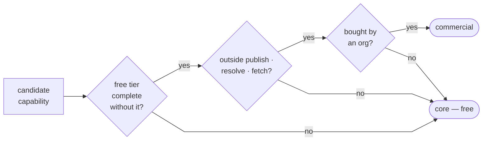
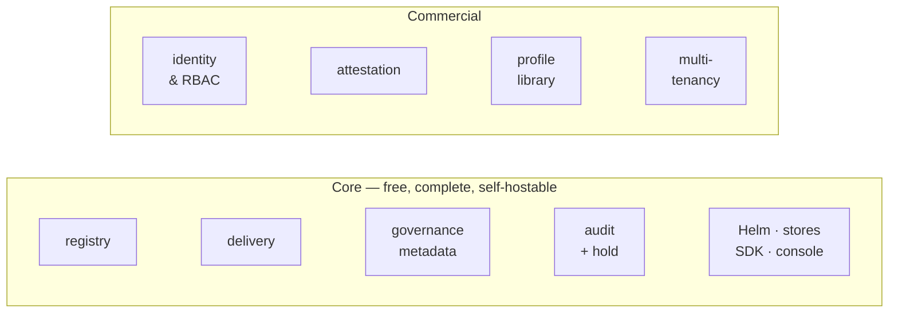
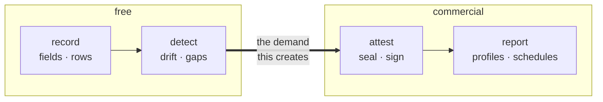
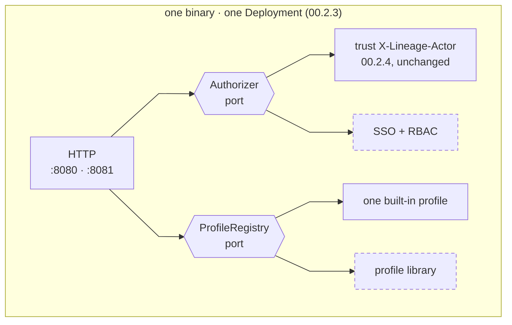

# 23 — Open-Core Split

> Status: **Proposed**. Where a commercial tier could sit relative to the free registry, why
> the line falls where it does, and what has to be decided before code exists.
>
> This is a **strategy doc, not an architecture change.** Nothing here alters an axiom or a
> `00.11` decision. The split is *derived* from the axioms — most of it is already implied by
> what `00.2` chose to exclude.

## 1. The Question

Not "what could we charge for". The axioms make that the wrong question, because `00.2.1` —
self-hosting is primary, SaaS never compromises it — forbids the usual answer. The question is:

> **What can a commercial tier add such that someone who never pays still gets a complete,
> honest registry?**

If the free tier is a demo, the project fails on its own terms. Every rule below exists to
keep that from happening quietly.

## 2. The Test

A capability may sit in the commercial tier only if **all three** hold.

| # | Rule | Derived from |
|---|---|---|
| 1 | Removing it leaves a **complete and correct** registry, not a crippled one | `00.2.1`, `00.2.2` |
| 2 | It is **not** in the publish → resolve → fetch path | `00.2.8` |
| 3 | Its buyer is an **organisation**, not a developer | — commercial reality |

Rule 1 is the one that does the work. It rules out the tempting choices — Postgres, the audit
log, Helm — because each is load-bearing for the free tier's correctness, not a luxury on top
of it.

## 3. The Split

The upper band adds to the lower one through seams that already exist (§5); it never replaces
or gates anything in it.

| Capability | Tier | Why |
|---|---|---|
| Registry, artifacts, delivery, console, SDK/CLI, Helm | **core** | rule 1 and rule 2 — this *is* the product |
| Audit log, retention floor, legal hold (`19`) | **core** | `00.2.7` makes auditability an axiom; a paid audit log contradicts it |
| Classification, drift, validation records (`16` · `17` · `20`) | **core** | §4 |
| One self-serve export profile (`18`) | **core** | the value has to be visible without a sales call |
| **Identity & RBAC** | commercial | `00.2.4` leaves the slot empty by design — §3.1 |
| **Tamper-evident audit chain** (`19`) | commercial | already specced as *optional*; the seam exists |
| **Profile library + scheduled bundles** (`18` · `21` · `22`) | commercial | §4 |
| **Multi-tenancy** | commercial | `00.11.5` already defers it; expensive, and the buyer is a platform group |

### 3.1 Auth is the cleanest line in the product

`00.2.4` puts authN/authZ on the infra and has Lineage record `X-Lineage-Actor` for
attribution. For a platform team behind a mesh that is correct and sufficient.

For a regulated buyer it is not: anyone who can reach `:8081` can set a legal risk class and
write any actor string they like into the audit trail. The attribution is only as good as the
network in front of it.

SSO plus per-model authorisation ("only the risk function may write an `eu_ai_act` row") is
therefore additive by construction — **the free tier keeps trusting the header exactly as
specced today**, and nothing is taken away from anyone. That is rule 1 satisfied in the
strongest possible form: the feature did not exist to remove.

## 4. Why the Compliance Layer Splits Down the Middle

The tempting move is to make all of `15`–`22` commercial. It is the only part of Lineage that
is not parity with something free, and `20.2` already identifies the buyer with a budget —
*"the only regime here with fifteen years of examiner precedent and staffed teams behind it —
the budget exists rather than arriving with a deadline."*

**Don't.** Split it by verb instead:

| Verb | Example | Tier | Reason |
|---|---|---|---|
| **Record** | `eu_system_risk_class`, `mrm_tier`, a `validation` row | core | it is metadata on a model — the registry's actual job. Cheap to build, and it is what makes anyone choose Lineage over MLflow in the first place |
| **Detect** | the drift predicate (`16.5`), unmonitored-in-production (`20.7`) | core | computed on read from rows already held. Costs nothing to give away and creates the problem the paid tier solves |
| **Attest** | sealed audit chain, signed bundle | commercial | this is the part an examiner relies on, and the part that must be defensible rather than merely present |
| **Report** | profile library, scheduled and diffed bundles | commercial | the buyer is a compliance function with a recurring obligation, not an engineer with a question |

**Neither commercial item is being taken away.** Signed bundles are deferred post-v1 in `18.11`
("signing needs key management Lineage does not have") and scheduled generation is deferred in
`21.9` pending the event surface. Both are unbuilt roadmap items, so the free tier loses
nothing it has today — the same rule-1 argument as §3.1. What ships free is the **self-digest**
(`18.7`), which already makes a bundle tamper-*evident*; the commercial tier adds the key
management that makes it tamper-*proof*.

The logic: **free detection manufactures the demand.** A registry that tells a team "nine of
your high-risk models are stale" for nothing is the most persuasive possible argument for the
tier that produces the document fixing it. Gating the detection hides the problem, and nobody
buys a solution to a problem they cannot see.

## 5. The Code Seam

Three of the four commercial capabilities plug into extension points **the docs already
designed** for other reasons — which is the main evidence that this split is natural rather
than retrofitted.

| Capability | Seam | Status |
|---|---|---|
| Profile library | `18.2` profile seam | exists — `21` was written to prove it |
| Attestation | `19`'s optional audit chain | exists — already optional |
| Multi-tenancy | the reserved `scope` key (`00.11.5`) | reserved |
| Identity & RBAC | an `Authorizer` port | **new** — the only one to add |

Dashed = licensed. Both ports fall back to the core implementation when no key is present, so
an unlicensed install behaves exactly as `00.2.4` specifies today.

**One binary, not two.** `00.2.3` fixes one Go binary and one Deployment, and `00.2.2` makes
Helm a tested product surface — two artefacts would double both. So commercial code compiles
into the same binary and stays **inert without a licence key**, with the `Authorizer` falling
back to today's trust-the-header behaviour. A pure-FOSS build tag stays available for
distributors who need one.

The cost of this shape is that the repository ships code most users cannot run. That is the
accepted trade (Grafana and GitLab both make it); the alternative costs an axiom.

## 6. Licensing

| Question | Proposal |
|---|---|
| Core licence | permissive — Apache-2.0 |
| Commercial code | separate `ee/` tree, source-available (BSL or Elastic-style), **not** OSI-open |
| Repository | one repo. Two repos means two issue trackers and a permanent question about where a bug goes |
| CLA | required from outside contributors, or `ee/` can never be defended |

**This is the decision with a closing window.** Relicensing after outside contribution needs
every contributor's consent. Today there is none, so the split costs a directory and a
`LICENSE` file; after the first external PR it costs a negotiation. Nothing else in this doc
gets harder by waiting.

## 7. What We Will Never Gate

Publishing this list is part of the strategy — an open-core project is trusted exactly as far
as its boundary is predictable.

| Never gated | Because |
|---|---|
| Postgres, or any storage backend | `00.2.6`; gating the real database is the classic bait-and-switch |
| The audit log | `00.2.7` — auditability is an axiom, not a feature |
| Helm, or a working default install | `00.2.2`; `14.6` documents the competitor whose self-hosting is enterprise-tier-only and takes ~3 engineer-weeks to stabilise — that gap is what we sell into |
| Resolve, fetch, signed URLs, the storage-initializer | `00.2.8` — this is the adoption engine |
| Recording or detecting compliance state | §4 |

## 8. Open Decisions

Not resolved here; each needs a call before the relevant code.

| ◻ | Decision |
|---|---|
| ◻ | Is there a hosted SaaS at all, or is commercial = self-hosted licence only? `00.2.1` allows either; they imply very different roadmaps |
| ◻ | Licence choice for `ee/` — BSL 1.1 with a change date, or Elastic v2 |
| ◻ | Pricing axis: per-model, per-seat, or flat per-install. Per-model penalises the inventory completeness the regulations require, so probably not |
| ◻ | Whether RBAC's *enforcement point* is free with only the *identity integration* paid — a defensible softer line than §3.1 |

## 9. Impact on Build Order

None immediately. `15.6`'s phasing is unchanged, because everything in phases 1–9 is core
under §3 except the profile library, which is already last. The only thing that moves earlier
is the **`Authorizer` port** — cheap to define now as a no-op that preserves `00.2.4`, and
awkward to thread through every handler later.

## 10. See Also

| For | Doc |
|---|---|
| Axioms this is derived from | `00.2` |
| The buyer, and why the compliance layer has a budget | `15.2.2`, `20.2`, `15.6.1` |
| Competitors' self-hosting and pricing failures | `14.6`, `14.9` |
| The profile seam the commercial library plugs into | `18.2`, `21` |
| Optional audit chain | `19` |
| Reserved multi-tenancy key | `00.11.5` |
