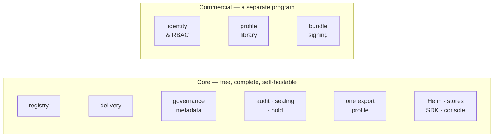

# 24 — Commercial Boundary

> What is free, what is not, and what will never change. Lineage is open core: the registry is
> Apache-2.0 and complete on its own, and a separate commercial program adds identity and
> compliance paperwork on top of it.
>
> **This doc is the public commitment.** The reasoning behind it is commercial strategy and is
> not published, but the boundary itself is — a project is trusted exactly as far as its
> boundary is predictable. Where internal planning and this doc disagree, **this doc wins.**

## 1. The Shape

The upper band is a **separate proprietary program**. It is not a fork, a plugin, a build tag,
or a library linked into this binary. **This repository contains no commercial code**, no
dormant features, and no build tags that unlock any — a claim you can check, which is the
point of making it.

## 2. Core — Free and Complete

| Capability | Docs |
|---|---|
| Registry — models, versions, stages, artifacts | `02` · `03` |
| Delivery — resolve, fetch, signed URLs, storage-initializer | `04` · `05` |
| Governance metadata — classification, drift, validation records | `16` · `17` · `20` |
| Audit — log, Merkle epoch sealing, retention floor, legal hold | `19` |
| One self-serve evidence export profile | `18` |
| Operations — Helm, SQLite + Postgres, SDK/CLI, console | `06` · `08` · `10` |

Running Lineage without ever paying yields a complete and correct registry, not a trial.

## 3. What Will Never Be Gated

| Never gated | Because |
|---|---|
| Postgres, or any storage backend | `00.2.6`. Gating the real database is the classic bait-and-switch |
| Resolve, fetch, signed URLs, the storage-initializer | `00.2.8` — machines consuming models is the point of the project |
| Recording or detecting compliance state | knowing a classification has gone stale is registry work, not a product tier |
| The audit log, including Merkle sealing | `00.2.7` and `00.11.14` — auditability is an axiom, not a feature |
| Helm, or a working default install | `00.2.2`. One `helm install` yields a working, secure registry |

## 4. What the Commercial Tier Adds

| | Why it is not core |
|---|---|
| **Identity & RBAC** — SSO, per-model authorisation | `00.2.4` puts authN/authZ on the infrastructure by design. Core trusts an infra-supplied actor header and always will; this adds the infrastructure, it does not remove the default |
| **Profile library + scheduled bundles** | a recurring regulatory obligation, per framework — see `18.2`, `21`. This is the *shaping* of facts into one regulator's document, never the facts themselves (§4.1) |
| **Bundle signing with a managed key** | key custody is a service. The sealing and self-digest it builds on are core (`18.7`, `19.5`) |

Each is **additive**. Remove the commercial program and you are left with exactly what §2
describes, behaving exactly as these docs specify.

### 4.1 The compliance docs, specifically

The regulatory work in `15`–`22` is **mostly core.** The line does not run between documents;
it runs between *holding a fact* and *shaping it into a regulator's document*:

> **If it needs a column, it is core. If it turns stored facts into paperwork, it is
> commercial.**

| Doc | Core | Commercial |
|---|---|---|
| `15` regulatory landscape | all — it is a map, no schema | — |
| `16` EU risk classification | the fields, the drift predicate, the inventory query | — |
| `17` EU modification review | the review queue | — |
| `19` retention, hold, audit sealing | all of it (`00.11.14`) | — |
| `20` model risk management | `mrm_tier`, `validation` records, unmonitored-in-production detection | the `mrm` bundle profile |
| `22` change control plans | the `change_plan` table and the conformance predicate | the `pccp` bundle profile |
| `18` evidence export | the bundle mechanism, gap reporting, one self-serve profile | the profile library, scheduling |
| `21` assurance profiles | — it declares **zero schema** | all of it — it is nothing but profiles |

So: **knowing** you have nine stale high-risk models is free, and always will be. **Producing
the filing** for them, across a library of frameworks, on a schedule, signed, is the product.

## 5. Standing Commitments

| | |
|---|---|
| **Core stays Apache-2.0** | `00.11.16`. Not BSL, not source-available, no change date |
| **There is no SaaS** | `00.11.15`. Self-hosting is the only distribution model, so nothing you run can be switched off by us |
| **Core is never modified for the commercial tier** | it integrates through a documented header and the public `/v1` API — contracts anyone can read |
| **Contributions need a CLA** | `00.11.16`. Core is Apache today and the CLA is what keeps that decision revisitable rather than accidental |

## 6. See Also

| For | Doc |
|---|---|
| Axioms these commitments derive from | `00.2` |
| The decisions themselves | `00.11.14`, `00.11.15`, `00.11.16` |
| The identity header the commercial tier integrates through | `00.2.4`, `03` |
| Evidence profiles and the seam they plug into | `18.2`, `21` |
