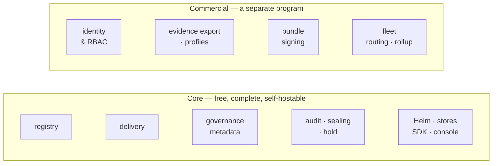

# 24 — Commercial Boundary

> What is free, what is not, and what will never change. Lineage is open core: the registry is
> Apache-2.0 and complete on its own, and a separate commercial program adds identity and
> compliance paperwork on top of it.
>
> **This doc is the public commitment.** The reasoning behind it is commercial strategy and is
> not published, but the boundary itself is — a project is trusted exactly as far as its
> boundary is predictable. Where internal planning and this doc disagree, **this doc wins.**

## 1. The Shape

**Core holds the record. The commercial tier turns it into paperwork.** That is the whole
line, and everything below is it applied.

The upper band is a **separate proprietary program**. It is not a fork, a plugin, a build tag,
or a library linked into this binary. **This repository contains no commercial code**, no
dormant features, and no build tags that unlock any — a claim you can check, which is the
point of making it.

## 2. Core — Free and Complete

| Capability | Docs |
|---|---|
| Registry — models, versions, stages, artifacts | `02` · `03` |
| Delivery — resolve, fetch, signed URLs, storage-initializer | `04` · `05` |
| Governance metadata — classification, drift, modification review, validation records | `16` · `17` · `20` |
| Audit — log, Merkle epoch sealing, retention floor, legal hold | `19` |
| Operations — Helm, SQLite + Postgres, SDK/CLI, console | `06` · `08` · `10` |

Running Lineage without ever paying yields a complete and correct registry, not a trial.

**Every regulatory *fact* is here.** Which models are high risk, which classifications have
gone stale and why, which modifications want review, which tier-1 model has gone unmonitored,
what the retention floor is, and an audit log that can prove it was not rewritten — all free,
all queryable, all yours. What is not here is the step that renders those facts as a named
regulator's document.

## 3. What Will Never Be Gated

| Never gated | Because |
|---|---|
| Postgres, or any storage backend | `00.2.6`. Gating the real database is the classic bait-and-switch |
| Resolve, fetch, signed URLs, the storage-initializer | `00.2.8` — machines consuming models is the point of the project |
| Recording or detecting compliance state | knowing a classification has gone stale is registry work, not a product tier |
| The audit log, including Merkle sealing | `00.2.7` and `00.11.14` — auditability is an axiom, not a feature |
| Helm, or a working default install | `00.2.2`. One `helm install` yields a working, secure registry |
| Every **fact** an install holds, readable from that install | one install answers every question about its own models on its own, forever. Rendering those facts as a named regulator's document is the commercial step (§4) — the answer is always free, the filing is not |
| `/v1` completeness — no private read paths | the commercial tier is a client of the same API you have. If it can build a document from your registry, so can you (§4.3) |

## 4. What the Commercial Tier Adds

| | Why it is not core |
|---|---|
| **Identity & RBAC** — SSO, per-model authorisation | `00.2.4` puts authN/authZ on the infrastructure by design. Core trusts an infra-supplied actor header and always will; this adds the infrastructure, it does not remove the default |
| **Evidence export** — the bundle mechanism, every profile, scheduled generation | `18`, `21`. This is the *shaping* of facts into one regulator's document, never the facts themselves (§4.1). It reads core through `/v1` like any other client and holds its own record of what it produced |
| **Bundle signing with a managed key** | key custody is a service. The sealing and self-digest it builds on are core (`18.7`, `19.5`) |
| **Fleet** — routing and cross-install rollup across several installs | `00.11.5` makes one install per tenant the design, and each install is complete and authoritative on its own. Running *many* of them, and reading across them into one derived view, is work that happens outside every one of them — it adds nothing to any install and takes nothing from it |

Each is **additive**. Remove the commercial program and you are left with exactly what §2
describes, behaving exactly as these docs specify.

### 4.1 The compliance docs, specifically

The regulatory work in `15`–`22` is **mostly core.** The line does not run between documents;
it runs between *holding a fact* and *shaping it into a regulator's document*:

> **Core holds the record. If it turns stored facts into paperwork, it is commercial.**

| Doc | Core | Commercial |
|---|---|---|
| `15` regulatory landscape | all — it is a map, no schema | — |
| `16` EU risk classification | the fields, the drift predicate, the inventory query | — |
| `17` EU modification review | the review queue | — |
| `19` retention, hold, audit sealing | all of it (`00.11.14`) | — |
| `20` model risk management | `mrm_tier`, `validation` records, unmonitored-in-production detection | the `mrm` bundle profile |
| `22` change control plans | the `change_plan` table and the conformance predicate | the `pccp` bundle profile |
| `18` evidence export | — | all of it: the bundle mechanism, gap reporting, and every profile |
| `21` assurance profiles | — | all of it; the doc declares **zero schema** of its own |

So: **knowing** you have nine stale high-risk models is free, and always will be. **Producing
the filing** for them, across a library of frameworks, on a schedule, signed, is the product.

Four of the six regulatory docs are wholly core. The two that are not are the two whose output
is a document.

### 4.2 The profiles, by name

Every profile is commercial. The roster exists so that is checkable rather than inferable.

| Profile | Document it produces | Scope | Spec |
|---|---|---|---|
| `annex_xii` | GPAI provider → downstream integrator (Art. 53) | version | `18.3` |
| `annex_iv` | EU high-risk technical documentation (Art. 11) | version | `18.3` |
| `mrm` | Supervisory pack — SR 26-2 · PRA SS1/23 · OSFI E-23 | version | `20` |
| `pccp` | FDA predetermined change control plan | version | `22` |
| `iso_42001` | ISO/IEC 42001 AIMS | install | `21` |
| `nist_ai_rmf` | NIST AI RMF | install | `21` |

**A profile is a mapping table, and you can write your own.** It is their heading ← our field,
plus fixtures (`18.2.1`), and it requires nothing core does not already publish on `/v1`. What
the commercial tier sells is a *maintained* set — kept current as regulators revise them,
generated on a schedule, signed — not access to your own facts. An install that never pays can
export everything through `/v1` and shape it however it likes, and core is tested to keep that
true (§4.3).

**The commercial tier carries its own schema.** `evidence_bundle` — the record of what was
produced, its digest and its frozen gap counts (`18.8.1`) — belongs with the thing that
produces it, as does install scope (`21.7.2`). Core therefore gains **no** table, column or
endpoint on behalf of the commercial program, now or later. Earlier drafts of this doc said
the opposite; the line moved, and this is where it sits.

### 4.3 The obligation this puts on core

Moving export out makes one core property load-bearing: **`/v1` has to be complete enough that
every one of those profiles can be built from outside it.** If a profile ever needs a private
query, the boundary has been breached from the inside and the free registry is quietly less
useful than it claims.

So core carries a test that an out-of-tree process, holding no privileged access, can assemble
a full evidence bundle over HTTP alone — using a reference profile that lives in the test
suite, not a shipped one. It fails if `/v1` develops a gap. That test is core's half of the
bargain, and it runs on every change.

## 5. Standing Commitments

| | |
|---|---|
| **Core stays Apache-2.0** | `00.11.16`. Not BSL, not source-available, no change date |
| **There is no SaaS** | `00.11.15`. Self-hosting is the only distribution model, so nothing you run can be switched off by us |
| **Core is never modified for the commercial tier** | it integrates through a documented header and the public `/v1` API — contracts anyone can read |
| **Contributions need a CLA** | `00.11.16`. Core is Apache today and the CLA is what keeps that decision revisitable rather than accidental |

## 6. See Also

| For | Doc |
|---|---|
| Axioms these commitments derive from | `00.2` |
| The decisions themselves | `00.11.14`, `00.11.15`, `00.11.16` |
| The identity header the commercial tier integrates through | `00.2.4`, `03` |
| Single-tenant per install, and the reserved scope key | `00.11.5`, `02.1` |
| Evidence profiles and the seam they plug into | `18.2`, `21` |
