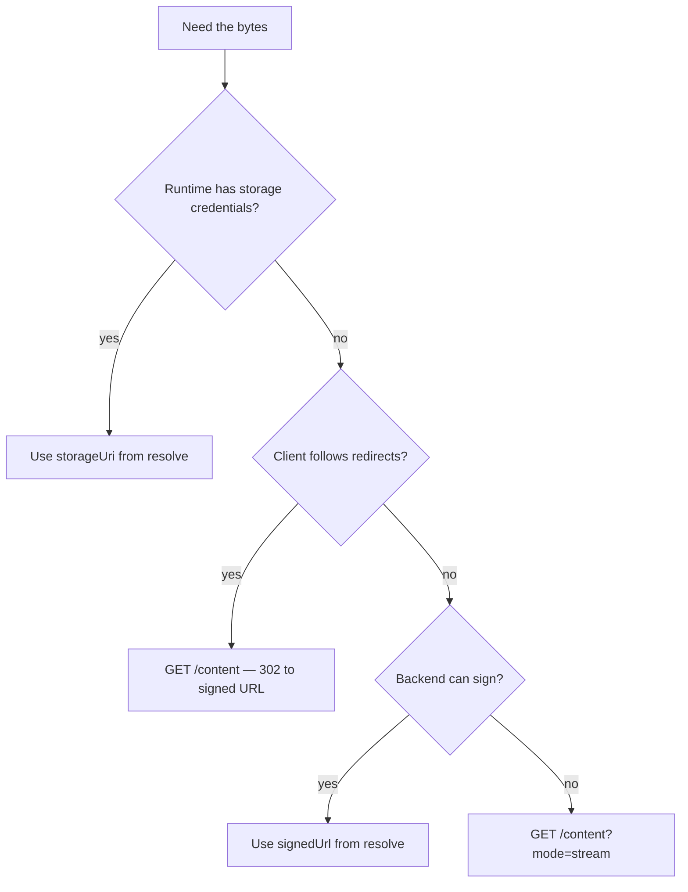

Most consumers never call this. They take `storageUri` or `signedUrl` from
[resolve](/delivery/resolve/) and fetch directly.

The broker exists for pullers that want one HTTPS endpoint and do not want to think about
which storage backend is behind it.

```
GET /v1/models/{model}/versions/{version}/artifacts/{artifact}/content
```

## Default: redirect

```bash
curl -sL "localhost:8081/v1/models/fraud-detector/versions/1.4.0/artifacts/model.onnx/content" \
  -o model.onnx
```

The registry responds `302` with a `Location` header pointing at a freshly signed URL. The
bytes go straight from your object store to the client; the registry never touches them.

Any HTTP client that follows redirects works. `curl -L`, `wget`, `requests` with
`allow_redirects=True`.

## Stream-through

```bash
curl -s ".../artifacts/model.onnx/content?mode=stream" -o model.onnx
```

`?mode=stream` forces the bytes through the registry. This is the fallback for backends that
cannot sign URLs — the filesystem driver, most obviously.

Streamed responses support:

| Feature | Behaviour |
| --- | --- |
| `ETag` | The artifact digest. Send `If-None-Match` and get `304` when unchanged |
| `Range` | Supported for seekable sources, so a failed download resumes |
| `Content-Type` | The artifact's `mediaType` when recorded |
| `Content-Length` | Set when the size is known |

```bash
# Resume a partial download
curl -s -C - ".../content?mode=stream" -o model.onnx

# Skip the transfer entirely if you already have this digest
curl -s -o/dev/null -w '%{http_code}\n' \
  -H 'If-None-Match: "sha256:9f2c4a10..."' \
  ".../content?mode=stream"
```

:::caution[Streaming costs you the registry's bandwidth]
Every streamed byte passes through the registry process, so it competes with API traffic for
CPU and network. On S3-compatible storage, take the redirect. Reserve `mode=stream` for the
filesystem backend and for clients that genuinely cannot follow a redirect to a different
host.
:::

## Choosing a fetch path



## Verify what you fetched

The digest is in the resolution and in the `ETag`. Check it after download — a truncated
transfer that nobody verified is the failure mode this field exists to prevent.

```bash
echo "9f2c4a10...  model.onnx" | shasum -a 256 -c -
```

## Next

- [Resolving a model](/delivery/resolve/)
- [Storage backends](/operate/storage-backends/)
- [Custom runtimes](/delivery/custom-runtimes/)
