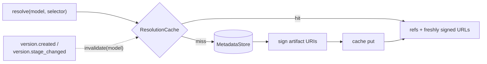

A resolution changes only when somebody publishes a version or moves one between stages. That
makes it highly cacheable — and makes correctness a question of invalidation, not of TTL.



## What is cached

The **selection** — which version and which artifacts a `(model, selector)` pair resolves to.

Signed URLs are **not** cached. They are minted fresh on every response, because a cached
signed URL is a URL that expires while it sits in the cache. That is why a cache hit still
produces a usable response.

## Invalidation is event-driven

`version.created` and `version.stage_changed` invalidate every resolve entry for that model.
The change reaches consumers as fast as the event propagates, rather than whenever a TTL
happens to lapse.

A short TTL sits behind it as a backstop for a missed event. It is insurance, not the
mechanism.

## Backends

| Engine | Use | Invalidation |
| --- | --- | --- |
| `memory` | Development, single replica | Direct, in-process |
| `redis` | Production, multiple replicas | `O(1)` via a per-model generation counter |

The Redis adapter embeds a per-model generation counter in every cache key. Invalidating a
model bumps the counter, which orphans the old keys — they expire on their own TTL. There is
no `SCAN`/`DEL` sweep, so invalidation costs the same whether a model has three cached
selectors or three thousand.

```bash
LINEAGE_CACHE_ENGINE=redis
LINEAGE_REDIS_ADDR=redis:6379
LINEAGE_REDIS_PASSWORD=…
LINEAGE_REDIS_DB=0
```

:::caution[Multiple replicas need Redis]
With `memory`, each replica has its own cache and its own view of invalidation. A promotion
handled by one pod does not clear another pod's cache except by TTL. Run Redis for any
multi-replica install.
:::

## Client-side caching

Resolutions carry an `ETag`. Send it back and get `304` when nothing has changed:

```bash
etag=$(curl -sD- -o/dev/null "$LINEAGE/v1/models/fraud-detector/resolve?stage=production" \
       | awk '/^etag:/ {print $2}' | tr -d '\r')

curl -s -o resolution.json -w '%{http_code}\n' \
  -H "If-None-Match: $etag" \
  "$LINEAGE/v1/models/fraud-detector/resolve?stage=production"
```

This is the polling pattern for watching promotions: ask on an interval with the last `ETag`,
do work only on `200`. A poller that sits on `304` costs almost nothing on either side.

Artifact content requests are conditional too — the `ETag` there is the digest. See
[Fetching artifact content](/delivery/artifact-content/).

## What to cache locally

Cache **by digest**, not by version name or by stage. Artifact content is write-once, so a
matching digest means the file you already have is the file you would download.

```
~/.cache/models/sha256/9f2c4a10…/model.onnx
```

Stage-keyed caches go stale the moment somebody promotes. Digest-keyed caches never do.

## Metrics

The registry exports cache hit and miss counters on `:9090/metrics`. A hit rate that falls
off a cliff usually means either an invalidation storm — something publishing in a loop — or
a cache that is not shared across replicas.

See [Observability](/operate/observability/).

## Next

- [Resolving a model](/delivery/resolve/)
- [Stages and promotion](/guides/stages-and-promotion/)
- [Observability](/operate/observability/)
