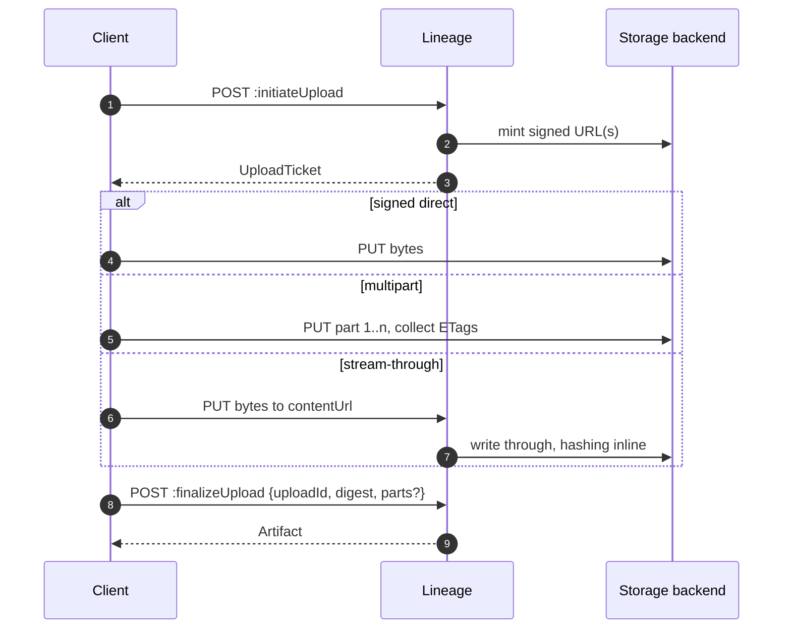

An artifact is a file belonging to a version. Lineage records where the bytes are and what
they are; the bytes themselves live in your storage backend.

| Field | Meaning |
| --- | --- |
| `name` | Unique within the version — `model.onnx`, `tokenizer.json` |
| `kind` | `MODEL` or `DOC`. Pull tools take `MODEL` by default |
| `uri` | Where the bytes live — `s3://…`, `file://…` |
| `digest` | `sha256:…`, verified on upload |
| `sizeBytes` | Filled by `Stat` when registered by reference |
| `mediaType` | MIME type |
| `modelFormat` | `{ "name": "onnx", "version": "1.16" }` |
| `serviceAccount` | Credential hint passed through to consumers |

A version usually has several artifacts: sharded weights, a config, a tokenizer, a model
card. That is why `resolve` returns a list.

## Register by reference

When the bytes already exist somewhere the registry can reach, just point at them.

```bash
curl -XPOST localhost:8081/v1/models/fraud-detector/versions/1.4.0/artifacts \
  -H 'Content-Type: application/json' -H 'X-Lineage-Actor: you@example.com' \
  -d '{
    "name": "model.onnx",
    "kind": "MODEL",
    "uri": "s3://models/fraud-detector/1.4.0/model.onnx",
    "modelFormat": { "name": "onnx", "version": "1.16" }
  }'
```

If you omit `digest` and `sizeBytes`, the backend `Stat`s the object and fills them in. Pass
them yourself when you already know them — it saves a round trip and it is the only option
for a URI the registry cannot read.

## Upload

Three steps, so that large files never pass through the registry when the backend can sign.



### Initiate

```bash
curl -XPOST localhost:8081/v1/models/fraud-detector/versions/1.4.0/artifacts:initiateUpload \
  -H 'Content-Type: application/json' -H 'X-Lineage-Actor: you@example.com' \
  -d '{
    "name": "model.onnx",
    "kind": "MODEL",
    "sizeBytes": 431717888,
    "mediaType": "application/octet-stream",
    "modelFormat": { "name": "onnx", "version": "1.16" }
  }'
```

The ticket tells you which mode you got:

| Mode | Ticket fields | When |
| --- | --- | --- |
| **Signed direct** | `url`, `method`, `headers` | Backend can sign and the file is a normal size |
| **Multipart** | `multipart: true`, `partSize`, `parts[]` | Large file on an S3-compatible backend |
| **Stream-through** | `streamThrough: true`, `contentUrl` | Backend cannot sign — filesystem, for example |

`expiresAt` is when the ticket stops being usable. Start the transfer before then; a transfer
in progress is not cut off.

:::note[contentUrl is relative]
Stream-through tickets carry a **server-relative** `contentUrl`. Resolve it against the Model
API origin. Signed tickets carry an absolute URL at the storage backend.
:::

### Transfer

Signed direct — send the headers the ticket gave you, unchanged:

```bash
curl -X PUT --upload-file model.onnx \
  -H 'x-amz-meta-sha256: 9f2c4a10...' \
  "$TICKET_URL"
```

Multipart — `PUT` each part URL in order and keep every response's `ETag`. Read one part at a
time so peak memory is one part, not the whole file.

### Finalize

```bash
curl -XPOST localhost:8081/v1/models/fraud-detector/versions/1.4.0/artifacts:finalizeUpload \
  -H 'Content-Type: application/json' -H 'X-Lineage-Actor: you@example.com' \
  -d '{
    "uploadId": "01JQ...",
    "digest": "sha256:9f2c4a10...",
    "parts": [ { "partNumber": 1, "etag": "\"a1b2...\"" } ]
  }'
```

The artifact row is created **only** if finalize succeeds. A failed digest check leaves no
artifact behind, so a bad upload is never something a consumer can resolve.

## How the digest is verified

| Path | Verification |
| --- | --- |
| Stream-through | Hashed inline as the bytes pass through — always exact |
| Signed direct | `Stat` reads back `x-amz-meta-sha256`, or the object is re-streamed and hashed under a size cap |
| Multipart / very large | The declared digest is trusted; `Stat` confirms the size |

Always compute and send the digest. It is what makes the artifact's identity portable, and
consumers verify against it after download.

## Content is write-once

`UNIQUE(version_id, name)` is enforced in the schema. You cannot upload over an existing
artifact name, and `PATCH` on an artifact updates metadata only.

This is deliberate. Consumers cache by digest and pin by name; silently swapping bytes under
a name someone already trusts is the failure this design refuses to allow. Publish a new
version instead.

## Update and delete metadata

```bash
curl -XPATCH .../artifacts/model.onnx \
  -H 'Content-Type: application/json' -H 'X-Lineage-Actor: you@example.com' \
  -d '{"mediaType":"application/octet-stream"}'
```

```bash
curl -XDELETE .../artifacts/model.onnx -H 'X-Lineage-Actor: you@example.com'
```

`DELETE` removes the metadata row. Whether the bytes go depends on
[garbage collection](/operate/garbage-collection/) — the default is to retain them.

## Next

- [Storage backends](/operate/storage-backends/) — filesystem, S3, MinIO, R2, Ceph
- [Fetching artifact content](/delivery/artifact-content/)
- [Garbage collection](/operate/garbage-collection/)
