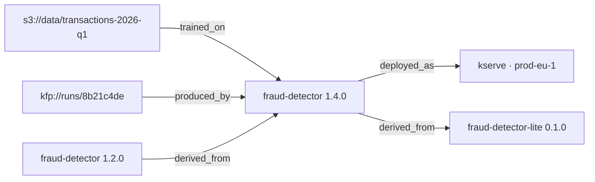

Provenance in most registries is an informal tag. In Lineage it is a typed graph, which means
"what produced this?" and "what did this break?" are queries rather than archaeology.

## The four relations

| Relation | From → to | Records |
| --- | --- | --- |
| `derived_from` | version → version or external ref | fine-tune, distill, quantize, continue-train |
| `trained_on` | version → dataset URI or internal ref | training data provenance |
| `produced_by` | version → run or pipeline ref | the job that built it |
| `deployed_as` | version → deployment | where it is or was served |

Targets are either another version in this registry or an external reference — a dataset URI,
a pipeline run, a Hugging Face model id. External nodes appear in traversals as
`type: "external"` with the ref you gave.

## Recording edges

```bash
V=localhost:8081/v1/models/fraud-detector/versions/1.4.0

curl -XPOST $V/lineage -H 'Content-Type: application/json' -H 'X-Lineage-Actor: ci@example.com' \
  -d '{"relation":"trained_on","to":{"uri":"s3://data/transactions-2026-q1/"}}'

curl -XPOST $V/lineage -H 'Content-Type: application/json' -H 'X-Lineage-Actor: ci@example.com' \
  -d '{"relation":"produced_by","to":{"uri":"kfp://runs/8b21c4de"}}'

curl -XPOST $V/lineage -H 'Content-Type: application/json' -H 'X-Lineage-Actor: ci@example.com' \
  -d '{
    "relation": "derived_from",
    "to": { "version": "1.2.0" },
    "properties": { "method": "continue_train", "epochs": 3, "lr": 1e-5 }
  }'
```

`to` takes either `version` (a version of the same model, or `model@version`) or `uri` (an
external ref). `properties` is free-form and is where the *how* goes — quantization method,
source dtype, sampling ratio.

Record edges at publish time, from the job that did the work. Nobody reconstructs this
accurately three months later.

## Listing edges

```bash
curl -s $V/lineage
```

Returns the edges attached directly to this version, in both directions.

## Traversing

Add `direction` and the response becomes a graph — nodes and edges with a depth on each node.

```bash
# What produced this?
curl -s "$V/lineage?direction=upstream&depth=3"

# What derives from it, and where does it run?
curl -s "$V/lineage?direction=downstream&depth=3"

# Neighbourhood, for a console view
curl -s "$V/lineage?direction=both&depth=2"
```

| Parameter | Values | Default |
| --- | --- | --- |
| `direction` | `upstream`, `downstream`, `both` | edges only, no traversal |
| `depth` | integer | 3 |
| `relations` | comma-separated subset of the four | all |

```json
{
  "root": "01JQ7Y...",
  "direction": "upstream",
  "nodes": [
    { "type": "model_version", "id": "01JQ7Y...", "model": "fraud-detector",
      "version": "1.4.0", "stage": "production", "depth": 0 },
    { "type": "model_version", "id": "01JQ6X...", "model": "fraud-detector",
      "version": "1.2.0", "stage": "archived", "depth": 1 },
    { "type": "external", "ref": "s3://data/transactions-2026-q1/",
      "label": "transactions-2026-q1", "depth": 1 }
  ],
  "edges": [ { "relation": "derived_from", "srcId": "01JQ7Y...", "dstId": "01JQ6X..." } ]
}
```

## The two questions worth asking



**Ancestry — "explain this model."** Walk upstream. You get the data, the run, and the parent
version, with the `properties` on each edge saying how each step happened. This is the answer
to an audit request and to "why does this behave differently from last quarter."

**Impact — "what did this touch?"** Walk downstream from a version, or reverse-walk from a
dataset ref. Every version that inherited the problem, and via `deployed_as`, every endpoint
serving one. This is the answer at 3am when a training set turns out to be contaminated.

```bash
# Everything downstream of the bad quarter, including live endpoints
curl -s "$V/lineage?direction=downstream&depth=5&relations=derived_from,deployed_as"
```

## Filtering by relation

`relations` narrows a traversal, which matters on a dense graph:

```bash
# Just the deployment surface
curl -s "$V/lineage?direction=downstream&depth=1&relations=deployed_as"

# Just model ancestry, ignoring data and runs
curl -s "$V/lineage?direction=upstream&depth=5&relations=derived_from"
```

## Deleting an edge

```bash
curl -XDELETE $V/lineage/01JQ9A... -H 'X-Lineage-Actor: you@example.com'
```

Edges are audited like everything else, so a removed edge leaves a record.

## Next

- [Deployments](/guides/deployments/) — the `deployed_as` target
- [Model insights](/guides/model-insights/) — what the version is made of
- [Comparing versions](/guides/version-diff/)
