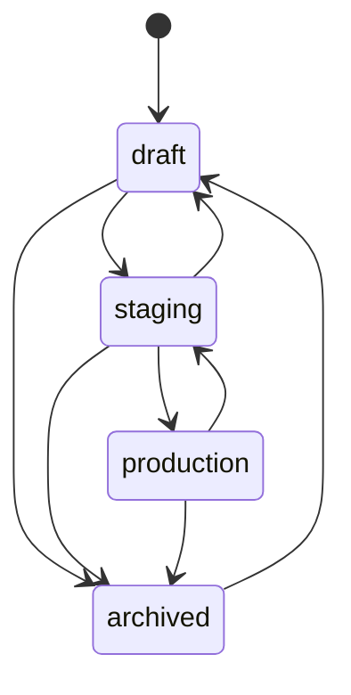
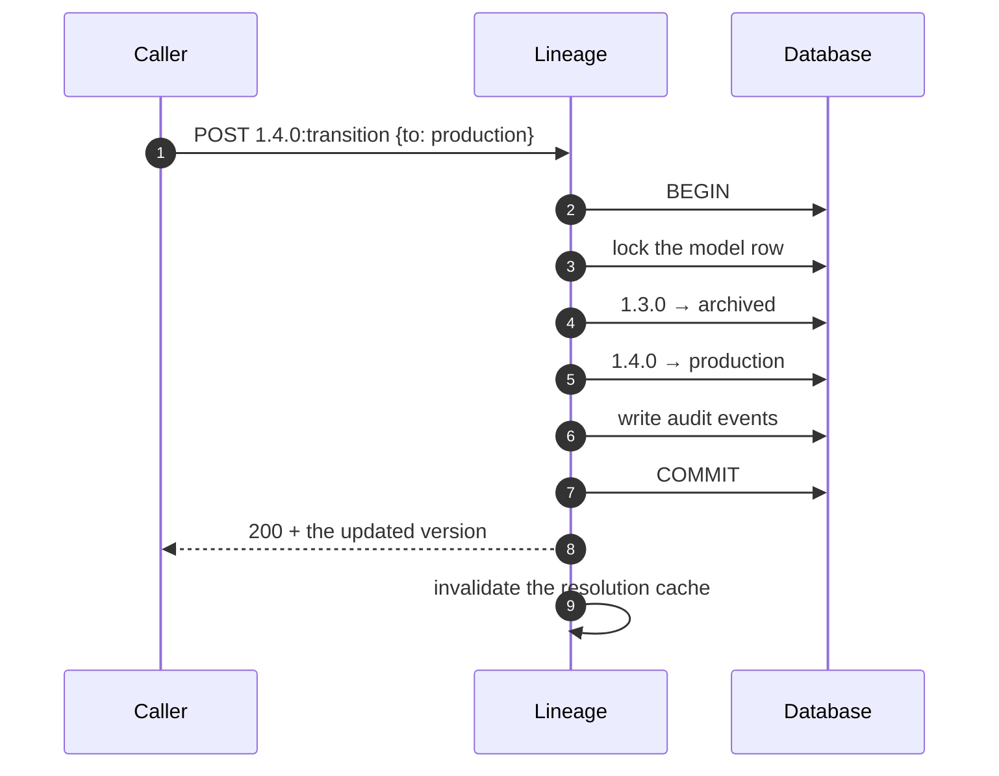

Every version sits in exactly one stage. Stages are how consumers refer to models without
knowing version numbers, and how governance gets a grip on what is live.

| Stage | Meaning |
| --- | --- |
| `draft` | Published, not yet a candidate. The default on creation |
| `staging` | A candidate under evaluation |
| `production` | Serving. **At most one per model** |
| `archived` | Retired, kept for the record |

## Legal transitions



There is no `draft → production`. A version reaches production by going through staging,
which is where the evaluation gate belongs.

An illegal move returns `409 failed_precondition`, and the problem body's `details` lists
the stages you could have gone to:

```json
{
  "status": 409,
  "code": "failed_precondition",
  "title": "illegal stage transition",
  "detail": "cannot move from draft to production",
  "details": { "from": "draft", "to": "production", "allowed": ["staging", "archived"] }
}
```

## Transition

```bash
curl -XPOST localhost:8081/v1/models/fraud-detector/versions/1.4.0:transition \
  -H 'Content-Type: application/json' \
  -H 'X-Lineage-Actor: release-bot@example.com' \
  -d '{"to":"production","reason":"shadow eval green for 48h"}'
```

`reason` is optional and lands in the audit event. Write one for anything that touches
production — it is the field people read a year later when they ask why.

## The singleton production invariant

**At most one version of a model is in `production`.** Promoting a new one demotes the
incumbent to `archived` in the same transaction.



There is no window in which two versions are in production and none in which zero are. On
Postgres the model row is taken with `FOR UPDATE`; on SQLite writes are serialized by the
single-writer model. Two concurrent promotions resolve to one winner and one loser, never to
a split state.

Because the transition is atomic, `resolve?stage=production` never observes an intermediate
state, and cache invalidation is driven by the transition event rather than by expiry.

## What promotion does not do

Promotion changes metadata. It does not copy bytes, does not restart anything, and does not
call your cluster. Serving systems find out on their next `resolve`, or immediately if they
watch for cache invalidation. That is the whole point: the registry is the source of truth,
and deployments read from it.

## Patterns

**Gate on evaluation.** Record evaluations against the staging version, then promote only if
they pass:

```bash
curl -s .../versions/1.4.0/evaluations | jq '.items[] | select(.metric=="auc")'
```

See [Model insights](/guides/model-insights/).

**Roll back.** The previous version is `archived`, not gone. Move it back through staging:

```bash
curl -XPOST .../versions/1.3.0:transition -d '{"to":"draft"}'
curl -XPOST .../versions/1.3.0:transition -d '{"to":"staging"}'
curl -XPOST .../versions/1.3.0:transition -d '{"to":"production","reason":"rollback: 1.4.0 latency regression"}'
```

Three calls, deliberately. Rollback is a decision, and each step is on the record.

**Keep production undeletable.** A version in `production` cannot be deleted. Move it out
first.

## Next

- [Resolving a model](/delivery/resolve/) — what consumers see after a promotion
- [The audit trail](/guides/audit-trail/) — reading the promotion history
- [Caching and invalidation](/delivery/caching/)
