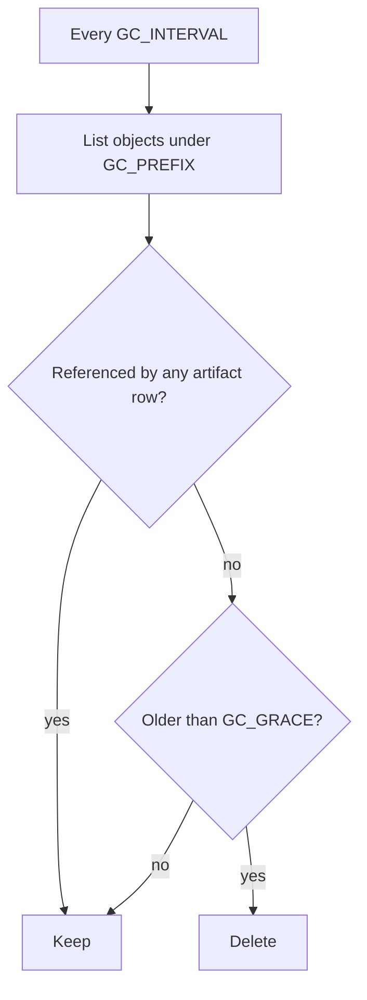

By default, Lineage never deletes bytes. `DELETE` on an artifact removes the metadata row and
leaves the object where it is.

That default is deliberate. A registry that deletes weights because a metadata row went away
is a registry that can lose something irreplaceable to a bad script.

## The two modes

| Mode | Behaviour |
| --- | --- |
| `retain` *(default)* | `DELETE` drops the row. Objects stay forever |
| `sweep` | A background sweeper reference-counts objects and deletes unreferenced ones past a grace period |

```bash
LINEAGE_STORAGE_GC=sweep
LINEAGE_GC_GRACE=24h      # minimum object age before eligibility
LINEAGE_GC_INTERVAL=1h    # sweep period
LINEAGE_GC_PREFIX=models/ # the prefix the sweeper is scoped to
```

Under Helm, the same settings live under `storage.gc`.

## How sweeping works



The reference count is over artifact URIs, so an object referenced by any artifact — in any
version, at any stage — survives. Deduplicated objects shared by several versions are only
removed once the last reference is gone.

## The grace period exists for uploads in flight

An upload writes bytes before the artifact row is created on finalize. During that window the
object is genuinely unreferenced, and a sweeper without a grace period would delete a file
somebody is still uploading.

`LINEAGE_GC_GRACE` must comfortably exceed your longest upload. The 24-hour default is
generous on purpose. Shorten it only if you know your largest artifact and your slowest link.

## Scope it with a prefix

`LINEAGE_GC_PREFIX` bounds what the sweeper will even look at.

:::danger[Set the prefix]
Without a prefix, the sweeper considers every object in the bucket. If Lineage shares a bucket
with anything else, unreferenced means "not referenced by Lineage" — and everything else in
that bucket qualifies.

Give Lineage its own bucket, or set `LINEAGE_GC_PREFIX` to the prefix it owns. Preferably
both.
:::

## Permissions

Sweeping needs `s3:DeleteObject` and `s3:ListBucket` in addition to the usual read and write.
Leaving `DeleteObject` off the policy is a solid second line of defence while you are
deciding whether to enable this at all.

## Turning it on safely

1. Give Lineage a dedicated bucket or prefix.
2. Enable object versioning on the bucket, so a mistaken delete is recoverable.
3. Set `LINEAGE_GC_PREFIX`.
4. Run with a long grace period first — a week — and watch what gets removed.
5. Tighten the grace period once you trust it.

## When to leave it off

Storage is usually cheaper than the incident. If your bucket has a lifecycle policy, or your
compliance rules require retention anyway, or nobody is complaining about the bill, `retain`
is the right answer.

Turn sweeping on when experiment churn is generating real cost — thousands of draft versions
that never became anything.

## Next

- [Storage backends](/operate/storage-backends/)
- [Artifacts and uploads](/guides/artifacts-and-uploads/)
- [Backup and restore](/operate/backup-and-restore/)
