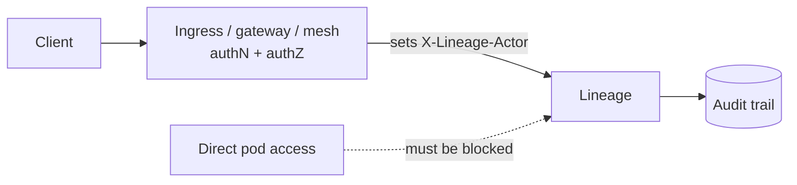

**Lineage does not authenticate anyone.** It trusts an already-authenticated request and
records an infrastructure-provided identity for audit attribution.

This is a deliberate axiom, not a gap. Your ingress, gateway, mesh, or `NetworkPolicy`
already knows how to do authN and authZ, and it does it better than a registry reimplementing
OIDC would. What Lineage owes you is a clean seam.

It also means an unprotected Lineage is fully open. Everything below is your job.



## What you have to do

### 1. Put something in front of it

Every port needs a policy:

| Port | Exposure |
| --- | --- |
| `:8081` Model API | Authenticated machines — CI, training jobs, serving systems |
| `:8080` Admin console | Authenticated humans, usually behind SSO |
| `:9090` Ops | **Never** outside the cluster. Prometheus only |

### 2. Overwrite the actor header at the edge

Lineage reads `X-Lineage-Actor` (configurable with `LINEAGE_ACTOR_HEADER`) and records
whatever it says.

:::danger[Strip it, do not just set it]
Your proxy must **overwrite** the header on every inbound request, not add it when missing.
If a client can supply the header themselves, your audit trail records whatever they felt
like claiming — and it will look completely legitimate.
:::

nginx ingress:

```yaml
nginx.ingress.kubernetes.io/configuration-snippet: |
  proxy_set_header X-Lineage-Actor $authenticated_user;
```

Envoy: strip the header in the inbound filter chain, then set it from the authenticated
principal.

### 3. Lock down the network

The chart ships a `NetworkPolicy`. Turn it on:

```yaml
networkPolicy:
  enabled: true
```

The goal is that nothing can reach the pod except through the ingress that does
authentication. A `NetworkPolicy` that leaves pod-to-pod traffic open means any workload in
the cluster can publish to your registry as anyone it likes.

### 4. Keep secrets in Secrets

The Postgres DSN and any static S3 keys belong in a `Secret`, never in a ConfigMap or in
`extraEnv`. The chart's `database.postgres.dsnSecret` and
`storage.s3.credentialsSecret` exist for this.

Better still on EKS: omit the static keys entirely and let the credential chain use IRSA. No
keys anywhere, nothing to rotate. See [Storage backends](/operate/storage-backends/).

## What Lineage does provide

- **Attribution.** Every state change records an actor, an action, and a timestamp, in the
  same transaction as the change. See [The audit trail](/guides/audit-trail/).
- **Content integrity.** Artifacts are digest-verified on upload and write-once by schema
  constraint. Nobody can swap bytes under a name a consumer already trusts.
- **Short-lived credentials.** Signed URLs are minted per response and expire. A leaked one
  stops working.
- **A minimal attack surface.** A distroless, non-root, statically linked image with a small
  dependency set — SQLite, pgx, go-redis. The S3 driver, the SigV4 signer, the Prometheus
  registry, and the OpenAPI document are all hand-authored or standard library.
- **Path safety.** Artifact names are validated before being joined into a local path, so a
  compromised registry cannot make a client write outside its destination directory.

## Threats this design accepts

| Threat | Status |
| --- | --- |
| Unauthenticated access to an unprotected install | **Your perimeter's job.** Full read and write |
| A spoofed actor header from inside the perimeter | **Your perimeter's job.** Strip and overwrite |
| Per-model or per-team authorisation | Not implemented. v1 is single-tenant; use separate installs |
| Reading artifact bytes | Governed by your storage policy, not by Lineage |

There is no per-model ACL. If two teams must not see each other's models, run two installs.
Multi-tenancy is reserved for a later, additive change — scope keys exist in the data model,
but nothing enforces them yet.

## A minimal safe deployment

1. `networkPolicy.enabled: true`.
2. Ingress on `:8081` requiring a machine identity — mTLS or a signed token.
3. Ingress on `:8080` behind SSO.
4. `:9090` unexposed; scraped in-cluster.
5. The actor header stripped and set at both ingresses.
6. DSN and storage credentials in Secrets, or IRSA.
7. TLS everywhere, including to Postgres (`sslmode=require`).

## Next

- [The audit trail](/guides/audit-trail/)
- [Production checklist](/deploy/production-checklist/)
- [Deploy with Helm](/deploy/helm/)
