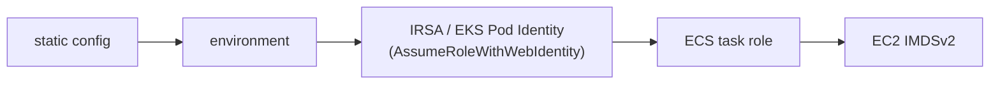

Lineage owns metadata and pointers. Artifact bytes live in a pluggable backend and travel
directly between that backend and the consumer.

| Driver | Signs URLs | Use for |
| --- | --- | --- |
| `fs` | No — falls back to stream-through | Development, single-node, air-gapped |
| `s3` | Yes | Everything else — AWS, MinIO, R2, Ceph |

## Filesystem

```bash
LINEAGE_STORAGE_DRIVER=fs
LINEAGE_STORAGE_ROOT=/data/artifacts
```

Simple and dependency-free. Because it cannot sign URLs, uploads use stream-through and
downloads use the `/content` broker with `?mode=stream` — every byte passes through the
registry process.

That is fine for development and for small installs. It is not fine for a busy registry
serving multi-gigabyte weights, because artifact transfer then competes with API traffic.

## S3-compatible

```bash
LINEAGE_STORAGE_DRIVER=s3
LINEAGE_S3_BUCKET=acme-models
LINEAGE_S3_REGION=eu-west-1
```

The S3 driver is hand-rolled on the standard library, including SigV4 signing — there is no
AWS SDK dependency. It has been validated against AWS's published signing test vector and
against a live MinIO server.

Any S3-compatible endpoint works:

| Backend | Settings |
| --- | --- |
| **AWS S3** | Bucket and region; leave the endpoint empty |
| **MinIO** | `LINEAGE_S3_ENDPOINT=https://minio.internal:9000`, `LINEAGE_S3_PATH_STYLE=true` |
| **Cloudflare R2** | `LINEAGE_S3_ENDPOINT=https://<account>.r2.cloudflarestorage.com`, region `auto` |
| **Ceph RGW** | Endpoint override, `LINEAGE_S3_PATH_STYLE=true` |

Path-style addressing is required by MinIO and Ceph. AWS and R2 use virtual-host style, which
is the default.

## Credentials

Static keys work:

```bash
LINEAGE_S3_ACCESS_KEY=…
LINEAGE_S3_SECRET_KEY=…
```

Omitting them is better. The driver then walks a credential chain:



Temporary credentials are cached and refreshed automatically before they expire. On EKS this
means attaching a role to the service account and setting nothing else — no keys anywhere,
nothing to rotate.

## Bucket policy

The registry needs `GetObject`, `PutObject`, and `ListBucket` on its prefix. Add
`DeleteObject` only if you enable [garbage collection](/operate/garbage-collection/).

```json
{
  "Effect": "Allow",
  "Action": ["s3:GetObject", "s3:PutObject", "s3:ListBucket"],
  "Resource": ["arn:aws:s3:::acme-models", "arn:aws:s3:::acme-models/*"]
}
```

Consumers that fetch by native `storageUri` need their own read access. Consumers that fetch
by `signedUrl` need none — the signature carries the authorisation, which is the point.

## Signed URL lifetime

Signed URLs are minted per response and are short-lived. `signedUrlExpiresAt` on every
resolved artifact says when. Clients should resolve, then fetch promptly, and never persist a
signed URL.

## Large files

Uploads over the multipart threshold get presigned part URLs. The client `PUT`s each part and
returns the ETags on finalize. Parts are read one at a time, so a 40 GB upload costs one part
of memory, not forty gigabytes.

See [Artifacts and uploads](/guides/artifacts-and-uploads/).

## Verifying a backend

```bash
# The registry reports dependency reachability on readyz
curl -s localhost:9090/readyz
```

A backend that cannot be reached fails readiness rather than failing individual uploads with
a confusing error.

## Next

- [Artifacts and uploads](/guides/artifacts-and-uploads/)
- [Garbage collection](/operate/garbage-collection/)
- [Production checklist](/deploy/production-checklist/)
