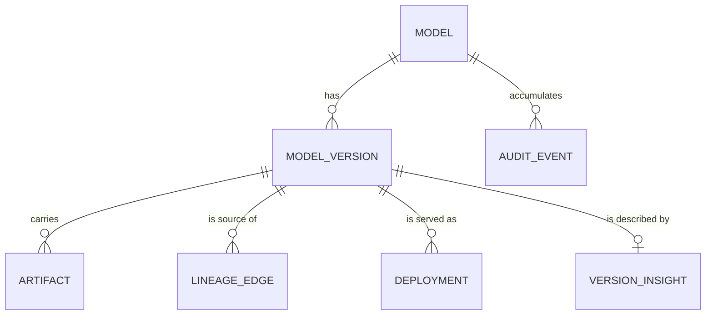
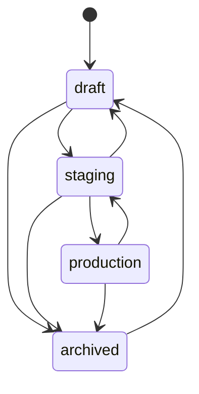

Seven entities. Everything else in the API is a view over them.

## Model

The named thing your organisation ships — `fraud-detector`, not `fraud-detector-v3-final`.
It carries a description, an owner, labels, and custom properties. Its state is `ACTIVE` or
`ARCHIVED`.

Model names are stable identifiers. Consumers reference them, so renaming is not a casual
operation.

## Model version

One concrete release of a model: `1.4.0`. A version has a stage, an author, labels, custom
properties, artifacts, lineage edges, and its own audit history.

Versions are unique per model, immutable in their content, and mutable in their metadata.
You can edit a description; you cannot repoint an artifact at different bytes.

## Artifact

A file belonging to a version, with a `kind` of `MODEL` or `DOC`. An artifact records where
the bytes are (`uri`, `storageBackend`, `storagePath`), what they are (`digest`,
`sizeBytes`, `mediaType`, `modelFormat`), and nothing more.

A version usually has several: sharded weights, a config, a tokenizer, a model card. Pull
all `MODEL` artifacts to get a usable model directory.

Artifact content is **write-once**. `UNIQUE(version_id, name)` enforces it at the schema
level, so a retry cannot quietly replace weights under a name a consumer already trusts.

## Stage

The lifecycle position of a version. Four values, one transition at a time.

**Exactly one version of a model may be in `production`.** Promoting a new one archives the
incumbent in the same transaction — `FOR UPDATE` row locking on Postgres, serialized writes
on SQLite. There is no window where two versions are live and no window where none is.

See [Stages and promotion](/guides/stages-and-promotion/).

## Lineage edge

A typed relationship from a version to something else. Four relations:

| Relation | Points at | Answers |
| --- | --- | --- |
| `derived_from` | another version, or an external ref | fine-tune, distill, quantize, continue-train |
| `trained_on` | a dataset URI or internal ref | what data went in |
| `produced_by` | a run or pipeline ref | which job built it |
| `deployed_as` | a deployment | where it runs |

Edges carry a free-form `properties` object for the detail — `{"method":"quantize",
"from_dtype":"fp16"}` on a `derived_from` edge, for example.

Because the relations are typed, ancestry and impact are queries. See
[The lineage graph](/guides/lineage-graph/).

## Deployment

A record that a version is or was being served: an `environment`, an `endpointUri`, a status
of `ACTIVE` or `INACTIVE`, and an `externalRef` back to whatever actually runs it.

Deployments are what make impact analysis useful — a dataset problem walks downstream
through versions and lands on the endpoints that inherited it.

## Insight

Optional composition facts about a version: framework, producer, parameter counts, tensor
count, dominant dtype, quantization method, disk and weight bytes, layer blocks, memory
footprints, and evaluation results.

Every field records **how it was obtained** — `declared` (asserted by the publisher),
`derived` (computed from the model files), or `measured` (reported by a runtime or harness).
A number without its provenance is not actionable, so Lineage never stores one.

See [Model insights](/guides/model-insights/).

## Audit event

An append-only record of a state change: who (`actor`), what (`action`), on which subject,
when, with a summary and structured data. Every mutating operation writes one, in the same
transaction as the change.

The actor comes from the trusted identity header your infrastructure sets — by default
`X-Lineage-Actor`. See [The audit trail](/guides/audit-trail/).

## Identifiers

Every entity has a ULID `id`. Most API paths address things by name instead
(`/v1/models/fraud-detector/versions/1.4.0`) because names are what humans and pipelines
already have. Both work; IDs are what edges and audit rows point at.

## Next

- [Register your first model](/start/first-model/)
- [Stages and promotion](/guides/stages-and-promotion/)
- [The lineage graph](/guides/lineage-graph/)
